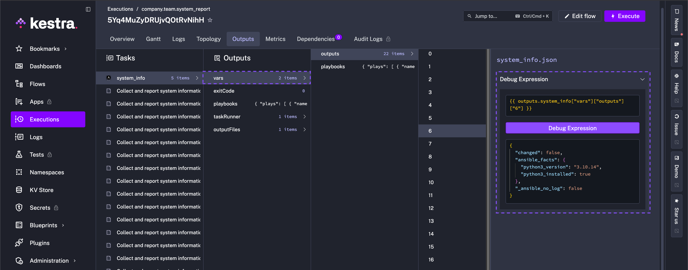
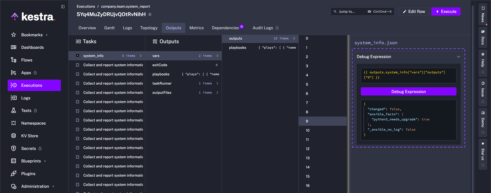
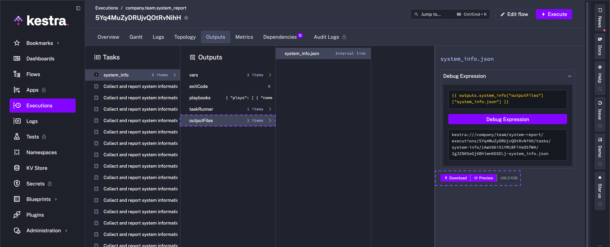
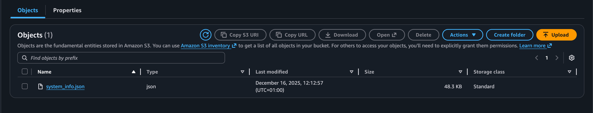
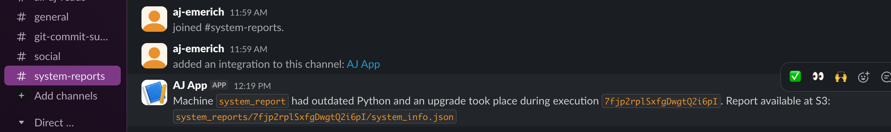

Run Ansible playbooks from Kestra and coordinate downstream infrastructure tasks.

## Check Machine Resources and Tool Versions with Ansible and Kestra

Ansible is an agentless automation tool that uses YAML playbooks to describe desired state and apply it over SSH or APIs. Teams rely on it to install software, manage configs, update systems, and provision cloud infrastructure.

## System report playbook (cross-platform)

This playbook audits a host without assuming the OS, captures diagnostics, and upgrades `python3` when needed using the appropriate package manager (`apt`, `yum`, or Homebrew). It writes a JSON report to `./system_info.json`. You can extend the same pattern to a real-world fleet by adding an inventory of servers or laptops, running over SSH instead of `localhost`, and inserting more version/presence checks for tools your team depends on (e.g., `node`, `aws`, `kubectl`). In multi-machine mode, facts and JSON outputs can be aggregated centrally to spot drift and trigger remediations.

:::collapse{title="View the playbook"}
```yaml
---
- name: Collect and report system information (system agnostic)
  hosts: localhost
  connection: local
  gather_facts: true

  vars:
    system_info_output: "./system_info.json"
    python3_min_version: "3.11.0"

  tasks:
    - name: Show basic system summary
      ansible.builtin.debug:
        msg:
          - "Hostname: {{ ansible_facts['hostname'] | default('unknown') }}"
          - "OS family: {{ ansible_facts['os_family'] | default('unknown') }}"
          - "Distribution: {{ ansible_facts['distribution'] | default('') }} {{ ansible_facts['distribution_version'] | default('') }}"
          - "Kernel: {{ ansible_facts['kernel'] | default('unknown') }}"
          - "Architecture: {{ ansible_facts['architecture'] | default('unknown') }}"
          - "CPU(s): {{ ansible_facts['processor_vcpus'] | default('unknown') }}"
          - "Total RAM (MB): {{ ansible_facts['memtotal_mb'] | default('unknown') }}"
          - "Primary IP: {{ ansible_facts['default_ipv4']['address'] | default('unknown') }}"

    # -----------------------------
    # Extra checks / diagnostics
    # -----------------------------

    - name: Check overall disk usage (df -h)
      ansible.builtin.command: df -h
      register: disk_usage
      changed_when: false
      failed_when: false   # in case df is not available

    - name: Check load average and uptime
      ansible.builtin.command: uptime
      register: uptime_cmd
      changed_when: false
      failed_when: false

    - name: Show top 5 memory-hungry processes
      ansible.builtin.shell: |
        ps aux | head -n 1
        ps aux | sort -nrk 4 | head -n 5
      register: top_mem_processes
      changed_when: false
      failed_when: false

    # -----------------------------
    # Python3 detection & version
    # -----------------------------

    - name: Check if python3 is installed
      ansible.builtin.command: python3 --version
      register: python3_check
      failed_when: false
      changed_when: false

    - name: Parse python3 version
      ansible.builtin.set_fact:
        python3_installed: "{{ python3_check.rc == 0 }}"
        python3_version: >-
          {{
            (python3_check.stdout.split()[1])
            if (python3_check.rc == 0 and (python3_check.stdout | length > 0))
            else 'unknown'
          }}

    - name: Debug python3 detection
      ansible.builtin.debug:
        msg:
          - "python3 installed: {{ python3_installed }}"
          - "python3 version: {{ python3_version }}"

    # -----------------------------
    # OS family convenience flags
    # -----------------------------

    - name: Set OS family flags
      ansible.builtin.set_fact:
        os_family: "{{ ansible_facts['os_family'] | default('Unknown') }}"
        is_debian: "{{ ansible_facts['os_family'] == 'Debian' }}"
        is_redhat: "{{ ansible_facts['os_family'] == 'RedHat' }}"
        is_darwin: "{{ ansible_facts['os_family'] == 'Darwin' }}"

    # -----------------------------
    # Decide if python3 upgrade is needed
    # -----------------------------

    - name: Decide if python3 upgrade is needed
      ansible.builtin.set_fact:
        python3_needs_upgrade: >-
          {{
            python3_installed
            and python3_version != 'unknown'
            and (python3_version is version(python3_min_version, '<'))
          }}

    - name: Debug python3 upgrade decision
      ansible.builtin.debug:
        msg:
          - "Minimum required python3 version: {{ python3_min_version }}"
          - "Current python3 version: {{ python3_version }}"
          - "Needs upgrade: {{ python3_needs_upgrade }}"

    - name: Initialize python3 upgrade result
      ansible.builtin.set_fact:
        python3_upgrade_result:
          manager: "none"
          attempted: false
          note: "No upgrade attempted yet."

    # -----------------------------
    # Debian / Ubuntu path (apt)
    # -----------------------------

    - name: Upgrade python3 via apt if needed (Debian family)
      ansible.builtin.apt:
        name: python3
        state: latest
        update_cache: yes
      when:
        - is_debian
        - python3_needs_upgrade
      register: python3_upgrade_apt

    - name: Record python3 upgrade result for Debian family
      ansible.builtin.set_fact:
        python3_upgrade_result: >-
          {{
            python3_upgrade_result | combine(
              {
                'manager': 'apt',
                'attempted': python3_needs_upgrade,
                'note': (
                  python3_needs_upgrade
                  | ternary(
                      'python3 upgrade handled by apt on Debian-based system (see play output).',
                      'python3 already meets minimum version; apt upgrade not required.'
                    )
                )
              },
              recursive=True
            )
          }}
      when: is_debian

    # -----------------------------
    # RedHat / CentOS / Fedora path (yum)
    # -----------------------------

    - name: Upgrade python3 via yum if needed (RedHat family)
      ansible.builtin.yum:
        name: python3
        state: latest
      when:
        - is_redhat
        - python3_needs_upgrade
      register: python3_upgrade_yum

    - name: Record python3 upgrade result for RedHat family
      ansible.builtin.set_fact:
        python3_upgrade_result: >-
          {{
            python3_upgrade_result | combine(
              {
                'manager': 'yum',
                'attempted': python3_needs_upgrade,
                'note': (
                  python3_needs_upgrade
                  | ternary(
                      'python3 upgrade handled by yum on RedHat-based system (see play output).',
                      'python3 already meets minimum version; yum upgrade not required.'
                    )
                )
              },
              recursive=True
            )
          }}
      when: is_redhat

    # -----------------------------
    # macOS path (Homebrew)
    # -----------------------------

    - name: Check if Homebrew is installed (macOS)
      ansible.builtin.command: brew --version
      register: brew_check
      failed_when: false
      changed_when: false
      when: is_darwin

    - name: Upgrade python via Homebrew if needed (macOS)
      ansible.builtin.command: brew upgrade python
      when:
        - is_darwin
        - python3_needs_upgrade
        - brew_check.rc == 0
      register: python3_upgrade_brew
      changed_when: true

    - name: Record python3 upgrade result for macOS
      ansible.builtin.set_fact:
        python3_upgrade_result: >-
          {{
            python3_upgrade_result | combine(
              {
                'manager': (brew_check.rc == 0) | ternary('brew', 'none'),
                'attempted': (python3_needs_upgrade and brew_check.rc == 0),
                'note': (
                  (not python3_needs_upgrade)
                  | ternary(
                      'python3 already meets minimum version; brew upgrade not required.',
                      (
                        brew_check.rc == 0
                        | ternary(
                            'python upgrade handled by Homebrew on macOS (see play output).',
                            'Homebrew not available; cannot upgrade python on macOS.'
                          )
                      )
                    )
                )
              },
              recursive=True
            )
          }}
      when: is_darwin

    # -----------------------------
    # Build & write combined report
    # -----------------------------

    - name: Build combined system info structure
      ansible.builtin.set_fact:
        full_system_info:
          collected_at: "{{ ansible_facts['date_time']['iso8601'] | default('') }}"
          hostname: "{{ ansible_facts['hostname'] | default('') }}"
          os:
            family: "{{ ansible_facts['os_family'] | default('') }}"
            distribution: "{{ ansible_facts['distribution'] | default('') }}"
            version: "{{ ansible_facts['distribution_version'] | default('') }}"
            release: "{{ ansible_facts['distribution_release'] | default('') }}"
            kernel: "{{ ansible_facts['kernel'] | default('') }}"
          hardware:
            architecture: "{{ ansible_facts['architecture'] | default('') }}"
            cpu_model: "{{ ansible_facts['processor'][1] | default('') if ansible_facts.get('processor') else '' }}"
            vcpus: "{{ ansible_facts['processor_vcpus'] | default(0) }}"
            memtotal_mb: "{{ ansible_facts['memtotal_mb'] | default(0) }}"
          network:
            default_ipv4: "{{ ansible_facts['default_ipv4'] | default({}) }}"
            all_ipv4: "{{ ansible_facts['all_ipv4_addresses'] | default([]) }}"
            interfaces: "{{ ansible_facts['interfaces'] | default([]) }}"
          storage:
            mounts: "{{ ansible_facts['mounts'] | default([]) }}"
          virtualization:
            type: "{{ ansible_facts['virtualization_type'] | default('') }}"
            role: "{{ ansible_facts['virtualization_role'] | default('') }}"
          diagnostics:
            disk_usage: "{{ disk_usage.stdout | default('') }}"
            uptime: "{{ uptime_cmd.stdout | default('') }}"
            top_mem_processes: "{{ top_mem_processes.stdout | default('') }}"
          python3:
            installed: "{{ python3_installed }}"
            version: "{{ python3_version }}"
            minimum_required: "{{ python3_min_version }}"
            needs_upgrade: "{{ python3_needs_upgrade }}"
            upgrade: "{{ python3_upgrade_result }}"
          ansible_facts: "{{ ansible_facts }}"

    - name: Write full system info to JSON file
      ansible.builtin.copy:
        dest: "{{ system_info_output }}"
        content: "{{ full_system_info | to_nice_json }}"
        mode: "0600"

    - name: Print location of saved system info
      ansible.builtin.debug:
        msg:
          - "Full system information written to: {{ system_info_output }}"
          - "You can inspect it with: jq '.' {{ system_info_output }}  (if jq is installed)"
```
:::

### What this playbook covers

It gathers the usual suspects (OS family, distro, kernel, CPU, RAM, IP), then pulls quick diagnostics like disk usage, uptime, and top memory processes. It checks `python3` and, if it's older than `3.11.0`, upgrades it with the right package manager depending on the OS of the machine (`apt`, `yum`, or Homebrew).

Each play in the playbook generates a log and output, for example, there is a log for each diagnostic metric check, a log for Python3 detection and version, and a log for building and writing the combined report to name a few.

The image below shows an example output targeting a local machine where `python3` is installed (`python3_installed`), but the Python version is `"3.10.4"`.



Ansible also reports that `"python3_needs_upgrade": true` and depending on the detected OS of the machine, upgrades accordingly.



Everything from this Python upgrade to other machine diagnostics are aggregated in `system_info.json` with mode `0600` so you have a tidy, readable report. This playbook can of course be adapted for other checks and in principle demonstrates the possibilities when you combine Ansible with Kestra.

### Run it locally

Make sure Ansible is installed and save the YAML as `system_info.yml`, run it against localhost, and peek at the output:
- `ansible-playbook -i localhost, -c local system_info.yml`
- Optionally inspect the JSON: `jq '.' system_info.json`

The diagnostics report captured looks like the following (macOS):

```json
"diagnostics": {
  "disk_usage": [
    "Filesystem      Size   Used  Avail Capacity iused      ifree %iused  Mounted on",
    "/dev/disk3s1   466Gi  128Gi  318Gi    29% 1453290 4882459910    0%   /"
  ],
  "uptime": "18:42  up 5 days,  7:31, 4 users, load averages: 2.34 2.11 1.98",
  "top_mem_processes": [
    "USER         PID  %CPU %MEM      VSZ      RSS   TT  STAT STARTED      TIME COMMAND",
    "jdoe        4287  23.5  9.8  9876544  823456   ??  R    9:12PM   0:21.43 /Applications/Chrome",
    "jdoe        1562   7.3  5.4  6453320  455121   ??  S    7:58AM  12:11.01 /usr/bin/python3 myscript.py",
    "_windowser   991   3.8  3.8  5432100  315789   ??  S    Fri11AM   5:45.22 WindowServer",
    "root          72   1.2  2.2  4321000  190233   ??  S    Sun09AM   3:12.90 /usr/libexec/trustd",
    "jdoe        2178   0.9  1.6  3876543  131442   ??  S    Sat08PM   1:03.07 Slack"
  ]
}
```

And the machine information outputs the follwing for local macOS machine:

```json
TASK [Show basic system summary] *************************************************************************************************************************************
ok: [localhost] => {
    "msg": [
        "Hostname: Mac",
        "OS: Darwin MacOSX 15.6.1",
        "Kernel: 24.6.0",
        "Architecture: arm64",
        "CPU(s): 10",
        "Total RAM (MB): 24576",
        "Primary IP: 10.0.0.42"
    ]
}
```

### Run it from Kestra

Embed the playbook in your flow's YAML inline, and collect the report with a single [Ansible CLI task](/plugins/plugin-ansible/cli/io.kestra.plugin.ansible.cli.ansiblecli):

```yaml
id: system_report
namespace: company.team

tasks:
  - id: system_info
    type: io.kestra.plugin.ansible.cli.AnsibleCLI
    inputFiles:
      playbook.yml: |
        # paste the playbook above
      inventory.ini: |
        localhost ansible_connection=local
    outputFiles:
      - system_info.json
    containerImage: cytopia/ansible:latest-tools
    commands:
      - ansible-playbook -i inventory.ini playbook.yml
```

Or, keep the playbook as a [Namespace File](../../05.concepts/02.namespace-files.md) and reference it directly with the same [Ansible CLI task](/plugins/plugin-ansible/cli/io.kestra.plugin.ansible.cli.ansiblecli).


Also make sure to add the `inventory.ini` file to the Namespace as well (`localhost ansible_connection=local`). For simplicity, this guide checks the local machine, but of course this example can be expanded to utilize Ansible's capability to SSH into multiple servers and perform operations:

```yaml
id: system_report
namespace: company.team

tasks:
  - id: system_info
    type: io.kestra.plugin.ansible.cli.AnsibleCLI
    namespaceFiles:
      enabled: true
    outputFiles:
      - system_info.json
    containerImage: cytopia/ansible:latest-tools
    commands:
      - ansible-playbook -i inventory.ini system_info.yml
```

After the run, the `outputFiles` property allows you to preview or download `system_info.json` from the task outputs and feed it into downstream checks or dashboards.



### Upload the report to S3

Extend the Namespace File flow with an [S3 Upload task](/plugins/plugin-aws/s3/io.kestra.plugin.aws.s3.upload) and store credentials in [secrets](../../06.concepts/04.secret/index.md):

```yaml
id: system_report_to_s3
namespace: company.team

tasks:
  - id: system_info
    type: io.kestra.plugin.ansible.cli.AnsibleCLI
    namespaceFiles:
      enabled: true
    outputFiles:
      - system_info.json
    containerImage: cytopia/ansible:latest-tools
    commands:
      - ansible-playbook -i inventory.ini system_info.yml

  - id: upload_output_to_s3
    type: io.kestra.plugin.aws.s3.Upload
    region: "{{ secret('AWS_DEFAULT_REGION') }}"
    accessKeyId: "{{ secret('AWS_ACCESS_KEY_ID') }}"
    secretKeyId: "{{ secret('AWS_SECRET_KEY_ID') }}"
    bucket: "{{ secret('S3_BUCKET_NAME') }}"
    key: "system_reports/{{ execution.id }}/system_info.json"
    from: "{{ outputs.system_info.outputFiles['system_info.json'] }}"
```



The `upload_output_to_s3` task pushes the generated JSON to S3 using secrets for credentials and bucket name; reuse `outputFiles` expressions anywhere you need the file.

### Add a Slack notification

To include a separate notification to the relevant channels, add the [Slack Incoming Webhook task](/plugins/plugin-slack/io.kestra.plugin.slack.slackincomingwebhook) after the upload with a message alerting that "Machine X" had outdated software and patched an upgrade. You can swap Slack for any other notifier in the Plugin catalog or chain multiple notifications if needed:

```yaml
  - id: slack_notification
    type: io.kestra.plugin.slack.SlackIncomingWebhook
    url: "{{ secret('SLACK_WEBHOOK_URL') }}"
    messageText: "Machine `{{ flow.id }}` had outdated Python and an upgrade took place during execution `{{ execution.id }}`. Report available at S3: `{{ outputs.upload_output_to_s3.key }}`"
```



### Trigger it (scheduled or event-driven)

Lastly, add a trigger so the flow runs automatically — either on a schedule ([Schedule trigger](../../05.workflow-components/07.triggers/01.schedule-trigger/index.md)) or from an external event ([Webhook trigger](../../05.workflow-components/07.triggers/03.webhook-trigger/index.md)):

```yaml
triggers:
  - id: nightly_audit
    type: io.kestra.plugin.core.trigger.Schedule
    cron: "0 2 * * *"   # every night at 2 AM

  # Or, event-driven example (e.g., HTTP webhook from your MDM/ITSM):
  # - id: mdm_webhook
  #   type: io.kestra.plugin.core.http.Webhook
```

A trigger allows you to build a historical log of machine health in S3 and Slack without manual runs.

### Wrap up

Ansible handles host-level automation — collecting facts, checking software package versions, remediating with the right package manager, and so much more. Kestra now orchestrates the run, stores secrets, uploads the JSON report to S3, and notifies Slack (or your preferred channel) so teams see when upgrades occur. Together they scale this cross-platform playbook from one laptop to a fleet, with repeatable runs and downstream integrations ready to consume the results.
