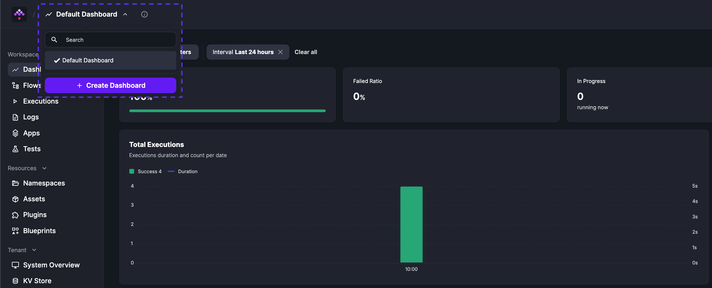
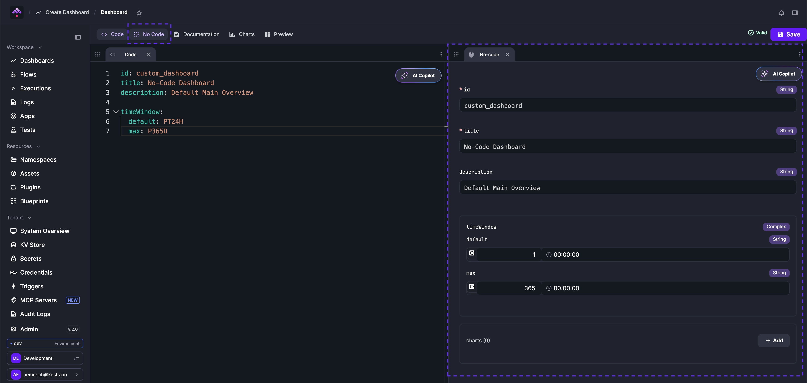
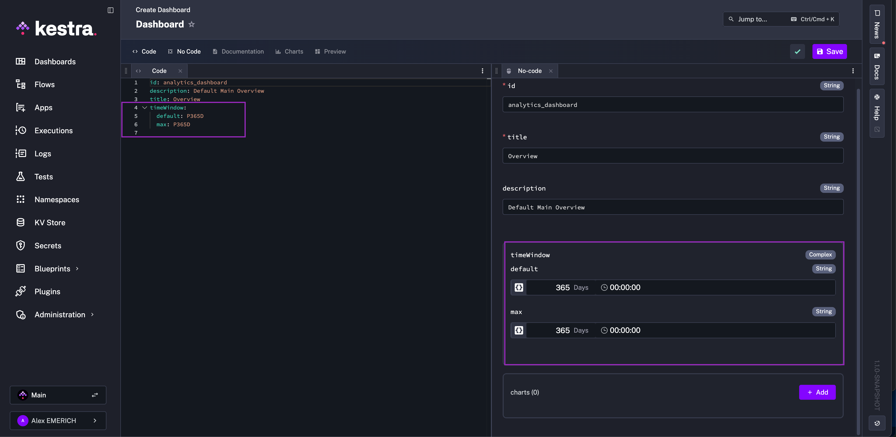
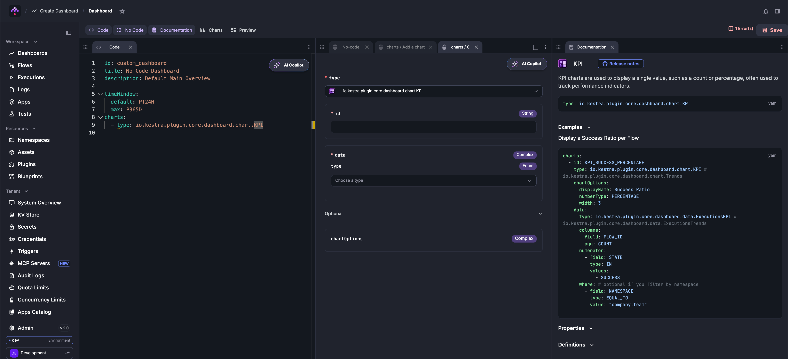
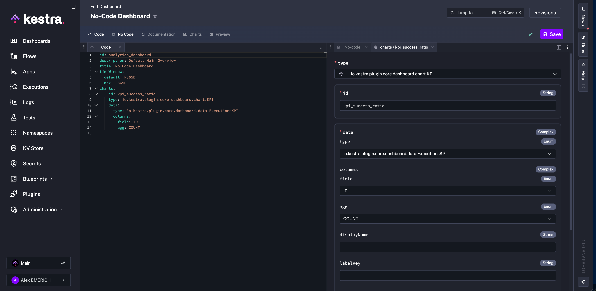
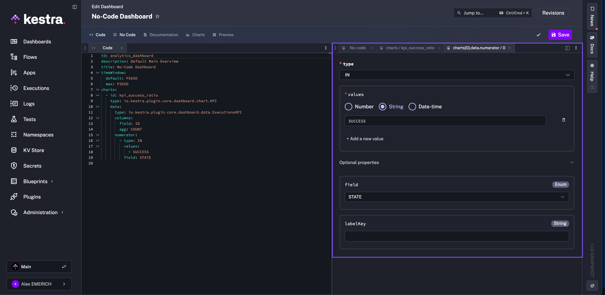
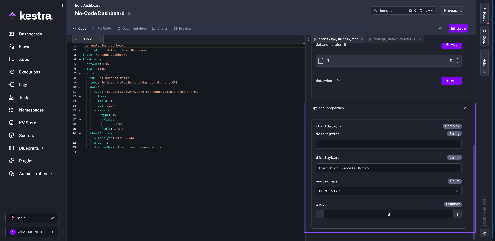
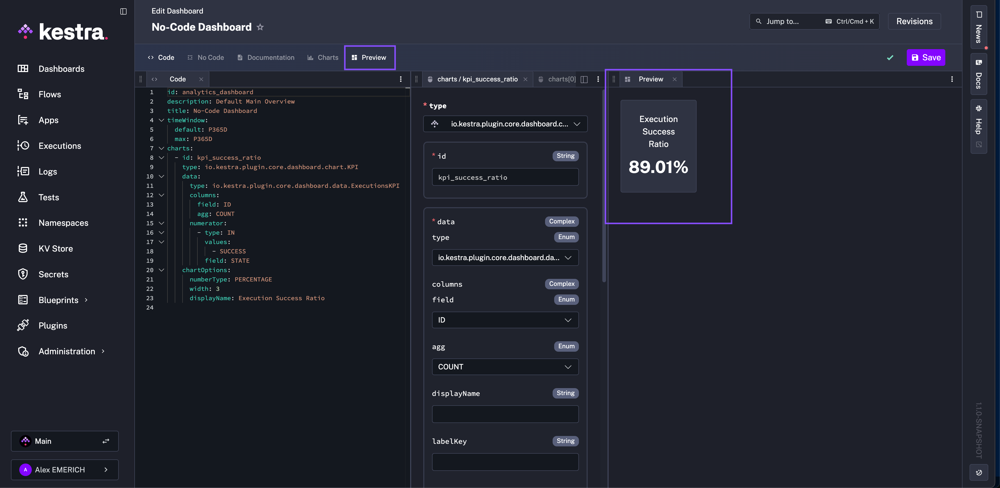

Build a KPI chart that displays the percentage of successful executions using Kestra's No Code dashboard editor.

## Prerequisites

- A Kestra instance with at least one completed execution.
- Access to the **Dashboards** section in the UI.

## Steps

### 1. Open the dashboard editor

From **Dashboards**, select **Default Dashboard** and click **+ Create Dashboard**.

In the editor, select the **No Code** tab. It appears alongside the YAML editor so you can view both as you work.

### 2. Set the dashboard properties

Give your dashboard an ID, title, description, and time window. Changes in the No Code form immediately reflect in the YAML editor.

### 3. Add a KPI chart

Click **+ Add** in the **charts** block. Choose **KPI Chart** as the chart type. Open the **Documentation** tab at any time to view chart-specific guidance without leaving the editor.

Give the chart an ID and set the data type to **Executions**. Set `field` to `ID` and `agg` to `COUNT` to count all executions.

### 4. Add a numerator filter

Click **+ Add** under the numerator section. Set `type` to `IN`, add `SUCCESS` as a value, and set `field` to `STATE`. This scopes the numerator to successful executions — the denominator remains all executions.

### 5. Set display options

Return to the `charts` No Code tab and open **Optional Properties**. Set `displayName`, change `numberType` to `PERCENTAGE`, and set `width` to `3`.

### 6. Preview and save

Open the **Preview** tab to review the chart. Click **Save** when satisfied.

## Extend: add a failure ratio chart

To add a failure ratio chart alongside the success ratio, copy the generated YAML for the KPI chart, paste it into the YAML editor as a second chart entry, and replace `SUCCESS` with `FAILED`. The two charts will sit side by side on the dashboard.

## Best practices

**Organize by purpose.** Group related charts into dashboards with a clear goal — for example, separate dashboards for system health, execution performance, and user activity.

**Use consistent naming.** A pattern like `team_metric_type` (e.g., `dataops_executions_latency`) makes dashboards easier to find, version, and export.

**Use YAML for reuse.** When charts share the same structure with small differences in filters or fields, copy-paste the YAML and modify — faster than rebuilding forms.

**Preview before saving.** Catch mismatched fields and aggregation errors early before they make it into a published dashboard.

## Next steps

See the [Dashboards reference](../../09.ui/00.dashboard/index.md) for the full list of chart types, data source fields, and filter options.
