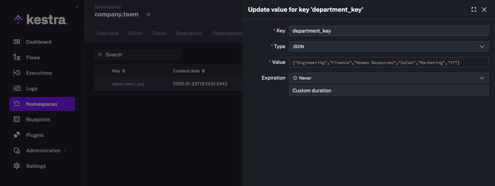
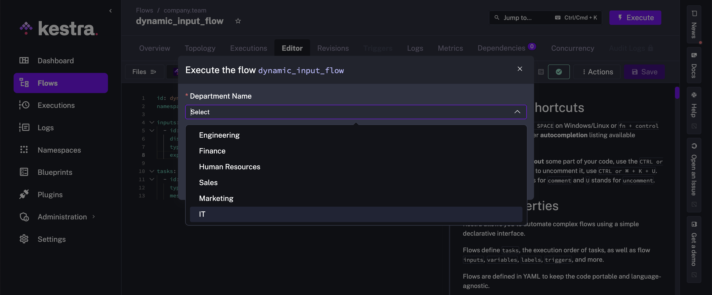

Support dynamic dropdown for inputs based on data from external source.

In this guide, we show how you can create a dynamic dropdown list for inputs. The dropdown retrieves the values from an external source. It is possible to do so by storing the values in the [KV store](../../06.concepts/05.kv-store/index.md), and also to directly integrate the external source with the HTTP Pebble function, `http()`.

## Update KV store on schedule

To get started, we create a flow that fetches the data from the external source and set the value in the KV store. The value will be in the form of a list of strings.

In this example, the flow fetches data from a PostgreSQL table on an hourly schedule. You can change the `cron` property to run at a different frequency depending on how frequently you expect the data at the source to change. If the external source is in a database that supports change data capture, as in this case where we use PostgreSQL table, you can also use the [debezium trigger](/plugins/plugin-debezium-postgres/io.kestra.plugin.debezium.postgres.trigger) and immediately update the KV store.

```yaml
id: update_kv_store
namespace: company.team

tasks:
  - id: fetch_departments
    type: io.kestra.plugin.jdbc.postgresql.Query
    url: "jdbc:postgresql://{{ secret('POSTGRES_HOST') }}:5432/postgres"
    username: "{{ secret('POSTGRES_USERNAME') }}"
    password: "{{ secret('POSTGRES_PASSWORD') }}"
    sql: select department_name from departments
    fetchType: FETCH

  - id: department_key
    type: io.kestra.plugin.core.kv.Set
    key: "{{ task.id }}"
    kvType: JSON
    value: "{{ outputs.fetch_departments.rows | jq('.[].department_name') }}"

triggers:
  - id: schedule
    type: io.kestra.plugin.core.trigger.Schedule
    cron: "0 */1 * * *"
```

This is how the KV store will look post execution of the above flow.



## Flow supporting Dynamic Inputs

Let us now create the flow that supports dynamic dropdown for inputs powered by the KV store key.

```yaml
id: dynamic_input_flow
namespace: company.team

inputs:
  - id: department
    displayName: Department Name
    type: SELECT
    expression: "{{ kv('department_key') }}"

tasks:
  - id: hello
    type: io.kestra.plugin.core.log.Log
    message: "The selected department is {{ inputs.department }}"
```

When you execute this flow, the `department` input will have a dropdown that contains the values fetched from the `department_key` key in the KV store.



## Dynamic Inputs with HTTP function

With the `http()` function, you can make `SELECT` and `MULTISELECT` inputs dynamic by fetching options from an external API. This proves valuable when your data used in dropdowns changes frequently or when you already have an API serving that data for existing applications.

The example below demonstrates how to create a flow with two dynamic dropdowns: one for selecting a product category and another for selecting a product from that category. The first dropdown fetches the product categories from an external HTTP API. The second dropdown makes another HTTP call to dynamically retrieve products matching the selected category.

```yaml
id: dynamic_dropdowns
namespace: company.team
inputs:
  - id: category
    type: SELECT
    expression: "{{ http(uri = 'https://dummyjson.com/products/categories') | jq('.[].slug') }}"
  - id: product
    type: SELECT
    dependsOn:
      inputs:
        - category
    expression: "{{ http(uri = 'https://dummyjson.com/products/category/' + inputs.category) | jq('.products[].title') }}"
tasks:
  - id: display_selection
    type: io.kestra.plugin.core.log.Log
    message: |
      You selected Category: {{ inputs.category }}
      And Product: {{ inputs.product }}
```

---

Dynamic inputs are useful for flows using authenticated API requests like the following:

```yaml
id: approversFlow
namespace: company.team

inputs:
  - id: executionIdsToBeApproved
    type: MULTISELECT
    expression: >-
      {{
      http(
        uri = 'http://localhost:8080/api/v1/internal/executions/search?state=PAUSED',
        method = 'GET',
        contentType = 'application/json',
        headers={
          'User-Agent': 'kestra',
          'Connection': 'keep-alive',
          'Authorization': 'Bearer ' ~ secret("bearerToken")
        }
      ) | jq('.results[] | "ExecutionId: \(.id), FlowId: \(.flowId), RequestedBy: \(.labels[] | select(.key == "system.username").value) InputParams: \( .inputs | to_entries | map("\(.key):\(.value)") | join(" ") )"')  }}

tasks:
  - id: hello
    type: io.kestra.plugin.core.log.Log
    message: Hello World! 🚀
```

:::alert{type="info"}
When using `http()` inside an `expression` with secrets in headers (e.g., an authenticated API request), use named arguments and string concatenation ([Pebble Literals](https://pebbletemplates.io/wiki/guide/basic-usage/#literals)). The key to the syntax is to use string interpolation with `~`.
:::

## Populate a dropdown from a subflow

When `kv()` and `http()` are not enough — for example, when you need to run a script task, call a CLI command (`aws ec2 describe-instances`, `gcloud projects list`), or execute complex multi-step logic — use the `subflow()` Pebble function.

`subflow()` runs a subflow synchronously at form render time and exposes its flow-level outputs as the dropdown values. The main flow does not start until the subflow finishes and the form is submitted.

**Step 1 — Create the data-fetching subflow.** This flow queries your infrastructure and returns a list as a flow-level output:

```yaml
id: fetch_aws_regions
namespace: company.ops

tasks:
  - id: get_regions
    type: io.kestra.plugin.scripts.shell.Commands
    taskRunner:
      type: io.kestra.plugin.core.runner.Process
    commands:
      - |
        regions=$(aws ec2 describe-regions --query 'Regions[].RegionName' --output json)
        echo "::$(printf '{"outputs":{"regions":%s}}' "$regions")::"

outputs:
  - id: regions
    type: JSON
    value: "{{ outputs.get_regions.vars.regions }}"
```

The `::{"outputs":{"key":"value"}}::` line is Kestra's [script output format](../../16.scripts/06.outputs-metrics/index.md) — it's how `shell.Commands` tasks publish named values that downstream expressions can reference via `outputs.<task_id>.vars.<key>`.

**Step 2 — Reference it from a SELECT input in your main flow:**

```yaml
id: deploy_to_region
namespace: company.ops

inputs:
  - id: region
    type: SELECT
    displayName: AWS Region
    expression: "{{ subflow(namespace='company.ops', id='fetch_aws_regions').outputs.regions }}"

tasks:
  - id: deploy
    type: io.kestra.plugin.core.log.Log
    message: "Deploying to {{ inputs.region }}"
```

When a user opens the Execute form, Kestra runs `fetch_aws_regions` synchronously and populates the dropdown from its output.

### Chaining dropdowns with `dependsOn`

You can chain dropdowns so the second list depends on the first selection:

```yaml
inputs:
  - id: environment
    type: SELECT
    expression: "{{ subflow(namespace='company.ops', id='fetch_environments').outputs.envs }}"

  - id: cluster
    type: SELECT
    dependsOn:
      inputs:
        - environment
    expression: "{{ subflow(namespace='company.ops', id='fetch_clusters', inputs={'env': inputs.environment}).outputs.clusters }}"
```

**Constraints to be aware of:**

- `subflow()` is only valid in the `expression:` property of a `SELECT` or `MULTISELECT` input. It throws if used in a task or trigger property.
- The subflow must complete within the timeout (default `PT1M`, max `PT5M`). Keep data-fetching subflows fast.
- Recursion is capped at depth 3.

## Label/value pairs for decoupled dropdowns

When your API returns structured data, use a `{label, value}` jq projection so the dropdown shows a human-readable label while `{{ inputs.x }}` resolves to the underlying technical identifier:

```yaml
id: dynamic_account_selector
namespace: company.team

inputs:
  - id: aws_account
    type: SELECT
    displayName: AWS Account
    expression: "{{ http(uri = 'https://api.example.com/accounts') | jq('.accounts[] | {label: .name, value: .id}') }}"

tasks:
  - id: log_account
    type: io.kestra.plugin.core.log.Log
    message: "Selected account ID: {{ inputs.aws_account }}"
```

The dropdown displays account names; `{{ inputs.aws_account }}` resolves to the account ID. The same pattern works with static `values` lists — see [Label/value pairs in SELECT and MULTISELECT inputs](../../05.workflow-components/05.inputs/index.md#labelvalue-pairs-in-select-and-multiselect-inputs).
