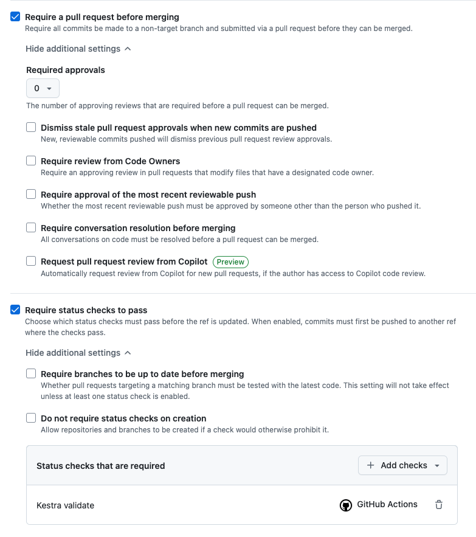

How to use GitHub Actions to automatically validate and deploy your flows to Kestra.

## Validate and Deploy your Flows with GitHub Actions

<div class="video-container">
  <iframe src="https://www.youtube.com/embed/4MqtD9VtGVs?si=eMqBQFumZG9P4OHb" title="YouTube video player" allow="accelerometer; autoplay; clipboard-write; encrypted-media; gyroscope; picture-in-picture; web-share" referrerpolicy="strict-origin-when-cross-origin" allowfullscreen></iframe>
</div>

---

If you're version controlling your Flows inside of a Git repository, it can be useful to automatically validate that they're in the correct format before merging into your `main` branch. On top of that, you can automatically deploy your flows in your `main` branch to your Kestra instance.

There are three GitHub Actions available:
- [Validate Flows](https://github.com/kestra-io/github-actions/tree/main/validate-flows) - Validate your flows before deploying anything.
- [Deploy Flows](https://github.com/kestra-io/github-actions/tree/main/deploy-flows) - Deploy your flows to your Kestra server.
- [Deploy Namespace Files](https://github.com/kestra-io/github-actions/tree/main/deploy-namespace-files) - Deploy namespace files to your Kestra server.

## Validate Your Flows

Using the Validate Flows Action, we can set up our workflow to check all flows inside of the `directory` specified when a commit is pushed to `main` or a Pull Request is opened for the `main` branch. For the full list of inputs, check out the [GitHub Actions reference](../../version-control-cicd/cicd/01.github-action/index.md#validate-flows-action-inputs).

In the example below:
1. Triggers when a commit is pushed to `main` or when a PR is opened for the `main` branch.
2. Checks out the repository so we can access the files in later steps.
3. Uses the Validate Flows Action to check all the flows inside of the `./kestra/flows` directory.

```yaml
name: Kestra CI/CD
on:
  push:
    branches: [ "main" ]
  pull_request:
    branches: [ "main" ]

jobs:
  validate:
    runs-on: ubuntu-latest
    name: Kestra validate
    steps:
      - name: Checkout repo content
        uses: actions/checkout@v4

      - name: Validate all flows
        uses: kestra-io/github-actions/validate-flows@main
        with:
          directory: ./kestra/flows
          server: https://server-url.com
```

## Deploy Your Flows

Using the Deploy Flows Action, we can set up our workflow to deploy when new commits are pushed to our `main` branch. We need to specify a `directory` containing your flows and optionally a `namespace` to deploy them to. For the full list of inputs, check out the [GitHub Actions reference](../../version-control-cicd/cicd/01.github-action/index.md#deploy-flows-action-inputs).

If you want to deploy flows to multiple namespaces, you can add multiple steps using the Deploy Flows Action, each with a different `namespace` and `directory`.

In the example below:
1. Triggers when commits are pushed to `main`.
2. Checks out the repository so we can access the files in later steps.
3. Deploys flows inside of `kestra/flows` to the `company.team` namespace in the Kestra instance.

```yaml
name: Kestra CI/CD
on:
  push:
    branches: [ "main" ]

jobs:
  deploy:
    runs-on: ubuntu-latest
    name: Kestra deploy
    steps:
      - name: Checkout repo content
        uses: actions/checkout@v4

      - name: Deploy flows
        uses: kestra-io/github-actions/deploy-flows@main
        with:
          namespace: company.team
          directory: ./kestra/flows
          server: https://server-url.com
```

## Deploy Namespace Files

Using the Deploy Namespace Files Action, you can deploy configuration files or other resources to a namespace. This is useful for managing shared files across your flows.

In the example below:
1. Triggers when commits are pushed to `main`.
2. Checks out the repository so we can access the files in later steps.
3. Deploys a configuration file to the `company.team` namespace.

```yaml
name: Kestra CI/CD
on:
  push:
    branches: [ "main" ]

jobs:
  deploy-nsfiles:
    runs-on: ubuntu-latest
    name: Kestra deploy namespace files
    steps:
      - name: Checkout repo content
        uses: actions/checkout@v4

      - name: Deploy namespace files
        uses: kestra-io/github-actions/deploy-namespace-files@main
        with:
          namespace: company.team
          localPath: ./config/app.yaml
          namespacePath: config/app.yaml
          server: https://server-url.com
```

## Authentication

If you have [authentication](../../configuration/index.md#http-basic-authentication) enabled in your Kestra instance, you will need to add additional properties so your action can authenticate with your instance.

### Basic Authentication

If you have basic authentication enabled with a username and password (e.g. on the Open Source Edition), you can add the `user` and `password` properties to your action using [GitHub Secrets](https://docs.github.com/en/actions/security-for-github-actions/security-guides/using-secrets-in-github-actions):

```yaml
name: Kestra CI/CD
on:
  push:
    branches: [ "main" ]

jobs:
  deploy:
    runs-on: ubuntu-latest
    name: Kestra deploy
    steps:
      - name: Checkout repo content
        uses: actions/checkout@v4

      - name: Deploy flows
        uses: kestra-io/github-actions/deploy-flows@main
        with:
          namespace: company.team
          directory: ./kestra/flows
          server: https://server-url.com
          user: ${{ secrets.KESTRA_USERNAME }}
          password: ${{ secrets.KESTRA_PASSWORD }}
```

As you can see, the `user` and `password` are added as secrets with the expression syntax `${{ secrets.name }}` to prevent you from committing these to your repository.

### API Token Authentication

If you're using the [Enterprise Edition](../../oss-vs-paid/index.md), you can use an [API Token](../../07.enterprise/03.auth/api-tokens/index.md) instead:

```yaml
name: Kestra CI/CD
on:
  push:
    branches: [ "main" ]

jobs:
  deploy:
    runs-on: ubuntu-latest
    name: Kestra deploy
    steps:
      - name: Checkout repo content
        uses: actions/checkout@v4

      - name: Deploy flows
        uses: kestra-io/github-actions/deploy-flows@main
        with:
          namespace: company.team
          directory: ./kestra/flows
          server: https://server-url.com
          apiToken: ${{ secrets.KESTRA_API_TOKEN }}
```

## Set Up a Branch Ruleset

If you're working in a team, it can be useful to set up a [Ruleset](https://docs.github.com/en/repositories/configuring-branches-and-merges-in-your-repository/managing-rulesets/about-rulesets) on your `main` branch to prevent broken flows from being deployed accidentally to your production instance.

To enable this, go to the **Settings** of your repository on GitHub and go to **Rules** then **Rulesets**. In here, we can create a new branch ruleset.

The goal of this ruleset is to protect the `main` branch as our GitHub Action will automatically deploy any flows in this branch to our Kestra instance. To achieve this, we can set the specific Branch rules:
- Require a pull request before merging - No commits can be made directly to the `main` branch
- Require status checks to pass - Requires our Validate Flows Action to pass before we can merge our Pull Requests



With these enabled, we are required to make a Pull Request before our flows end up in production. This enables us to run our validate check and require that to pass before we can merge any pull requests.


In the example above, the flow had an incorrect indentation so it failed the validate check. As a result of this, the Pull Request is unable to be merged until it is fixed.
