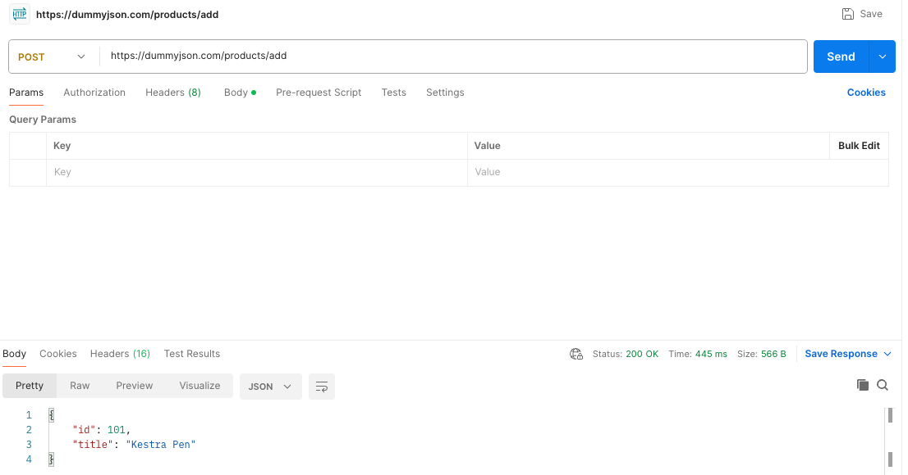
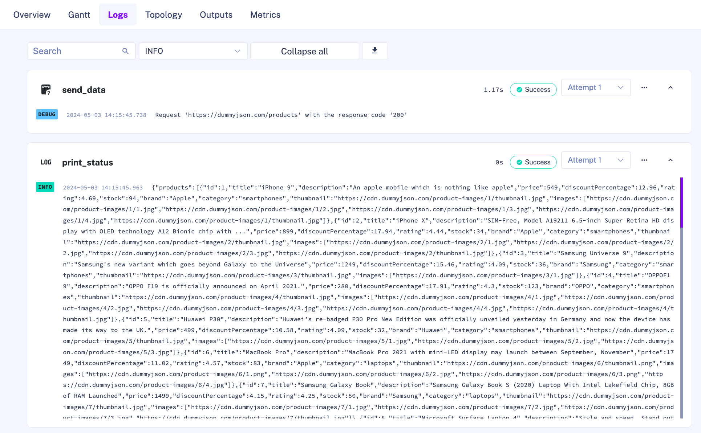
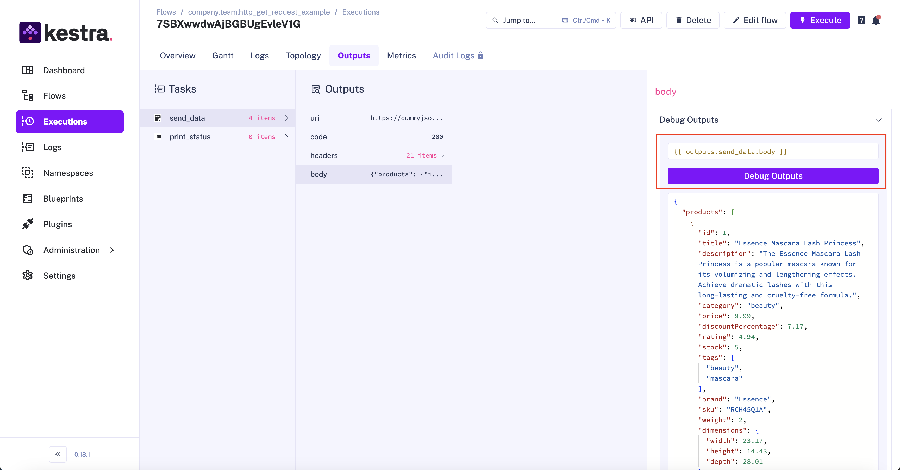
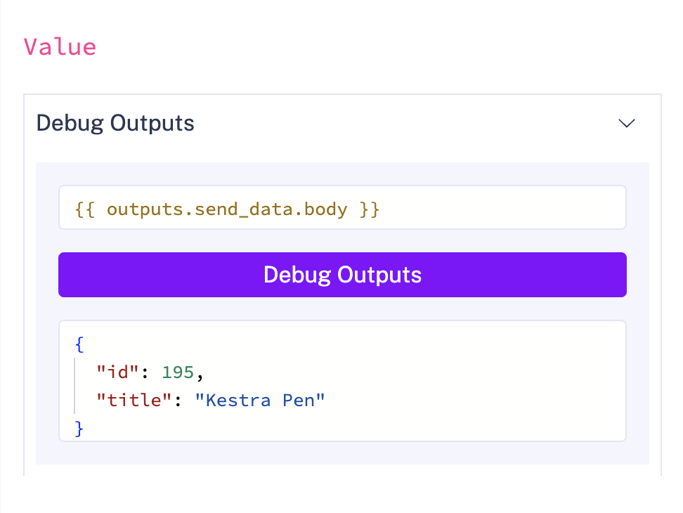
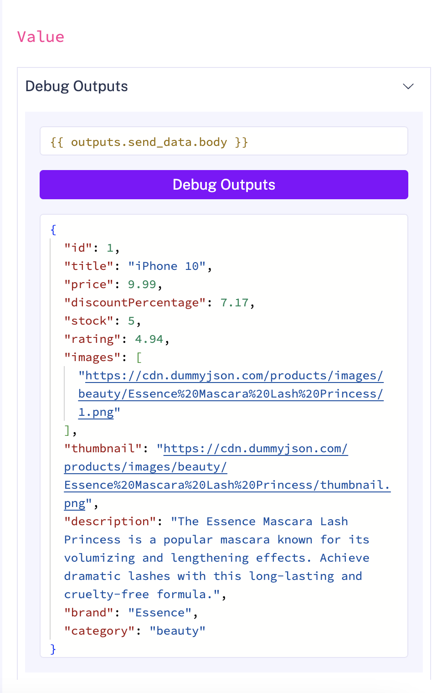
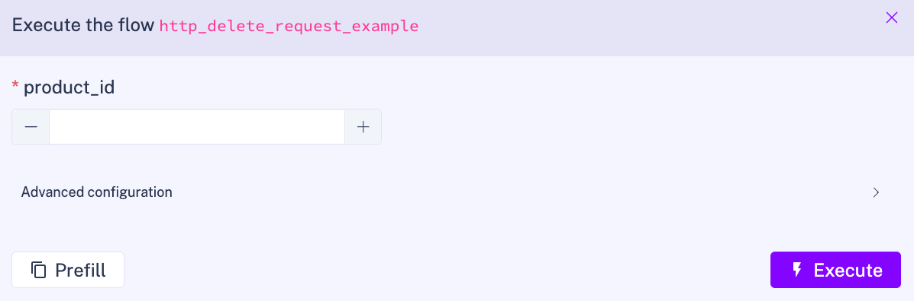
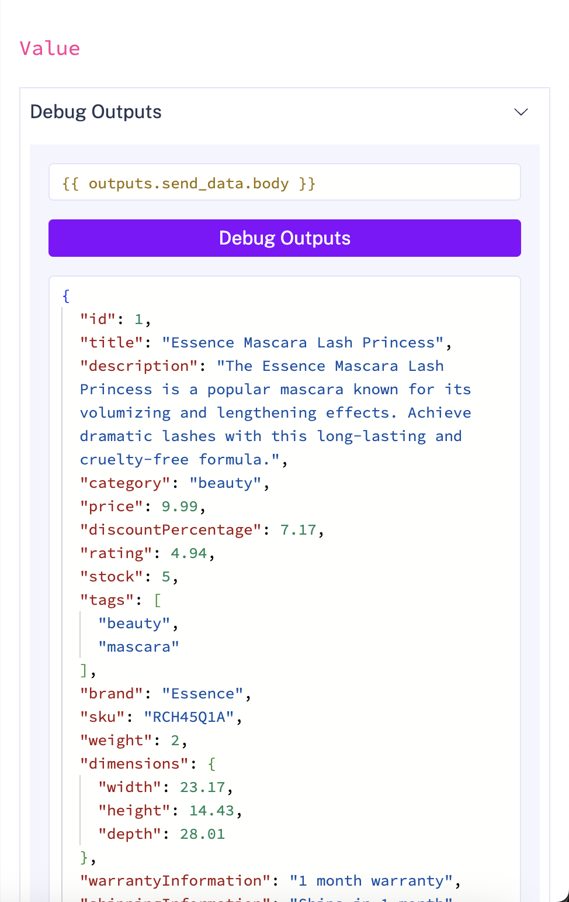

Make HTTP requests to fetch data and generate outputs.

<div class="video-container">
  <iframe src="https://www.youtube.com/embed/sI-BDbb1aPI?si=ygTv9ZVoHPwYMaty" title="YouTube video player" allow="accelerometer; autoplay; clipboard-write; encrypted-media; gyroscope; picture-in-picture; web-share" referrerpolicy="strict-origin-when-cross-origin" allowfullscreen></iframe>
</div>

You can make HTTP requests directly inside a flow and use the responses as outputs in downstream tasks. This guide covers what HTTP requests are and how to use the most common request methods in Kestra.

## What is an HTTP request?

Hypertext Transfer Protocol (better known as HTTP) [requests](https://developer.mozilla.org/en-US/docs/Web/HTTP/Messages#http_requests) are messages sent between a client and server to request something.

Requests can send or request data, with common methods known as GET, POST, PUT and DELETE requests. You can use these directly in Kestra to interact with third-party systems.

| Request Method | Description |
| - | - |
| GET | Used to retrieve data from a server |
| POST | Used to create new data on a server |
| PUT | Used to replace data on a server |
| DELETE | Used to delete data on a server |

There are many other request methods too, which you can read more about on the [MDN docs](https://developer.mozilla.org/en-US/docs/Web/HTTP/Methods).

When you make a request, you will receive a [response](https://developer.mozilla.org/en-US/docs/Web/HTTP/Messages#http_responses) from the server with the answer. This answer can drive Kestra automations. First, here is what makes up a request.

### Status code

When you make a request, you'll receive a response with a status code that indicates whether the request succeeded. The format follows:

| Status Codes | Description |
| - | - |
| 100 - 199 | Informational |
| 200 - 299 | Successful |
| 300 - 399 | Redirection |
| 400 - 499 | Client error |
| 500 - 599 | Server error |

A few common ones you might have seen include:
- 200: OK - Request was successful.
- 404: Not Found - Request reached the server but the resource wasn't found. A common one you see when you go to a page on a website that doesn't exist.
- 500: Internal Server Error - Request reached the server but the server was unable to process it. Usually means the server has thrown an error.

You can read the full list of status codes on the [MDN docs](https://developer.mozilla.org/en-US/docs/Web/HTTP/Status).

### Headers

Each request also has a set of request headers that provide additional information, such as the client type and the content type being sent. You can read more about HTTP headers on the [MDN docs](https://developer.mozilla.org/en-US/docs/Web/HTTP/Headers/). Responses include headers in the same structure.

### Body

Requests can also have a request body that contains data to send. For example, if you want to add a user to a system, you would include their name and email in the body. Request bodies are fundamental for POST and PUT requests, but methods like GET don't have them. You can read more about the request body on the [MDN docs](https://developer.mozilla.org/en-US/docs/Web/API/Request/body).

When you receive a [response](https://developer.mozilla.org/en-US/docs/Web/HTTP/Messages#body_2), it may also have a body — for example, a GET request might return JSON data that you can pass to downstream tasks in your workflow.

## How can I make HTTP requests?

You can make requests by putting a URL directly into your browser, especially for GET requests, but it can be challenging to specify the body and headers for other methods, such as POST and PUT requests. There's a variety of tools that can make this easier such as [Postman](https://www.postman.com/) and [cURL](https://curl.se/).

The example below uses Postman to make a POST request to [dummyjson.com](https://dummyjson.com). Use the `/products/add` route to add a new product by providing a body like this:

```json
{
    "title": "Kestra Pen"
}
```

In Postman, add the URL `https://dummyjson.com/products/add`, set the request type to `POST`, add the body above as a `raw` option, and change the type to JSON. Then press send:



You can do the same with cURL:

```bash
curl -X POST https://dummyjson.com/products/add \
     -H 'Content-Type: application/json' \
     -d '{ "title": "Kestra Pen" }'
```

The arguments used are:
- `-X {method} {url}` — specifies the HTTP method and URL
- `-H {header-type}` — sets request headers
- `-d {body}` — provides the request body

The response is the same as in Postman:
```json
{
    "id": 101,
    "title": "Kestra Pen"
}
```

These tools work well for one-off API testing but require extra effort to automate or integrate with other systems.

## Making HTTP requests in Kestra

Kestra's HTTP task lets you automate requests alongside other tasks. Below, you'll find examples for `GET`, `POST`, `PUT`, and `DELETE` requests in your flow.

To make a request, use the task type `io.kestra.plugin.core.http.Request`. For more information on the task type, see the [dedicated documentation](/plugins/core/http/io.kestra.plugin.core.http.request).

### GET request

Use a GET request to fetch data from a server and pass it to downstream tasks.

This flow sends a GET request to collect a list of products and print the output to the logs:

```yaml
id: http_get_request_example
namespace: company.team
description: Make a HTTP Request and Handle the Output

tasks:
  - id: send_data
    type: io.kestra.plugin.core.http.Request
    uri: https://dummyjson.com/products
    method: GET
    contentType: application/json

  - id: print_status
    type: io.kestra.plugin.core.log.Log
    message: "{{ outputs.send_data.body }}"

```

The Logs page shows the response:



To view task outputs without Log tasks, use the Outputs page in the UI:



The [Debug Expression](../../05.workflow-components/06.outputs/index.md#using-debug-expression) option lets you inspect specific outputs using an expression after the flow executes — useful when debugging tasks to see what was generated.

### POST request

Build on the GET request example above by changing these properties:
- `uri` → `https://dummyjson.com/products/add`
- `method` → `POST`
- `body` → add the data to send to the server


```yaml
id: http_post_request_example
namespace: company.team
description: Make a HTTP Request and Handle the Output

inputs:
  - id: payload
    type: JSON
    defaults: |
      { "title": "Kestra Pen" }

tasks:
  - id: send_data
    type: io.kestra.plugin.core.http.Request
    uri: https://dummyjson.com/products/add
    method: POST
    contentType: application/json
    body: "{{ inputs.payload }}"

  - id: print_status
    type: io.kestra.plugin.core.log.Log
    message: "{{ outputs.send_data.body }}"

```

Defining the request body as an input makes it easy to change at execution time or reuse across multiple requests.

:::alert{type="info"}
If your body message input is multiple lines, the best practice is to use a pebble expression to convert it to JSON and avoid escape function issues. For more details, check out this [multiline JSON example with pebble](../../expressions/02.syntax/index.mdx#multiline-json-bodies).
:::

Executing this as a POST request returns the following response, visible in the Outputs page via the Debug Expression option:



This produces the same output as the earlier example, with the added ability to pass the response to downstream tasks.

### PUT request

Similar to the `POST` request, change the `method` property to `PUT`. Since the `PUT` request replaces content, adjust the body with the data to update. From the `GET` request, `id` 1 is an `iPhone 9` — change it to an `iPhone 10`:

```yaml
id: http_put_request_example
namespace: company.team
description: Make a HTTP Request and Handle the Output

inputs:
  - id: payload
    type: JSON
    defaults: |
      {"title": "iPhone 10"}

tasks:
  - id: send_data
    type: io.kestra.plugin.core.http.Request
    uri: https://dummyjson.com/products/1
    method: PUT
    contentType: application/json
    body: "{{ inputs.payload }}"

  - id: print_status
    type: io.kestra.plugin.core.log.Log
    message: "{{ outputs.send_data.body }}"
```

The response body confirms the updated title field.



### DELETE request

Use a DELETE request to remove a resource. Unlike POST and PUT, you don't need to provide a body — just specify the resource ID as an input.

```yaml
id: http_delete_request_example
namespace: company.team
description: Make a HTTP Request and Handle the Output

inputs:
  - id: product_id
    type: INT

tasks:
  - id: send_data
    type: io.kestra.plugin.core.http.Request
    uri: "https://dummyjson.com/products/{{ inputs.product_id }}"
    method: DELETE
    contentType: application/json

  - id: print_status
    type: io.kestra.plugin.core.log.Log
    message: "{{ outputs.send_data.body }}"

```

Adding an input lets you specify which product to remove by providing the `id` at execution.



The response confirms the deletion:



## SSL and self-signed certificates

If the endpoint you are calling uses a self-signed or internally issued certificate, the task fails with an SSL verification error.

### Development and testing

For non-production environments, you can disable certificate verification with `options.ssl.insecureTrustAllCertificates`:

```yaml
id: http_insecure_ssl_example
namespace: company.team

tasks:
  - id: send_data
    type: io.kestra.plugin.core.http.Request
    uri: https://internal-service.example.com/api
    method: GET
    options:
      ssl:
        insecureTrustAllCertificates: true
```

:::alert{type="warning"}
`insecureTrustAllCertificates: true` disables all certificate verification. Never use this in production — it exposes connections to man-in-the-middle attacks.
:::

### Production

For production, import the CA certificate into the JVM trust store on the Kestra worker. Once imported, the worker trusts any endpoint signed by that CA and tasks connect without disabling verification.

- **Kubernetes**: see [Trusting a custom CA for outbound connections on Kubernetes](../../10.administrator-guide/custom-ca-kubernetes/index.md) for keytool steps and Helm configuration.
- **Standalone or Docker**: set `JAVA_OPTS` in your Kestra environment:

```bash
JAVA_OPTS="-Djavax.net.ssl.trustStore=/path/to/truststore.p12 \
           -Djavax.net.ssl.trustStorePassword=changeit \
           -Djavax.net.ssl.trustStoreType=PKCS12"
```
