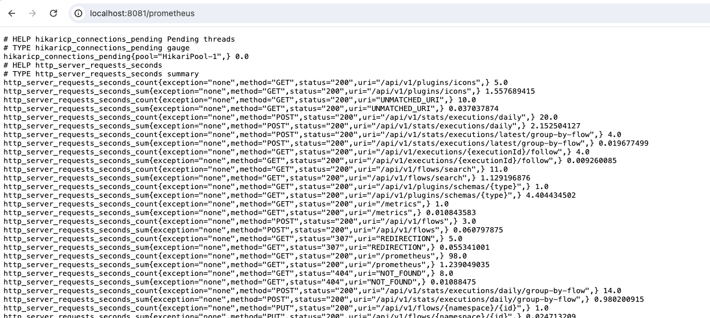
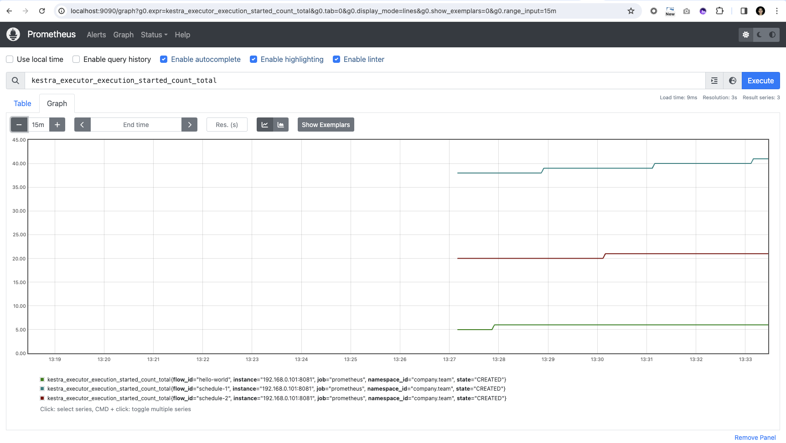
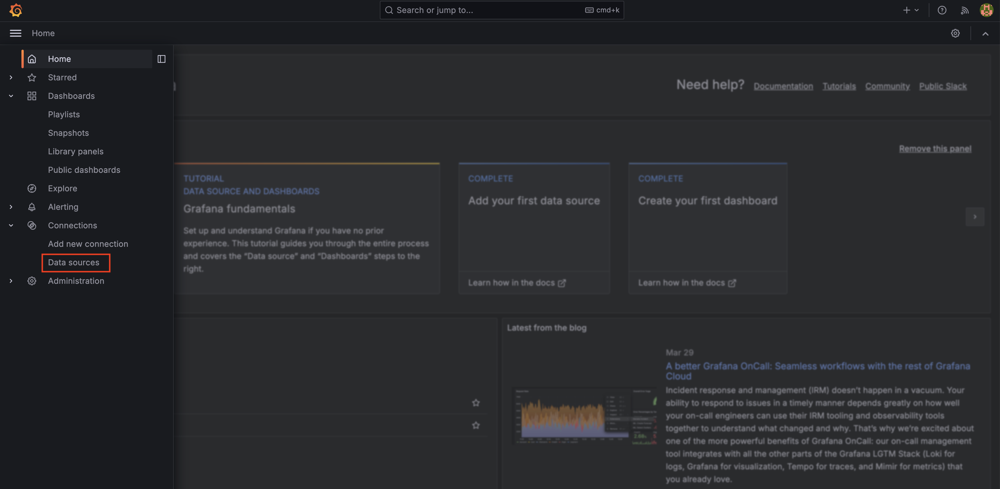
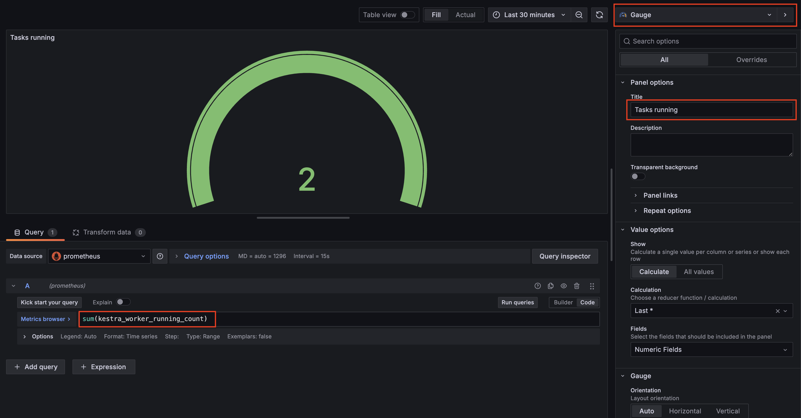
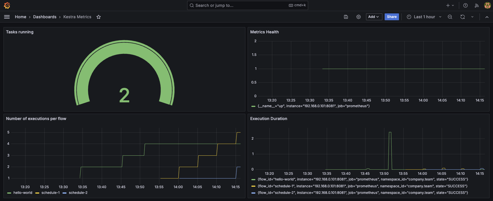

Set up Prometheus and Grafana for monitoring Kestra.

<div class="video-container">
  <iframe src="https://www.youtube.com/embed/4borr5sFTSg?si=q1z9mqLXI8arG0a5" title="YouTube video player" allow="accelerometer; autoplay; clipboard-write; encrypted-media; gyroscope; picture-in-picture; web-share" referrerpolicy="strict-origin-when-cross-origin" allowfullscreen></iframe>
</div>

Kestra exposes [Prometheus](https://prometheus.io/) metrics at port 8081 on the endpoint `/prometheus`. This endpoint can be used by any compatible monitoring system.

Use the [docker-compose.yml](https://github.com/kestra-io/kestra/blob/develop/docker-compose.yml) file and start Kestra using the command:

```sh
docker compose up
```

Once Kestra is up and running, view the available metrics at `http://localhost:8081/prometheus` in your browser. The metrics should appear as below:



Create a few flows and execute them to generate some metrics for visualization. You can also add triggers to the flows to check the metrics corresponding to executions happening on a regular basis.

## Setting up Prometheus

With metrics available from Kestra, set up a Prometheus server to scrape them and store them in a time-series DB.

Create a `prometheus.yml` file for scraping the metrics:

```yaml
global:
  scrape_interval: 15s
  evaluation_interval: 15s

scrape_configs:
  - job_name: "prometheus"
    metrics_path: /prometheus
    static_configs:
      - targets: ["<kestra-host-ip-address>:8081"]
```

Be sure to put the appropriate `<kestra-host-ip-address>` in the last line, e.g. `localhost:8081` or `host.docker.internal:8081`.

:::alert{type="info"}
If you're running everything in Docker on the same machine, you will need to change your host address to `host.docker.internal` rather than localhost.
:::

We can start the Prometheus server using the following docker command in the same directory as `prometheus.yml`:

```sh
docker run -d -p 9090:9090 -v ./prometheus.yml:/etc/prometheus/prometheus.yml prom/prometheus
```

Note, in this last command you may have to add `--add-host=host.docker.internal:host-gateway` to ensure your Prometheus endpoint is shown as `UP` (you can check it in the [targets](http://localhost:9090/targets)).

You can now go to `http://localhost:9090/graph` and try out visualizing some metrics using the PromQL. Here is one of the graphs for `kestra_executor_execution_started_count_total` metric:



## Scraping Kestra on Kubernetes

The setup above uses `static_configs` with a single hardcoded target, which suits a single Kestra instance running locally. It does not translate to [Kubernetes](../../02.installation/03.kubernetes/index.md): pod IP addresses change whenever a pod restarts or is rescheduled, and a distributed deployment runs many pods to scrape rather than one.

Use Kubernetes service discovery instead. Prometheus resolves its targets from the Kubernetes API and updates them as pods come and go, so pod churn is handled for you.

You do not need to create a Service to scrape Kestra. Prometheus discovers and scrapes the pods directly.

:::alert{type="warning"}
Avoid pointing Prometheus at a Service `ClusterIP`. A `ClusterIP` load-balances, so each scrape reaches one arbitrary pod while reporting under a single target identity. Counters then appear to jump backwards between scrapes, and no series can be attributed to a specific pod.
:::

### Enable the metrics endpoint

The Helm chart renders `configurations.application` into a single ConfigMap that every component mounts, so enabling the endpoint once covers the webserver, executor, scheduler, indexer, worker, and every worker group:

```yaml
configurations:
  application:
    endpoints:
      metrics:
        enabled: true
      prometheus:
        enabled: true
        sensitive: false
    micronaut:
      metrics:
        enabled: true
        export:
          prometheus:
            enabled: true
            step: PT1M
```

Every Kestra pod already declares port 8081 as a named container port called `management`, so no additional port configuration is required.

:::alert{type="info"}
Metrics are served on port 8081, not the 8080 UI port. Requesting `/prometheus` on port 8080 returns a redirect.
:::

### Discover pods with annotations

If you run Prometheus yourself with a `kubernetes_sd_configs` scrape job, annotate the pods so your existing annotation-based job picks them up. Setting this under `common` applies it to every component, including all worker groups:

```yaml
common:
  podAnnotations:
    prometheus.io/scrape: "true"
    prometheus.io/port: "8081"
    prometheus.io/path: "/prometheus"
```

### Discover pods with a PodMonitor

If you use the Prometheus Operator, a single `PodMonitor` covers every Kestra component. Add it through the chart's `extraManifests`:

```yaml
extraManifests:
  - |
    apiVersion: monitoring.coreos.com/v1
    kind: PodMonitor
    metadata:
      name: {{ include "kestra.fullname" . }}
      labels:
        {{- include "kestra.labels" . | nindent 4 }}
    spec:
      selector:
        matchLabels:
          {{- include "kestra.selectorLabels" . | nindent 6 }}
      podMetricsEndpoints:
        - port: management
          path: /prometheus
          interval: 30s
      podTargetLabels:
        - app.kubernetes.io/component
        - kestra.io/worker-group
```

`podMetricsEndpoints.port` refers to the named `management` container port, so it stays correct regardless of how the port is configured. `podTargetLabels` promotes the listed pod labels onto the scraped metrics, which is what lets you filter by component and by worker group in PromQL.

:::alert{type="info"}
Entries in `extraManifests` are rendered as Helm templates. When writing one as a YAML block scalar, the `nindent` value must match the indentation of the surrounding literal keys after YAML strips the block indent. A mismatch fails with a `did not find expected key` error.
:::

### Distinguishing worker groups

Kestra's metrics payload does not include a worker group tag, so worker group identity has to come from Kubernetes pod labels. The Helm chart does not add a per-group label automatically, so declare one for the worker deployment and for each worker group:

```yaml
deployments:
  worker:
    enabled: true
    podLabels:
      kestra.io/worker-group: default

workerGroups:
  gpu:
    enabled: true
    podLabels:
      kestra.io/worker-group: gpu
```

Together with `podTargetLabels` in the `PodMonitor` above, this makes each worker group separately queryable. Without it, every worker pod carries the same labels and its metrics cannot be attributed to a group.

:::alert{type="info"}
`podLabels` and `podAnnotations` are supported per component and per worker group, not only under `common`.
:::

## Setting up Grafana

Let us now move on to setting up Grafana. You start by installing Grafana using docker via the following command:

```sh
docker run -d -p 3000:3000 --name=grafana grafana/grafana-enterprise
```

You can open the Grafana server at `http://localhost:3000`. The default credentials are `admin` as both username and password. Once logged into Grafana, click on the hamburger menu on the top left and go to **Connections -> Data Sources**.



### Add Data Source

Click on **Add new Data Source** button present on the top right, and select **Prometheus** from the time series databases list. In the **Prometheus server URL** text box, put in the following URL: `http://<host-ip-address>:9090`. All the other configuration can be left as default. You can click on **Save and Test** button at the bottom, and confirm that the connection to Prometheus database is successful.

## Add Dashboard

We are now all set to create the Grafana dashboard. For this, click on the **+** button on the top of the page to add a **New Dashboard** to Grafana. Save the dashboard with an appropriate name. Then, click on **Add visualization**, and select **prometheus** as the data source.

We will create a Gauge that shows the number of tasks that are presently running. For this, select **Gauge** as the Visualization in the top right corner. In the PromQL metrics explorer text box, you can write `sum(kestra_worker_running_count)`. Click on **Run queries** button to ensure the Gauge shows up the number.

Head back to Kestra and create a number of tasks that will execute for a long time. The example below will sleep for 60 seconds:

```yaml
id: sleep
namespace: company.team

tasks:
  - id: sleep_task
    type: io.kestra.plugin.scripts.shell.Commands
    commands:
      - sleep 60
```

Now we have some long-running tasks in progress, we can check that the Gauge correctly reflects the count. You can now put an appropriate title in the Panel options that says **Tasks running**.

This is how your Grafana should look like:



Click on **Save** and **Apply** to add this gauge to the dashboard.

Similarly, you can now keep on adding more graphs to your dashboard. Here is one of the example dashboards for Kestra metrics.



The [Alerting & Monitoring](../../10.administrator-guide/03.monitoring/index.md#grafana-and-kibana) section includes an import-ready Grafana dashboard definition.
