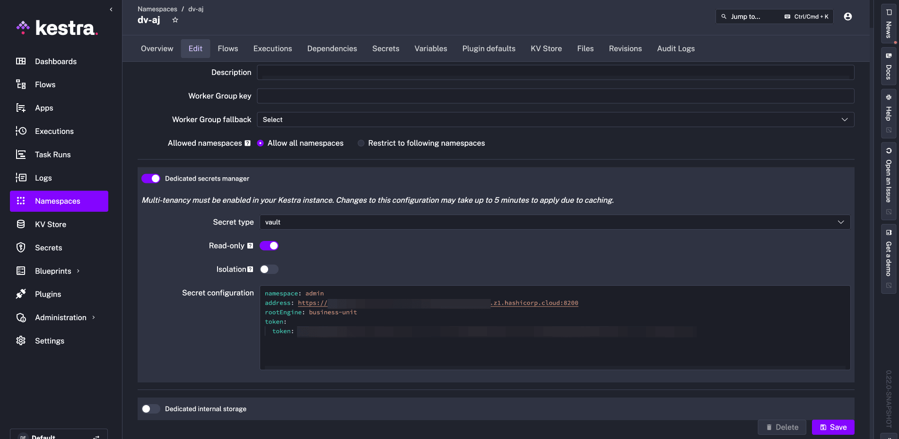

Configure HashiCorp Vault as a read-only secrets backend so Kestra reads secrets from an existing Vault instance without managing their lifecycle.

## Prerequisites

- A running Vault instance with the [KV Secrets Engine v2](https://developer.hashicorp.com/vault/docs/secrets/kv/kv-v2) enabled.
- A Kestra Enterprise namespace configured to use a dedicated secrets manager.
- A Vault token with read access to the relevant secret paths.

For background on how read-only mode differs from managed mode, see [Secrets manager modes](../../07.enterprise/02.governance/secrets-manager/index.md#secrets-manager-modes).

## Vault secret structure

Kestra reads secrets from Vault using a path-based structure. A Vault secret engine can host multiple secret paths, and each path contains key-value pairs (subkeys).

```plaintext
secret/
  ├── app1/
  │   ├── db/          ← secret path (visible as a secret name in Kestra)
  │   │   ├── DATABASE_USERNAME    ← subkey
  │   │   └── DATABASE_PASSWORD    ← subkey
  │   └── api/
  │       └── API_TOKEN
  └── app2/
      └── config
```

- `secret` — the KV engine name (`root-engine` in Kestra config).
- `app1`, `app2` — path prefixes (set via `secret-path-prefix`).
- `db`, `api`, `config` — secret names visible in Kestra UI.
- `DATABASE_USERNAME`, `API_TOKEN` — subkey names referenced in flows.

## Configure Vault as a read-only backend

In Kestra, navigate to the namespace you want to connect to Vault and open the **Edit** tab. Under **Dedicated secrets manager**, enter the Vault configuration:



The equivalent YAML configuration is:

```yaml
kestra:
  secret:
    type: vault
    vault:
      address: https://my-vault:8200/
      root-engine: secret
      secret-path-prefix: app1
      token:
        token: my-vault-access-token
    read-only: true
```

`secret-path-prefix: app1` limits Kestra's view to secrets under the `app1` path — in this example, `db` and `api`.

After saving, the **Secrets** tab shows the available secret paths with a lock icon, confirming read-only mode is active. No new secrets can be created and existing ones cannot be edited from Kestra:


## Read a Vault secret in a flow

Use the `secret()` function with a `subkey` parameter to access a specific key within a Vault secret path.

In this example, `my-app` is the Vault secret (path visible in Kestra) and `NEON_PASSWORD` is the subkey:


Reference it in a flow:

```yaml
{{ secret('my-app', subkey='NEON_PASSWORD') }}
```

Here is a complete flow example that uses the Vault-backed secret to connect to a [Neon](../neon/index.md) PostgreSQL database:

:::collapse{title="Expand for full flow YAML"}
```yaml
id: neon-db
namespace: company.team

tasks:
  - id: download
    type: io.kestra.plugin.core.http.Download
    uri: https://huggingface.co/datasets/kestra/datasets/raw/main/csv/orders.csv

  - id: create_columns
    type: io.kestra.plugin.jdbc.postgresql.Queries
    sql: |
      ALTER TABLE kestra_example_secret
      ADD COLUMN order_id int,
      ADD COLUMN customer_name text,
      ADD COLUMN customer_email text,
      ADD COLUMN product_id int,
      ADD COLUMN price double precision,
      ADD COLUMN quantity int,
      ADD COLUMN total double precision;

  - id: copy_in
    type: io.kestra.plugin.jdbc.postgresql.CopyIn
    table: "kestra_example_secret"
    from: "{{ outputs.download.uri }}"
    header: true
    columns: [order_id,customer_name,customer_email,product_id,price,quantity,total]
    delimiter: ","

pluginDefaults:
  - forced: true
    type: io.kestra.plugin.jdbc.postgresql
    values:
      url: jdbc:postgresql://ep-ancient-flower-a2e73um1-pooler.eu-central-1.aws.neon.tech/neondb?user=neondb_owner&password={{ secret('my-app', subkey='NEON_PASSWORD') }}
```
:::

After execution, Kestra confirms it read `NEON_PASSWORD` from Vault and inserted 100 rows:


## What happened in Vault

Vault held the secret at the path `business-unit/my-app` (in the `admin` namespace, if using Vault Enterprise):


Kestra resolved `NEON_PASSWORD` from that path at runtime, without storing or caching the value beyond the execution.

## Related

- [Secrets manager configuration reference](../../07.enterprise/02.governance/secrets-manager/index.md)
- [Secrets manager modes](../../07.enterprise/02.governance/secrets-manager/index.md#secrets-manager-modes)
