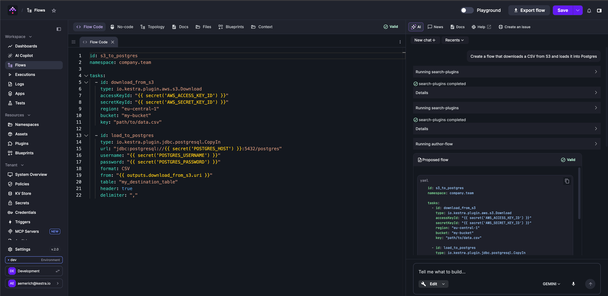
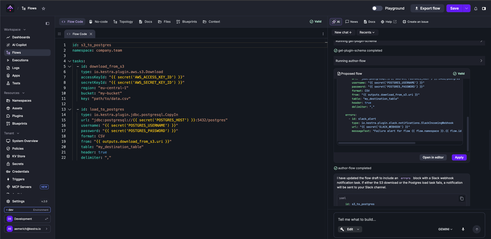
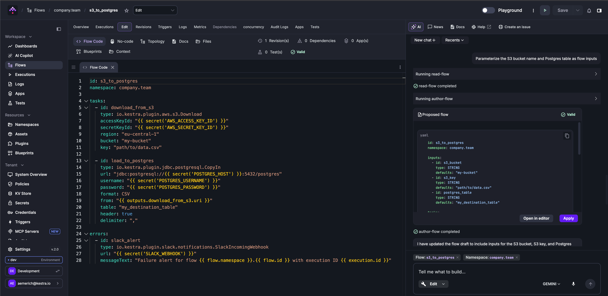
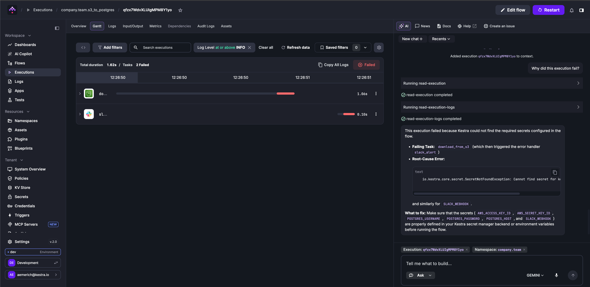
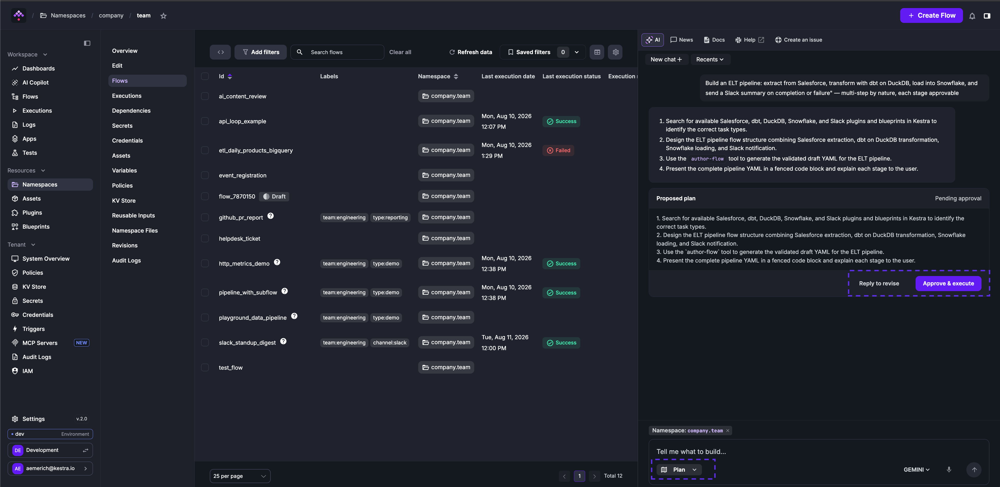

Build and modify flows, ask questions about Kestra, and get AI-driven plans — all from a persistent chat sidebar.

The AI Copilot opens as a right-side panel from the **AI** button in the top toolbar. Click **New chat +** to start a conversation, or use **Recents** to return to a previous one. Conversations persist for the browser session. You can type prompts or click the microphone button to dictate with speech-to-text.

## Modes

The Copilot has three modes, selectable from the dropdown at the bottom left of the chat panel:

| Mode | What it does |
|---|---|
| **Ask** | Answers questions about Kestra using docs-grounded responses. Ask about features, configuration, plugin options, or get help diagnosing a failed execution. |
| **Edit** | Generates and iteratively edits flow YAML. Describe what you want to build; the Copilot drafts the change and asks for confirmation before applying it. |
| **Plan** | Proposes a step-by-step plan for a complex task. Each step requires individual approval before the Copilot executes it. Rejecting any step cancels the plan. |

Switch modes at any point in a conversation — the Copilot carries the conversation history across mode switches.

| If you want to… | Use |
|---|---|
| Build, modify, or refactor a flow | Edit |
| Diagnose a failed execution | Ask |
| Ask about Kestra features, plugins, or configuration | Ask |
| Complete a multi-step task with approval at each step | Plan |

## Context

The Copilot automatically attaches the resource you are viewing as context when you open the panel. Attached resources appear as dismissible pills above the input. You can remove any pill to narrow the Copilot’s focus, and the transcript records each add and remove so you always know what the agent is looking at.

Resources that can be attached as context:

- Flow
- Namespace
- Execution
- Dashboard
- App
- Test suite
- Blueprint
- Plugin

Copilot also reads Namespace metadata — Policies, Variables, Secrets, and Key-Value pairs — so prompts like "Create a task that integrates with MongoDB" can reuse your configured credentials and variables without extra hints.

## Confirmation

In **Edit** and **Plan** modes, actions that modify resources (creating or updating a flow, restarting an execution) require explicit confirmation before the Copilot executes them. A confirmation prompt appears in the chat with an optional field to steer the next step. Approving executes the action; rejecting resumes the conversation in Edit mode or cancels the current plan in Plan mode.

## Edit mode

Edit mode generates and iteratively refines declarative flow YAML. Describe what you want to build; the Copilot searches available plugins, validates the generated YAML, and proposes the change for your approval. Once accepted, you can keep iterating — adding triggers, adjusting tasks, or refactoring a section — without the Copilot touching unrelated parts of the flow.

Edit mode is available anywhere you build in Kestra — Flows, Apps, Unit tests, and Dashboards.

## Usage limits

When no custom provider is configured, Kestra uses a built-in AI service with a daily generation limit per instance. The UI shows how many generations you have left, and the limit resets daily at midnight UTC.

To remove the limit, configure your own LLM provider in the `kestra.ai.providers` block. See [Configuration](#configuration) below.

## Configuration

To add Copilot to your flow editor, add the following to your [Enterprise and Advanced configuration](../../configuration/06.enterprise-and-advanced/index.md). The `providers` array lets you register multiple LLMs and pick a default (`isDefault: true`):

```yaml
kestra:
  ai:
    enabled: true # set to false to disable AI Copilot entirely
    providers:
      - id: gemini
        display-name: Gemini - Private
        type: gemini
        configuration:
          model-name: gemini-3.1-flash-lite
          api-key: YOUR_GEMINI_API_KEY
      - id: gpt
        display-name: Open AI
        type: openai
        isDefault: true
        configuration:
          model-name: gpt-4
          api-key: YOUR_OPENAI_API_KEY
```

:::alert{type="info"}
Legacy single-provider configs (`kestra.ai.type` + provider block) still work, but the `providers` array lets you register multiple providers and choose a default (`isDefault: true`).
:::

### Disabling AI Copilot

To fully disable the AI Copilot — including the built-in fallback to the `api.kestra.io` service — set `kestra.ai.enabled` to `false`:

```yaml
kestra:
  ai:
    enabled: false
```

When disabled, the Copilot UI will not appear and all AI endpoints will be deactivated. The property defaults to `true`.

### Multiple providers

When multiple providers are configured, users can switch models from a dropdown in the Copilot UI instead of relying only on the default.

Replace `api-key` with your provider credentials. Optionally, you can add the following properties inside each provider `configuration` block (availability varies by provider):

- `temperature`: Controls randomness in responses — lower values make outputs more focused and deterministic, while higher values increase creativity and variability.
- `topP` (nucleus sampling): Ranges from 0.0–1.0; lower values (0.1–0.3) produce safer, more focused responses for technical tasks, while higher values (0.7–0.9) encourage more creative and varied outputs.
- `topK`: Typically ranges from 1–200+ depending on the API; lower values restrict choices to a few predictable tokens, while higher values allow more options and greater variety in responses.
- `maxOutputTokens`: Sets the maximum number of tokens the model can generate, capping the response length.
- `logRequests`: Creates logs in Kestra for LLM requests.
- `logResponses`: Creates logs in Kestra for LLM responses.
- `baseURL`: Specifies the endpoint address where the LLM API is hosted.
- `clientPem`: (Required for mTLS) PEM bundle with client cert + private key (e.g., `cat client.crt.pem client.key.pem > client-bundle.pem`). Used for mutual TLS.
- `caPem`: CA PEM file to add a custom CA without `trustAll`. Usually not needed since hosts already trust the CA.
- `customHeaders`: Specify custom HTTP headers for authentication and routing through internal AI gateways. Custom headers should be passed as a map inside the property.
- `timeout`: Specifies the maximum duration to wait for an AI model API request to complete before timing out. ISO 8601 duration format (Java Duration): `PT30S` = 30 seconds. You can set it per provider to enforce strict SLAs.

:::alert{type="info"}
Enterprise Edition includes an [RBAC permission](../../07.enterprise/03.auth/rbac/index.md) that lets administrators allow or disallow Copilot usage per role at tenant or namespace scope.
:::

:::alert{type="info"}
The open-source version supports only Google Gemini models. Enterprise Edition users can configure any LLM provider, including Amazon Bedrock, Anthropic, Azure OpenAI, DeepSeek, Google Gemini, Google Vertex AI, Mistral, OpenAI, OpenRouter, and all open-source models supported by Ollama. See [Enterprise Edition Copilot configurations](#enterprise-edition-copilot-configurations) below. If you use a different provider, [reach out to us](https://kestra.io/demo) and we'll add it.
:::

## Build flows with Edit mode

Open the Copilot sidebar, select **Edit** mode, and describe what you want to build. The Copilot searches for the right plugins, generates validated YAML, and proposes the change for your approval. The flow is marked **Valid** before the proposal is shown — you will not be asked to apply broken YAML.

**Step 1: Build the initial flow**

```txt
Create a flow that downloads a CSV from S3 and loads it into Postgres
```



The Copilot searches for the S3 and Postgres plugins, authors the flow with secrets referenced via `{{ secret('...') }}`, and presents the proposal. Select **Apply** to write it to the editor, or **Open in editor** to review the diff before accepting.

**Step 2: Add error handling**

```txt
Add error handling that sends a Slack alert if any task fails
```



The Copilot updates only the `errors` block — the existing `download_from_s3` and `load_to_postgres` tasks are untouched. The Copilot explains what it changed before presenting the proposal.

**Step 3: Parameterize hardcoded values**

```txt
Parameterize the S3 bucket name and Postgres table as flow inputs
```



The Copilot reads the current flow (note the `read-flow` step in the sidebar), adds an `inputs` block with `s3_bucket`, `s3_key`, and `postgres_table`, and rewires the hardcoded values to `{{ inputs.* }}` references throughout the flow. The flow and namespace context pills are attached automatically while working inside the editor.

Each accepted change is saved as a revision. You can track the full edit history from the **Revisions** tab, or use [Git sync](../../version-control-cicd/04.git/index.md) to push revisions to your repository.

## Ask mode

Use Ask mode to ask natural-language questions about Kestra without generating any code. Ask mode grounds its answers in the Kestra documentation and can analyze execution failures by reading the execution logs directly.

**Diagnosing a failed execution**

When you open the Copilot from a failed execution view, the execution is automatically attached as context. Ask "Why did this execution fail?" and the Copilot reads the execution metadata and logs, then gives a structured answer: which task failed, the root-cause error, and what to fix.



In the example above, the Copilot ran `read-execution` and `read-execution-logs`, identified that the `download_from_s3` task failed due to `SecretNotFoundException`, and listed exactly which secrets — `AWS_ACCESS_KEY_ID`, `AWS_SECRET_KEY_ID`, `POSTGRES_USERNAME`, `POSTGRES_PASSWORD`, `POSTGRES_HOST`, and `SLACK_WEBHOOK` — need to be configured before running the flow again.

Other example questions:
- "What is the difference between a Worker Group and a Task Runner?"
- "How do I configure namespace-level Policies?"
- "What secrets and variables are available in this namespace?" (with a namespace attached as context)

Ask mode is also a useful starting point before switching to Edit or Plan — use it to understand your options, then switch modes to act on the answer.

## Plan mode

Use Plan mode when a task involves multiple ordered steps that you want to approve individually before the Copilot executes them. Plan mode presents the full plan upfront as a numbered list, then waits for your confirmation before starting. You can approve and execute the plan, or reply to revise it before anything runs.



In the example above, the prompt "Build an ELT pipeline: extract from Salesforce, transform with dbt on DuckDB, load into Snowflake, and send a Slack summary on completion or failure" produced a four-step plan. The `company.team` namespace pill is attached, so the Copilot can reference available plugins and credentials in that namespace.

Rejecting a step cancels the remaining steps. If you want to adjust the plan before it runs, use **Reply to revise** to send feedback and get a revised plan.

Use Plan mode for tasks like:
- Building a multi-stage pipeline where you want to review the structure before any YAML is generated
- Migrating flows from one pattern to another (for example, from `ForEach` to the Loop task) across multiple steps
- Setting up namespaces, variables, and RBAC in sequence for a new team

## Fix with AI

From the Logs and Gantt views, click the three-dot menu on any failed task and select **Fix with AI**. The flow editor opens with the Copilot pre-loaded with the error context in Edit mode, ready to propose a fix.

## Starter prompts

:::collapse{title="Edit mode prompts"}
```markdown
- Create a flow that runs a dbt build command on DuckDB
- Create a flow cloning https://github.com/kestra-io/dbt-example Git repository from a main branch, then add a dbt CLI task using DuckDB backend that will run dbt build command for that cloned repository using my_dbt_project profile and dev target. The dbt project is located in the root directory so no dbt project needs to be configured.
- Create a flow that sends a POST request to https://dummyjson.com/products/add
- Send a POST request to https://dummyjson.com/products/add
- Write a Python script that sends a POST request to https://dummyjson.com/products/add
- Write a Node.js script that sends a POST request to https://dummyjson.com/products/add
- Create a flow with a Python script that fetches weather data for New York City
- Make a REST API call to https://kestra.io/api/mock and allow failure
- Create a flow that logs "Hello from AI" to the console
- Create a flow that returns Hello as output
- Create a flow that outputs Hello as value
- Run a flow every 10 minutes
- Run a flow every day at 9 AM
- Run a shell command echo 'Hello Docker' in a Docker container
- Run a command python main.py in a Docker container
- Run a script main.py stored as namespace file
- Build a Docker image from an inline Dockerfile and push it to a GitHub Container Registry
- Build a Docker image from an inline Dockerfile and push it to a DockerHub Container Registry
- Create a flow that adds a string KV pair called MYKEY with value myvalue to namespace company
- Fetch value for KV pair called MYKEY from namespace company
- Create a flow that downloads a file mydata.csv from S3 bucket named mybucket
- Create a flow that downloads all files from the folder kestra/plugins/ from S3 bucket mybucket in us-east-1
- Send a Slack notification that approval is needed and Pause the flow for manual approval
- Send a Slack alert whenever any execution from namespace company fails
- Fetch value for string kv pair called mykey from Redis
- Fetch value for mykey from Redis
- Set value for mykey in Redis to myvalue
- Sync all flows and scripts for selected namespaces from Git to Kestra
- Create a flow that clones a Git repository and runs a Python script
- Export a Postgres table called mytable to a CSV file
- Query a Postgres table called mytable
- Find documents in a MongoDB collection called mycollection
- Load documents into a MongoDB mycollection using a file from input mydata
- Trigger an Airbyte connection sync and retry it up to 3 times
- Run an Airflow DAG called mydag
- Orchestrate an Ansible playbook stored in Namespace Files
- Run a DuckDB query that reads a CSV file
- Fetch AWS ECR authorization token to push Docker images to Amazon ECR
- Run a flow whenever 5 records are available in Kafka topic mytopic
- Submit a run for a Databricks job
```
:::

:::collapse{title="Ask mode prompts"}
```markdown
- Why did this execution fail? (attach the execution as context)
- What secrets and variables are available in this namespace? (attach the namespace as context)
- What is the difference between a Worker Group and a Task Runner?
- What plugins are available for working with Kafka?
- How do I configure RBAC so developers can run flows but not edit them?
- What is the best way to handle retries for a flaky HTTP API?
- How do I pass outputs from one task to the next?
- What does the errors block do and when should I use it?
- How do I schedule a flow to run only on weekdays?
- What is the difference between Namespace Variables and the KV Store?
```
:::

:::collapse{title="Plan mode prompts"}
```markdown
- Build an ELT pipeline: extract from Salesforce, transform with dbt on DuckDB, load into Snowflake, and send a Slack summary on completion or failure
- Migrate all ForEach tasks in this flow to use the Loop task
- Add retry logic, error notifications, and a timeout to every task in this flow
- Set up namespaces for dev, staging, and prod with RBAC roles for the engineering team
- Create a flow that ingests data from five different S3 paths in parallel, merges the results, and loads them into BigQuery
```
:::

## Enterprise Edition Copilot configurations

Enterprise Edition supports Amazon Bedrock, Anthropic, Azure OpenAI, DeepSeek, Google Gemini, Google Vertex AI, Mistral, OpenAI, OpenRouter, and all open-source models via Ollama. Add one or more provider blocks inside `kestra.ai.providers` and set `isDefault: true` on the one Copilot should use by default.

Only non-thinking models are supported. If a model cannot have thinking disabled, the generated YAML will be incorrect.

### Amazon Bedrock

```yaml
kestra:
  ai:
    providers:
      - id: bedrock
        display-name: Amazon Bedrock
        type: bedrock
        configuration:
          model-name: amazon.nova-lite-v1:0
          access-key-id: BEDROCK_ACCESS_KEY_ID
          secret-access-key: BEDROCK_SECRET_ACCESS_KEY
```

### Anthropic

```yaml
kestra:
  ai:
    providers:
      - id: anthropic
        display-name: Anthropic
        type: anthropic
        configuration:
          model-name: claude-opus-4-1-20250805
          api-key: CLAUDE_API_KEY
```

### Azure OpenAI

```yaml
kestra:
  ai:
    providers:
      - id: azure-openai
        display-name: Azure OpenAI
        type: azure-openai
        configuration:
          model-name: gpt-4o-2024-11-20
          api-key: AZURE_OPENAI_API_KEY
          tenant-id: AZURE_TENANT_ID
          client-id: AZURE_CLIENT_ID
          client-secret: AZURE_CLIENT_SECRET
          endpoint: "https://your-resource.openai.azure.com/"
```

### Deepseek

```yaml
kestra:
  ai:
    providers:
      - id: deepseek
        display-name: DeepSeek
        type: deepseek
        configuration:
          model-name: deepseek-chat
          api-key: DEEPSEEK_API_KEY
          base-url: "https://api.deepseek.com/v1"
```

### Google Gemini

```yaml
kestra:
  ai:
    providers:
      - id: gemini
        display-name: Google Gemini
        type: gemini
        configuration:
          model-name: gemini-3.1-flash-lite
          api-key: YOUR_GEMINI_API_KEY
```

### Google Vertex AI

```yaml
kestra:
  ai:
    providers:
      - id: vertex
        display-name: Google Vertex AI
        type: googlevertexai
        configuration:
          model-name: gemini-3.1-flash-lite
          project: GOOGLE_PROJECT_ID
          location: GOOGLE_CLOUD_REGION
          endpoint: VERTEX-AI-ENDPOINT
```

### Mistral

```yaml
kestra:
  ai:
    providers:
      - id: mistral
        display-name: Mistral
        type: mistralai
        configuration:
          model-name: mistral:7b
          api-key: MISTRALAI_API_KEY
          base-url: "https://api.mistral.ai/v1"
```

### Ollama

```yaml
kestra:
  ai:
    providers:
      - id: ollama
        display-name: Ollama
        type: ollama
        configuration:
          model-name: llama3
          base-url: http://localhost:11434
```

:::alert{type="info"}
If Ollama is running locally on your host machine while Kestra is running inside a container, connection errors may occur when using `localhost`. In this case, use the Docker internal network URL instead — for example, set the base URL to `http://host.docker.internal:11434`.
:::

:::alert{type="info"}
Some Ollama model tags resolve to thinking models behind the scenes. For example, `qwen3:30b-a3b` points to `qwen3:30b-a3b-thinking-2507-q4_K_M`, which cannot have thinking disabled. Check that the model you select has a non-thinking version or supports a toggle before using it with Copilot.
:::

### OpenAI

```yaml
kestra:
  ai:
    providers:
      - id: openai
        display-name: OpenAI
        type: openai
        configuration:
          model-name: gpt-5-nano
          api-key: OPENAI_API_KEY
          base-url: https://api.openai.com/v1
```

### OpenRouter

```yaml
kestra:
  ai:
    providers:
      - id: openrouter
        display-name: OpenRouter
        type: openrouter
        configuration:
          api-key: OPENROUTER_API_KEY
          base-url: "https://openrouter.ai/api/v1"
          model-name: "anthropic/claude-sonnet-4"
```
