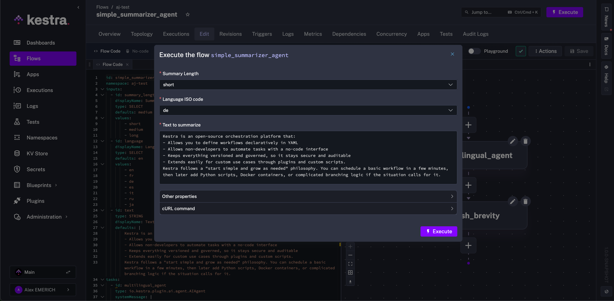
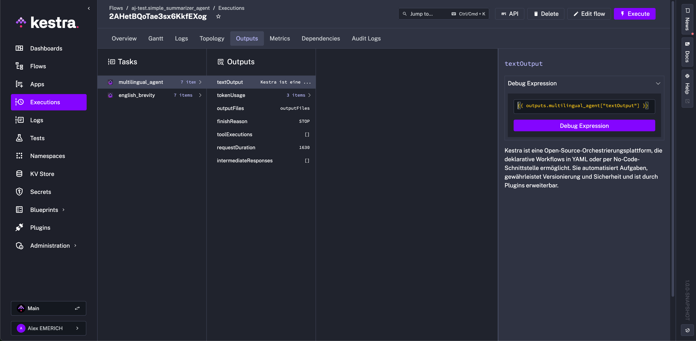
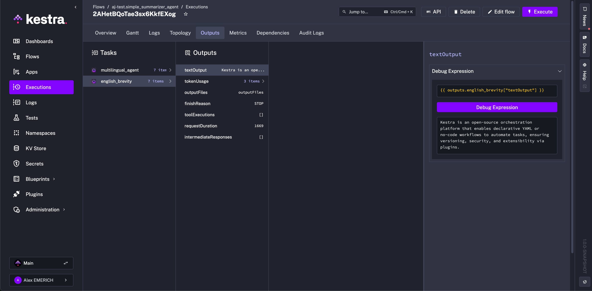

Launch autonomous processes with an LLM, memory, and tools.

## Build autonomous AI agents in Kestra

Add autonomous AI-driven tasks to flows that can think, remember, and dynamically orchestrate tools and tasks.

<div class="video-container">
  <iframe src="https://www.youtube.com/embed/osrS9mi5-eg?si=Tc8kMRP6NhqLQ4_u" title="YouTube video player" allow="accelerometer; autoplay; clipboard-write; encrypted-media; gyroscope; picture-in-picture; web-share" referrerpolicy="strict-origin-when-cross-origin" allowfullscreen></iframe>
</div>

An AI Agent is an autonomous system that uses a Large Language Model (LLM). Each run combines a **system message** and a **prompt**. The system message defines the agent's role and behavior, while the prompt carries the actual user input for that execution. Together, they guide the agent's response.

With AI Agents, workflows are no longer limited to a predefined sequence of tasks. An AI Agent task launches an autonomous process with the help of an LLM, memory, and tools such as web search, task execution, and flow calling, and can dynamically decide which actions to take and in what order. Unlike traditional flows, an AI Agent can loop tasks until a condition is met, adapt to new information, and orchestrate complex multi-step objectives on its own. This enables agentic orchestration patterns in Kestra, where agents can operate independently or collaborate in multi-agent systems, all while remaining fully observable and manageable in code.

To start using this feature, you can add an [**AI Agent**](/plugins/plugin-ai/agent) task to your flow. The AI Agent will then use the tools you provide to achieve its goal, leveraging capabilities such as web search, task execution, and flow calling. Thanks to memory, your AI Agent can remember information across executions to provide context for future tasks and subsequent prompts.

## AI Agent flow example

<div style="position: relative; padding-bottom: calc(48.95833333333333% + 41px); height: 0; width: 100%;"><iframe src="https://demo.arcade.software/KL8TVCdgVc4nS5OTS6VS?embed&embed_mobile=tab&embed_desktop=inline&show_copy_link=true" title="AI Agent 3 | Kestra" loading="lazy" webkitallowfullscreen mozallowfullscreen allowfullscreen allow="clipboard-write" style="position: absolute; top: 0; left: 0; width: 100%; height: 100%; color-scheme: light;" ></iframe></div>

The following flow summarizes arbitrary text with controllable length and language. Each component of the flow is broken down below.

```yaml
id: simple_summarizer_agent
namespace: company.ai
inputs:
  - id: summary_length
    displayName: Summary Length
    type: SELECT
    defaults: medium
    values:
        - short
        - medium
        - long
  - id: language
    displayName: Language ISO code
    type: SELECT
    defaults: en
    values:
        - en
        - fr
        - de
        - es
        - it
        - ru
        - ja
  - id: text
    type: STRING
    displayName: Text to summarize
    defaults: |
        Kestra is an open-source orchestration platform that:
        - Allows you to define workflows declaratively in YAML
        - Allows non-developers to automate tasks with a no-code interface
        - Keeps everything versioned and governed, so it stays secure and auditable
        - Extends easily for custom use cases through plugins and custom scripts.
        Kestra follows a "start simple and grow as needed" philosophy. You can schedule a basic workflow in a few minutes, then later add Python scripts, Docker containers, or complicated branching logic if the situation calls for it.
tasks:
  - id: multilingual_agent
    type: io.kestra.plugin.ai.agent.AIAgent
    systemMessage: |
        You are a precise technical assistant.
        Produce a {{ inputs.summary_length }} summary in {{ inputs.language }}.
        Keep it factual, remove fluff, and avoid marketing language.
        If the input is empty or non-text, return a one-sentence explanation.
        Output format:
        - 1-2 sentences for 'short'
        - 2-5 sentences for 'medium'
        - Up to 5 paragraphs for 'long'
    prompt: |
        Summarize the following content: {{ inputs.text }}

  - id: english_brevity
    type: io.kestra.plugin.ai.agent.AIAgent
    prompt: Generate exactly 1 sentence English summary of "{{ outputs.multilingual_agent.textOutput }}"

pluginDefaults:
  - type: io.kestra.plugin.ai.agent.AIAgent
    values:
        provider:
          type: io.kestra.plugin.ai.provider.GoogleGemini
          modelName: gemini-2.5-flash
          apiKey: "{{ secret('GEMINI_API_KEY') }}"
          configuration:
            logRequests: true
            logResponses: true
            responseFormat:
              type: TEXT
```

### Inputs

The flow uses three inputs — `summary_length`, `language`, and `text` — to control the summary length, language, and source text.

All inputs have a default value. Any of them can be referenced in downstream tasks with [expressions](../../expressions/index.mdx). When executing the flow, any input can be selected or modified from its default.



The example selects `short` for the summary length and German (`de`) for the summary language.

### Tasks

The flow has two tasks using the [AI Agent plugin](/plugins/plugin-ai/agent): `multilingual_agent` and `english_brevity`. The first task, `multilingual_agent`, uses the `systemMessage` property to set the agent's role and behavior. The system message references the input selections for summary length and language, and defines what to output for each length option.

The `prompt` property instructs the agent to summarize the input text. For a short summary, `multilingual_agent` produces a 1–2 sentence German summary of Kestra.



The `english_brevity` task only needs a `prompt` because the `systemMessage` is inherited from plugin defaults. Whether the original output is in a different language or needs shortening, `english_brevity` produces a one-sentence English summary.



These outputs can then be passed on as notifications or system messages to external tools or subflows within Kestra. Other useful outputs include `tokenUsage` to compare different providers for the same tasks. At runtime, Kestra also emits counter metrics — `ai.agent.tool.calls`, `ai.provider.calls`, and `ai.embedding.store.calls` — tagged by class name, which you can scrape with Prometheus or export via OpenTelemetry to monitor AI task usage. For more examples and details about properties, outputs, and definitions, refer to the AI [Agent plugin documentation](/plugins/plugin-ai/agent).

### Plugin defaults

Each task using the AI Agent requires the `provider` property. To avoid repetition and simplify the flow building experience, first consider using [Kestra's AI Copilot](../ai-copilot/index.md), next consider using [Plugin Defaults](../../05.workflow-components/09.plugin-defaults/index.md) to ensure consistency and remove repetition. Additionally, for your provider API key, secure it either through the [Key-Value Store](../../06.concepts/05.kv-store/index.md) or as a [Secret](../../06.concepts/04.secret/index.md) if using [Kestra Enterprise Edition](../../07.enterprise/01.overview/01.enterprise-edition/index.md).

## Agent tools

The AI Agent can be extended with **tools** — capabilities the LLM can choose to invoke at runtime to complete its task. Tools are listed under the `tools` property of an `AIAgent` task.

### Skills

The [**Skill**](/plugins/plugin-ai/tool/skill) tool lets you attach structured instructions to an agent that it can activate on demand. Rather than including all instructions in the system message, skills let you define discrete, reusable knowledge blocks — each with a name, a description the LLM uses to decide when to activate it, and the actual instruction content.

This is useful when an agent has multiple possible modes of operation, such as translating text, reviewing code, or formatting data, where you want the LLM to select and apply the right instructions based on context rather than always receiving all instructions at once.

Each skill requires:
- `name` — a unique identifier for the skill
- `description` — explains to the LLM when to activate the skill
- `content` or `contentUri` — the instruction content, either inline or loaded from Kestra internal storage

#### Inline skill content

The simplest way to define a skill is with inline `content`:

```yaml
id: agent_with_skills
namespace: company.ai

tasks:
  - id: agent
    type: io.kestra.plugin.ai.agent.AIAgent
    prompt: Translate the following text to French - "Hello, how are you today?"
    provider:
      type: io.kestra.plugin.ai.provider.GoogleGemini
      modelName: gemini-2.5-flash
      apiKey: "{{ secret('GEMINI_API_KEY') }}"
    tools:
      - type: io.kestra.plugin.ai.tool.Skill
        skills:
          - name: translation_expert
            description: Expert translator for multiple languages
            content: |
              You are an expert translator. When translating text:
              1. Preserve the original meaning and tone
              2. Use natural phrasing in the target language
              3. Keep proper nouns unchanged
```

#### Loading skill content from storage

For longer or reusable instructions, store the skill content as a file in Kestra internal storage and reference it with `contentUri`. This is especially useful when skill content is generated or updated by an earlier task in the same flow:

```yaml
id: agent_with_skill_from_storage
namespace: company.ai

tasks:
  - id: write_instructions
    type: io.kestra.plugin.core.storage.Write
    content: |
      You are a senior code reviewer. When reviewing code:
      1. Check for security vulnerabilities
      2. Ensure proper error handling
      3. Verify naming conventions are followed
      4. Flag any code duplication

  - id: agent
    type: io.kestra.plugin.ai.agent.AIAgent
    prompt: Review this Python function - "def add(a, b): return a + b"
    provider:
      type: io.kestra.plugin.ai.provider.GoogleGemini
      modelName: gemini-2.5-flash
      apiKey: "{{ secret('GEMINI_API_KEY') }}"
    tools:
      - type: io.kestra.plugin.ai.tool.Skill
        skills:
          - name: code_review_expert
            description: Expert code reviewer with strict guidelines
            contentUri: "{{ outputs.write_instructions.uri }}"
```

A single `Skill` tool can define multiple skills. Each skill must have a unique name. `content` and `contentUri` are mutually exclusive — exactly one must be set per skill. For more details on all available properties, refer to the [Skill plugin documentation](/plugins/plugin-ai/tool/skill).

### Kestra-native tools

- [**KestraFlow**](/plugins/plugin-ai/tool/kestraflow) — triggers a Kestra flow as a tool, either with a predefined namespace and flow ID or dynamically based on the agent's prompt.
- [**KestraTask**](/plugins/plugin-ai/tool/kestratask) — exposes one or more Kestra runnable tasks as tools, letting the agent supply values for properties left unset.

### Web search

- [**TavilyWebSearch**](/plugins/plugin-ai/tool/tavilywebsearch) — gives the agent access to live web results via the Tavily search API.
- [**GoogleCustomWebSearch**](/plugins/plugin-ai/tool/googlecustomwebsearch) — gives the agent access to live web results via a Google Custom Search Engine.

### Code execution

- [**CodeExecution**](/plugins/plugin-ai/tool/codeexecution) — lets the agent write and run JavaScript snippets in a Judge0 sandbox (via RapidAPI).

### Nested agents

- [**AIAgent**](/plugins/plugin-ai/tool/aiagent) — wraps another AI agent as a callable tool so a parent agent can delegate sub-tasks to a specialized child agent.
- [**A2AClient**](/plugins/plugin-ai/tool/a2aclient) — forwards prompts to a remote AI agent over the Agent-to-Agent (A2A) protocol and returns its response.

### MCP clients

Kestra supports MCP in two directions. These clients cover the **Kestra-as-client** direction: your flow calls tools on an *external* MCP server. For the opposite direction — exposing your flows *as* MCP tools for external AI agents to call — see [MCP Server](../mcp-server/index.md) and the [McpToolTrigger](../../05.workflow-components/07.triggers/06.mcp-tool-trigger/index.md).

Connect the agent to any [Model Context Protocol (MCP)](https://modelcontextprotocol.io) server to expose its tools:

- [**DockerMcpClient**](/plugins/plugin-ai/tool/dockermcpclient) — runs an MCP server inside a Docker container.
- [**SseMcpClient**](/plugins/plugin-ai/tool/ssemcpclient) — connects to a remote MCP server over Server-Sent Events (SSE).
- [**StdioMcpClient**](/plugins/plugin-ai/tool/stdiomcpclient) — spawns a local MCP server process and communicates over stdio.
- [**StreamableHttpMcpClient**](/plugins/plugin-ai/tool/streamablehttpmcpclient) — connects to an MCP server over HTTP streaming.

The [Kestra Python MCP server](https://github.com/kestra-io/mcp-server-python) is an example of an external MCP server you can connect to from a Kestra AI Agent task using one of the clients above.

## Execution details

When you open an execution in the topology view, the details panel for `AIAgent`, `ChatCompletion`, and `rag.ChatCompletion` tasks shows the LLM configuration and post-execution context for each call.

**Pre-execution:**
- Model name and provider
- System prompt (collapsible)
- Tools available to the agent
- RAG retriever and embedding store configuration (when applicable)

**Post-execution:**

| Signal | Description |
|---|---|
| LLM response | The final text or JSON output rendered inline |
| Tool call timeline | Each tool invocation in order: name, arguments, and result |
| Token usage | Input tokens, output tokens, total, and an estimated cost by provider and model |
| Reasoning chain | Intermediate responses and extended thinking steps when present |
| RAG sources | Retrieved chunks ranked by similarity score, showing which context grounded the answer |
| Finish reason | Why the model stopped: natural stop, max tokens reached, or a guardrail trigger |
