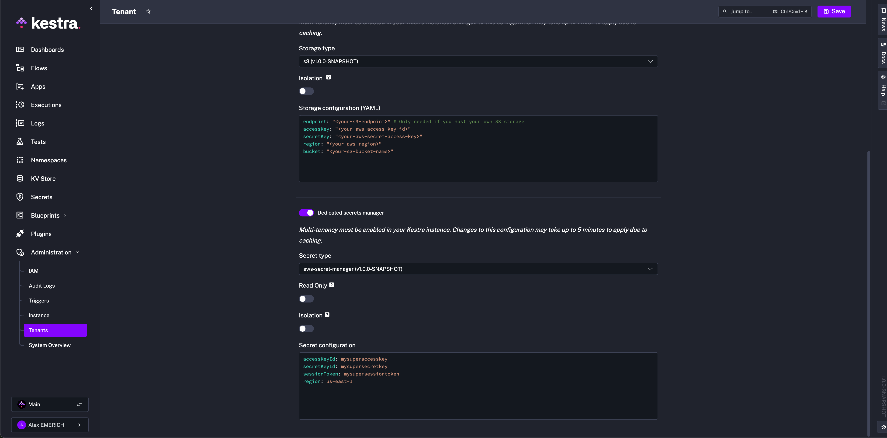

Use this page when you need to protect sensitive values or harden a Kestra deployment.

## Encryption

Kestra supports encryption of sensitive inputs and outputs at rest through `kestra.encryption.secret-key`.

Example:

```yaml
kestra:
  encryption:
    secret-key: BASE64_ENCODED_STRING_OF_32_CHARACTERS
```

This is required when you want to use `SECRET` input or output types safely.

## Secret backends

Kestra can be configured to use a secrets backend through `kestra.secret.*`.

The full reference covers:

- AWS Secrets Manager
- Azure Key Vault
- Google Secret Manager
- HashiCorp Vault
- JDBC
- secret tags
- secret cache
- isolation options



## Security settings

This group includes:

- super-admin behavior
- default roles
- invitation expiration
- password rules
- server basic auth
- deletion of configuration files

## Related docs

- Secrets manager concepts: [External Secrets Manager](../../07.enterprise/02.governance/secrets-manager/index.md)
- Enterprise auth and RBAC: [Authentication and Users](../../07.enterprise/03.auth/index.mdx)
- Full property list: [Full Reference](../99.full-reference/index.md#secret-managers)
