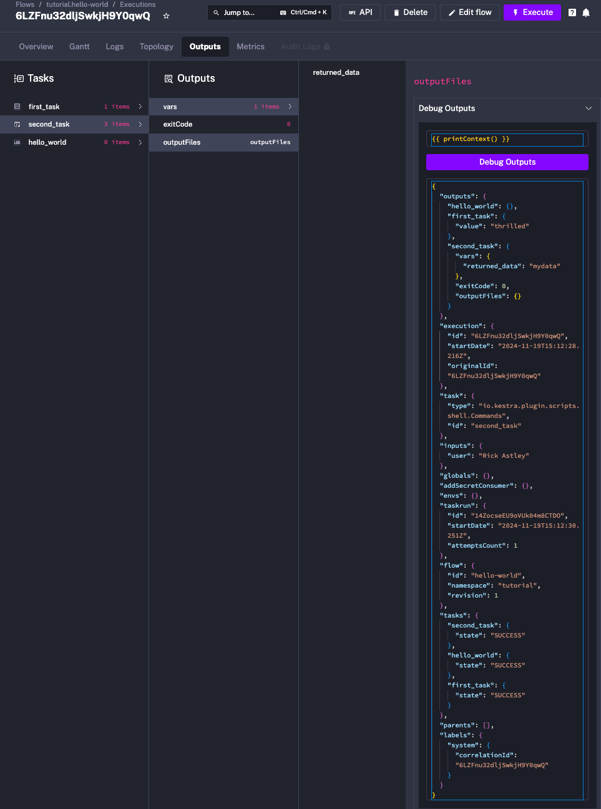

Use this page when you need to know what data is available inside `{{ ... }}` at runtime.

## Understand the execution context

Kestra expressions combine the [Pebble templating engine](../../06.concepts/06.pebble/index.md) with the execution context to dynamically render flow properties.

The execution context usually includes:

- `flow`
- `execution`
- `inputs`
- `outputs`
- `labels`
- `tasks`
- `trigger` when the flow was started by a trigger
- `vars` when the flow defines variables
- `namespace` in Enterprise Edition when namespace variables are configured
- `envs` for environment variables
- `globals` for global configuration values

:::alert{type="info"}
To inspect the full runtime context, use `{{ printContext() }}` in the Debug Expression console.

:::

## Default execution context variables

| Parameter | Description |
| --- | --- |
| `{{ flow.id }}` | Identifier of the flow |
| `{{ flow.namespace }}` | Namespace of the flow |
| `{{ flow.tenantId }}` | Tenant identifier in Enterprise Edition |
| `{{ flow.revision }}` | Flow revision number |
| `{{ execution.id }}` | Unique execution identifier |
| `{{ execution.startDate }}` | Start date of the execution |
| `{{ execution.state }}` | Current execution state |
| `{{ execution.originalId }}` | Original execution ID preserved across replays |
| `{{ task.id }}` | Current task identifier |
| `{{ task.type }}` | Fully qualified class name of the current task |
| `{{ taskrun.id }}` | Current task run identifier |
| `{{ taskrun.startDate }}` | Start date of the current task run |
| `{{ taskrun.attemptsCount }}` | Retry and restart attempt count |
| `{{ taskrun.parentId }}` | Parent task run identifier for nested tasks |
| `{{ taskrun.value }}` | Current loop or flowable value |
| `{{ parent.taskrun.value }}` | Value of the nearest parent task run |
| `{{ parent.outputs }}` | Outputs of the nearest parent task run |
| `{{ parents }}` | List of parent task runs |
| `{{ labels }}` | Execution labels accessible by key |

Example:

```yaml
id: expressions
namespace: company.team

tasks:
  - id: debug_expressions
    type: io.kestra.plugin.core.debug.Return
    format: |
      taskId: {{ task.id }}
      date: {{ execution.startDate | date("yyyy-MM-dd HH:mm:ss.SSSSSS") }}
```

## Trigger variables

When the execution is started by a `Schedule` trigger:

| Parameter | Description |
| --- | --- |
| `{{ trigger.date }}` | Date of the current schedule |
| `{{ trigger.next }}` | Date of the next schedule |
| `{{ trigger.previous }}` | Date of the previous schedule |

When the execution is started by a `Flow` trigger:

| Parameter | Description |
| --- | --- |
| `{{ trigger.executionId }}` | ID of the triggering execution |
| `{{ trigger.namespace }}` | Namespace of the triggering flow |
| `{{ trigger.flowId }}` | ID of the triggering flow |
| `{{ trigger.flowRevision }}` | Revision of the triggering flow |

## Environment and global variables

Kestra provides access to environment variables prefixed with `ENV_` by default, unless configured otherwise in the [runtime and storage configuration](../../configuration/02.runtime-and-storage/index.md).

- reference `ENV_FOO` as `{{ envs.foo }}`
- reference the configured environment name as `{{ kestra.environment }}`
- reference the configured Kestra URL as `{{ kestra.url }}`
- reference global variables from configuration as `{{ globals.foo }}`

## Flow variables and inputs

Use flow-level variables with `vars.*`:

```yaml
id: flow_variables
namespace: company.team

variables:
  my_variable: "my_value"

tasks:
  - id: print_variable
    type: io.kestra.plugin.core.debug.Return
    format: "{{ vars.my_variable }}"
```

Use inputs with `inputs.*`:

```yaml
id: render_inputs
namespace: company.team

inputs:
  - id: myInput
    type: STRING

tasks:
  - id: myTask
    type: io.kestra.plugin.core.debug.Return
    format: "{{ inputs.myInput }}"
```

## Secrets, credentials, namespace variables, and outputs

Use `secret()` to inject secret values at runtime:

```yaml
tasks:
  - id: myTask
    type: io.kestra.plugin.core.debug.Return
    format: "{{ secret('MY_SECRET') }}"
```

Use `credential()` in Enterprise Edition to inject a short-lived token from a managed [Credential](../../07.enterprise/03.auth/credentials/index.md):

```yaml
tasks:
  - id: request
    type: io.kestra.plugin.core.http.Request
    method: GET
    uri: https://api.example.com/v1/ping
    auth:
      type: BEARER
      token: "{{ credential('my_oauth') }}"
```

`credential()` returns the short-lived token only. The credential itself is managed in the Kestra UI.

Use namespace variables in Enterprise Edition with `namespace.*`. If a namespace variable itself contains Pebble, evaluate it with `render()`:

```yaml
format: "{{ render(namespace.github.token) }}"
```

Use outputs with `outputs.taskId.attribute`:

```yaml
message: |
  First: {{ outputs.first.value }}
  Second: {{ outputs['second-task'].value }}
```

:::alert{type="info"}
If a task ID or output key contains a hyphen, use bracket notation such as `outputs['second-task']`. To avoid that, prefer `camelCase` or `snake_case`.
:::

For more detail, see [Full Reference](../99.full-reference/index.md).
