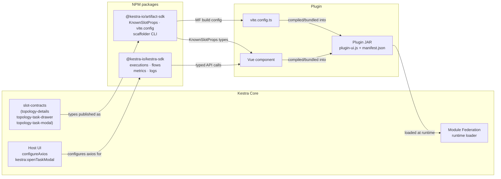

Plugins can ship custom Vue.js frontend components that load directly into the Kestra UI at runtime, without any changes to Kestra core.

This lets you build domain-specific experiences: visualize a query plan in the topology view, render log output in a structured panel, or display task metadata in a rich card. The core UI stays lean; each plugin brings exactly the UI it needs.

## Why plugin artifacts?

Tasks in Kestra produce structured outputs and have rich configuration. But the default topology and log views are generic — they show raw YAML and plain text. When a task is query-centric, graph-centric, or data-heavy, that generic view loses signal.

Plugin artifacts let you close this gap without forking Kestra's core. A `topology-details` component can show a formatted query, estimated cost, or job metadata inline in the flow topology. A `log-details` component can structure log output into a readable table. This keeps the core UI generic and lets each plugin deliver the right experience for its domain.

## Architecture

Plugin artifacts are built as **Vue.js micro-frontends** using [Module Federation](https://module-federation.io/). The plugin's `ui/` directory compiles to a federated JavaScript module, which is bundled into the plugin JAR under `src/main/resources/plugin-ui/`. At runtime, the Kestra host app discovers and loads these modules dynamically — no static linking required.

```
Plugin JAR
└── src/main/resources/plugin-ui/
    ├── plugin-ui.js       ← the federated module entry point
    ├── manifest.json      ← declares which task types have UI and which slots they fill
    └── *.css              ← scoped styles
```

The `manifest.json` is the contract between the plugin and the host. It tells Kestra which task types expose UI components, which slot each component fills, and any static metadata (dimensions, feature flags) the host needs before loading the component.

The [`@kestra-io/artifact-sdk`](https://github.com/kestra-io/artifact-sdk) handles all the Module Federation configuration, manifest generation, and shared dependencies. You write a Vue component; the SDK takes care of the bundling contract.



## Available UI slots

Each plugin component targets a specific **slot** — a named extension point in the Kestra UI. Slots are defined in Kestra core (OSS) and distributed via the `@kestra-io/artifact-sdk` package. Kestra core owns the runtime contract (what props are injected, what `manifest.json` shape is accepted); the SDK exposes the corresponding TypeScript types and powers the scaffolding CLI. Three slots are available in `@kestra-io/artifact-sdk`:

### `topology-details`

Renders in the **execution topology view** when a task node is selected. The contract is defined in [`ui/packages/slot-contracts/src/topology-details.ts`](https://github.com/kestra-io/kestra/blob/develop/ui/packages/slot-contracts/src/topology-details.ts) in Kestra core and distributed via `@kestra-io/artifact-sdk`:

```ts
import type { Execution, MetricEntry, Task } from "@kestra-io/kestra-sdk"
import { z } from "zod"

export const propsSchema = z.object({
    taskType: z.string(),
    task: z.custom<Task>(),
    execution: z.custom<Execution>().optional(),
    namespace: z.string().optional(),
    flowId: z.string().optional(),
    metrics: z.custom<MetricEntry>().array(),
})
```

`Task`, `Execution`, and `MetricEntry` are imported from `@kestra-io/kestra-sdk`.

Check `execution?.id` to detect whether execution data is available and adjust the rendered content accordingly. `metrics` is always an array (empty before execution).

The host also injects `displayMode` as an HTML attribute — it is not in the props type, so it lands in `attrs`. Use `useAttrs()` to read it:

```ts
const attrs = useAttrs();
const isFullView = computed(() => attrs.displayMode === "full");
```

When `displayMode` is `"full"` the component renders in an expanded drawer; otherwise it renders inline in the compact topology node.

:::alert{type="warning"}
During certain render phases, `namespace` and `flowId` may arrive as unresolved URL template strings — e.g. `"{namespace}"` instead of `"myteam"`. These strings are truthy in JavaScript, so a plain `if (!props.namespace)` check won't catch them. Always guard with a `startsWith("{")` check before making API calls:

```ts
async function loadFlowData() {
  const ns = props.namespace;
  const fid = props.flowId;
  if (!ns || ns.startsWith("{") || !fid || fid.startsWith("{")) return;
  // safe to call SDK
}
```
:::

### `topology-task-drawer`

Renders in the **flow editor** (low-code editor) drawer when a task node is selected. It shares the exact same `propsSchema` as `topology-details` (defined in [`topology-task-drawer.ts`](https://github.com/kestra-io/kestra/blob/develop/ui/packages/slot-contracts/src/topology-task-drawer.ts)). This slot targets the design-time context, so `execution` is typically absent and `metrics` will be an empty array.

Same as `topology-details`, `displayMode` is injected as an HTML attribute and must be read via `useAttrs()`. `namespace` and `flowId` are props.

You can reuse the same Vue component file for both `topology-details` and `topology-task-drawer` — just register it under both slot names in `vite.config.ts` and use `displayMode` to adjust what is rendered (see [Configuring the exposed components](#configuring-the-exposed-components)).

### `topology-task-modal`

Renders as a **full-screen modal** (`KsDialog`) in the execution topology view when the user clicks "View details" on a runner-backed task node. It shares the exact same `propsSchema` as `topology-details` (defined in [`ui/packages/slot-contracts/src/topology-task-modal.ts`](https://github.com/kestra-io/kestra/blob/develop/ui/packages/slot-contracts/src/topology-task-modal.ts) in Kestra core).

The modal is triggered by injecting `kestra:openTaskModal` — provided by the Kestra host via `LowCodeEditor.vue`. Plugin components that want to open the modal call this injection; you do not need to handle the dialog lifecycle yourself.

```ts
import { inject } from "vue"
import type { KnownSlotProps } from "@kestra-io/artifact-sdk"

defineProps<KnownSlotProps["topology-task-modal"]>()

const openTaskModal = inject<(ctx: Record<string, any>) => void>("kestra:openTaskModal")
```

This slot is the right choice when a task runner (e.g. AWS Batch, Docker, Kubernetes) needs a rich detail view that goes beyond what fits in the compact topology node or the `topology-details` panel.

## Quick start

Use the [`@kestra-io/create-artifact-sdk`](https://github.com/kestra-io/artifact-sdk) scaffolder to bootstrap the `ui/` directory in your plugin. Run this from your plugin's root (the directory containing `settings.gradle` or `settings.gradle.kts`):

```bash
npm create @kestra-io/artifact-sdk
```

The CLI will:

1. **Detect your plugin** — reads `settings.gradle[.kts]` to infer the plugin group ID (e.g. `io.kestra.plugin.example`).
2. **Ask which task** you want to add UI for (e.g. `query.RunQuery`).
3. **Ask which UI slot** to target (`topology-details` or `topology-task-drawer`).
4. **Ask whether to add `@kestra-io/kestra-sdk`** as a dependency (default: no — add it only if your component needs to call Kestra APIs, see [Calling the Kestra API](#calling-the-kestra-api)).
5. **Show a summary** and ask for confirmation before writing anything.
6. **Scaffold the `ui/` directory** with all required files and run `npm install`.

:::alert{type="info"}
Node.js ≥ 18 is required. The scaffolder can also be run from inside an existing `ui/` directory if you want to add more components later.
:::

:::alert{type="warning"}
After scaffolding, add `@kestra-io/design-system` as a **direct** dependency:

```bash
cd ui
npm install @kestra-io/design-system
```

`@module-federation/vite` resolves shared package entries from its own `node_modules` path. Even though `@kestra-io/design-system` is already a dependency of `artifact-sdk`, the Module Federation build will fail unless it is also listed as a top-level dependency in your plugin's `package.json`.
:::

## Project structure

After scaffolding, the `ui/` directory looks like this:

```
ui/
├── .gitignore
├── .storybook/
│   ├── main.ts
│   └── preview.ts
├── index.html                          ← dev server entry
├── package.json
├── tsconfig.json
├── vite.config.ts                      ← Module Federation config
└── src/
    ├── App.vue                         ← dev server wrapper
    ├── main.ts                         ← dev server entry
    ├── components/
    │   └── QueryRunQueryTopologyDetails.vue   ← your component to edit
    └── QueryRunQueryTopologyDetails.stories.ts
```

The component file is the only file you need to edit. The rest of the scaffolding is boilerplate that wires up the local dev server, Storybook, and the production build.

## Calling the Kestra API

Plugin components often need to fetch data from Kestra — task outputs, execution metrics, flow definitions — to render meaningful information. Use the [`@kestra-io/kestra-sdk`](https://www.npmjs.com/package/@kestra-io/kestra-sdk) package for all API calls instead of raw `fetch()`.

### Why not raw `fetch()`?

Kestra EE uses cookie-based authentication with JWT access tokens and automatic token refresh. Raw `fetch()` bypasses this entirely: it won't include the right credentials in cross-origin contexts, and it won't retry on 401 by refreshing the token. This causes silent failures or authentication errors in production EE deployments.

The SDK wraps every call in an axios instance that the Kestra host configures at startup with `withCredentials: true`, a 401 → token-refresh interceptor, and impersonation support. Any SDK function you call in your component automatically inherits this configuration — no extra setup needed.

### Installation

The scaffolder asks whether to include `@kestra-io/kestra-sdk` during setup. If you answered yes, the package is already in your `package.json`. If you skipped it, add it manually:

```bash
cd ui
npm install @kestra-io/kestra-sdk
```

### Why your plugin doesn't call `configureAxios`

The Kestra host application calls `configureAxios()` once at boot, passing it the auth store, router, and other runtime dependencies. This call registers the EE-aware axios instance globally inside the SDK. Your plugin component only needs to import and call the typed API functions — the auth layer is already wired up by the time your component loads.

```ts
// ✅ correct — import from the appropriate subpath and call it
import * as ExecutionAPI from "@kestra-io/kestra-sdk/executions";
import * as MetricsAPI from "@kestra-io/kestra-sdk/metrics";

// ❌ do not call configureAxios yourself — that's the host's responsibility
// import { configureAxios } from "@kestra-io/kestra-sdk";
// configureAxios(...);
```

### Usage example

The SDK exposes flat async functions, one per API operation. Tenant is injected automatically (the host sets it via `setSelectedTenant` at boot):

```ts
import { ref, watch, computed } from "vue";
import * as ExecutionAPI from "@kestra-io/kestra-sdk/executions";
import * as MetricsAPI from "@kestra-io/kestra-sdk/metrics";

// Fetch task outputs from the full execution
const fetchedOutputs = ref<Record<string, any> | null>(null);
const executionId = computed(() => props.execution?.id as string | undefined);

watch(executionId, async (id) => {
  if (!id) return;
  try {
    const exec = await ExecutionAPI.execution({ path: { executionId: id } });
    const tr = exec.taskRunList?.filter((r: any) => r.taskId === props.task.id).at(-1);
    fetchedOutputs.value = (tr as any)?.outputs ?? null;
  } catch { /* best-effort */ }
}, { immediate: true });

// Fetch execution metrics
const metrics = ref<Array<{ name: string; value: number }>>([]);

watch(executionId, async (id) => {
  if (!id) return;
  try {
    const resp = await MetricsAPI.searchByExecution({ path: { executionId: id } });
    metrics.value = resp.results ?? [];
  } catch { /* best-effort */ }
}, { immediate: true });
```

Key API functions for topology and log components:

| Function | Import | Description |
|---|---|---|
| `flow` | `@kestra-io/kestra-sdk/flows` | Fetch a flow definition (namespace, task config) |
| `execution` | `@kestra-io/kestra-sdk/executions` | Fetch a full execution with task run list |
| `searchByExecution` | `@kestra-io/kestra-sdk/metrics` | Fetch all metrics for an execution |
| `listLogsFromExecution` | `@kestra-io/kestra-sdk/logs` | Fetch log entries for an execution |
| `taskRunOutputs` | `@kestra-io/kestra-sdk/outputs` | Fetch outputs for a specific task run |

:::alert{type="info"}
Wrap every SDK call in `try { … } catch { /* best-effort */ }`. In Storybook and the local dev server (`npm run dev`) there is no Kestra host, so calls will fail — the component should degrade gracefully and fall back to whatever static data the stories or dev harness provides via props.
:::

:::alert{type="warning"}
**404 responses trigger a full-page error overlay.** The SDK's 404 interceptor unconditionally sets `coreStore.error = 404`, which replaces the entire Kestra UI with an error page. Passing `showMessageOnError: false` is **not enough** — that only suppresses toast messages; the 404 interceptor runs before that check.

For any SDK call that may legitimately return 404 (e.g. fetching a flow definition before the flow has been saved), pass `validateStatus` to route the 404 through the success path instead of the error interceptor:

```ts
import * as FlowAPI from "@kestra-io/kestra-sdk/flows";

try {
  const f = await FlowAPI.flow(
    { path: { namespace: ns, id: fid } },
    { showMessageOnError: false, validateStatus: (s: number) => s === 200 || s === 404 },
  );
  // f.tasks will be undefined on a 404 — handle that gracefully
  const tasks = (f as any)?.tasks as any[] | undefined;
} catch { /* best-effort */ }
```
:::

## Configuring the exposed components

The `vite.config.ts` file declares which components are exposed and under which task types:

```ts
import defaultViteConfig from "@kestra-io/artifact-sdk/vite.config";

export default defaultViteConfig({
  plugin: "io.kestra.plugin.example",

  exposes: {
    "query.RunQuery": [
      {
        slotName: "topology-details",
        path: "./src/components/QueryRunQueryTopologyDetails.vue",
        additionalProperties: {
          height: 120,
          heightWithExecution: 200,
        },
      },
    ],
  },
});
```

- **`plugin`** — the plugin group ID, matching the prefix used in task types.
- **`exposes`** — a map from task type suffix (everything after `io.kestra.plugin.example.`) to a list of slot definitions.
- **`slotName`** — which UI slot this component fills.
- **`path`** — path to the Vue component, relative to `ui/`.
- **`additionalProperties`** — static metadata written to the manifest (see [below](#additional-properties)).

A single task can expose components for multiple slots:

```ts
"query.RunQuery": [
  {
    slotName: "topology-details",
    path: "./src/components/QueryRunQueryTopologyDetails.vue",
    additionalProperties: { height: 120 },
  },
  {
    slotName: "topology-task-drawer",
    path: "./src/components/QueryRunQueryTopologyTaskDrawer.vue",
    additionalProperties: { height: 120 },
  },
],
```

## Complete example

The snippet below is adapted from the BigQuery plugin ([plugin-gcp#599](https://github.com/kestra-io/plugin-gcp/pull/599)). It shows a `topology-details` component that:

- renders project/location before execution
- adds duration and cost estimates after execution
- uses `displayMode === "full"` to show a rich job-details section only in the expanded drawer
- fetches outputs and metrics via `@kestra-io/kestra-sdk`
- reuses the same file for the `topology-task-drawer` slot

```vue
<!-- ui/src/components/QueryRunQueryTopologyDetails.vue -->
<script setup lang="ts">
import type { KnownSlotProps } from "@kestra-io/artifact-sdk";
import { computed, ref, watch, useAttrs } from "vue";
import * as ExecutionAPI from "@kestra-io/kestra-sdk/executions";
import * as FlowAPI from "@kestra-io/kestra-sdk/flows";

// KnownSlotProps["topology-details"] includes taskType, task, execution, namespace, flowId, metrics
const props = defineProps<KnownSlotProps["topology-details"]>();
const attrs = useAttrs();
const isFullView = computed(() => attrs.displayMode === "full");

const taskId = computed(() => props.task?.id as string | undefined);

// Fetch the full flow definition to resolve task config that may not be in props.task.
// namespace/flowId are proper props (injected by the host).
const flowTask = ref<Record<string, any> | null>(null);

async function loadFlowTask() {
  const ns = props.namespace;
  const fid = props.flowId;
  if (!ns || ns.startsWith("{") || !fid || fid.startsWith("{")) return;
  try {
    const f = await FlowAPI.flow({ path: { namespace: ns, id: fid } });
    const tasks = (f as any).tasks as any[] | undefined;
    flowTask.value = tasks?.find((t: any) => t.id === taskId.value) ?? null;
  } catch { /* best-effort */ }
}

watch([() => props.namespace, () => props.flowId], () => loadFlowTask(), { immediate: true });

const projectId = computed(() =>
  (props.task?.projectId ?? flowTask.value?.projectId) as string | undefined
);
const location = computed(() =>
  (props.task?.location ?? flowTask.value?.location) as string | undefined
);

// Execution state
const hasExecution = computed(() => !!props.execution?.id);
const executionId = computed(() => props.execution?.id as string | undefined);

// Fetch the full execution to get task outputs (props.execution contains task runs but not outputs)
const fetchedOutputs = ref<Record<string, any> | null>(null);

watch(executionId, async (id) => {
  if (!id) return;
  try {
    const exec = await ExecutionAPI.execution({ path: { executionId: id } });
    const tr = (exec.taskRunList as any[])?.filter((r: any) => r.taskId === taskId.value).at(-1);
    fetchedOutputs.value = (tr as any)?.outputs ?? null;
  } catch { /* best-effort */ }
}, { immediate: true });

const taskOutputs = computed(() => fetchedOutputs.value ?? null);

// Metrics come from props — no SDK fetch needed
const getMetric = (name: string) => props.metrics.find((m) => m.name === name)?.value;
const bytesBilled  = computed(() => getMetric("total.bytes.billed"));
const durationMs   = computed(() => getMetric("duration"));

function formatBytes(b?: number) {
  if (b === undefined) return "—";
  const units = ["B", "KB", "MB", "GB", "TB"];
  let i = 0, v = b;
  while (v >= 1024 && i < units.length - 1) { v /= 1024; i++; }
  return `${v.toFixed(i === 0 ? 0 : 2)} ${units[i]}`;
}

function formatCost(b?: number) {
  if (b === undefined) return "—";
  const cost = (b / Math.pow(1024, 4)) * 5;
  return cost < 0.01 ? "< $0.01" : `~$${cost.toFixed(4)}`;
}

function formatDuration(ms?: number) {
  if (ms === undefined) return "—";
  return ms < 1000 ? `${ms} ms` : `${(ms / 1000).toFixed(2)} s`;
}
</script>

<template>
  <div class="details">
    <dl class="grid">
      <dt>Project</dt><dd>{{ projectId ?? "—" }}</dd>
      <dt>Location</dt><dd>{{ location ?? "—" }}</dd>
      <template v-if="hasExecution">
        <dt>Duration</dt><dd>{{ formatDuration(durationMs) }}</dd>
        <dt>Est. cost</dt><dd>{{ formatCost(bytesBilled) }}</dd>
      </template>
    </dl>

    <!-- Full details: only shown in expanded drawer (displayMode="full") -->
    <template v-if="hasExecution && isFullView">
      <section class="section">
        <h4 class="section-title">Job Details</h4>
        <dl class="grid">
          <dt>Job ID</dt><dd>{{ taskOutputs?.jobId ?? "—" }}</dd>
          <dt>Rows</dt><dd>{{ taskOutputs?.size?.toLocaleString() ?? "—" }}</dd>
          <dt>Bytes billed</dt><dd>{{ formatBytes(bytesBilled) }}</dd>
        </dl>
      </section>
    </template>
  </div>
</template>

<style scoped>
.details { padding: 0.5rem 0.75rem; font-size: 0.7rem; }
.grid { display: grid; grid-template-columns: auto 1fr; gap: 0.15rem 0.625rem; margin: 0; }
.grid dt { font-weight: 500; color: var(--ks-color-text-secondary, #6b7280); white-space: nowrap; }
.grid dd { margin: 0; overflow: hidden; text-overflow: ellipsis; white-space: nowrap; }
.section { margin-top: 0.5rem; }
.section-title { margin: 0 0 0.25rem; font-size: 0.6875rem; font-weight: 600; text-transform: uppercase; color: var(--ks-color-text-secondary, #6b7280); }
</style>
```

Register the same file under both slots — no `additionalProperties` needed for `topology-task-drawer` since the host drawer handles its own layout:

```ts
// ui/vite.config.ts
import defaultViteConfig from "@kestra-io/artifact-sdk/vite.config";

export default defaultViteConfig({
  plugin: "io.kestra.plugin.example",

  exposes: {
    "query.RunQuery": [
      {
        slotName: "topology-details",
        path: "./src/components/QueryRunQueryTopologyDetails.vue",
        additionalProperties: {
          height: 108,
          heightWithExecution: 135,
          customAction: { label: "Show query", taskProp: "sql", lang: "sql" },
        },
      },
      {
        slotName: "topology-task-drawer",
        path: "./src/components/QueryRunQueryTopologyDetails.vue",
      },
    ],
  },
});
```

### Storybook stories

The scaffolder generates a starter story. Expand it with pre-execution and post-execution variants to cover both rendering modes:

```ts
// ui/src/QueryRunQueryTopologyDetails.stories.ts
import type { Meta, StoryObj } from "@storybook/vue3";
import QueryRunQueryTopologyDetails from "./components/QueryRunQueryTopologyDetails.vue";

const meta: Meta<typeof QueryRunQueryTopologyDetails> = {
  title: "Plugin Artifacts / topology-details / QueryRunQueryTopologyDetails",
  component: QueryRunQueryTopologyDetails,
  tags: ["autodocs"],
};

export default meta;
type Story = StoryObj<typeof QueryRunQueryTopologyDetails>;

const baseTask = {
  id: "run-query",
  type: "io.kestra.plugin.example.query.RunQuery",
  sql: "SELECT id, name FROM users WHERE active = true LIMIT 1000",
  projectId: "my-project",
};

export const PreExecution: Story = {
  name: "Pre-execution",
  args: {
    taskType: "io.kestra.plugin.example.query.RunQuery",
    task: baseTask,
    namespace: "company.team",
    flowId: "my-flow",
    metrics: [],
  },
};

export const PostExecution: Story = {
  name: "Post-execution",
  args: {
    taskType: "io.kestra.plugin.example.query.RunQuery",
    task: baseTask,
    namespace: "company.team",
    flowId: "my-flow",
    execution: {
      id: "exec-abc123",
      state: { current: "SUCCESS" },
      taskRunList: [
        {
          id: "tr-001",
          taskId: "run-query",
          executionId: "exec-abc123",
          outputs: { jobId: "my-project:US.bqjob_r1234", size: 42500 },
        },
      ],
    },
    metrics: [
      { name: "duration", value: 1230, taskId: "run-query" },
      { name: "total.bytes.billed", value: 10737418240, taskId: "run-query" },
    ],
  },
};
```

The dev server (`npm run dev`) renders your component using `SLOTS['topology-details'].defaultProps` from `@kestra-io/artifact-sdk`, which provides the same shape as the story props:

```vue
<!-- ui/src/App.vue -->
<script setup lang="ts">
import QueryRunQueryTopologyDetails from "./components/QueryRunQueryTopologyDetails.vue";
import { SLOTS } from "@kestra-io/artifact-sdk";
</script>

<template>
  <div style="padding: 1rem">
    <QueryRunQueryTopologyDetails v-bind="SLOTS['topology-details'].defaultProps" />
  </div>
</template>
```

## Development workflow

### Local dev server

The scaffolded `src/App.vue` renders your component with the slot's default props (via `SLOTS` from `@kestra-io/artifact-sdk`). Start it to iterate quickly without running Kestra:

```bash
cd ui
npm run dev
```

### Storybook

Run Storybook to develop and test your component in isolation:

```bash
npm run storybook
```

See the [Complete example](#complete-example) above for a full stories file with pre-execution and post-execution variants.

### Building

```bash
npm run build -- --outDir ../src/main/resources/plugin-ui
```

The build output goes directly into the plugin's resource directory, where it will be picked up by the JAR packaging step. See [Gradle integration](#gradle-integration) to automate this.

### Testing in Kestra UI

To see your component running inside a real Kestra instance:

1. Build the UI module:

```bash
cd ui
npm run build -- --outDir ../src/main/resources/plugin-ui
```

2. Package the plugin as a JAR:

```bash
./gradlew shadowJar
```

3. Copy the JAR from `build/libs/` into your local Kestra plugins folder. Make sure there is **only one version** of the plugin JAR in that folder — remove any older versions first to avoid conflicts.

4. Restart both the Kestra backend and frontend.

5. Hard-reload the Kestra UI in your browser to bypass the cache:
   - **Chrome / Firefox**: `Ctrl + Shift + R` (Linux/Windows) or `Cmd + Shift + R` (macOS)
   - **Alternative**: `Ctrl + F5`

:::alert{type="info"}
The browser caches Module Federation bundles aggressively. A hard reload (`Ctrl + Shift + R`) is required after each UI build to ensure the browser fetches the latest version of your component.
:::

## Gradle integration

Add the [Node Gradle plugin](https://github.com/node-gradle/gradle-node-plugin) to your `build.gradle` and wire the UI build into the plugin packaging lifecycle:

```groovy
plugins {
    // ... existing plugins ...
    id 'com.github.node-gradle.node' version '7.1.0'
}

// Build the UI module before packaging (only if ui/ directory exists)
if (file('ui').exists()) {
    tasks.register('npmInstallUI', com.github.gradle.node.npm.task.NpmTask) {
        args = ['install']
        workingDir = file('ui')
    }

    tasks.register('buildUI', com.github.gradle.node.npm.task.NpmTask) {
        dependsOn 'npmInstallUI'
        args = ['run', 'build', '--', '--outDir', '../src/main/resources/plugin-ui']
        workingDir = file('ui')
    }

    processResources.dependsOn 'buildUI'
    shadowJar.dependsOn 'buildUI'
}
```

The `if (file('ui').exists())` guard keeps the build working for other developers and CI pipelines that haven't set up Node.js, without failing the Java build.

Add the build output to `.gitignore` so the compiled assets are not committed:

```
# UI build artifact
src/main/resources/plugin-ui/
```

## Additional properties

The `additionalProperties` object in each slot definition is written verbatim into `manifest.json`. The host app reads this before loading the component, so it can reserve layout space or configure behavior without incurring the cost of loading the full module.

Commonly used properties for `topology-details`:

| Property | Type | Description |
|---|---|---|
| `height` | `number` | Height (in px) of the detail panel before execution |
| `heightWithExecution` | `number` | Height (in px) of the detail panel after execution |
| `customAction` | `object` | Adds a button on the task node that opens a drawer for a specific task property (e.g. a SQL query) |

### Sizing the node

`height` and `heightWithExecution` are not hints — the host reserves exactly that many pixels for the node and anchors the dashed connector that leaves the **bottom** of the node at that declared height. They must match your component's **real rendered height** (the node header the host draws, plus your component, plus borders):

- **Too small** — your content overflows the reserved box, so the bottom connector is drawn behind the node body and appears stunted or missing, while the top connector still looks normal.
- **Too large** — an empty gap appears between the end of your content and the start of the bottom connector.

The two values are read in different contexts: the flow editor topology (no execution) uses `height`, and the execution topology uses `heightWithExecution`. Set **both** — typically to the same value, since a component with a fixed layout renders at the same height either way. Setting only one leaves the node mis-sized on the other view.

Because these values are static, measure the rendered component once and re-measure only if its layout changes.

:::alert{type="info"}
A reliable way to get the value: build the plugin, open the node in the topology with the component visible, and read the rendered height of the node element in your browser's dev tools. Round to the nearest pixel.
:::

### `customAction`

The `customAction` property lets the host render an action button directly on the task node in the topology. When clicked, the host opens a drawer displaying the specified task property with syntax highlighting:

```ts
additionalProperties: {
  "customAction": {
    "label": "Show query",   // tooltip and button label
    "taskProp": "sql",       // the task property to display
    "lang": "sql"            // language for syntax highlighting
  }
}
```

This is useful for tasks that carry large or structured payloads (SQL queries, scripts, templates) that are better viewed in a dedicated panel than inline in the YAML editor.

:::alert{type="info"}
`additionalProperties` values are static — they are evaluated at build time and embedded in the manifest. They cannot reference runtime task values.
:::
