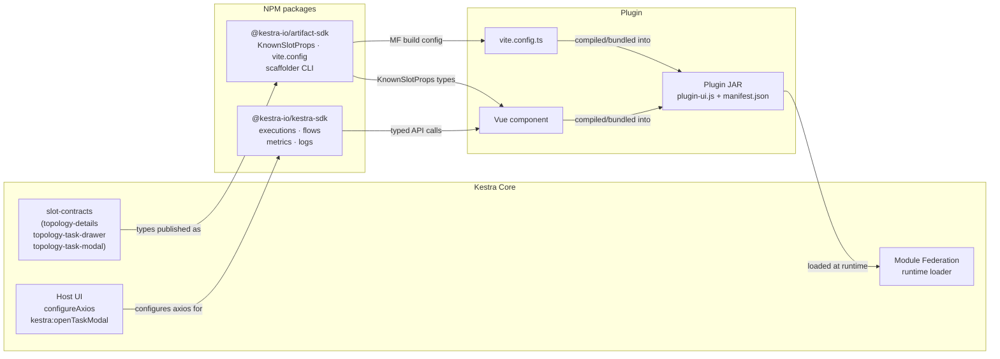

Plugins can ship custom Vue.js frontend components that load directly into the Kestra UI at runtime, without any changes to Kestra core.

This lets you build domain-specific experiences: visualize a query plan in the topology view, render log output in a structured panel, or display task metadata in a rich card. The core UI stays lean; each plugin brings exactly the UI it needs.

:::alert{type="info"}
Plugin artifacts are available starting in **Kestra 2.0.0**.
:::

## Why plugin artifacts?

Tasks in Kestra produce structured outputs and have rich configuration. But the default topology and log views are generic — they show raw YAML and plain text. When a task is query-centric, graph-centric, or data-heavy, that generic view loses signal.

Plugin artifacts let you close this gap without forking Kestra's core. A `topology-details` component can show a formatted query, estimated cost, or job metadata inline in the flow topology. A `log-details` component can structure log output into a readable table. This keeps the core UI generic and lets each plugin deliver the right experience for its domain.

## Architecture

Plugin artifacts are built as **Vue.js micro-frontends** using [Module Federation](https://module-federation.io/). The plugin's `ui/` directory compiles to a federated JavaScript module, which is bundled into the plugin JAR under `src/main/resources/plugin-ui/`. At runtime, the Kestra host app discovers and loads these modules dynamically — no static linking required.

```
Plugin JAR
└── src/main/resources/plugin-ui/
    ├── plugin-ui.js       ← the federated module entry point
    ├── manifest.json      ← declares which task types have UI and which slots they fill
    └── *.css              ← scoped styles
```

The `manifest.json` is the contract between the plugin and the host. It tells Kestra which task types expose UI components, which slot each component fills, and any static metadata (dimensions, feature flags) the host needs before loading the component.

The [`@kestra-io/artifact-sdk`](https://github.com/kestra-io/artifact-sdk) handles all the Module Federation configuration, manifest generation, and shared dependencies. You write a Vue component; the SDK takes care of the bundling contract.



## Available UI slots

Each plugin component targets a specific **slot** — a named extension point in the Kestra UI. Slots are defined in Kestra core (OSS) and distributed via the `@kestra-io/artifact-sdk` package. Kestra core owns the runtime contract (what props are injected, what `manifest.json` shape is accepted); the SDK exposes the corresponding TypeScript types and powers the scaffolding CLI. Three slots are available in `@kestra-io/artifact-sdk`:

### `topology-details`

Renders in the **execution topology view** when a task node is selected. The contract is defined in [`ui/packages/slot-contracts/src/topology-details.ts`](https://github.com/kestra-io/kestra/blob/develop/ui/packages/slot-contracts/src/topology-details.ts) in Kestra core and distributed via `@kestra-io/artifact-sdk`:

```ts
import type { Execution, PagedResultsMetricEntry, Task } from "@kestra-io/kestra-sdk"
import { z } from "zod"

export const progressEventSchema = z.object({
    taskId: z.string(),
    taskRunId: z.string(),
    step: z.string(),
    timestamp: z.string(),
})

export const propsSchema = z.object({
    taskType: z.string(),
    task: z.custom<Task>(),
    execution: z.custom<Execution>().optional(),
    namespace: z.string().optional(),
    flowId: z.string().optional(),
    tenant: z.string().optional(),
    source: z.string().optional(),
    progress: progressEventSchema.array(),
    fetchOutputs: z.custom<(query?: { taskRunId?: string }) => Promise<Record<string, unknown>>>().optional(),
    fetchMetrics: z.custom<(query?: { page?: number; size?: number; sort?: string; taskRunId?: string }) => Promise<PagedResultsMetricEntry>>().optional(),
})
```

`Task`, `Execution`, and `PagedResultsMetricEntry` are imported from `@kestra-io/kestra-sdk` for typing purposes only — your component doesn't call the SDK to populate these.

- **`task`** is complete — the host merges the graph node's task with the same task parsed out of `source`, so you never need to fetch the flow definition to fill in properties missing from the execution-graph node.
- **`tenant`** is the current tenant, so you don't need to read it from `localStorage` or resolve it yourself.
- **`fetchOutputs(query?)`** and **`fetchMetrics(query?)`** are lazy fetchers, not values: calling them resolves the current task run's outputs/metrics (scoped to this task and tenant already), and a component that renders neither costs no request. Both accept an optional `taskRunId` to address one iteration of a looped task; outside an execution they resolve to `{}` / an empty page rather than being absent. See [Fetching outputs and metrics](#fetching-outputs-and-metrics) below.

Check `execution?.id` to detect whether execution data is available and adjust the rendered content accordingly. `progress` is covered in [Tracking live task progress](#tracking-live-task-progress) below.

:::alert{type="info"}
**A new data need is a new slot prop, never a new SDK call.** If your component needs something the host already knows (task config, execution state, outputs, metrics) and it isn't in `propsSchema` yet, that's a gap in the contract, not a reason to reach for `@kestra-io/kestra-sdk`. An artifact should render what core hands it — calling the REST API directly bypasses the permission model and ties your component to internal API shapes that can change independently of the slot contract.
:::

The host also injects `displayMode` as an HTML attribute — it is not in the props type, so it lands in `attrs`. Use `useAttrs()` to read it:

```ts
const attrs = useAttrs();
const isFullView = computed(() => attrs.displayMode === "full");
```

When `displayMode` is `"full"` the component renders in an expanded drawer; otherwise it renders inline in the compact topology node.

:::alert{type="warning"}
During certain render phases, `namespace` and `flowId` may arrive as unresolved URL template strings — e.g. `"{namespace}"` instead of `"myteam"`. These strings are truthy in JavaScript, so a plain `if (!props.namespace)` check won't catch them. Always guard with a `startsWith("{")` check before making API calls:

```ts
async function loadFlowData() {
  const ns = props.namespace;
  const fid = props.flowId;
  if (!ns || ns.startsWith("{") || !fid || fid.startsWith("{")) return;
  // safe to call SDK
}
```
:::

### `topology-task-drawer`

Renders in the **flow editor** (low-code editor) drawer when a task node is selected. It shares the exact same `propsSchema` as `topology-details` (defined in [`topology-task-drawer.ts`](https://github.com/kestra-io/kestra/blob/develop/ui/packages/slot-contracts/src/topology-task-drawer.ts)). This slot targets the design-time context, so `execution` is typically absent and `fetchOutputs`/`fetchMetrics` will resolve to empty results.

Same as `topology-details`, `displayMode` is injected as an HTML attribute and must be read via `useAttrs()`. `namespace` and `flowId` are props.

You can reuse the same Vue component file for both `topology-details` and `topology-task-drawer` — just register it under both slot names in `vite.config.ts` and use `displayMode` to adjust what is rendered (see [Configuring the exposed components](#configuring-the-exposed-components)).

### `topology-task-modal`

Renders as a **full-screen modal** (`KsDialog`) in the execution topology view when the user clicks "View details" on a runner-backed task node. It shares the exact same `propsSchema` as `topology-details` (defined in [`ui/packages/slot-contracts/src/topology-task-modal.ts`](https://github.com/kestra-io/kestra/blob/develop/ui/packages/slot-contracts/src/topology-task-modal.ts) in Kestra core).

The modal is triggered by injecting `kestra:openTaskModal` — provided by the Kestra host via `LowCodeEditor.vue`. Plugin components that want to open the modal call this injection; you do not need to handle the dialog lifecycle yourself.

```ts
import { inject } from "vue"
import type { KnownSlotProps } from "@kestra-io/artifact-sdk"

defineProps<KnownSlotProps["topology-task-modal"]>()

const openTaskModal = inject<(ctx: Record<string, any>) => void>("kestra:openTaskModal")
```

This slot is the right choice when a task runner (e.g. AWS Batch, Docker, Kubernetes) needs a rich detail view that goes beyond what fits in the compact topology node or the `topology-details` panel.

## Tracking live task progress

Tasks that go through multiple lifecycle steps before finishing — a batch job, a runner provisioning an external resource — can report progress while still running, instead of waiting for outputs and metrics to materialize at completion.

Task code reports a step with `RunContext#emitProgress`:

```java
runContext.emitProgress("pod.created", "Pod scheduled on node gke-cluster-1");

// or backdate the event to a real timestamp known only after the fact,
// e.g. a Kubernetes condition's lastTransitionTime
runContext.emitProgress("pod.running", "Pod is running", podStartedAt);
```

Each call emits a regular INFO log line carrying a typed `progress` key, so it rides the existing log queue — no separate channel or endpoint is needed. `step` is an opaque, plugin-defined identifier (e.g. `"pod.created"`); `message` is the human-readable text shown in the log console.

The `topology-details` slot (and any slot sharing its `propsSchema`) picks these up automatically: `progress` is an array of `{ taskId, taskRunId, step, timestamp }` entries, fed live from the execution's follow-logs stream while the task run is in progress.

```ts
const props = defineProps<KnownSlotProps["topology-details"]>();
const steps = computed(() => props.progress ?? []);
```

Use `progress` to render a step indicator or timeline while `hasExecution` is true but before outputs and metrics are available — it updates live, whereas outputs and metrics only materialize once the task run completes.

### Rendering a stepper

The `ui/` directory is a standalone Vue app, so you're not limited to `@kestra-io/design-system` — any Vue 3 component library works. [Element Plus](https://element-plus.org/) ships a ready-made `<el-steps>` component that's a natural fit for `progress`:

```bash
cd ui
npm install element-plus
```

```vue
<!-- ui/src/components/QueryRunQueryTopologyDetails.vue -->
<script setup lang="ts">
import type { KnownSlotProps } from "@kestra-io/artifact-sdk";
import { computed } from "vue";
import { ElSteps, ElStep } from "element-plus";
import "element-plus/es/components/steps/style/css";
import "element-plus/es/components/step/style/css";

const props = defineProps<KnownSlotProps["topology-details"]>();

// progress events land one SSE message at a time and aren't guaranteed to arrive in order
const orderedSteps = computed(() =>
  [...props.progress].sort((a, b) => a.timestamp.localeCompare(b.timestamp))
);
</script>

<template>
  <el-steps :active="orderedSteps.length" finish-status="success" align-center>
    <el-step v-for="s in orderedSteps" :key="s.step" :title="s.step" />
  </el-steps>
</template>
```

`active` set to the number of steps received so far marks everything up to the latest one as done; new entries pushed into `progress` advance the stepper live as the task runs.

:::alert{type="warning"}
`RunContext#emitProgress` requires your plugin to build against `kestraVersion = 1.3.27` (or later) in `gradle.properties` — it ships in Kestra core, not the artifact-sdk.
:::

## Quick start

Use the [`@kestra-io/create-artifact-sdk`](https://github.com/kestra-io/artifact-sdk) scaffolder to bootstrap the `ui/` directory in your plugin. Run this from your plugin's root (the directory containing `settings.gradle` or `settings.gradle.kts`):

```bash
npm create @kestra-io/artifact-sdk
```

The CLI will:

1. **Detect your plugin** — reads `settings.gradle[.kts]` to infer the plugin group ID (e.g. `io.kestra.plugin.example`).
2. **Ask which task** you want to add UI for (e.g. `query.RunQuery`).
3. **Ask which UI slot** to target (`topology-details` or `topology-task-drawer`).
4. **Ask whether to add `@kestra-io/kestra-sdk`** as a dependency (default: no — see [Calling the Kestra API](#calling-the-kestra-api) for why a `topology-details`/`topology-task-drawer`/`topology-task-modal` component should almost never need it).
5. **Show a summary** and ask for confirmation before writing anything.
6. **Scaffold the `ui/` directory** with all required files and run `npm install`.

:::alert{type="info"}
Node.js ≥ 18 is required. The scaffolder can also be run from inside an existing `ui/` directory if you want to add more components later.
:::

:::alert{type="warning"}
After scaffolding, add `@kestra-io/design-system` as a **direct** dependency:

```bash
cd ui
npm install @kestra-io/design-system
```

`@module-federation/vite` resolves shared package entries from its own `node_modules` path. Even though `@kestra-io/design-system` is already a dependency of `artifact-sdk`, the Module Federation build will fail unless it is also listed as a top-level dependency in your plugin's `package.json`.
:::

## Project structure

After scaffolding, the `ui/` directory looks like this:

```
ui/
├── .gitignore
├── .storybook/
│   ├── main.ts
│   └── preview.ts
├── index.html                          ← dev server entry
├── package.json
├── tsconfig.json
├── vite.config.ts                      ← Module Federation config
└── src/
    ├── App.vue                         ← dev server wrapper
    ├── main.ts                         ← dev server entry
    ├── components/
    │   └── QueryRunQueryTopologyDetails.vue   ← your component to edit
    └── QueryRunQueryTopologyDetails.stories.ts
```

The component file is the only file you need to edit. The rest of the scaffolding is boilerplate that wires up the local dev server, Storybook, and the production build.

## Fetching outputs and metrics

Task outputs and metrics are the two things almost every `topology-details` component needs, and they no longer require calling the API yourself. Use the `fetchOutputs` and `fetchMetrics` props instead — they're bound to this task and the current tenant by the host, and resolve on call rather than on mount, so a component that never renders them never fires a request:

```ts
import type { KnownSlotProps } from "@kestra-io/artifact-sdk";
import { ref, watch, computed } from "vue";

const props = defineProps<KnownSlotProps["topology-details"]>();

const executionId = computed(() => props.execution?.id as string | undefined);

// Task outputs
const outputs = ref<Record<string, unknown>>({});

watch(executionId, async (id) => {
  outputs.value = id ? await props.fetchOutputs?.() ?? {} : {};
}, { immediate: true });

// Task metrics
const metrics = ref<Array<{ name: string; value: number }>>([]);

watch(executionId, async (id) => {
  metrics.value = id ? (await props.fetchMetrics?.())?.results ?? [] : [];
}, { immediate: true });
```

Both fetchers take an optional query object:

```ts
fetchOutputs(query?: { taskRunId?: string }): Promise<Record<string, unknown>>
fetchMetrics(query?: { page?: number; size?: number; sort?: string; taskRunId?: string }): Promise<PagedResultsMetricEntry>
```

Pass `taskRunId` to address one iteration of a looped task; omit it to let the host resolve the task's current run. Outside an execution both resolve to an empty result (`{}` / an empty page) rather than rejecting — no `try/catch` needed for that case.

:::alert{type="info"}
`fetchOutputs` and `fetchMetrics` are optional in the type because they aren't injected in every rendering context (e.g. a bare dev-server harness). Guard with `?.()` and a fallback, as in the example above, rather than assuming they're always present.
:::

## Calling the Kestra API

**A new data need is a new slot prop, not a new SDK call.** The `@kestra-io/kestra-sdk` package exists and other parts of your plugin can depend on it, but a `topology-details`/`topology-task-drawer`/`topology-task-modal` component has no legitimate reason to import it at all: the props above — `task`, `execution`, `tenant`, `fetchOutputs`, `fetchMetrics` — already cover flow definitions, execution state, outputs, and metrics, and there is no remaining case (including rendering task properties for display, see [Pebble expressions](#pebble-expressions-in-task-config) below) where an artifact needs to call `ExecutionAPI`, `FlowAPI`, `OutputsAPI`, `MetricsAPI`, or the expression-rendering endpoint directly. Those endpoints route through the host's authenticated client with no capability scoping, which is exactly what the props exist to avoid. If you find yourself reaching for one of them, it means the slot contract is missing a prop your component needs — raise that, don't work around it.

Don't add `@kestra-io/kestra-sdk` to your `ui/package.json` for one of these three slots. If a build-time CI check exists in your target Kestra version, a runtime import of it under a plugin `ui/` will fail it.

## Pebble expressions in task config

Task configuration is authored with [Pebble expressions](../../expressions/index.mdx): a `sql` property might be `SELECT * FROM {{ vars.dataset }}.users`, a `projectId` might be `{{ inputs.project }}`. The `task` prop your component receives holds these **as written, unrendered** — your component does not resolve them.

Display the raw value as-is:

```ts
const projectId = computed(() => props.task?.projectId as string | undefined);
```

A user sees `{{ vars.dataset }}` rather than the value it would resolve to. That's the current, intentional behavior — plugin artifacts do not call an expression-rendering endpoint to resolve template strings for display, because doing so is exactly the kind of direct-API-call the props contract exists to replace, and a rendering endpoint is inherently best-effort (functions with side effects like `env()`/`kv()`/`secret()`, and out-of-context variable references, can't safely resolve outside a real execution anyway).

:::alert{type="info"}
The fix in progress is architectural, not artifact-side: a task property a user needs to see resolved in an artifact should become a proper task **output** — computed once, server-side, at the point the value is actually known — rather than an artifact re-resolving a template string on the client. Once a given task exposes the value as an output, read it via [`fetchOutputs`](#fetching-outputs-and-metrics) like any other post-execution data, same as everything else in this guide. Until a given plugin's tasks are updated to publish these as outputs, the pre-execution/raw-template value is what your component should show — don't work around it with a client-side rendering call.
:::

## Configuring the exposed components

The `vite.config.ts` file declares which components are exposed and under which task types:

```ts
import defaultViteConfig from "@kestra-io/artifact-sdk/vite.config";

export default defaultViteConfig({
  plugin: "io.kestra.plugin.example",

  exposes: {
    "query.RunQuery": [
      {
        slotName: "topology-details",
        path: "./src/components/QueryRunQueryTopologyDetails.vue",
        additionalProperties: {
          height: 120,
          heightWithExecution: 200,
        },
      },
    ],
  },
});
```

- **`plugin`** — the plugin group ID, matching the prefix used in task types.
- **`exposes`** — a map from task type suffix (everything after `io.kestra.plugin.example.`) to a list of slot definitions.
- **`slotName`** — which UI slot this component fills.
- **`path`** — path to the Vue component, relative to `ui/`.
- **`additionalProperties`** — static metadata written to the manifest (see [below](#additional-properties)).

A single task can expose components for multiple slots:

```ts
"query.RunQuery": [
  {
    slotName: "topology-details",
    path: "./src/components/QueryRunQueryTopologyDetails.vue",
    additionalProperties: { height: 120 },
  },
  {
    slotName: "topology-task-drawer",
    path: "./src/components/QueryRunQueryTopologyTaskDrawer.vue",
    additionalProperties: { height: 120 },
  },
],
```

## Complete example

The snippet below is adapted from the BigQuery plugin's topology component. It shows a `topology-details` component that:

- renders project/location before execution — read straight off `task`, which the host already fills in from the flow source
- adds duration and cost estimates after execution, via `fetchMetrics`
- adds a job-details section fed by `fetchOutputs`
- uses `displayMode === "full"` to show the rich job-details section only in the expanded drawer
- reuses the same file for the `topology-task-drawer` slot

```vue
<!-- ui/src/components/QueryRunQueryTopologyDetails.vue -->
<script setup lang="ts">
import type { KnownSlotProps } from "@kestra-io/artifact-sdk";
import { computed, ref, watch, useAttrs } from "vue";

// KnownSlotProps["topology-details"] includes taskType, task, execution, namespace, flowId,
// tenant, source, progress, fetchOutputs, fetchMetrics
const props = defineProps<KnownSlotProps["topology-details"]>();
const attrs = useAttrs();
const isFullView = computed(() => attrs.displayMode === "full");

const taskId = computed(() => props.task?.id as string | undefined);

// task is already complete — the host merges the graph node's task with the same task
// parsed out of `source`, so no flow fetch is needed to read config not on the graph node.
const projectId = computed(() => props.task?.projectId as string | undefined);
const location = computed(() => props.task?.location as string | undefined);

// Execution state
const hasExecution = computed(() => !!props.execution?.id);
const executionId = computed(() => props.execution?.id as string | undefined);

// Task outputs, via the lazy fetchOutputs prop — resolves to {} outside an execution
const taskOutputs = ref<Record<string, unknown>>({});

watch(executionId, async (id) => {
  taskOutputs.value = id ? await props.fetchOutputs?.() ?? {} : {};
}, { immediate: true });

// Task metrics, via the lazy fetchMetrics prop — already scoped to this task and execution
const metrics = ref<Array<{ name: string; value: number }>>([]);

watch(executionId, async (id) => {
  metrics.value = id ? (await props.fetchMetrics?.())?.results ?? [] : [];
}, { immediate: true });

const getMetric = (name: string) => metrics.value.find((m) => m.name === name)?.value;
const bytesBilled  = computed(() => getMetric("total.bytes.billed"));
const durationMs   = computed(() => getMetric("duration"));

function formatBytes(b?: number) {
  if (b === undefined) return "—";
  const units = ["B", "KB", "MB", "GB", "TB"];
  let i = 0, v = b;
  while (v >= 1024 && i < units.length - 1) { v /= 1024; i++; }
  return `${v.toFixed(i === 0 ? 0 : 2)} ${units[i]}`;
}

function formatCost(b?: number) {
  if (b === undefined) return "—";
  const cost = (b / Math.pow(1024, 4)) * 5;
  return cost < 0.01 ? "< $0.01" : `~$${cost.toFixed(4)}`;
}

function formatDuration(ms?: number) {
  if (ms === undefined) return "—";
  return ms < 1000 ? `${ms} ms` : `${(ms / 1000).toFixed(2)} s`;
}
</script>

<template>
  <div class="details">
    <dl class="grid">
      <dt>Project</dt><dd>{{ projectId ?? "—" }}</dd>
      <dt>Location</dt><dd>{{ location ?? "—" }}</dd>
      <template v-if="hasExecution">
        <dt>Duration</dt><dd>{{ formatDuration(durationMs) }}</dd>
        <dt>Est. cost</dt><dd>{{ formatCost(bytesBilled) }}</dd>
      </template>
    </dl>

    <!-- Full details: only shown in expanded drawer (displayMode="full") -->
    <template v-if="hasExecution && isFullView">
      <section class="section">
        <h4 class="section-title">Job Details</h4>
        <dl class="grid">
          <dt>Job ID</dt><dd>{{ taskOutputs?.jobId ?? "—" }}</dd>
          <dt>Rows</dt><dd>{{ taskOutputs?.size?.toLocaleString() ?? "—" }}</dd>
          <dt>Bytes billed</dt><dd>{{ formatBytes(bytesBilled) }}</dd>
        </dl>
      </section>
    </template>
  </div>
</template>

<style scoped>
.details { padding: 0.5rem 0.75rem; font-size: 0.7rem; }
.grid { display: grid; grid-template-columns: auto 1fr; gap: 0.15rem 0.625rem; margin: 0; }
.grid dt { font-weight: 500; color: var(--ks-color-text-secondary, #6b7280); white-space: nowrap; }
.grid dd { margin: 0; overflow: hidden; text-overflow: ellipsis; white-space: nowrap; }
.section { margin-top: 0.5rem; }
.section-title { margin: 0 0 0.25rem; font-size: 0.6875rem; font-weight: 600; text-transform: uppercase; color: var(--ks-color-text-secondary, #6b7280); }
</style>
```

Register the same file under both slots — no `additionalProperties` needed for `topology-task-drawer` since the host drawer handles its own layout:

```ts
// ui/vite.config.ts
import defaultViteConfig from "@kestra-io/artifact-sdk/vite.config";

export default defaultViteConfig({
  plugin: "io.kestra.plugin.example",

  exposes: {
    "query.RunQuery": [
      {
        slotName: "topology-details",
        path: "./src/components/QueryRunQueryTopologyDetails.vue",
        additionalProperties: {
          height: 108,
          heightWithExecution: 135,
          customAction: { label: "Show query", taskProp: "sql", lang: "sql" },
        },
      },
      {
        slotName: "topology-task-drawer",
        path: "./src/components/QueryRunQueryTopologyDetails.vue",
      },
    ],
  },
});
```

### Storybook stories

The scaffolder generates a starter story. Expand it with pre-execution and post-execution variants to cover both rendering modes:

```ts
// ui/src/QueryRunQueryTopologyDetails.stories.ts
import type { Meta, StoryObj } from "@storybook/vue3";
import QueryRunQueryTopologyDetails from "./components/QueryRunQueryTopologyDetails.vue";

const meta: Meta<typeof QueryRunQueryTopologyDetails> = {
  title: "Plugin Artifacts / topology-details / QueryRunQueryTopologyDetails",
  component: QueryRunQueryTopologyDetails,
  tags: ["autodocs"],
};

export default meta;
type Story = StoryObj<typeof QueryRunQueryTopologyDetails>;

const baseTask = {
  id: "run-query",
  type: "io.kestra.plugin.example.query.RunQuery",
  sql: "SELECT id, name FROM users WHERE active = true LIMIT 1000",
  projectId: "my-project",
};

export const PreExecution: Story = {
  name: "Pre-execution",
  args: {
    taskType: "io.kestra.plugin.example.query.RunQuery",
    task: baseTask,
    namespace: "company.team",
    flowId: "my-flow",
  },
};

export const PostExecution: Story = {
  name: "Post-execution",
  args: {
    taskType: "io.kestra.plugin.example.query.RunQuery",
    task: baseTask,
    namespace: "company.team",
    flowId: "my-flow",
    execution: {
      id: "exec-abc123",
      state: { current: "SUCCESS" },
      taskRunList: [{ id: "tr-001", taskId: "run-query", executionId: "exec-abc123" }],
    },
    // Plain prop fixtures — no transport to stub, since fetchOutputs/fetchMetrics are
    // just functions the host would otherwise inject.
    fetchOutputs: async () => ({ jobId: "my-project:US.bqjob_r1234", size: 42500 }),
    fetchMetrics: async () => ({
      results: [
        { name: "duration", value: 1230, taskId: "run-query" },
        { name: "total.bytes.billed", value: 10737418240, taskId: "run-query" },
      ],
      total: 2,
    }),
  },
};
```

The dev server (`npm run dev`) renders your component using `SLOTS['topology-details'].defaultProps` from `@kestra-io/artifact-sdk`, which provides the same shape as the story props:

```vue
<!-- ui/src/App.vue -->
<script setup lang="ts">
import QueryRunQueryTopologyDetails from "./components/QueryRunQueryTopologyDetails.vue";
import { SLOTS } from "@kestra-io/artifact-sdk";
</script>

<template>
  <div style="padding: 1rem">
    <QueryRunQueryTopologyDetails v-bind="SLOTS['topology-details'].defaultProps" />
  </div>
</template>
```

## Development workflow

### Local dev server

The scaffolded `src/App.vue` renders your component with the slot's default props (via `SLOTS` from `@kestra-io/artifact-sdk`). Start it to iterate quickly without running Kestra:

```bash
cd ui
npm run dev
```

### Storybook

Run Storybook to develop and test your component in isolation:

```bash
npm run storybook
```

See the [Complete example](#complete-example) above for a full stories file with pre-execution and post-execution variants.

### Building

```bash
npm run build -- --outDir ../src/main/resources/plugin-ui
```

The build output goes directly into the plugin's resource directory, where it will be picked up by the JAR packaging step. See [Gradle integration](#gradle-integration) to automate this.

### Testing in Kestra UI

To see your component running inside a real Kestra instance:

1. Build the UI module:

```bash
cd ui
npm run build -- --outDir ../src/main/resources/plugin-ui
```

2. Package the plugin as a JAR:

```bash
./gradlew shadowJar
```

3. Copy the JAR from `build/libs/` into your local Kestra plugins folder. Make sure there is **only one version** of the plugin JAR in that folder — remove any older versions first to avoid conflicts.

4. Restart both the Kestra backend and frontend.

5. Hard-reload the Kestra UI in your browser to bypass the cache:
   - **Chrome / Firefox**: `Ctrl + Shift + R` (Linux/Windows) or `Cmd + Shift + R` (macOS)
   - **Alternative**: `Ctrl + F5`

:::alert{type="info"}
The browser caches Module Federation bundles aggressively. A hard reload (`Ctrl + Shift + R`) is required after each UI build to ensure the browser fetches the latest version of your component.
:::

## Gradle integration

Add the [Node Gradle plugin](https://github.com/node-gradle/gradle-node-plugin) to your `build.gradle` and wire the UI build into the plugin packaging lifecycle:

```groovy
plugins {
    // ... existing plugins ...
    id 'com.github.node-gradle.node' version '7.1.0'
}

// Build the UI module before packaging (only if ui/ directory exists)
if (file('ui').exists()) {
    tasks.register('npmInstallUI', com.github.gradle.node.npm.task.NpmTask) {
        args = ['install']
        workingDir = file('ui')
    }

    tasks.register('buildUI', com.github.gradle.node.npm.task.NpmTask) {
        dependsOn 'npmInstallUI'
        args = ['run', 'build', '--', '--outDir', '../src/main/resources/plugin-ui']
        workingDir = file('ui')
    }

    processResources.dependsOn 'buildUI'
    shadowJar.dependsOn 'buildUI'
}
```

The `if (file('ui').exists())` guard keeps the build working for other developers and CI pipelines that haven't set up Node.js, without failing the Java build.

Add the build output to `.gitignore` so the compiled assets are not committed:

```
# UI build artifact
src/main/resources/plugin-ui/
```

## Additional properties

The `additionalProperties` object in each slot definition is written verbatim into `manifest.json`. The host app reads this before loading the component, so it can reserve layout space or configure behavior without incurring the cost of loading the full module.

Commonly used properties for `topology-details`:

| Property | Type | Description |
|---|---|---|
| `height` | `number` | Height (in px) of the detail panel before execution |
| `heightWithExecution` | `number` | Height (in px) of the detail panel after execution |
| `customAction` | `object` | Adds a button on the task node that opens a drawer for a specific task property (e.g. a SQL query) |

### Sizing the node

`height` and `heightWithExecution` are not hints — the host reserves exactly that many pixels for the node and anchors the dashed connector that leaves the **bottom** of the node at that declared height. They must match your component's **real rendered height** (the node header the host draws, plus your component, plus borders):

- **Too small** — your content overflows the reserved box, so the bottom connector is drawn behind the node body and appears stunted or missing, while the top connector still looks normal.
- **Too large** — an empty gap appears between the end of your content and the start of the bottom connector.

The two values are read in different contexts: the flow editor topology (no execution) uses `height`, and the execution topology uses `heightWithExecution`. Set **both** — typically to the same value, since a component with a fixed layout renders at the same height either way. Setting only one leaves the node mis-sized on the other view.

Because these values are static, measure the rendered component once and re-measure only if its layout changes.

:::alert{type="info"}
A reliable way to get the value: build the plugin, open the node in the topology with the component visible, and read the rendered height of the node element in your browser's dev tools. Round to the nearest pixel.
:::

### `customAction`

The `customAction` property lets the host render an action button directly on the task node in the topology. When clicked, the host opens a drawer displaying the specified task property with syntax highlighting:

```ts
additionalProperties: {
  "customAction": {
    "label": "Show query",   // tooltip and button label
    "taskProp": "sql",       // the task property to display
    "lang": "sql"            // language for syntax highlighting
  }
}
```

This is useful for tasks that carry large or structured payloads (SQL queries, scripts, templates) that are better viewed in a dedicated panel than inline in the YAML editor.

:::alert{type="info"}
`additionalProperties` values are static — they are evaluated at build time and embedded in the manifest. They cannot reference runtime task values.
:::
