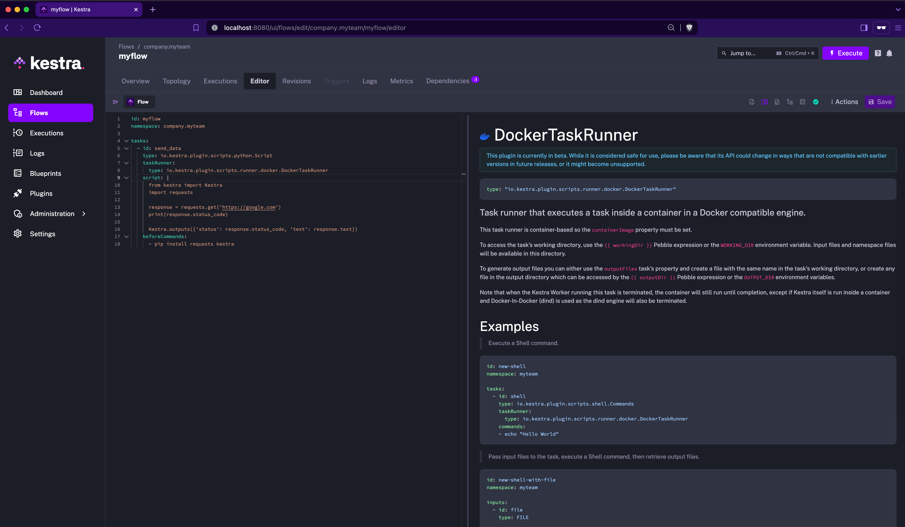

Task Runners let you control resource allocation, environment configuration, and deployment targets without changing your task code.

## Docker in development, Kubernetes in production

Many Kestra users develop their scripts locally using **Docker containers** and deploy the same code in production as **Kubernetes pods**.
The `taskRunner` property lets you switch execution environments without changing your scripts.

Set the `taskRunner` property directly on each task. Switching environments means updating the `taskRunner` block — the script stays identical.

### 1. Development task (Docker)

```yaml
- id: transform
  type: io.kestra.plugin.scripts.python.Script
  containerImage: python:slim
  taskRunner:
    type: io.kestra.plugin.scripts.runner.docker.Docker
    pullPolicy: IF_NOT_PRESENT
    cpu:
      cpus: 1
    memory:
      memory: 512Mi
  script: |
    print("running in Docker")
```

### 2. Production task (Kubernetes)

```yaml
- id: transform
  type: io.kestra.plugin.scripts.python.Script
  containerImage: python:slim
  taskRunner:
    type: io.kestra.plugin.ee.kubernetes.runner.Kubernetes
    namespace: company.team
    pullPolicy: ALWAYS
    config:
      username: "{{ secret(‘K8S_USERNAME’) }}"
      masterUrl: "{{ secret(‘K8S_MASTER_URL’) }}"
      caCert: "{{ secret(‘K8S_CA_CERT’) }}"
      clientCert: "{{ secret(‘K8S_CLIENT_CERT’) }}"
      clientKey: "{{ secret(‘K8S_CLIENT_KEY’) }}"
    resources:
      request:
        cpu: "500m"
        memory: "256Mi"
  script: |
    print("running in Kubernetes")
```

:::alert{type="info"}
Notice that `containerImage` is defined at the task level, not inside `taskRunner`. Container images typically change more often than the runner setup, so keeping them separate makes both easier to maintain.
:::

In Enterprise Edition, a namespace-scoped [Policy](../../07.enterprise/02.governance/policies/index.md) can inject the `taskRunner` block into every task automatically — apply the dev policy to development namespaces and the production policy to production namespaces, with no per-task changes required.

## Centralized configuration management (Enterprise Edition)

In Enterprise Edition, use a [Policy](../../07.enterprise/02.governance/policies/index.md) to centralize task runner credentials at the namespace level. For example, inject AWS credentials into every AWS Batch task runner without repeating them in each flow:

```yaml
id: aws-batch-credentials
description: "AWS credentials for the Batch task runner."
enforcement: ACTIVE
rules:
  - type: io.kestra.plugin.ee.rules.Add
    on: PLUGIN
    where:
      - field: type
        operator: EQUAL_TO
        value: io.kestra.plugin.ee.aws.runner.Batch
    values:
      accessKeyId: "{{ secret('AWS_ACCESS_KEY_ID') }}"
      secretKeyId: "{{ secret('AWS_SECRET_ACCESS_KEY') }}"
      region: "us-east-1"
```

This ensures consistency and eliminates repetitive configuration across multiple workflows.

## Documentation and autocompletion

Each task runner is a self-contained plugin with its own icon, documentation, and property schema.
The built-in Kestra code editor provides **autocompletion**, **inline documentation**, and **syntax validation** for all runner properties.
Clicking on the runner’s name in the editor opens its documentation sidebar for quick reference.



## Full customization: build your own Task Runner

For advanced use cases, you can create a [custom task runner plugin](../../15.how-to-guides/custom-plugin/index.md) tailored to your environment.
Simply build it as a JAR file and add it to the `plugins` directory. Once Kestra restarts, your custom runner will appear as an available option in any script task.
