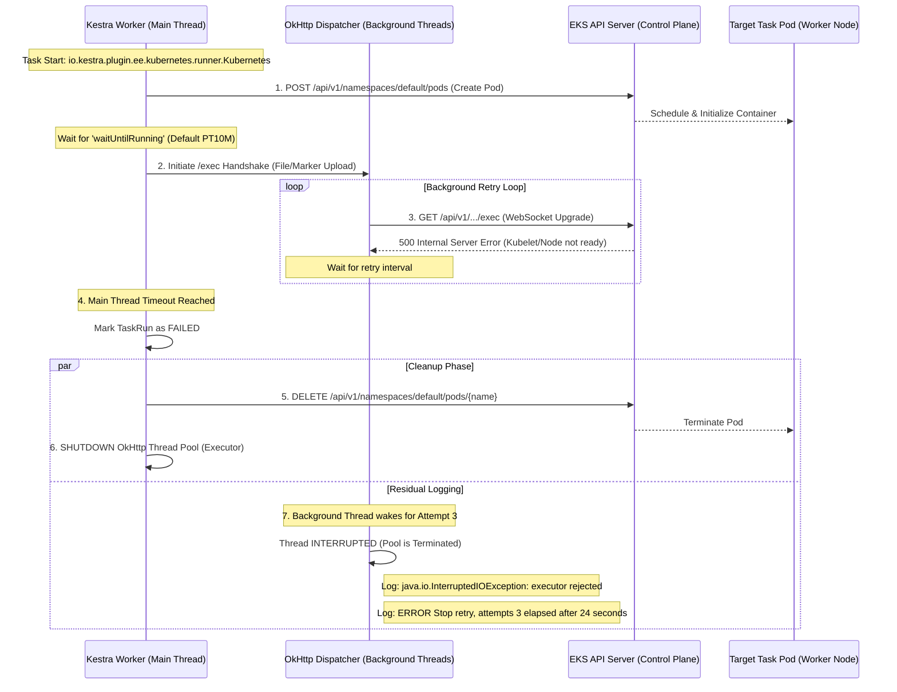

Run tasks as Kubernetes pods.

:::tip
This page covers running Kestra **tasks** as Kubernetes pods. To deploy applications **to** a Kubernetes or OpenShift cluster from a flow, see the [Deploy to OpenShift how-to guide](../../../15.how-to-guides/openshift/index.md).
:::

## Overview

This plugin is available only in the [Enterprise Edition](../../../07.enterprise/01.overview/01.enterprise-edition/index.md) (EE) and Kestra Cloud. The task runner is container-based, so the `containerImage` property must be set. To access the task's working directory, use either the `{{ workingDir }}` Pebble expression or the `WORKING_DIR` environment variable. Input files and namespace files are available in this directory.

To generate output files, you can either:
- Use the `outputFiles` property of the task and create a file with the same name in the task's working directory, or
- Create any file in the output directory, accessible via the `{{ outputDir }}` Pebble expression or the `OUTPUT_DIR` environment variable.

When the Kestra Worker running this task is terminated, the pod continues until completion. After restarting, the Worker resumes processing on the existing pod unless `resume` is set to `false`.

If your cluster is configured with [RBAC](https://kubernetes.io/docs/reference/access-authn-authz/rbac/), the service account running your pod must have the following authorizations:

- `pods`: get, create, delete, watch, list
- `pods/log`: get, watch
- `pods/exec`: get, watch
- `secrets`: create, delete (required only when `credentials` is set for private registry access)

The following role grants these authorizations:

```yaml
apiVersion: rbac.authorization.k8s.io/v1
kind: Role
metadata:
  name: task-runner
rules:
- apiGroups: [""]
  resources: ["pods"]
  verbs: ["get", "create", "delete", "watch", "list"]
- apiGroups: [""]
  resources: ["pods/exec"]
  verbs: ["get", "watch"]
- apiGroups: [""]
  resources: ["pods/log"]
  verbs: ["get", "watch"]
- apiGroups: [""]
  resources: ["secrets"]
  verbs: ["create", "delete"]
```

Use the `serviceAccountName` property to assign a custom service account to the pod. When omitted, the namespace default service account is used, which must carry the required RBAC permissions above.

## How to use the Kubernetes task runner

The following example connects to a cluster using certificate-based authentication, uploads an input file, runs a shell command, and retrieves the output:

```yaml
id: kubernetes_task_runner
namespace: company.team

description: |
  To get the kubeconfig file, run: `kubectl config view --minify --flatten`.
  Then, copy the values to the configuration below.
  Here is how Kubernetes task runner properties (on the left) map to the kubeconfig file's properties (on the right):
  - clientKeyData: client-key-data
  - clientCertData: client-certificate-data
  - caCertData: certificate-authority-data
  - masterUrl: server
  - oauthToken: token (if using OAuth, e.g., GKE/EKS)

inputs:
  - id: file
    type: FILE

tasks:
  - id: shell
    type: io.kestra.plugin.scripts.shell.Commands
    inputFiles:
      data.txt: "{{ inputs.file }}"
    outputFiles:
      - "*.txt"
    containerImage: centos
    taskRunner:
      type: io.kestra.plugin.ee.kubernetes.runner.Kubernetes
      config:
        clientKeyData: "{{ secret('K8S_CLIENT_KEY_DATA') }}"
        clientCertData: "{{ secret('K8S_CLIENT_CERT_DATA') }}"
        caCertData: "{{ secret('K8S_CA_CERT_DATA') }}"
        masterUrl: https://docker-for-desktop:6443
    commands:
      - echo "Hello from a Kubernetes task runner!"
      - cp data.txt out.txt
```

:::alert{type="info"}
To deploy Kubernetes with Docker Desktop, see the [Docker Desktop Kubernetes guide](https://docs.docker.com/desktop/kubernetes/#install-and-turn-on-kubernetes).

To install `kubectl`, see the [kubectl installation guide](https://kubernetes.io/docs/tasks/tools/#kubectl).
:::

<div class="video-container">
  <iframe src="https://www.youtube.com/embed/9vzwCL54rVk?si=DNtDF2LaAcXSXNTu" title="YouTube video player" allow="accelerometer; autoplay; clipboard-write; encrypted-media; gyroscope; picture-in-picture; web-share" referrerpolicy="strict-origin-when-cross-origin" allowfullscreen></iframe>
</div>

## File handling

When a task has `inputFiles` or `namespaceFiles` configured, Kestra adds an **init container** to the pod as a synchronization gate. The Worker transfers files directly to the pod using `kubectl cp`, then signals the init container, which exits and allows the main container to start.

When a task has `outputFiles` configured, a **sidecar container** is added to the pod that waits for the main container to finish before downloading output files back to the Worker.

All containers in the pod share an in-memory `emptyDir` volume for file exchange.

### Syncing the full working directory

By default, only files listed in `outputFiles` are downloaded after task completion. Set `syncWorkingDirectory: true` to download the entire working directory, which is useful when tasks produce files dynamically without knowing their names in advance:

```yaml
taskRunner:
  type: io.kestra.plugin.ee.kubernetes.runner.Kubernetes
  syncWorkingDirectory: true
  config:
    masterUrl: https://docker-for-desktop:6443
    caCertData: "{{ secret('K8S_CA_CERT_DATA') }}"
```

## Failure scenarios

If a task is resubmitted (for example, due to a retry or a Worker crash), the new Worker reattaches to the existing (or completed) pod instead of starting a new one.

Set `resume: false` to force a new pod to be created on every execution attempt rather than reattaching to an existing pod.

By default, pods are deleted after the task completes. Set `delete: false` to keep the pod alive after completion, which is useful when debugging failures — you can then inspect the pod with `kubectl exec` or `kubectl logs`:

```yaml
taskRunner:
  type: io.kestra.plugin.ee.kubernetes.runner.Kubernetes
  delete: false
  config:
    masterUrl: https://docker-for-desktop:6443
    caCertData: "{{ secret('K8S_CA_CERT_DATA') }}"
```

### Exec timeout and residual `InterruptedIOException` errors

The sequence diagram below illustrates a failure mode that occurs when the `waitUntilRunning` timeout expires while the OkHttp dispatcher is still retrying the `/exec` WebSocket upgrade in the background.




The task is already marked `FAILED` at step 4. The `java.io.InterruptedIOException: executor rejected` and `ERROR Stop retry` log lines emitted at step 7 are residual — they confirm the cleanup path ran correctly and can be safely ignored. If the `waitUntilRunning` timeout fires before the pod is ready (for example, due to slow image pulls or kubelet initialization on a cold node), increase the value to give the cluster more time:

```yaml
taskRunner:
  type: io.kestra.plugin.ee.kubernetes.runner.Kubernetes
  waitUntilRunning: PT20M
  config:
    masterUrl: https://docker-for-desktop:6443
    caCertData: "{{ secret('K8S_CA_CERT_DATA') }}"
```

## Private registry credentials

Use the `credentials` block to pull the task image from a private container registry. The runner creates an ephemeral `kubernetes.io/dockerconfigjson` imagePullSecret in the pod namespace, references it from the task pod, and deletes it when the pod is deleted.

| Property | Required | Description |
|---|---|---|
| `registry` | No | Registry URL. If omitted, extracted from the `containerImage` name. |
| `username` | No | Registry username. |
| `password` | No | Registry password. |
| `auth` | No | Base64-encoded `username:password` string. When set, used as-is; otherwise computed from `username` and `password`. |

:::alert{type="warning"}
Ensure the runner service account has `create` and `delete` permissions on `secrets` in the pod namespace. Without this, the runner cannot create the imagePullSecret and the pod will fail to start. See the [RBAC role](#overview) above.
:::

:::alert{type="info"}
The `credentials` field names mirror those of the Docker task runner, so a flow switching from the Docker runner to the Kubernetes runner can reuse its credentials block unchanged.
:::

The following example pulls from a private Amazon ECR registry:

```yaml
id: private_registry_task
namespace: company.team

tasks:
  - id: run
    type: io.kestra.plugin.scripts.python.Script
    containerImage: 123456789.dkr.ecr.eu-west-1.amazonaws.com/my-image:latest
    taskRunner:
      type: io.kestra.plugin.ee.kubernetes.runner.Kubernetes
      namespace: default
      config:
        masterUrl: https://eks-cluster.eu-west-1.eks.amazonaws.com
        caCertData: "{{ secret('K8S_CA_CERT_DATA') }}"
        oauthToken: "{{ secret('K8S_OAUTH_TOKEN') }}"
      credentials:
        registry: 123456789.dkr.ecr.eu-west-1.amazonaws.com
        username: AWS
        password: "{{ secret('ECR_PASSWORD') }}"
    script: |
      print("Running from a private registry image")
```

## Resource requests

Use the `resources` property to set CPU and memory requests and limits on the main task container. Both `cpu` and `memory` accept static values or Pebble expressions, so you can drive them from flow inputs at runtime.

The following example sizes the pod dynamically based on inputs:

```yaml
id: kubernetes_resources
namespace: company.team

inputs:
  - id: cpu_count
    type: INT
    defaults: 2
  - id: memory_per_cpu
    type: INT
    defaults: 4

tasks:
  - id: python_script
    type: io.kestra.plugin.scripts.python.Script
    containerImage: ghcr.io/kestra-io/pydata:latest
    taskRunner:
      type: io.kestra.plugin.ee.kubernetes.runner.Kubernetes
      namespace: default
      pullPolicy: ALWAYS
      config:
        masterUrl: https://docker-for-desktop:6443
        caCertData: "{{ secret('K8S_CA_CERT_DATA') }}"
        clientCertData: "{{ secret('K8S_CLIENT_CERT_DATA') }}"
        clientKeyData: "{{ secret('K8S_CLIENT_KEY_DATA') }}"
      resources:
        request:
          cpu: "{{ inputs.cpu_count }}"
          memory: "{{ inputs.cpu_count * inputs.memory_per_cpu }}Gi"
        limit:
          cpu: "{{ inputs.cpu_count }}"
          memory: "{{ inputs.cpu_count * inputs.memory_per_cpu }}Gi"
    outputFiles:
      - "*.json"
    script: |
      import platform
      import socket
      import sys
      import json
      from kestra import Kestra

      print("Hello from a Kubernetes runner!")

      host = platform.node()
      py_version = platform.python_version()
      platform_info = platform.platform()
      os_arch = f"{sys.platform}/{platform.machine()}"

      def print_environment_info():
          print(f"Host name: {host}")
          print(f"Python version: {py_version}")
          print(f"Platform: {platform_info}")
          print(f"OS/Arch: {os_arch}")

          env_info = {
              "host": host,
              "platform": platform_info,
              "os_arch": os_arch,
              "python_version": py_version,
          }
          Kestra.outputs(env_info)

          with open("environment_info.json", "w") as json_file:
              json.dump(env_info, json_file, indent=4)

      if __name__ == "__main__":
          print_environment_info()
```

:::alert{type="info"}
For a full list of Kubernetes task runner properties, see the [Kubernetes plugin documentation](/plugins/plugin-ee-kubernetes/io.kestra.plugin.ee.kubernetes.runner.kubernetes) or explore them in the built-in Code Editor in the Kestra UI.
:::

## Timeout configuration

Three properties control how long the runner waits at different stages of pod execution:

| Property | Default | Description |
|---|---|---|
| `waitUntilRunning` | `PT10M` | Maximum time to wait for the pod to be scheduled, the image to be pulled, and containers to start. |
| `waitUntilCompletion` | `PT1H` | Wall-clock timeout for task execution when the task itself has no `timeout` set. |
| `waitForLogs` | `PT30S` | Extra time after containers exit to allow the log stream to flush completely. |

Increase `waitUntilRunning` for clusters that pull large images or have slow scheduling. Increase `waitUntilCompletion` for long-running tasks. Decrease `waitForLogs` when you know logs are always flushed quickly and want to reduce idle time at the end of each task.

```yaml
taskRunner:
  type: io.kestra.plugin.ee.kubernetes.runner.Kubernetes
  waitUntilRunning: PT20M
  waitUntilCompletion: PT4H
  waitForLogs: PT10S
  config:
    masterUrl: https://docker-for-desktop:6443
    caCertData: "{{ secret('K8S_CA_CERT_DATA') }}"
```

## Connection and concurrency settings

At high concurrency, each task opens multiple WebSocket connections against the API server — one for the pod watch, one for the log stream, and one or two for file upload and sidecar signaling. On clusters that enforce API rate limits (such as GKE), this can cause transient failures and slow API server responses, compounding timeout issues.

Three properties on the `config:` block let you cap concurrent connections and tune reconnect backoff:

| Property | Default | Description |
|---|---|---|
| `maxConcurrentRequests` | `64` | Maximum total concurrent HTTP requests per client. |
| `maxConcurrentRequestsPerHost` | `5` | Maximum concurrent HTTP requests to the API server host. |
| `watchReconnectInterval` | `PT1S` | Backoff between watch reconnects. Increase to prevent reconnect storms under API pressure. |

```yaml
taskRunner:
  type: io.kestra.plugin.ee.kubernetes.runner.Kubernetes
  config:
    masterUrl: https://docker-for-desktop:6443
    caCertData: "{{ secret('K8S_CA_CERT_DATA') }}"
    maxConcurrentRequests: 32
    maxConcurrentRequestsPerHost: 3
    watchReconnectInterval: PT5S
```

## Pod and container customization

The Kubernetes task runner exposes several properties for customizing the pod spec beyond standard options like `resources` and `namespace`. These are advanced properties intended for cases such as security hardening, shared volumes, custom sidecars, or node scheduling constraints.

### `podSpec` — overlay the full pod spec

`podSpec` accepts a freeform YAML map that is merged into the generated pod's spec. Use it for anything not covered by a first-class property: tolerations, affinity, priority classes, additional volumes, or user-defined sidecar containers.

Any container listed under `podSpec.containers` whose name is **not** `"main"` is added as a user-defined sidecar alongside the Kestra main container. A container named `"main"` has its fields (such as `ports` and `env`) merged as defaults into the Kestra-built main container, with Kestra-injected values taking precedence on collision.

```yaml
taskRunner:
  type: io.kestra.plugin.ee.kubernetes.runner.Kubernetes
  config:
    masterUrl: https://docker-for-desktop:6443
    caCertData: "{{ secret('K8S_CA_CERT_DATA') }}"
  podSpec:
    tolerations:
      - key: "gpu"
        operator: "Exists"
        effect: "NoSchedule"
    affinity:
      nodeAffinity:
        requiredDuringSchedulingIgnoredDuringExecution:
          nodeSelectorTerms:
            - matchExpressions:
                - key: cloud.google.com/gke-accelerator
                  operator: Exists
    volumes:
      - name: shared-data
        emptyDir: {}
    containers:
      - name: sidecar
        image: busybox
        command: ["sh", "-c", "while true; do sleep 5; done"]
        volumeMounts:
          - name: shared-data
            mountPath: /data
```

Template expressions, including `{{ workingDir }}` (which resolves to `/kestra/working-dir` when file I/O is enabled), are supported inside `podSpec`.

### `containerSpec` — augment the main container

`containerSpec` is merged into the Kestra-generated main container. Use it for additional environment variables, a custom security context, or other per-container settings. Kestra-injected values (such as `WORKING_DIR` and `OUTPUT_DIR`) always take precedence over values defined here.

```yaml
taskRunner:
  type: io.kestra.plugin.ee.kubernetes.runner.Kubernetes
  config:
    masterUrl: https://docker-for-desktop:6443
    caCertData: "{{ secret('K8S_CA_CERT_DATA') }}"
  containerSpec:
    securityContext:
      runAsNonRoot: true
      runAsUser: 1000
      allowPrivilegeEscalation: false
    env:
      - name: MY_CUSTOM_VAR
        value: "hello"
```

### `containerDefaultSpec` — apply settings to all containers

`containerDefaultSpec` is merged into every container in the pod: the main task container, any user-defined sidecars in `podSpec.containers`, and the Kestra file-transfer init and sidecar containers. This is the right place for settings that must be uniform across all containers, such as:

- `volumeMounts` — mount a shared volume into every container without repeating it per container
- `securityContext` — enforce a consistent security posture
- `resources` — set default resource requests that individual containers can override
- `env` — inject common environment variables

Container-specific values always win over the defaults. For list fields (`volumeMounts`, `env`), defaults are prepended to any container-specific entries.

```yaml
taskRunner:
  type: io.kestra.plugin.ee.kubernetes.runner.Kubernetes
  config:
    masterUrl: https://docker-for-desktop:6443
    caCertData: "{{ secret('K8S_CA_CERT_DATA') }}"
  containerDefaultSpec:
    securityContext:
      allowPrivilegeEscalation: false
    volumeMounts:
      - name: docker-socket
        mountPath: /var/run/docker.sock
  podSpec:
    volumes:
      - name: docker-socket
        hostPath:
          path: /var/run/docker.sock
```

### `fileSideCarSpec` — customize file transfer containers

`fileSideCarSpec` is merged only into the init and sidecar containers that Kestra uses for file transfer. Use it when the file transfer containers need different settings from the main container, such as a stricter security context or an additional volume mount:

```yaml
taskRunner:
  type: io.kestra.plugin.ee.kubernetes.runner.Kubernetes
  config:
    masterUrl: https://docker-for-desktop:6443
    caCertData: "{{ secret('K8S_CA_CERT_DATA') }}"
  fileSideCarSpec:
    securityContext:
      runAsNonRoot: true
      runAsUser: 65534
```

### `fileSidecar` — file transfer container image and resources

The `fileSidecar` property controls the container image, resource requests, and default spec used by the init and sidecar containers that handle file transfer. By default these containers use `busybox`. Use this when your cluster's security policy restricts which images can be used, or when you need to limit the resources consumed by file transfer:

```yaml
taskRunner:
  type: io.kestra.plugin.ee.kubernetes.runner.Kubernetes
  config:
    masterUrl: https://docker-for-desktop:6443
    caCertData: "{{ secret('K8S_CA_CERT_DATA') }}"
  fileSidecar:
    image: gcr.io/my-project/busybox:latest
    resources:
      requests:
        cpu: "100m"
        memory: "32Mi"
      limits:
        cpu: "200m"
        memory: "64Mi"
```

A custom `fileSidecar.image` must provide, on its `PATH`, a POSIX shell (`sh`), `test`/`[`, and `sleep` — required by the polling script that waits for the file transfer to complete before the container exits. `find` and `wc` are also used, on a best-effort basis, to verify that uploaded files were fully transferred; if they're missing, verification is skipped rather than failing the task.

`fileSidecar.defaultSpec` applies additional container spec fields to the file transfer containers only, and takes precedence over `containerDefaultSpec` for those containers:

```yaml
fileSidecar:
  image: busybox
  defaultSpec:
    securityContext:
      allowPrivilegeEscalation: false
      readOnlyRootFilesystem: true
    volumeMounts:
      - name: tmp
        mountPath: /tmp
```

## OAuth token refresh for long-running tasks

When authenticating via `oauthToken`, the token is used as-is for the lifetime of the task runner. This works for short tasks but fails with an `Unauthorized` error for tasks that run longer than the token's validity period (typically one hour on GKE and EKS).

Use `oauthTokenProvider` to automatically refresh the token. The provider executes a Kestra task each time the Kubernetes client needs to re-authenticate, and caches the result for a configurable duration to avoid unnecessary token fetches:

```yaml
taskRunner:
  type: io.kestra.plugin.ee.kubernetes.runner.Kubernetes
  config:
    masterUrl: "https://{{ outputs.metadata.endpoint }}"
    caCertData: "{{ outputs.metadata.masterAuth.clusterCertificate }}"
    oauthTokenProvider:
      cache: PT5M
      task:
        type: io.kestra.plugin.gcp.auth.OauthAccessToken
      output: "{{ accessToken.tokenValue }}"
```

| Property | Default | Description |
|---|---|---|
| `task` | — | Any Kestra `RunnableTask` whose output contains the token. |
| `output` | — | A Pebble expression evaluated against the task's output map to extract the token string. |
| `cache` | `PT5M` | How long the fetched token is reused before the provider runs the task again. Set to `PT0S` to disable caching. |

## Plugin defaults

You can use `pluginDefaults` to avoid repeating configuration across multiple tasks. For example, you can set the `pullPolicy` to `ALWAYS` for all tasks in a namespace:

```yaml
id: k8s_taskrunner
namespace: company.team

tasks:
  - id: parallel
    type: io.kestra.plugin.core.flow.Parallel
    tasks:
      - id: run_command
        type: io.kestra.plugin.scripts.python.Commands
        containerImage: ghcr.io/kestra-io/kestrapy:latest
        commands:
          - pip show kestra

      - id: run_python
        type: io.kestra.plugin.scripts.python.Script
        containerImage: ghcr.io/kestra-io/pydata:latest
        script: |
          import socket

          ip_address = socket.gethostbyname(socket.gethostname())
          print("Hello from Kubernetes and Kestra!")
          print(f"Host IP Address: {ip_address}")

pluginDefaults:
  - type: io.kestra.plugin.scripts.python
    forced: true
    values:
      taskRunner:
        type: io.kestra.plugin.ee.kubernetes.runner.Kubernetes
        namespace: default
        pullPolicy: ALWAYS
        config:
          masterUrl: https://docker-for-desktop:6443
          caCertData: "{{ secret('K8S_CA_CERT_DATA') }}"
          clientCertData: "{{ secret('K8S_CLIENT_CERT_DATA') }}"
          clientKeyData: "{{ secret('K8S_CLIENT_KEY_DATA') }}"
```

## Guides

The following guides can help you set up the Kubernetes task runner on different platforms.

### Google Kubernetes Engine (GKE)

<div class="video-container">
  <iframe src="https://www.youtube.com/embed/vZU3Hh4RBoY?si=sYDaYz7S1APXeYNV" title="YouTube video player" allow="accelerometer; autoplay; clipboard-write; encrypted-media; gyroscope; picture-in-picture; web-share" referrerpolicy="strict-origin-when-cross-origin" allowfullscreen></iframe>
</div>

#### Before you begin

1. A Google Cloud account.
2. A Kestra instance with Google credentials stored as [secrets](../../../06.concepts/04.secret/index.md) or environment variables.

#### Set up Google Cloud

In Google Cloud, perform the following steps:

1. Create and select a project.
2. Create a GKE cluster.
3. Enable the Kubernetes Engine API.
4. Set up the `gcloud` CLI with `kubectl`.
5. Create a service account.

:::alert{type="info"}
To authenticate with Google Cloud, create a service account and add a JSON key to Kestra. Read more in our [Google credentials guide](../../../15.how-to-guides/google-credentials/index.md). For GKE, ensure the `Kubernetes Engine default node service account` role is assigned to your service account.
:::

#### Creating a flow

The following flow authenticates with GKE using a service account OAuth token:

```yaml
id: gke_task_runner
namespace: company.team

tasks:
  - id: metadata
    type: io.kestra.plugin.gcp.gke.ClusterMetadata
    clusterId: kestra-dev-gke
    clusterZone: "europe-west1"
    clusterProjectId: kestra-dev

  - id: auth
    type: io.kestra.plugin.gcp.auth.OauthAccessToken

  - id: pod
    type: io.kestra.plugin.scripts.shell.Commands
    containerImage: ubuntu
    commands:
      - echo "Hello from a Kubernetes task runner!"
    taskRunner:
      type: io.kestra.plugin.ee.kubernetes.runner.Kubernetes
      namespace: default
      config:
        caCertData: "{{ outputs.metadata.masterAuth.clusterCertificate }}"
        masterUrl: "https://{{ outputs.metadata.endpoint }}"
        oauthToken: "{{ outputs.auth.accessToken['tokenValue'] }}"
```

:::alert{type="info"}
For tasks that run longer than one hour, replace the static `oauthToken` with an `oauthTokenProvider` so that the token is refreshed automatically. See [OAuth token refresh for long-running tasks](#oauth-token-refresh-for-long-running-tasks).
:::

Use the `gcloud` CLI to get credentials such as `masterUrl` and `caCertData`:

```bash
gcloud container clusters get-credentials clustername --region myregion --project projectid
```

Update the following arguments with your own values:
- `clusterId`: the name of your cluster.
- `clusterZone`: the region of your cluster (for example, `europe-west2`).
- `clusterProjectId`: the ID of your Google Cloud project.

After running the command, access your config with `kubectl config view --minify --flatten` to replace `caCertData`, `masterUrl`, and `username`.

## Execution details

When you open an execution in the topology view, each Kubernetes task runner task shows a visual step tracker that displays progress through the pod lifecycle in real time. Each step shows its status and elapsed duration as it completes.

| Step | Completes when |
|---|---|
| `pod.created` | Always |
| `pod.scheduled` | Always |
| `files.uploaded` | `inputFiles` or `namespaceFiles` are set |
| `task.running` | Always |
| `files.retrieved` | `outputFiles` or `outputDir` are set |
| `pod.deleted` | Always |

All six steps are always shown in the tracker; steps that do not apply (no input or output files configured) remain in a waiting state. A long `files.uploaded` step suggests large or numerous input files; a long `files.retrieved` step suggests large outputs.

**Show Details modal — Configuration:**
- Namespace
- Pull policy (when set)
- Service account name (when set)
- CPU and memory requests and limits (when set)
- Node selector labels (when set)

**Show Details modal — Pod details (post-execution):**
- Pod name and node it ran on — useful for `kubectl logs` and `kubectl exec` debugging
- Pod phase badge (Succeeded / Failed)
- Scheduling wait — time between pod creation and the pod entering `Running` state; a long value indicates cluster pressure, a slow image pull, or insufficient node capacity
- Per-container exit codes

### Amazon Elastic Kubernetes Service (EKS)

The following flow authenticates with EKS using an OAuth token:

```yaml
id: eks_task_runner
namespace: company.team

tasks:
  - id: shell
    type: io.kestra.plugin.scripts.shell.Commands
    containerImage: centos
    taskRunner:
      type: io.kestra.plugin.ee.kubernetes.runner.Kubernetes
      config:
        caCertData: "{{ secret('K8S_CA_CERT_DATA') }}"
        masterUrl: https://xxx.xxx.region.eks.amazonaws.com
        username: arn:aws:eks:region:xxx:cluster/cluster_name
        oauthToken: "{{ secret('K8S_OAUTH_TOKEN') }}"
    commands:
      - echo "Hello from a Kubernetes task runner!"
```
