Run tasks as AWS Batch jobs on ECS Fargate, EC2, or EKS compute environments.

## Offload tasks to AWS Batch

To launch tasks on AWS Batch, you need to understand three key concepts:
1. **Compute environment** — mandatory; it won’t be created by the task. The compute environment defines the infrastructure for your tasks and can be ECS Fargate, EC2, or EKS.
2. **Job queue** — optional; it will be created by the task if not specified. Creating a queue adds some latency to the script’s runtime.
3. **Job** — created by the task runner; contains information about the image, commands, and resources to use.

:::alert{type="info"}
To get started quickly, use [this blueprint](/blueprints/aws-batch-terraform-git) to provision all required resources for running containers on ECS Fargate.
:::

## How does the AWS Batch task runner work?

To support `inputFiles`, `namespaceFiles`, and `outputFiles`, the task runner creates sidecar containers that handle S3 file transfers alongside the main container. The approach differs by compute environment type.

**ECS (Fargate and EC2):** Uses [multi-container ECS jobs](https://docs.aws.amazon.com/batch/latest/userguide/multi-container-jobs.html) with three containers per job:
1. A _before_-container that uploads input files to S3.
2. The _main_ container that fetches input files into the `{{ workingDir }}` directory and runs the task.
3. An _after_-container that fetches output files using `outputFiles` to make them available from the Kestra UI for download and preview.

**EKS:** Uses [EKS job definitions](https://docs.aws.amazon.com/batch/latest/userguide/jobs-eks.html) with a Kubernetes pod. Sidecar containers run as pod containers using the same S3-based file transfer pattern. The main container command is wrapped in `/bin/sh -c`, so the container image must include `/bin/sh`.

Since the working directory of the container isn’t known in advance, you must define the working and output directories explicitly. For example, use `cat {{ workingDir }}/myFile.txt` instead of `cat myFile.txt`.

### Exit codes

The task runner maps AWS Batch job statuses to exit codes as follows:

| AWS Batch status | Exit code |
|---|---|
| `SUCCEEDED` | `0` |
| `FAILED` | `1` |
| `RUNNING` | `2` |
| `RUNNABLE` | `3` |
| `PENDING` | `4` |
| `STARTING` | `5` |
| `SUBMITTED` | `6` |
| Unknown | `-1` |

## Minimum permissions required

:::alert{type="warning"}
**Running on Kestra Cloud?** The Cloud control plane runs outside your AWS account and has no EC2 instance profile or EKS IRSA to supply a base AWS identity. Static `accessKeyId` / `secretKeyId` credentials are required. See [Running from Kestra Cloud](#running-from-kestra-cloud) for the full details before configuring authentication.
:::

To submit and monitor AWS Batch jobs, the IAM principal used by Kestra needs permission to create, tag, inspect, and clean up Batch job definitions and jobs. It also needs permission to pass the ECS roles used by the job and to read the AWS Batch log group.

The following policy is the minimum set required by the task runner:

```json
{
  "Version": "2012-10-17",
  "Statement": [
    {
      "Action": [
        "logs:DescribeLogGroups",
        "batch:TagResource",
        "batch:SubmitJob",
        "batch:RegisterJobDefinition",
        "batch:ListJobs",
        "batch:DescribeJobs",
        "batch:DescribeJobDefinitions",
        "batch:DescribeComputeEnvironments",
        "batch:DeregisterJobDefinition",
        "batch:TerminateJob",
        "batch:CreateJobQueue",
        "batch:UpdateJobQueue",
        "batch:DeleteJobQueue",
        "batch:DescribeJobQueues"
      ],
      "Effect": "Allow",
      "Resource": "*"
    },
    {
      "Action": [
        "iam:PassRole"
      ],
      "Effect": "Allow",
      "Resource": [
        "<executionRoleArn>",
        "<serviceRoleArn>",
        "<taskRoleArn>"
      ]
    },
    {
      "Action": [
        "logs:StartLiveTail"
      ],
      "Effect": "Allow",
      "Resource": "arn:aws:logs:eu-central-1:<accountId>:log-group:/aws/batch/job"
    }
  ]
}
```

:::alert{type="info"}
The `batch:CreateJobQueue`, `batch:UpdateJobQueue`, `batch:DeleteJobQueue`, and `batch:DescribeJobQueues` permissions are only required when `jobQueueArn` is not configured — the task runner will create and clean up a job queue automatically in that case. If you always provide a `jobQueueArn`, you can omit those four permissions.
:::

:::alert{type="info"}
`logs:StartLiveTail` is only required when `streamLogs` is left at its default of `true`. If you set `streamLogs: false`, you can omit this permission — see [Log streaming](#log-streaming) below.
:::

Replace `<executionRoleArn>`, `<serviceRoleArn>`, `<taskRoleArn>`, and `<accountId>` with the values from your AWS account. If you use a different region, update the CloudWatch Logs ARN accordingly.

:::alert{type="info"}
The `iam:PassRole` entries for `<executionRoleArn>` and `<taskRoleArn>` apply to **ECS compute environments only**. For EKS, these roles are ignored — use `serviceAccountName` with [IRSA](https://docs.aws.amazon.com/eks/latest/userguide/iam-roles-for-service-accounts.html) to grant IAM permissions to your EKS pods instead.
:::

### S3 permissions when using `bucket`

When you set the `bucket` property, the Kestra worker itself (not the ECS task container) uploads `inputFiles` and `namespaceFiles` to S3 before the job starts and downloads `outputFiles` after it finishes. It also deletes the working-directory prefix from the bucket on cleanup. The Kestra IAM principal therefore needs the following additional permissions when `bucket` is configured:

```json
{
  "Version": "2012-10-17",
  "Statement": [
    {
      "Action": [
        "s3:GetObject",
        "s3:PutObject",
        "s3:DeleteObject",
        "s3:ListBucket"
      ],
      "Effect": "Allow",
      "Resource": "*"
    }
  ]
}
```

The ECS task container separately needs S3 access via its `taskRoleArn` to read input files and write output files at runtime. Refer to the [Create the `ecsTaskRole` IAM role](#create-the-ecstaskrole-iam-role) section for the task-level policy. For EKS compute environments, grant S3 access to the pod's IAM role via IRSA and set `serviceAccountName` on the task runner.

## Resource sizing

### Default resources

By default, each job runs with `1 vCPU` and `2048 MiB` of memory. Override this with the `resources` property:

```yaml
taskRunner:
  type: io.kestra.plugin.ee.aws.runner.Batch
  # ...
  resources:
    request:
      cpu: "2"
      memory: "4096"
```

### Fargate CPU and memory constraints

AWS Fargate enforces strict combinations of vCPU and memory. The task runner validates these at runtime and will throw an error if an invalid combination is used.

| vCPU | Allowed memory (MiB) |
|---|---|
| `0.25` | 512, 1024, 2048 |
| `0.5` | 1024, 2048, 3072, 4096 |
| `1` | 2048, 3072, 4096, 5120, 6144, 7168, 8192 |
| `2` | 4096 – 16384 (increments of 1024) |
| `4` | 8192 – 30720 (increments of 1024) |
| `8` | 16384 – 61440 (increments of 4096) |
| `16` | 32768 – 122880 (increments of 8192) |

For EC2 compute environments, the vCPU value must be a whole integer (e.g. `"1"`, `"2"`) and must be ≥ 1.

For EKS compute environments, CPU is specified as a decimal (e.g. `"0.5"`, `"1"`) and memory as an integer in MiB. The Fargate combination restrictions above do not apply.

### Sidecar container resources

When `inputFiles`, `namespaceFiles`, or `outputFiles` are used, the task runner adds sidecar containers that handle S3 file transfers. Default sidecar resources are:

- **ECS Fargate**: `0.25 vCPU` / `512 MiB`
- **ECS EC2**: `1 vCPU` / `128 MiB`

On Fargate, AWS Batch enforces resource limits at the **task level**. To keep the overall task resources equal to the value set in `resources.request`, the sidecar resources are automatically subtracted from the main container. For example, with `resources.request = 1 vCPU / 2048 MiB` and one sidecar at the default `0.25 vCPU / 512 MiB`, the main container will receive `0.75 vCPU / 1536 MiB`.

If your `resources.request` is too small to accommodate the sidecars, the task runner will throw an error at startup. You can either increase `resources.request` or override sidecar sizing with `sidecarResources`:

```yaml
taskRunner:
  type: io.kestra.plugin.ee.aws.runner.Batch
  # ...
  resources:
    request:
      cpu: "1"
      memory: "2048"
  sidecarResources:
    request:
      cpu: "0.25"
      memory: "512"
```

:::alert{type="info"}
Fargate always assigns a public IP address to each task. If your subnets do not have a route to the internet (no internet gateway or NAT gateway), the containers will not be able to pull Docker images from public registries.
:::

For EKS compute environments, sidecar resource limits are applied at the container level rather than the pod level, so the task-level resource subtraction described above does not apply.

## How to run tasks on AWS ECS Fargate

The example below demonstrates how to use the AWS Batch task runner to offload Python scripts to a serverless container running on AWS ECS Fargate:

```yaml
id: aws_batch_runner
namespace: company.team

tasks:
  - id: scrape_environment_info
    type: io.kestra.plugin.scripts.python.Script
    containerImage: ghcr.io/kestra-io/pydata:latest
    taskRunner:
      type: io.kestra.plugin.ee.aws.runner.Batch
      region: eu-central-1
      accessKeyId: "{{ secret('AWS_ACCESS_KEY_ID') }}"
      secretKeyId: "{{ secret('AWS_SECRET_KEY_ID') }}"
      computeEnvironmentArn: "arn:aws:batch:eu-central-1:707969873520:compute-environment/kestraFargateEnvironment"
      jobQueueArn: "arn:aws:batch:eu-central-1:707969873520:job-queue/kestraJobQueue"
      executionRoleArn: "arn:aws:iam::707969873520:role/kestraEcsTaskExecutionRole"
      taskRoleArn: arn:aws:iam::707969873520:role/ecsTaskRole
      bucket: kestra-product-de
    namespaceFiles:
      enabled: true
    outputFiles:
      - "*.json"
    script: |
      import platform
      import socket
      import sys
      import json
      from kestra import Kestra

      print("Hello from AWS Batch and kestra!")


      def print_environment_info():
          print(f"Host's network name: {platform.node()}")
          print(f"Python version: {platform.python_version()}")
          print(f"Platform information (instance type): {platform.platform()}")
          print(f"OS/Arch: {sys.platform}/{platform.machine()}")

          env_info = {
              "host": platform.node(),
              "platform": platform.platform(),
              "OS": sys.platform,
              "python_version": platform.python_version(),
          }
          Kestra.outputs(env_info)

          filename = "{{ workingDir }}/environment_info.json"
          with open(filename, "w") as json_file:
              json.dump(env_info, json_file, indent=4)


      if __name__ == "__main__":
          print_environment_info()
```


:::alert{type="info"}
For a full list of available properties, see the [AWS plugin documentation](/plugins/plugin-ee-aws/aws-batch-task-runner/io.kestra.plugin.ee.aws.runner.batch) or view them in the built-in Code Editor in the Kestra UI.
:::

## How to run tasks on AWS Batch with EKS

The example below shows how to run a shell command using an EKS compute environment. The container image must include `/bin/sh`. Use `serviceAccountName` with [IRSA](https://docs.aws.amazon.com/eks/latest/userguide/iam-roles-for-service-accounts.html) to grant the pod access to AWS services like S3 — `taskRoleArn` and `executionRoleArn` are ignored for EKS.

```yaml
id: run_container_on_eks
namespace: company.team

variables:
  region: us-east-1
  compute_environment_arn: arn:aws:batch:us-east-1:123456789:compute-environment/kestraEksEnvironment
  job_queue_arn: arn:aws:batch:us-east-1:123456789:job-queue/kestraEksQueue

tasks:
  - id: shell
    type: io.kestra.plugin.scripts.shell.Commands
    containerImage: amazonlinux:2
    taskRunner:
      type: io.kestra.plugin.ee.aws.runner.Batch
      region: "{{ vars.region }}"
      accessKeyId: "{{ secret('AWS_ACCESS_KEY_ID') }}"
      secretKeyId: "{{ secret('AWS_SECRET_KEY_ID') }}"
      computeEnvironmentArn: "{{ vars.compute_environment_arn }}"
      jobQueueArn: "{{ vars.job_queue_arn }}"
      serviceAccountName: kestra-sa
    commands:
      - echo "Hello from AWS Batch on EKS"
```

:::alert{type="warning"}
EKS log streaming requires the `amazon-cloudwatch-observability` addon to be installed on your cluster. Without it, task logs will not appear in Kestra. See step 4 below.
:::

### Setting up an EKS cluster for AWS Batch

The steps below walk through creating an EKS cluster and configuring it for AWS Batch. Replace `<cluster>`, `<region>`, and `<account-id>` with your values throughout.

#### 1. Create the cluster

If you do not already have an EKS cluster, create one using `eksctl`. This also configures `kubectl`:

```bash
eksctl create cluster --name <cluster> --region <region>
```

#### 2. Create the namespace and apply RBAC

AWS Batch runs jobs in a dedicated Kubernetes namespace and requires specific RBAC permissions:

```bash
kubectl create namespace aws-batch
```

Download the RBAC manifests from the [AWS getting started guide](https://docs.aws.amazon.com/batch/latest/userguide/getting-started-eks.html), save them to `aws-batch-rbac.yaml`, then apply:

```bash
kubectl apply -f aws-batch-rbac.yaml
```

#### 3. Add the IAM identity mapping

AWS Batch uses a service-linked role to manage pods. Because access entries do not work for service-linked roles, use `eksctl create iamidentitymapping` to register it:

```bash
eksctl create iamidentitymapping --cluster <cluster> --region <region> \
  --arn arn:aws:iam::<account-id>:role/AWSServiceRoleForBatch --username aws-batch
```

#### 4. Install the CloudWatch addon

To stream pod logs to CloudWatch, install the `amazon-cloudwatch-observability` addon. The node IAM role must have the `CloudWatchAgentServerPolicy` policy attached:

```bash
aws eks create-addon \
  --cluster-name <cluster> \
  --addon-name amazon-cloudwatch-observability \
  --region <region>
```

#### 5. Create the compute environment

Create an EKS-backed Batch compute environment. Use an instance type supported by AWS Batch such as `m5` — `t3` is rejected. Do not set a service role; Batch uses its service-linked role automatically:

```bash
aws batch create-compute-environment \
  --region <region> \
  --compute-environment-name kestra-eks \
  --type MANAGED \
  --state ENABLED \
  --eks-configuration eksClusterArn=<cluster-arn>,kubernetesNamespace=aws-batch \
  --compute-resources type=EC2,allocationStrategy=BEST_FIT_PROGRESSIVE,minvCpus=0,maxvCpus=16,instanceTypes=m5.large,subnets=<subnets>,securityGroupIds=<sg>,instanceRole=<node-instance-profile>
```

The `instanceRole` value is the ARN of the EC2 instance profile attached to your EKS node group (not a bare IAM role ARN).

#### 6. Create the job queue

```bash
aws batch create-job-queue \
  --region <region> \
  --job-queue-name kestra-eks-q \
  --state ENABLED \
  --priority 1 \
  --compute-environment-order order=1,computeEnvironment=kestra-eks
```

Once both resources are created, copy the compute environment ARN and job queue ARN into your flow's `computeEnvironmentArn` and `jobQueueArn` properties.

## Full step-by-step guide: setting up AWS Batch from scratch

To use the AWS Batch task runner, you must configure resources in your AWS account. You can set up the environment in two ways:

1. Use Terraform to provision all required resources with a single `terraform apply` command.
2. Create the resources step by step from the AWS Management Console.


<div class="video-container">
  <iframe src="https://www.youtube.com/embed/U2TzypTbpI8?si=mufli-Zwk5nG-3C0" title="YouTube video player" allow="accelerometer; autoplay; clipboard-write; encrypted-media; gyroscope; picture-in-picture; web-share" referrerpolicy="strict-origin-when-cross-origin" allowfullscreen></iframe>
</div>

### Before you begin

You will need:

1. An AWS account.
2. A Kestra Enterprise Edition instance running version 0.18.0 or later with AWS credentials stored as [secrets](../../../06.concepts/04.secret/index.md).

---

### Terraform setup

Follow the instructions in the [aws-batch README](https://github.com/kestra-io/deployment-templates/blob/main/aws/terraform/aws-batch/README.md) in the [terraform-deployments-templates](https://github.com/kestra-io/deployment-templates/tree/main) repository to provision resources using Terraform. You can also use [this blueprint](/blueprints/aws-batch-terraform-git), which creates all required resources in a single Kestra workflow execution.

The Terraform configuration creates the following resources:
- **AWS Security Group:** a security group for AWS Batch jobs with egress to the internet (required to be able to download public Docker images in your script tasks).
- **AWS IAM Roles and Policies:** IAM roles and policies for AWS Batch and ECS Task Execution, including permissions for S3 access (S3 is used to store input and output files for container access).
- **AWS Batch Compute Environment:** a managed ECS Fargate compute environment named `kestraFargateEnvironment`.
- **AWS Batch Job Queue:** a job queue named `kestraJobQueue` for submitting batch jobs.

---

### AWS Management Console setup

#### Create the `ecsTaskExecutionRole` IAM role

Create an execution role that allows AWS Batch to manage resources on your behalf.

1. Open the [IAM console](https://console.aws.amazon.com/iam).
2. In the navigation menu, choose **Roles**.
3. Choose **Create role**.
4. In the **Select trusted entity**, choose **Custom trust policy** and paste the following trust policy JSON:
    ```json
    {
      "Version": "2012-10-17",
      "Statement": [
        {
          "Sid": "",
          "Effect": "Allow",
          "Principal": {
            "Service": "ecs-tasks.amazonaws.com"
          },
          "Action": "sts:AssumeRole"
        }
      ]
    }
    ```
   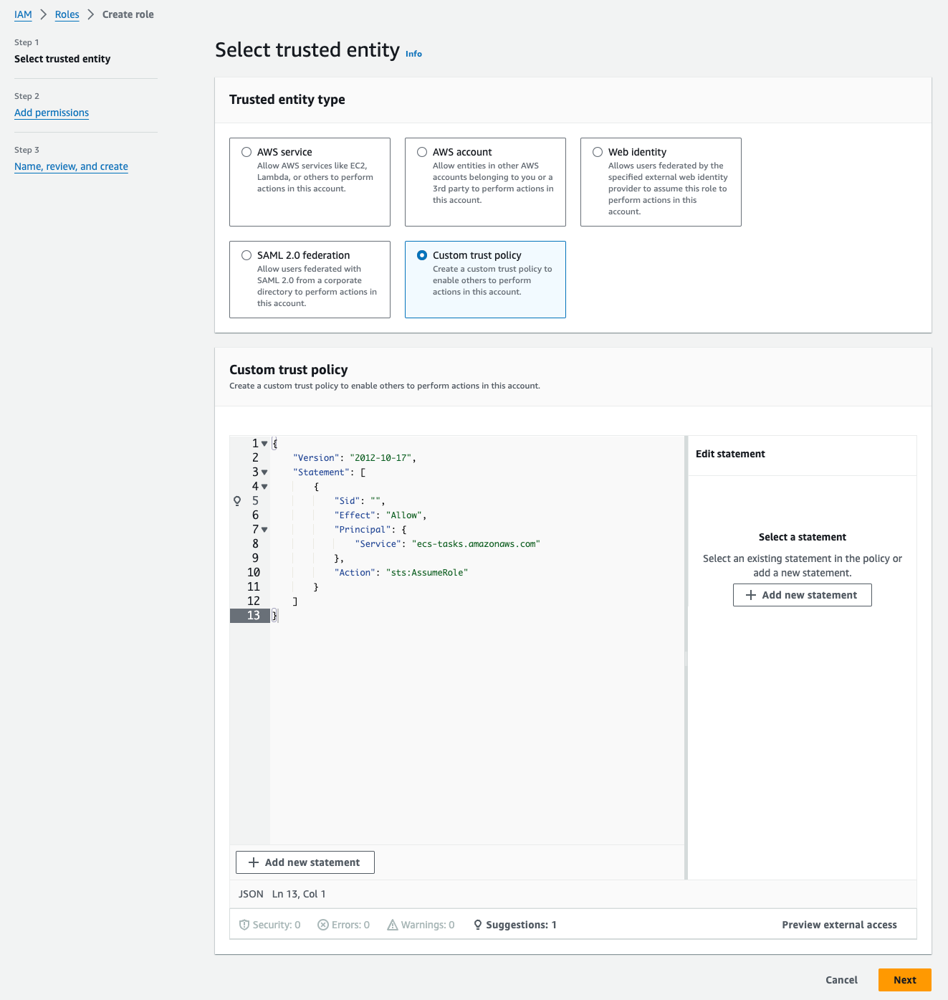
5. Click on **Next** and add the `AmazonECSTaskExecutionRolePolicy`.
6. Then, for **Role Name**, enter `ecsTaskExecutionRole`
7. Finally, click on **Create role**.

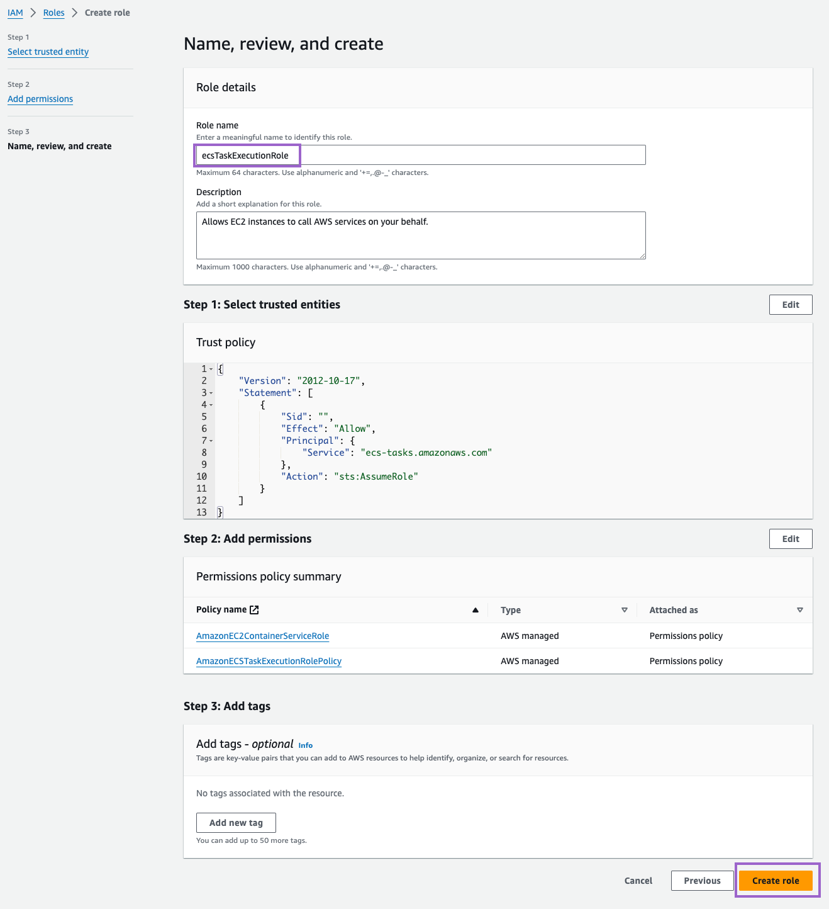

Make sure to copy the ARN of the role. You will need it later.

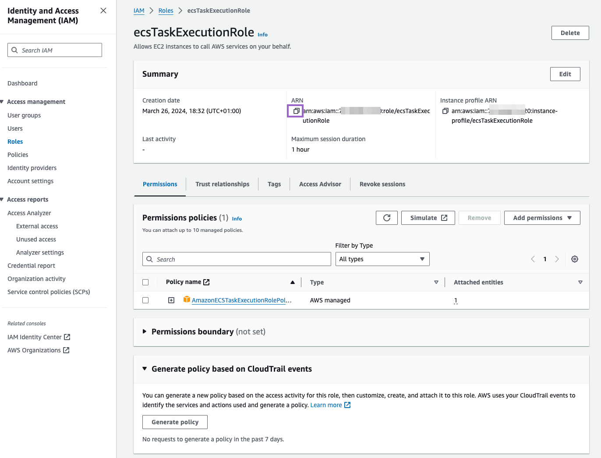

#### Create the `ecsTaskRole` IAM role

In addition to the execution role, you need a task role with S3 access permissions.

First, create a policy for S3 access.

1. Open the [IAM console](https://console.aws.amazon.com/iam).
2. In the navigation menu, choose **Policies**.
3. Select **JSON** and paste the following into the `Policy editor`:
    ```json
    {
      "Version": "2012-10-17",
      "Statement": [
        {
          "Action": [
            "s3:GetObject",
            "s3:PutObject",
            "s3:DeleteObject",
            "s3:ListBucket"
          ],
          "Effect": "Allow",
          "Resource": "*"
        }
      ]
    }
    ```
   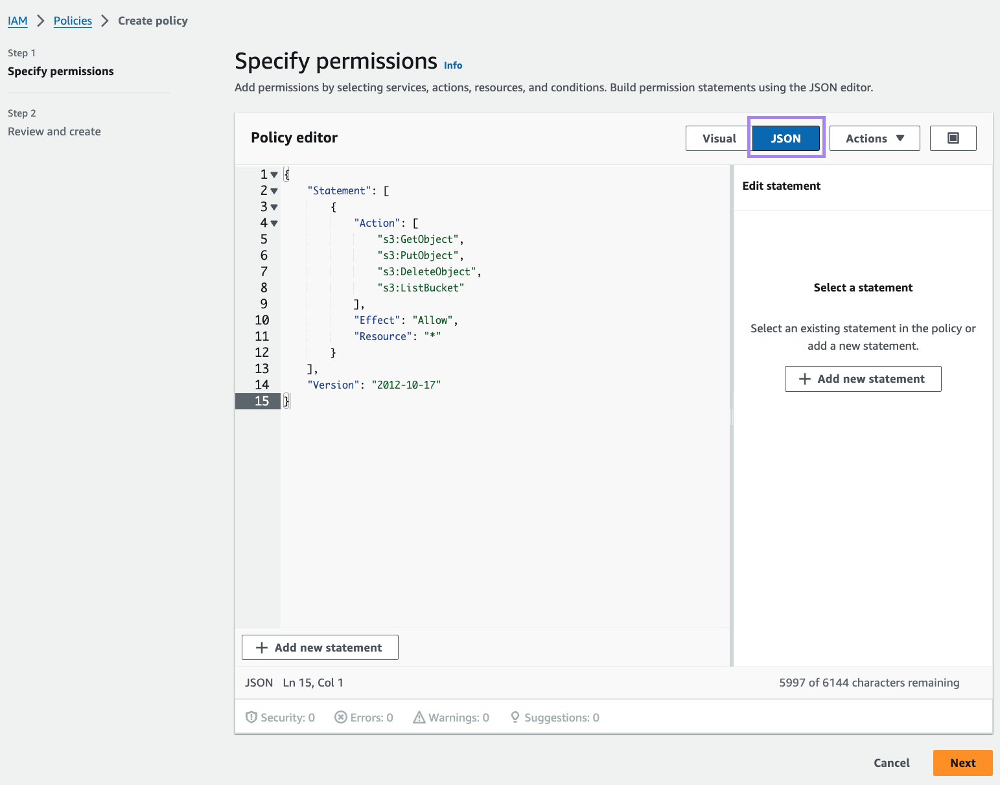
4. Select **Next** and type in a name for the policy, such as `ecsTaskRoleS3Policy`.
5. Once you're done, select **Create policy**.

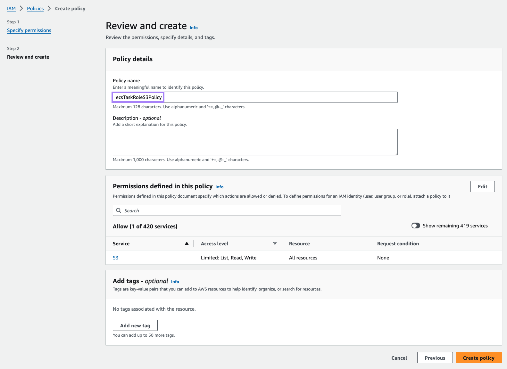


Now create a new role with the same trust policy as above. Attach the new policy before completing.

1. Open the [IAM console](https://console.aws.amazon.com/iam).
2. In the navigation menu, choose **Roles**.
3. Choose **Create role**.
4. In the **Select trusted entity**, choose **Custom trust policy** and paste the following trust policy JSON:
    ```json
    {
      "Version": "2012-10-17",
      "Statement": [
        {
          "Sid": "",
          "Effect": "Allow",
          "Principal": {
            "Service": "ecs-tasks.amazonaws.com"
          },
          "Action": "sts:AssumeRole"
        }
      ]
    }
    ```
5. Select **Next**.
6. Search for the new policy and check the box on the left, then select **Next**.
   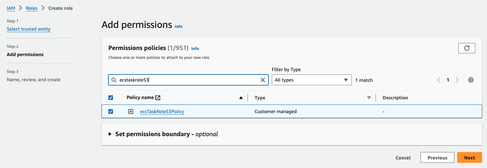
7. For **Role Name**, enter `ecsTaskRole`.
8. Select **Create role**.

#### AWS Batch setup

Go to the AWS Batch console.

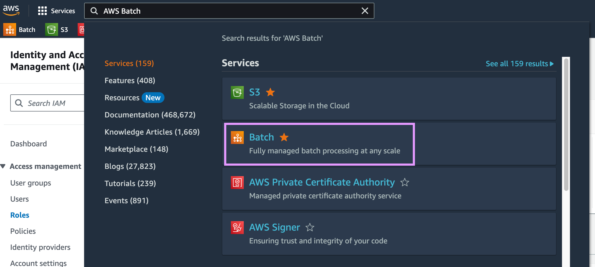

Then, click on **Get Started**. If you don't see the **Get Started** button, add `#firstRun` to the URL:

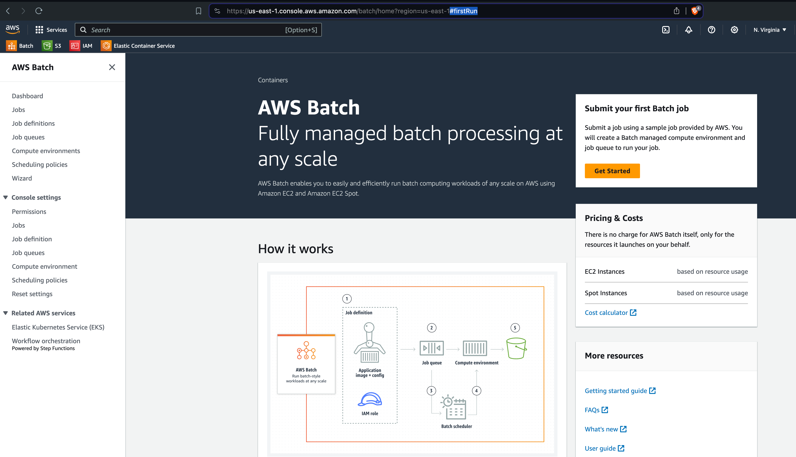

Follow the wizard to create a new compute environment.

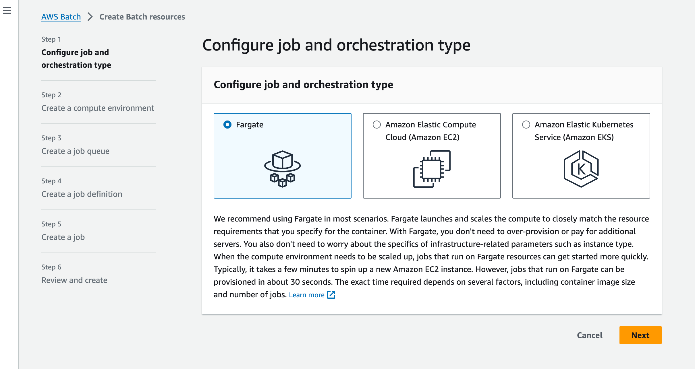

You should see the following text recommending the use of Fargate:

> "We recommend using Fargate in most scenarios. Fargate launches and scales the compute to closely match the resource requirements that you specify for the container. With Fargate, you don't need to over-provision or pay for additional servers. You also don't need to worry about the specifics of infrastructure-related parameters such as instance type. When the compute environment needs to be scaled up, jobs that run on Fargate resources can get started more quickly. Typically, it takes a few minutes to spin up a new Amazon EC2 instance. However, jobs that run on Fargate can be provisioned in about 30 seconds. The exact time required depends on several factors, including container image size and number of jobs. [Learn more](https://docs.aws.amazon.com/batch/latest/userguide/fargate.html)."

Select Fargate for this walkthrough.

#### Step 1: Select orchestration type

Select **Fargate** and click on **Next**.

#### Step 2: Create a compute environment

Add a name for your compute environment — for example, `kestra`. Keep the default settings. Select the VPC and subnets you want to use — the default VPC, subnets, and security group all work. Then select **Next**.

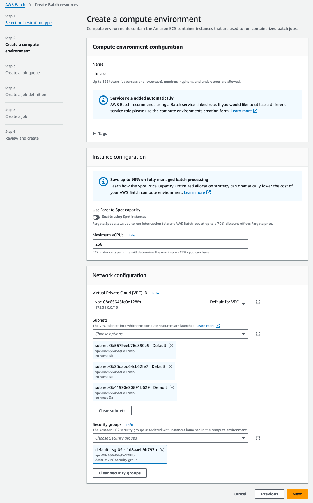

#### Step 3: Create a job queue

Name the job queue — for example, `kestra`. Keep the default settings. Then select **Next**:

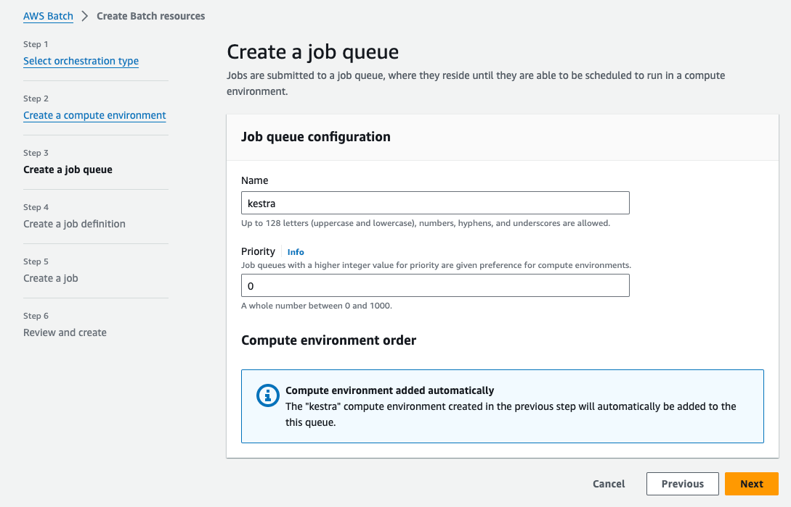

#### Step 4: Create a job definition

Create a job definition named `kestra`. Under **Execution role**, select the role you created earlier (`ecsTaskExecutionRole`). Keep default settings for everything else (you can optionally set the image to `ghcr.io/kestra-io/pydata:latest`). Then select **Next**:

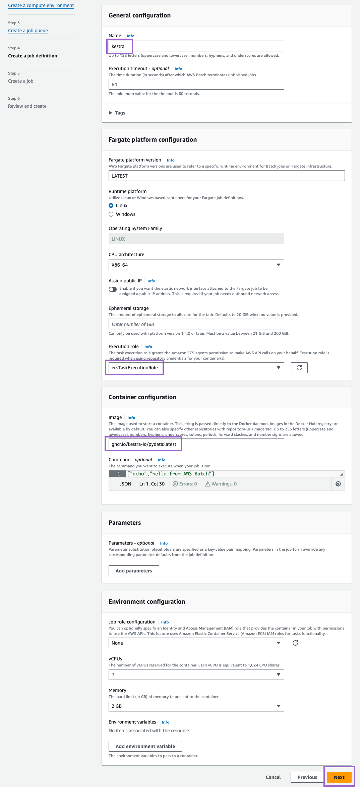

#### Step 5: Create a job

Create a job named `kestra`. Select **Next** to review settings:

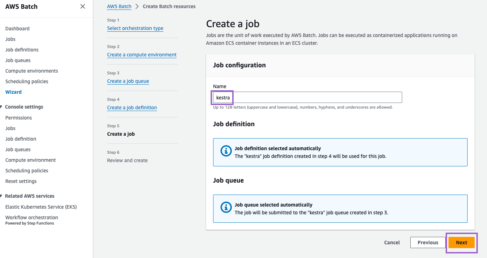

#### Step 6: Review and create

Review your settings and click on **Create resources**:

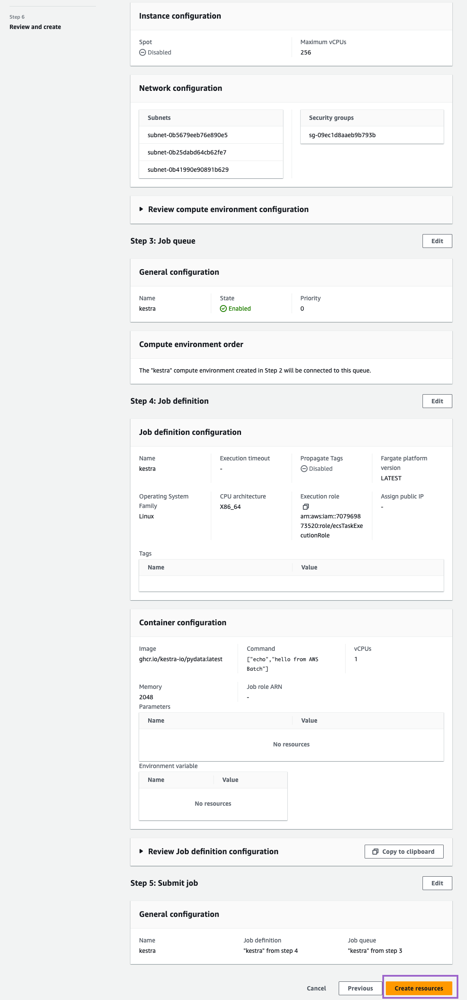

Once you see this message, you are all set:

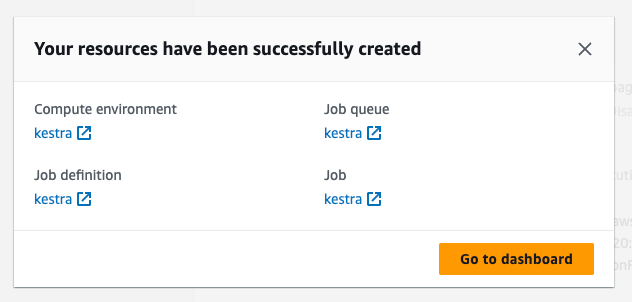

#### Copy and apply the ARN to your Kestra configuration

Copy the ARN of the compute environment and job queue. You will need to add these to your Kestra configuration.

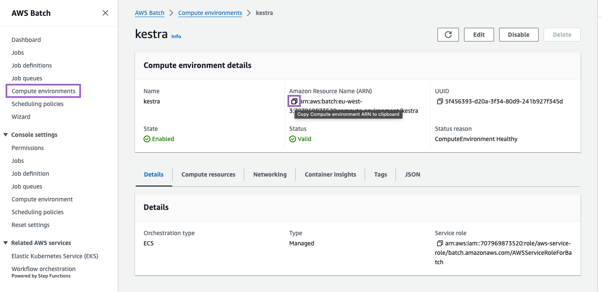

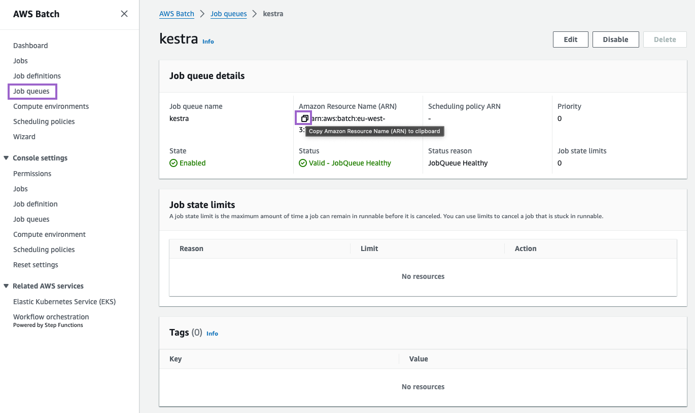

### Create an S3 bucket

Create an S3 bucket to store input and output files. To do this, open **S3** → **Create bucket**.

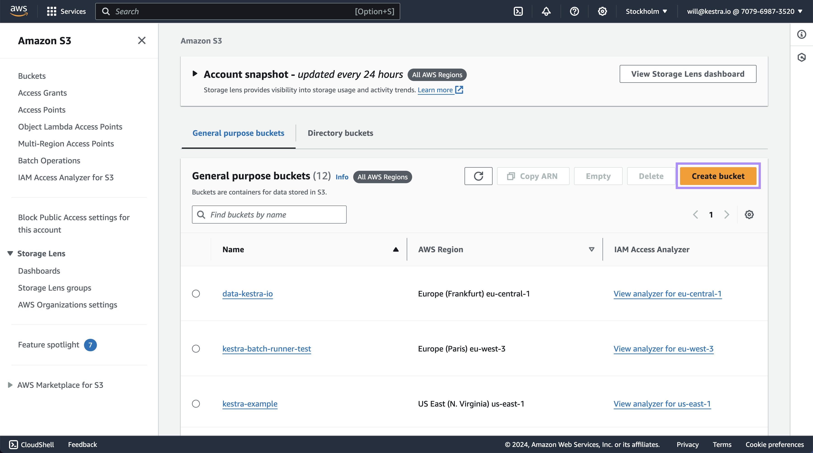

Add a name and leave everything else at its default.

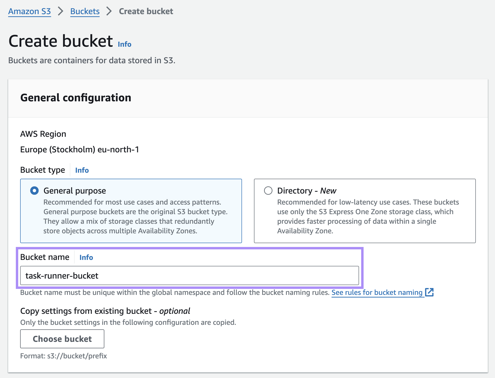

Scroll to the bottom and select **Create bucket**.

Add the bucket name to your Kestra flow.

### Run your Kestra task on AWS ECS Fargate

Fill in the ARNs of the compute environment and job queue in your Kestra configuration. Here is an example of a flow that uses the `aws.runner.Batch` to run a Python script on AWS ECS Fargate to get environment information and print it to the logs:

```yaml
id: aws_batch_runner
namespace: company.team

variables:
  compute_environment_arn: arn:aws:batch:us-east-1:123456789:compute-environment/kestra
  job_queue_arn: arn:aws:batch:us-east-1:123456789:job-queue/kestra
  execution_role_arn: arn:aws:iam::123456789:role/ecsTaskExecutionRole
  task_role_arn: arn:aws:iam::123456789:role/ecsTaskRole

tasks:
  - id: send_data
    type: io.kestra.plugin.scripts.python.Script
    containerImage: ghcr.io/kestra-io/pydata:latest
    taskRunner:
      type: io.kestra.plugin.ee.aws.runner.Batch
      region: us-east-1
      accessKeyId: "{{ secret('AWS_ACCESS_KEY_ID') }}"
      secretKeyId: "{{ secret('AWS_SECRET_KEY_ID') }}"
      computeEnvironmentArn: "{{ vars.compute_environment_arn }}"
      jobQueueArn: "{{ vars.job_queue_arn }}"
      executionRoleArn: "{{ vars.execution_role_arn }}"
      taskRoleArn: "{{ vars.task_role_arn }}"
      bucket: kestra-us
    script: |
      import platform
      import socket
      import sys

      print("Hello from AWS Batch and kestra!")

      def print_environment_info():
          print(f"Host's network name: {platform.node()}")
          print(f"Python version: {platform.python_version()}")
          print(f"Platform information (instance type): {platform.platform()}")
          print(f"OS/Arch: {sys.platform}/{platform.machine()}")

          try:
              hostname = socket.gethostname()
              ip_address = socket.gethostbyname(hostname)
              print(f"Host IP Address: {ip_address}")
          except socket.error as e:
              print("Unable to obtain IP address.")


      if __name__ == '__main__':
          print_environment_info()
```

When you execute this task, the environment information appears in the logs generated by the Python script:

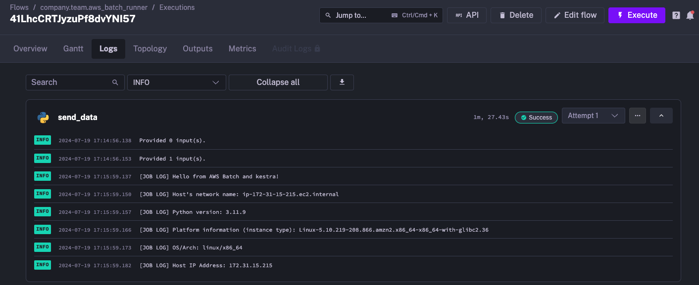

## Advanced configuration

The task runner exposes several optional properties for tuning behavior and authentication.

### Polling and timeouts

| Property | Default | Description |
|---|---|---|
| `waitUntilCompletion` | `PT1H` | Maximum duration to wait for the job to complete. If the task defines a `timeout`, that value takes precedence. AWS Batch will automatically terminate the job when this duration is reached. |
| `completionCheckInterval` | `PT5S` | How often Kestra polls AWS Batch for job status. Lower values reduce latency for short jobs; higher values reduce API call volume for long-running jobs. |

### Job lifecycle

| Property | Default | Description |
|---|---|---|
| `resume` | `true` | When `true`, if the Kestra worker is restarted while a job is running, it will reconnect to the existing job rather than submitting a new one. Requires a `jobQueueArn` to be configured. |
| `delete` | `true` | When `true`, the job definition, any auto-created job queue, and the S3 working-directory prefix are deleted after the job completes. Set to `false` to retain resources for debugging — note that a task retry may then reconnect to the previous (failed) job. |

### Log streaming

| Property | Default | Description |
|---|---|---|
| `streamLogs` | `true` | When `true`, the task runner streams container logs in real time using CloudWatch Logs Live Tail. Set to `false` to disable streaming and instead fetch logs only once the job completes. |

Set `streamLogs: false` for cost-sensitive workloads, since Live Tail is billed separately from standard CloudWatch Logs ingestion. It's also recommended when authenticating with role-chained or short-lived STS credentials (see [STS role assumption](#sts-role-assumption)) — Live Tail keeps a stream open for the entire job duration, and credentials that expire before the job finishes will cause the stream to fail.

### EKS: service account and IRSA

For EKS compute environments, use `serviceAccountName` to attach a Kubernetes service account to the pod. Annotate the service account with an IAM role ARN to enable [IRSA](https://docs.aws.amazon.com/eks/latest/userguide/iam-roles-for-service-accounts.html) — this is the recommended way to grant pods access to AWS services such as S3.

| Property | Description |
|---|---|
| `serviceAccountName` | Name of the Kubernetes service account to attach to the EKS pod. Use with IRSA for IAM authorization. Ignored for ECS compute environments. |

`taskRoleArn` and `executionRoleArn` are ignored when the compute environment is EKS.

### STS role assumption

Instead of static `accessKeyId` / `secretKeyId` credentials, you can authenticate via AWS STS `AssumeRole` for cross-account access or short-lived credentials:

```yaml
taskRunner:
  type: io.kestra.plugin.ee.aws.runner.Batch
  region: eu-central-1
  stsRoleArn: "arn:aws:iam::123456789012:role/kestra-batch-role"
  stsRoleExternalId: "{{ secret('STS_EXTERNAL_ID') }}"
  stsRoleSessionName: kestra-session
  computeEnvironmentArn: "arn:aws:batch:eu-central-1:123456789012:compute-environment/kestraFargateEnvironment"
```

:::alert{type="warning"}
**This example is keyless only when Kestra runs inside AWS.** On a self-hosted instance on EC2 or EKS, the AWS SDK uses the instance profile or IRSA to make the `sts:AssumeRole` call without static keys. On **Kestra Cloud**, no such ambient identity exists — you must supply `accessKeyId` and `secretKeyId` alongside `stsRoleArn`. See [Running from Kestra Cloud](#running-from-kestra-cloud).
:::

| Property | Description |
|---|---|
| `stsRoleArn` | ARN of the IAM role to assume. |
| `stsRoleExternalId` | External ID for the trust policy (optional). |
| `stsRoleSessionName` | Session name tag attached to the assumed-role session (optional). |
| `stsEndpointOverride` | Override the STS endpoint URL (optional, useful in GovCloud or custom environments). |
| `stsRoleSessionDuration` | Duration of the assumed-role session (optional; defaults to the AWS minimum). |

## Running from Kestra Cloud

Kestra Cloud's control plane runs outside your AWS account. It has no EC2 instance profile, EKS IRSA, or other ambient AWS identity. The following differences apply compared to a self-hosted Kestra instance running inside your own AWS environment.

### Authentication on Cloud

**Static credentials are required.** Supply `accessKeyId` and `secretKeyId` in the task runner configuration, stored as [secrets](../../../06.concepts/04.secret/index.md):

```yaml
taskRunner:
  type: io.kestra.plugin.ee.aws.runner.Batch
  region: eu-central-1
  accessKeyId: "{{ secret('AWS_ACCESS_KEY_ID') }}"
  secretKeyId: "{{ secret('AWS_SECRET_KEY_ID') }}"
  computeEnvironmentArn: "arn:aws:batch:eu-central-1:123456789012:compute-environment/kestraFargateEnvironment"
  jobQueueArn: "arn:aws:batch:eu-central-1:123456789012:job-queue/kestraJobQueue"
  executionRoleArn: "arn:aws:iam::123456789012:role/kestraEcsTaskExecutionRole"
  taskRoleArn: "arn:aws:iam::123456789012:role/ecsTaskRole"
```

**STS role assumption requires base credentials.** On a self-hosted instance running on EC2 or EKS, the AWS SDK uses the instance profile or IRSA to call `sts:AssumeRole` without static keys. On Kestra Cloud, you must supply base `accessKeyId` and `secretKeyId` alongside `stsRoleArn` — the STS call cannot proceed without them:

```yaml
taskRunner:
  type: io.kestra.plugin.ee.aws.runner.Batch
  region: eu-central-1
  accessKeyId: "{{ secret('AWS_ACCESS_KEY_ID') }}"
  secretKeyId: "{{ secret('AWS_SECRET_KEY_ID') }}"
  stsRoleArn: "arn:aws:iam::123456789012:role/kestra-batch-role"
  stsRoleExternalId: "{{ secret('STS_EXTERNAL_ID') }}"
  stsRoleSessionName: kestra-session
  computeEnvironmentArn: "arn:aws:batch:eu-central-1:123456789012:compute-environment/kestraFargateEnvironment"
```

**OIDC / Web Identity Federation is not currently supported.** Kestra Cloud does not act as an OIDC identity provider, so `AssumeRoleWithWebIdentity` (the approach used by GitHub Actions and similar systems) is not available. There is no fully keyless path from Kestra Cloud to your AWS account today. If your security policy requires no long-lived static credentials, contact [Kestra support](https://kestra.io/slack) to discuss alternatives or to ask about roadmap plans for a keyless Cloud-to-AWS path.

### Network access

Kestra Cloud makes HTTPS calls to the AWS Batch and S3 APIs from a fixed set of egress IPs. If your AWS environment uses VPC endpoint policies, S3 bucket policies, or SCPs that restrict API access by source IP, you need to allowlist the Kestra Cloud egress ranges. Contact [Kestra support](https://kestra.io/slack) to obtain the current egress IP list for your region.
