Run tasks as containers on Google Cloud VMs.

::snippet{name="cloud/cloud-setup-differs"}

## Offload tasks to Google Cloud Batch

The Google Batch task runner deploys a container for each task on a specified Google Cloud Batch VM.

To launch tasks on Google Cloud Batch, you should understand five main concepts:

1. **Machine type** — a required property that defines the compute machine type where the task will be deployed. If no `reservation` is specified, a new compute instance will be created for each batch, which can add up to a minute of startup latency.
2. **Reservation** — an optional property that lets you reserve virtual machines in advance to avoid the delay of provisioning new instances for every task.
3. **Network interfaces** — optional; if not specified, the runner will use the default network interface.
4. **Compute resources** — an optional property that overrides CPU (in milliCPU), memory (in MiB), and boot disk size per task, independently of the machine type. Defaults are 2000 milliCPU (2 vCPU) and 2048 MiB. Values must stay compatible with the chosen machine type — for example, `n2-standard-2` provides 2 vCPUs and 8 GiB of memory, so `cpu` must not exceed `2000` and `memory` must not exceed `8192`.

    ```yaml
    computeResource:
      cpu: "1000"      # 1 vCPU in milliCPU
      memory: "1024"   # 1 GiB in MiB
      bootDisk: "20GiB"
    ```

5. **Task retries** — use `maxRetryCount` (0–10, default 0) to have Google Batch automatically retry a failed task container before marking the job as failed. Combine with `lifecyclePolicies` for fine-grained control over which exit codes trigger a retry.

## How the Google Batch task runner works

To support `inputFiles`, `namespaceFiles`, and `outputFiles`, the Google Batch task runner performs the following actions:

- Mounts a volume from a GCS bucket.
- Uploads input files to the bucket before launching the container.
- Downloads output files from the bucket after the container finishes.
- Alternatively, any file written to `{{ outputDir }}` (accessible via the `OUTPUT_DIR` environment variable) is automatically captured as an output — useful when the set of output files is not known in advance.

:::alert{type="warning"}
Unlike other task runners, the Google Batch task runner executes commands from the **root directory** (`/`), not the working directory. You must always reference files using the `{{ workingDir }}` expression or the `WORKING_DIR` environment variable — for example, `python {{ workingDir }}/main.py` instead of `python main.py`.
:::

The following Pebble expressions and environment variables are available inside the task:

| Pebble expression | Environment variable | Description |
|---|---|---|
| `{{ workingDir }}` | `WORKING_DIR` | Path to the task's working directory where input files are placed |
| `{{ outputDir }}` | `OUTPUT_DIR` | Path to the output directory; files written here are automatically captured |
| `{{ bucketPath }}` | `BUCKET_PATH` | GCS URI of the task's staging folder in the configured bucket |

:::alert{type="info"}
If the Kestra worker processing this task is restarted, the Batch job continues running on GCP. When the worker comes back up, it automatically reattaches to the existing job (matched by labels) rather than creating a new one. Set `resume: false` to disable this behavior.
:::

By default, the task runner deletes the Batch job and all staging files from the GCS bucket once the task completes. Set `delete: false` to retain them for inspection — but be aware that stale jobs may be reused by the `resume` logic on the next run.

## Example flow

```yaml
id: gcp_batch_runner
namespace: company.team

variables:
  region: europe-west9

tasks:
  - id: scrape_environment_info
    type: io.kestra.plugin.scripts.python.Commands
    containerImage: ghcr.io/kestra-io/pydata:latest
    taskRunner:
      type: io.kestra.plugin.ee.gcp.runner.Batch
      projectId: "{{ secret('GCP_PROJECT_ID') }}"
      region: "{{ vars.region }}"
      bucket: "{{ secret('GCS_BUCKET') }}"
      serviceAccount: "{{ secret('GOOGLE_SA') }}"
    commands:
      - python {{ workingDir }}/main.py
    namespaceFiles:
      enabled: true
    outputFiles:
      - "environment_info.json"
    inputFiles:
      main.py: |
        import platform
        import socket
        import sys
        import json
        from kestra import Kestra

        print("Hello from GCP Batch and kestra!")

        def print_environment_info():
            print(f"Host's network name: {platform.node()}")
            print(f"Python version: {platform.python_version()}")
            print(f"Platform information (instance type): {platform.platform()}")
            print(f"OS/Arch: {sys.platform}/{platform.machine()}")

            env_info = {
                "host": platform.node(),
                "platform": platform.platform(),
                "OS": sys.platform,
                "python_version": platform.python_version(),
            }
            Kestra.outputs(env_info)

            filename = '{{ workingDir }}/environment_info.json'
            with open(filename, 'w') as json_file:
                json.dump(env_info, json_file, indent=4)

        if __name__ == '__main__':
          print_environment_info()
```

:::alert{type="info"}
For a full list of available properties, see the [Google Batch plugin documentation](/plugins/plugin-ee-gcp/google-cloud-task-runner/io.kestra.plugin.ee.gcp.runner.batch) or explore the configuration in the built-in Code Editor in the Kestra UI.
:::

---

## Full setup guide: running Google Batch from scratch

<div class="video-container">
  <iframe src="https://www.youtube.com/embed/kk084vVyZDM?si=zY1-yY_eivumpGGl" title="YouTube video player" allow="accelerometer; autoplay; clipboard-write; encrypted-media; gyroscope; picture-in-picture; web-share" referrerpolicy="strict-origin-when-cross-origin" allowfullscreen></iframe>
</div>

### Before you begin

You'll need the following prerequisites:

1. A Google Cloud account.
2. A Kestra instance (version 0.16.0 or later) with Google credentials stored as [secrets](../../../06.concepts/04.secret/index.md) or set as environment variables.

### Required IAM roles

The service account used by Kestra needs the following roles:

| Role | Purpose |
|---|---|
| `roles/batch.jobsEditor` | Create and manage Batch jobs |
| `roles/logging.viewer` | Stream task logs from Cloud Logging |
| `roles/storage.objectAdmin` | Read and write staging files in the GCS bucket |
| `roles/iam.serviceAccountUser` | Allow Batch to run jobs as the Compute Engine service account |

### Google Cloud Console setup

#### Create a project

If you don't already have one, create a new project in the Google Cloud Console.

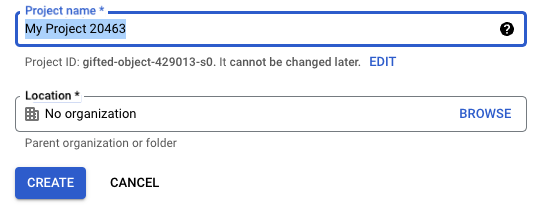

Once created, ensure your new project is selected in the top navigation bar.


#### Enable the Batch API

Navigate to the **APIs & Services** section and search for **Batch API**. Enable it so Kestra can create and manage Batch jobs.

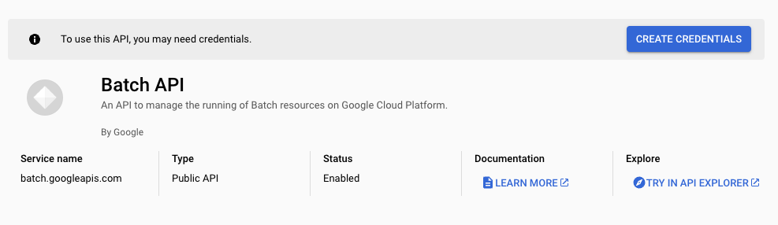

After enabling the API, you'll be prompted to create credentials for integration.

#### Create a service account

Once the Batch API is active, create a service account to allow Kestra to access GCP resources.

Follow the prompt for **Application data**, which will generate a new service account.

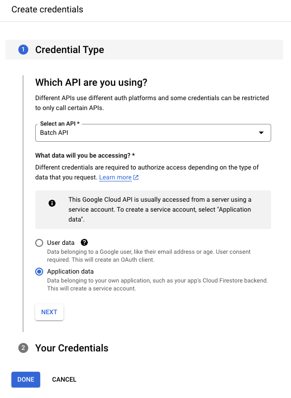

Give the service account a descriptive name.

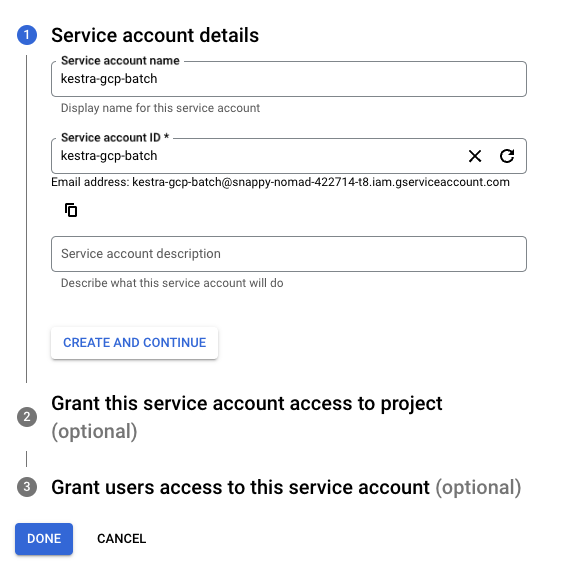

Assign the following roles:
- **Batch Job Editor**
- **Logs Viewer**
- **Storage Object Admin**

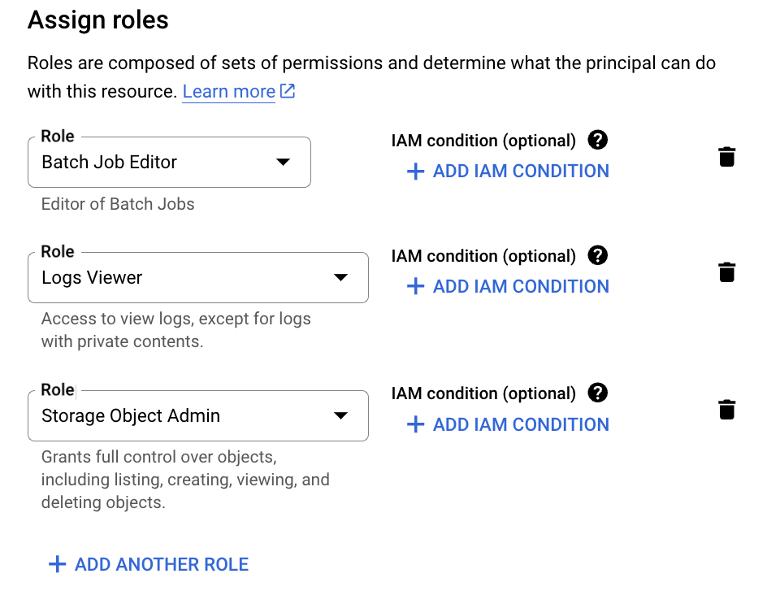

Next, create a key for this service account by going to **Keys → Add Key**, and choose **JSON**. This will generate credentials you can add to Kestra as a secret or directly into your flow configuration.

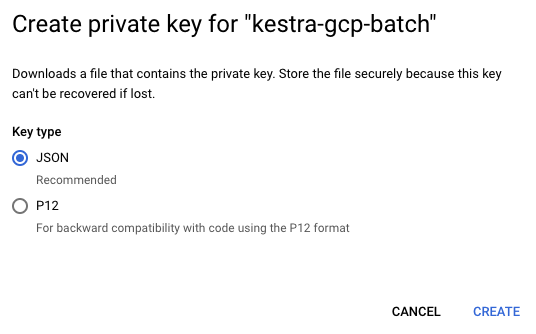

See [Google credentials guide](../../../15.how-to-guides/google-credentials/index.md) for more details.

Grant this service account access to the **Compute Engine default service account** by navigating to **IAM & Admin → Service Accounts → Permissions → Grant Access**, then assigning the **Service Account User** role.

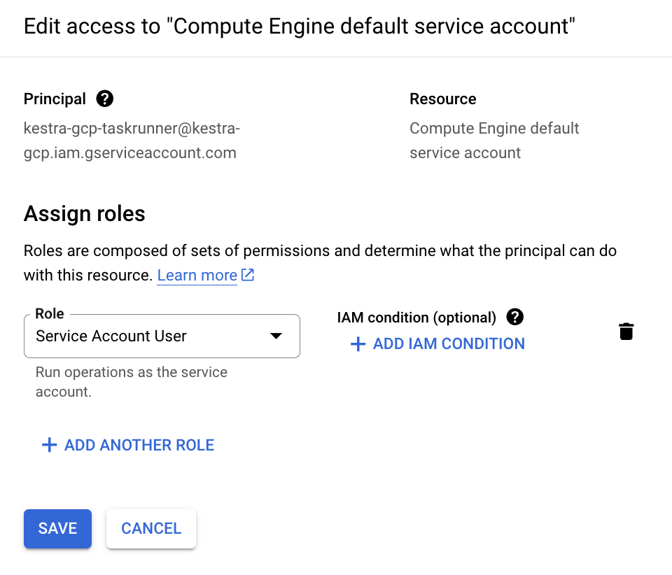

#### Create a storage bucket

Search for "Bucket" in the Cloud Console and create a new GCS bucket. You can keep the default configuration for now.

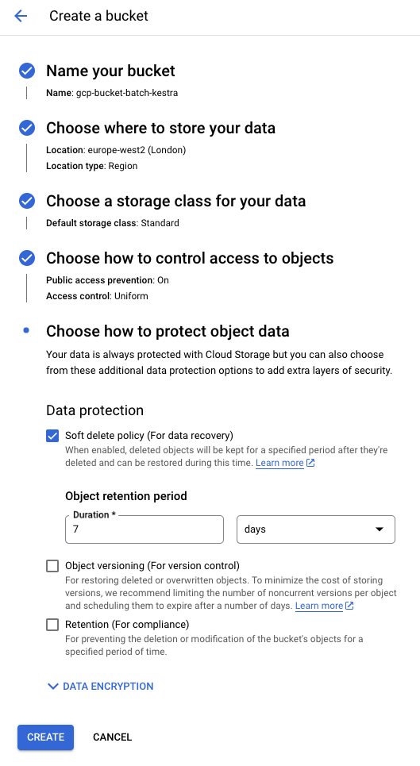

### Create a flow

Below is a sample flow that runs a Python file (`main.py`) using the Google Batch Task Runner. The `taskRunner` section defines properties such as the project, region, and bucket.

:::alert{type="info"}
By default, the task runner uses the default network configuration of your Google Cloud project. If none exists, you can configure connectivity manually using the `networkInterfaces` property. See the [Google Cloud Batch Task Runner documentation](https://kestra.io/plugins/plugin-ee-gcp/google-cloud-task-runner/io.kestra.plugin.ee.gcp.runner.batch#properties_networkInterfaces-body) for details.
:::

```yaml
id: gcp_batch_runner
namespace: company.team

variables:
  region: europe-west2

tasks:
  - id: scrape_environment_info
    type: io.kestra.plugin.scripts.python.Commands
    containerImage: ghcr.io/kestra-io/kestrapy:latest
    taskRunner:
      type: io.kestra.plugin.ee.gcp.runner.Batch
      projectId: "{{ secret('GCP_PROJECT_ID') }}"
      region: "{{ vars.region }}"
      bucket: "{{ secret('GCS_BUCKET') }}"
      serviceAccount: "{{ secret('GOOGLE_SA') }}"
    commands:
      - python {{ workingDir }}/main.py
    namespaceFiles:
      enabled: true
    outputFiles:
      - "environment_info.json"
    inputFiles:
      main.py: |
        import platform
        import socket
        import sys
        import json
        from kestra import Kestra

        print("Hello from GCP Batch and kestra!")

        def print_environment_info():
            print(f"Host's network name: {platform.node()}")
            print(f"Python version: {platform.python_version()}")
            print(f"Platform information (instance type): {platform.platform()}")
            print(f"OS/Arch: {sys.platform}/{platform.machine()}")

            env_info = {
                "host": platform.node(),
                "platform": platform.platform(),
                "OS": sys.platform,
                "python_version": platform.python_version(),
            }
            Kestra.outputs(env_info)

            filename = '{{ workingDir }}/environment_info.json'
            with open(filename, 'w') as json_file:
                json.dump(env_info, json_file, indent=4)

        print_environment_info()
```

When you execute the flow, the logs will show the task runner being created:

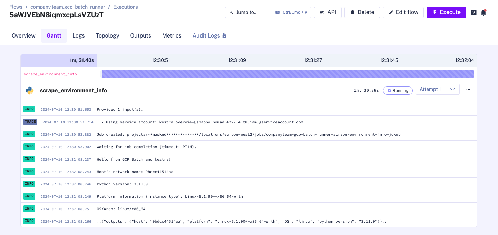

You can also confirm job creation directly in the Google Cloud Console:

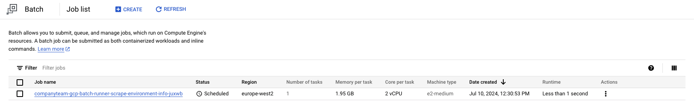

After the task completes, the runner automatically shuts down. You can review output artifacts in Kestra's **Outputs** tab:

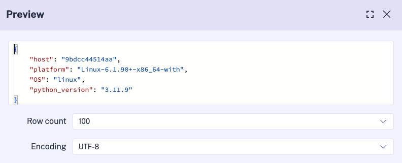
