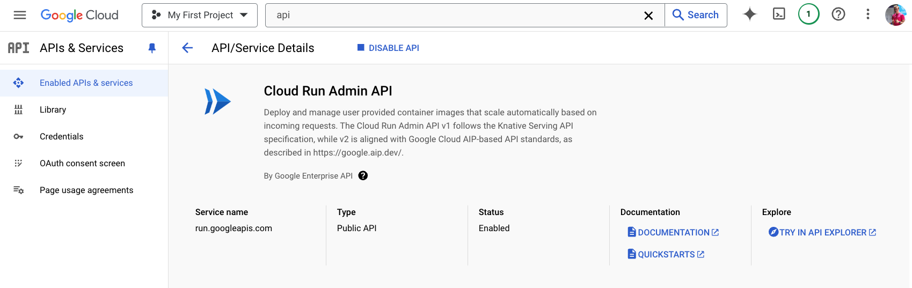
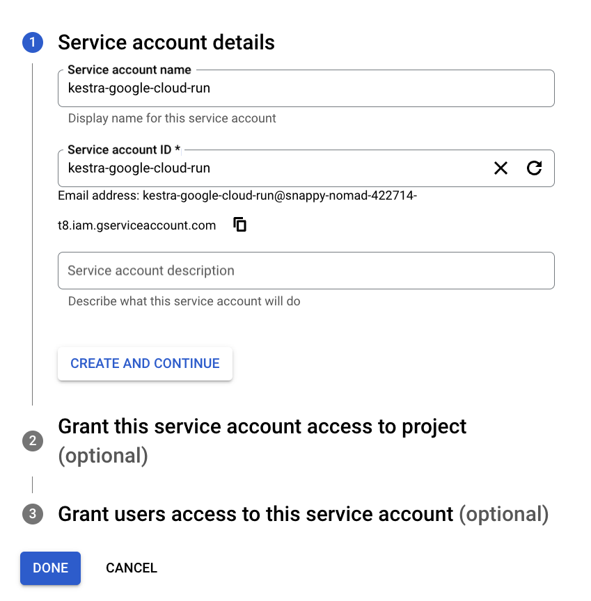
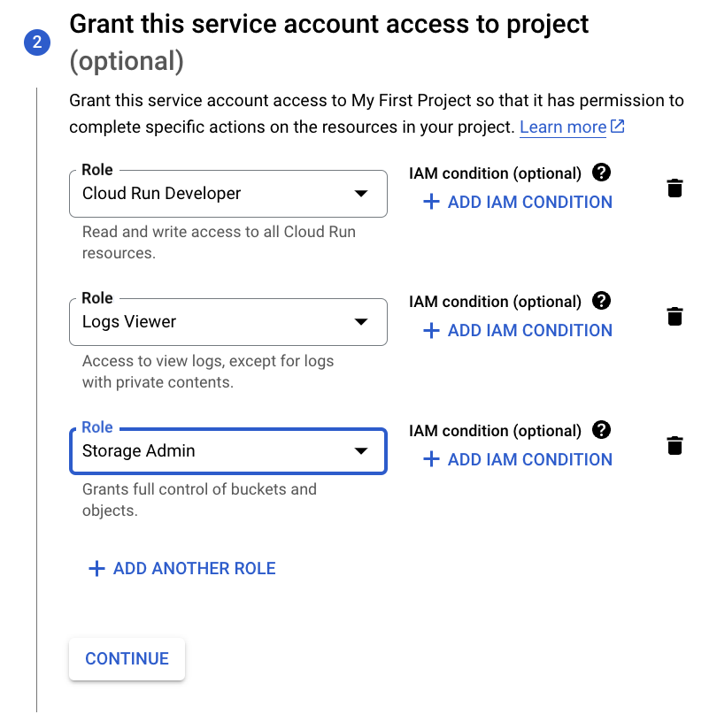
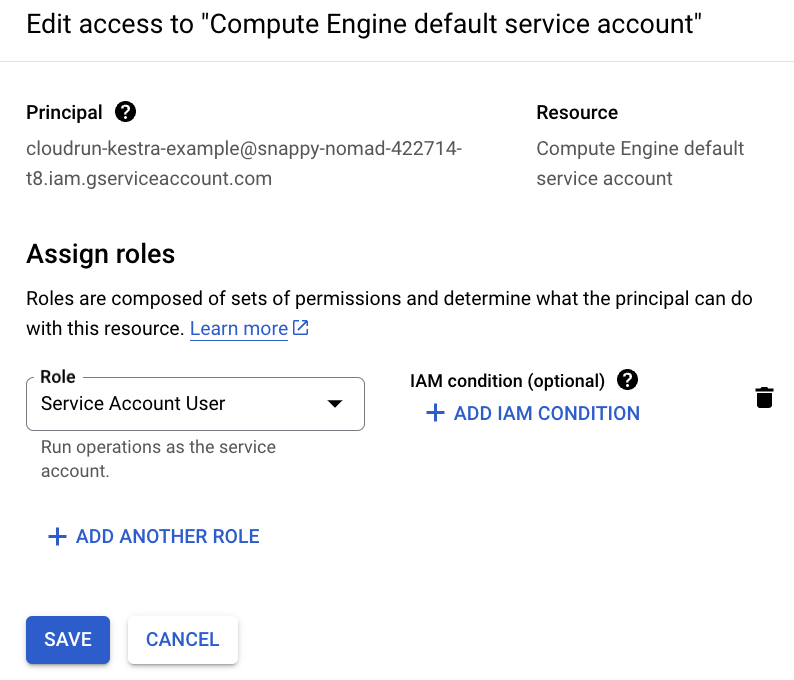
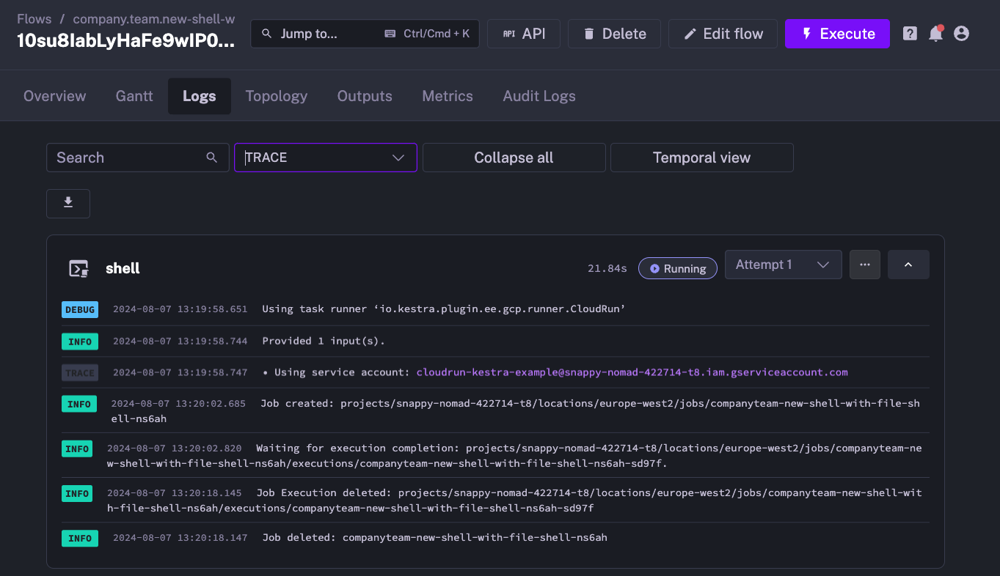
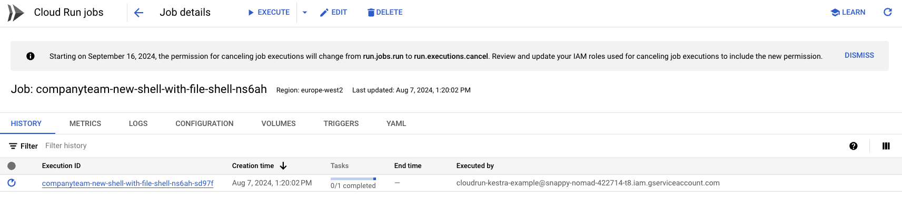

Run tasks as containers on Google Cloud Run.

If you already manage Cloud Run Jobs outside Kestra (via Terraform, `gcloud`, or the console) and want Kestra to trigger executions of those existing jobs, use [`io.kestra.plugin.ee.gcp.cloudrun.Run`](/plugins/plugin-ee-gcp/google-cloud-run/io.kestra.plugin.ee.gcp.cloudrun.run) instead. That task submits an execution against an existing job without creating or modifying the job definition.

## Overview

The Google Cloud Run task runner deploys the container for each task as a Cloud Run Job. When no file operations are configured, the container starts in the root directory — use the `{{ workingDir }}` Pebble expression or the `WORKING_DIR` environment variable to reference input files and outputs rather than relying on the current directory.

## File handling

To use the `inputFiles`, `outputFiles`, or `namespaceFiles` properties, set the `bucket` property. The bucket acts as an intermediary storage layer:

- Input and namespace files are uploaded to the bucket before the task runs.
- Output files are stored in the bucket during execution and made available for download and preview in the Kestra UI afterward.

The task runner creates a unique folder for each run. You can access this folder using the `{{ bucketPath }}` Pebble expression or the `BUCKET_PATH` environment variable.

### Syncing the full working directory

Set `syncWorkingDirectory: true` to download the entire working directory after task completion, which is useful when tasks produce files dynamically without knowing their names in advance:

```yaml
taskRunner:
  type: io.kestra.plugin.ee.gcp.runner.CloudRun
  projectId: "{{ secret('GCP_PROJECT_ID') }}"
  region: europe-west2
  bucket: "{{ secret('GCP_BUCKET') }}"
  serviceAccount: "{{ secret('GOOGLE_SA') }}"
  syncWorkingDirectory: true
```

## IAM permissions

The service account used by Kestra must be able to create Cloud Run jobs, view logs, and access the Cloud Storage bucket used for staging files.

Grant the following IAM roles to the Kestra service account:

- **Cloud Run Developer**
- **Logs Viewer**
- **Storage Admin** if you use `inputFiles`, `outputFiles`, or `namespaceFiles` with a `bucket`

If Cloud Run jobs execute as the Compute Engine default service account, also grant the Kestra service account the **Service Account User** role on that service account.

## Termination behavior

:::alert{type="warning"}
If the Kestra Worker running this task is terminated, the Cloud Run job continues to run until completion. This prevents interruptions due to Worker crashes.

If you manually stop the execution from the Kestra UI, the Cloud Run job is terminated to avoid unnecessary costs. _(This behavior is under development; track progress [on GitHub](https://github.com/kestra-io/plugin-gcp/issues/381))._
:::

By default, jobs are deleted after the task completes. When a task is resubmitted, the runner reattaches to an existing job for the same task run rather than creating a new one. Use `delete: false` to keep the job for inspection after completion, or `resume: false` to force a new job on every execution attempt:

```yaml
taskRunner:
  type: io.kestra.plugin.ee.gcp.runner.CloudRun
  projectId: "{{ secret('GCP_PROJECT_ID') }}"
  region: europe-west2
  serviceAccount: "{{ secret('GOOGLE_SA') }}"
  delete: false
  resume: false
```

## Container resources

Use the `resources` property to set CPU and memory limits on the Cloud Run container. Both `cpu` and `memory` accept static values or Pebble expressions:

```yaml
taskRunner:
  type: io.kestra.plugin.ee.gcp.runner.CloudRun
  projectId: "{{ secret('GCP_PROJECT_ID') }}"
  region: europe-west2
  serviceAccount: "{{ secret('GOOGLE_SA') }}"
  resources:
    cpu: "2"
    memory: "4Gi"
```

CPU accepts whole vCPUs (`1`, `2`, `4`, `8`) or millicores (`1000m`). Memory accepts standard SI suffixes (`512Mi`, `1Gi`, `2Gi`).

Both fields support Pebble expressions, so you can size containers dynamically from flow inputs:

```yaml
inputs:
  - id: cpu_count
    type: INT
    defaults: 2
  - id: memory_gb
    type: INT
    defaults: 4

tasks:
  - id: run
    type: io.kestra.plugin.scripts.shell.Commands
    containerImage: ubuntu
    taskRunner:
      type: io.kestra.plugin.ee.gcp.runner.CloudRun
      projectId: "{{ secret('GCP_PROJECT_ID') }}"
      region: europe-west2
      serviceAccount: "{{ secret('GOOGLE_SA') }}"
      resources:
        cpu: "{{ inputs.cpu_count }}"
        memory: "{{ inputs.memory_gb }}Gi"
    commands:
      - echo "Running with {{ inputs.cpu_count }} vCPUs and {{ inputs.memory_gb }}Gi memory"
```

## Timeout and polling

Three properties control how long the runner waits and how often it checks job status:

| Property | Default | Description |
|---|---|---|
| `waitUntilCompletion` | `PT1H` | Maps to the GCP **Task timeout** field visible in the GCP console under Task capacity. Controls both the GCP-enforced task timeout and the Kestra polling timeout — the Cloud Run task is forcibly terminated by GCP when this duration elapses. The Kestra task-level `timeout` property takes precedence when set. GCP maximum is 168 hours (`PT168H`). |
| `completionCheckInterval` | `PT5S` | How often to poll the Cloud Run API for job status. Lower values reduce latency for short jobs; higher values reduce API calls for long ones. |
| `waitForLogInterval` | `PT5S` | Extra time to stream late log entries after job completion. |

```yaml
taskRunner:
  type: io.kestra.plugin.ee.gcp.runner.CloudRun
  projectId: "{{ secret('GCP_PROJECT_ID') }}"
  region: europe-west2
  serviceAccount: "{{ secret('GOOGLE_SA') }}"
  waitUntilCompletion: PT4H
  completionCheckInterval: PT30S
  waitForLogInterval: PT10S
```

## Job retries

`maxRetries` controls the number of Cloud Run task-level retries (default `3`). These are retries within the Cloud Run execution itself, not Kestra-level task retries. Set to `0` to disable:

```yaml
taskRunner:
  type: io.kestra.plugin.ee.gcp.runner.CloudRun
  projectId: "{{ secret('GCP_PROJECT_ID') }}"
  region: europe-west2
  serviceAccount: "{{ secret('GOOGLE_SA') }}"
  maxRetries: 0
```

## VPC networking

### VPC Access Connector

Route job traffic through a Serverless VPC Access Connector to reach private resources such as Cloud SQL or internal services. Both `vpcAccessConnector` and `vpcEgress` must be set together:

```yaml
taskRunner:
  type: io.kestra.plugin.ee.gcp.runner.CloudRun
  projectId: "{{ secret('GCP_PROJECT_ID') }}"
  region: europe-west1
  serviceAccount: "{{ secret('GOOGLE_SA') }}"
  vpcAccessConnector: projects/my-project/locations/europe-west1/connectors/my-connector
  vpcEgress: PRIVATE_RANGES_ONLY
```

`vpcEgress` accepts `PRIVATE_RANGES_ONLY` (only private RFC 1918 ranges use the connector) or `ALL_TRAFFIC` (all outbound traffic uses the connector).

### Direct VPC Egress

Direct VPC Egress connects the job to a VPC network without a connector. Set `network` and/or `subnetwork` using full resource paths. `vpcAccessConnector` and Direct VPC Egress are mutually exclusive:

```yaml
taskRunner:
  type: io.kestra.plugin.ee.gcp.runner.CloudRun
  projectId: "{{ secret('GCP_PROJECT_ID') }}"
  region: europe-west1
  serviceAccount: "{{ secret('GOOGLE_SA') }}"
  network: projects/my-project/global/networks/my-vpc
  subnetwork: projects/my-project/regions/europe-west1/subnetworks/my-subnet
  vpcEgress: ALL_TRAFFIC
```

## Mounting GCS buckets as volumes

Use `volumes` to mount one or more GCS buckets directly into the container at specified paths. This is independent of the `bucket` property used for file transfer, and is useful for mounting reference datasets or shared outputs:

```yaml
taskRunner:
  type: io.kestra.plugin.ee.gcp.runner.CloudRun
  projectId: "{{ secret('GCP_PROJECT_ID') }}"
  region: europe-west1
  serviceAccount: "{{ secret('GOOGLE_SA') }}"
  volumes:
    - bucket: my-reference-data-bucket
      mountPath: /data
      readOnly: true
    - bucket: my-output-bucket
      mountPath: /output
```

Each entry requires `bucket` (the GCS bucket name) and `mountPath` (the absolute path inside the container). Set `readOnly: true` for read-only access; the default is read-write.

## Service account configuration

The Cloud Run task runner uses three service account properties with distinct roles:

| Property | Purpose |
|---|---|
| `serviceAccount` | JSON key used for Kestra API calls to create and manage Cloud Run jobs. Also used as the job execution identity when `runtimeServiceAccount` is not set. |
| `runtimeServiceAccount` | Email of the service account that the Cloud Run container runs as (`--service-account` equivalent). Controls what GCP resources the container can access at runtime. When set, takes precedence over `serviceAccount` for job execution identity. |
| `impersonatedServiceAccount` | Email of a service account to impersonate for API calls (`--impersonate-service-account` equivalent). Applies to job creation and management, not the container runtime. |

Use `runtimeServiceAccount` when the container needs a different identity from the service account Kestra uses to manage jobs:

```yaml
taskRunner:
  type: io.kestra.plugin.ee.gcp.runner.CloudRun
  projectId: "{{ secret('GCP_PROJECT_ID') }}"
  region: europe-west2
  serviceAccount: "{{ secret('GOOGLE_SA') }}"
  runtimeServiceAccount: container-runner@my-project.iam.gserviceaccount.com
```

## Example flows

### Basic example

The following example runs a shell command inside a Cloud Run container:

```yaml
id: new-shell
namespace: company.team

variables:
  projectId: myProjectId
  region: europe-west2

tasks:
  - id: shell
    type: io.kestra.plugin.scripts.shell.Commands
    taskRunner:
      type: io.kestra.plugin.ee.gcp.runner.CloudRun
      projectId: "{{ vars.projectId }}"
      region: "{{ vars.region }}"
      serviceAccount: "{{ secret('GOOGLE_SA') }}"
    commands:
      - echo "Hello World"
```

### Example with file inputs and outputs

The following flow uploads an input file to GCS, runs a shell command, and retrieves the output:

```yaml
id: new-shell-with-file
namespace: company.team

variables:
  projectId: myProjectId
  region: europe-west2

inputs:
  - id: file
    type: FILE

tasks:
  - id: shell
    type: io.kestra.plugin.scripts.shell.Commands
    inputFiles:
      data.txt: "{{ inputs.file }}"
    outputFiles:
      - out.txt
    containerImage: centos
    taskRunner:
      type: io.kestra.plugin.ee.gcp.runner.CloudRun
      projectId: "{{ vars.projectId }}"
      region: "{{ vars.region }}"
      bucket: "{{ vars.bucket }}"
      serviceAccount: "{{ secret('GOOGLE_SA') }}"
    commands:
      - cp {{ workingDir }}/data.txt {{ workingDir }}/out.txt
```

:::alert{type="info"}
For a complete list of properties available in the Cloud Run task runner, see the [GCP plugin documentation](/plugins/plugin-ee-gcp/google-cloud-task-runner/io.kestra.plugin.ee.gcp.runner.cloudrun) or explore the configuration in the built-in Code Editor.
:::

## How to run tasks on Google Cloud Run

<div class="video-container">
  <iframe src="https://www.youtube.com/embed/pxN8sCreUAA?si=VsnBBjNZRDit5gxD" title="YouTube video player" allow="accelerometer; autoplay; clipboard-write; encrypted-media; gyroscope; picture-in-picture; web-share" referrerpolicy="strict-origin-when-cross-origin" allowfullscreen></iframe>
</div>

### Before you begin

Ensure you have the following:

1. A Google Cloud account.
2. A Kestra instance with Google credentials stored as [secrets](../../../06.concepts/04.secret/index.md) or as environment variables.

### Google Cloud Console setup

#### Create a project

If you don't already have one, create a new project in the Google Cloud Console.


Ensure the new project is selected in the top navigation bar.


#### Enable the Cloud Run Admin API

Open **APIs & Services → Enable APIs and Services**, then search for and enable **Cloud Run Admin API**.



#### Create a service account

After enabling the API, create a service account to allow Kestra to access Cloud Run resources.

In the search bar, find **Service Accounts** and select **Create Service Account**.



Assign the following roles to the service account:

- **Cloud Run Developer**
- **Logs Viewer**
- **Storage Admin** (required for file upload and download)



Refer to the [Google credentials guide](../../../15.how-to-guides/google-credentials/index.md) for details on adding the service account to Kestra as a secret.

To grant access to the Compute Engine default service account, go to **IAM & Admin → Service Accounts → Permissions → Grant Access**, and assign the **Service Account User** role to your new service account.



#### Create a storage bucket

Search for "Bucket" in the Cloud Console and create a new GCS bucket. Use default settings unless otherwise required.


### Create a flow

The following flow runs a shell script using the Google Cloud Run task runner and copies a file under a new name:

```yaml
id: new-shell-with-file
namespace: company.team

variables:
  projectId: myProjectId
  region: europe-west2

inputs:
  - id: file
    type: FILE

tasks:
  - id: shell
    type: io.kestra.plugin.scripts.shell.Commands
    inputFiles:
      data.txt: "{{ inputs.file }}"
    outputFiles:
      - out.txt
    containerImage: centos
    taskRunner:
      type: io.kestra.plugin.ee.gcp.runner.CloudRun
      projectId: "{{ secret('GCP_PROJECT_ID') }}"
      region: "{{ vars.region }}"
      bucket: "{{ secret('GCP_BUCKET') }}"
      serviceAccount: "{{ secret('GOOGLE_SA') }}"
    commands:
      - cp {{ workingDir }}/data.txt {{ workingDir }}/out.txt
```

When you execute the flow, the Kestra logs confirm that the Cloud Run job was created and started:



You can also verify job creation in the Google Cloud Console:



After the task completes, the Cloud Run job is automatically deleted to free up resources.

## Execution details

When you open an execution in the topology view, the topology node for a Google Cloud Run task shows a compact status row. For full job and configuration details, click **Show Details** to open the job modal.

**Topology node:**

| Field | Description |
|---|---|
| Runner | Task runner type |
| Region | GCP region where the job runs |
| Project | GCP project ID |
| Job name | GCP Cloud Run job resource name |
| Duration | Elapsed or total execution time |

**Show Details modal:**

*Configuration:*
- Project ID and region
- Service account
- Staging GCS bucket
- Whether the job deletes on completion (`delete` flag)
- Whether an existing job will be resumed on Worker restart (`resume` flag)
- Configured timeout

*Post-execution:*
- Job name — GCP resource identifier for the Cloud Run job
- Resumed or new — whether the job reused an existing run or was freshly created
- Deletion triggered — whether the job was deleted after completion
