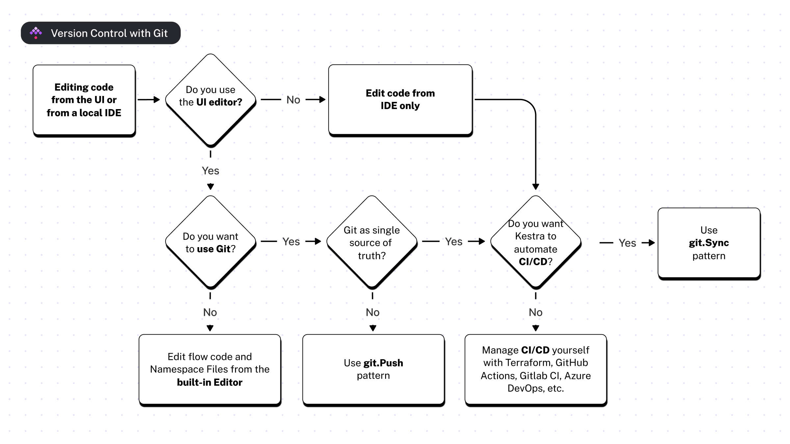
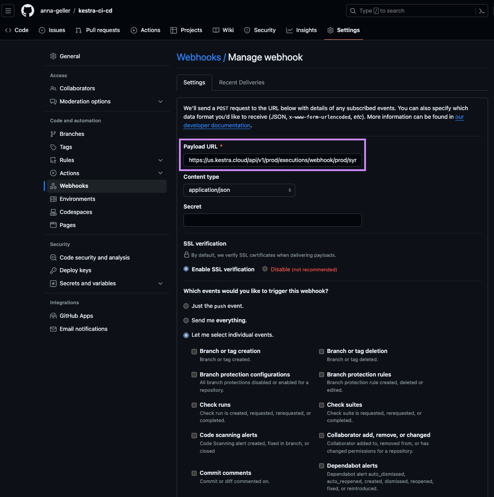

Learn how to pair Kestra with Git so you can version flows, namespace files, and related artifacts alongside your application code.

## Version flows and namespace files with Git

<div class="video-container">
  <iframe src="https://www.youtube.com/embed/videoseries?si=wOyAUkgChRUuJxcy&amp;list=PLEK3H8YwZn1p7tyd9RV5-WDxh_ZGpMpA3" title="YouTube video player" allow="accelerometer; autoplay; clipboard-write; encrypted-media; gyroscope; picture-in-picture; web-share" referrerpolicy="strict-origin-when-cross-origin" allowfullscreen></iframe>
</div>

---

Kestra supports version control with Git. You can use one or more repositories to store your [flows](../../05.workflow-components/01.flow/index.md), [namespace files](../../06.concepts/02.namespace-files/index.md), [apps](../../07.enterprise/04.scalability/apps/index.md), [tests](../../07.enterprise/02.governance/unit-tests/index.md), and [dashboards](../../09.ui/00.dashboard/index.md), tracking changes through Git history.

There are multiple ways to combine Kestra with Git:
- [SyncFlows](/plugins/plugin-git/io.kestra.plugin.git.syncflows) implements GitOps with Git as the single source of truth for flows.
- [SyncNamespaceFiles](/plugins/plugin-git/io.kestra.plugin.git.syncnamespacefiles) syncs namespace files the same way.
- [PushFlows](/plugins/plugin-git/io.kestra.plugin.git.PushFlows) commits and pushes flow edits from the UI to Git, useful when you rely on the built-in editor but still want version history.
- [PushNamespaceFiles](/plugins/plugin-git/io.kestra.plugin.git.pushnamespacefiles) does the same for namespace files.
- [SyncBlueprints](/plugins/plugin-ee-git/io.kestra.plugin.ee.git.SyncBlueprints) syncs Custom Blueprints from Git to Kestra (Enterprise Edition).
- [PushBlueprints](/plugins/plugin-ee-git/io.kestra.plugin.ee.git.PushBlueprints) commits and pushes Custom Blueprints from Kestra to Git (Enterprise Edition).
- [Clone](https://kestra.io/plugins/git/io.kestra.plugin.git.clone) clones a repository directly into a flow so scripts are available at runtime.
- [TenantSync](/plugins/plugin-git/io.kestra.plugin.git.tenantsync) synchronizes all namespaces in a tenant, including flows, files, apps, tests, and dashboards.
- [NamespaceSync](/plugins/plugin-git/io.kestra.plugin.git.namespacesync) keeps a single namespace in sync with a Git repo.
- A custom [CI/CD](../cicd/index.md) pipeline lets you manage deployments yourself (GitHub Actions, Terraform, etc.) while keeping Git authoritative.

The image below shows how to choose the right pattern based on your needs:



Let's dive into each of these patterns and when to use them.

## Git SyncFlows and SyncNamespaceFiles

The [Git SyncFlows](/plugins/plugin-git/io.kestra.plugin.git.syncflows) pattern implements GitOps with Git as the single source of truth. Store flows in Git, and run a _system flow_ that automatically syncs changes into Kestra. The [Git SyncNamespaceFiles](/plugins/plugin-git/io.kestra.plugin.git.syncnamespacefiles) pattern mirrors this for namespace files.

Here's how it works:
- Store flows and namespace files in Git.
- Schedule a _system flow_ that syncs changes from Git to Kestra.
- Modify files in Git whenever you need to change a flow or namespace file.
- The system flow syncs those changes, overwriting any conflicting UI edits with the Git version.

This pattern suits teams that treat Git as the single source of truth and prefer not to edit flows or namespace files in the UI. No CI/CD pipeline is required, so it's ideal if you already follow GitOps practices or come from a Kubernetes background.

Here is an example system flow that you can use to declaratively sync changes from Git to Kestra:

```yaml
id: sync_from_git
namespace: system

tasks:
  - id: git
    type: io.kestra.plugin.git.SyncFlows
    url: https://github.com/kestra/scripts
    branch: main
    username: git_username
    password: "{{ secret('GITHUB_ACCESS_TOKEN') }}"
    targetNamespace: git
    includeChildNamespaces: true # optional; by default, it's set to false to allow explicit definition
    gitDirectory: your_git_dir

triggers:
  - id: schedule
    type: io.kestra.plugin.core.trigger.Schedule
    cron: "*/1 * * * *" # every minute
```

Commit this flow to Git or add it via the built-in editor; it won't be overwritten by reconciliation.

You can also sync namespace files with the example below:

```yaml
id: sync_from_git
namespace: system


tasks:
  - id: git
    type: io.kestra.plugin.git.SyncNamespaceFiles
    namespace: prod
    gitDirectory: _files # optional; set to _files by default
    url: https://github.com/kestra-io/flows
    branch: main
    username: git_username
    password: "{{ secret('GITHUB_ACCESS_TOKEN') }}"
```

You can also trigger this flow with a [GitHub webhook](../../05.workflow-components/07.triggers/03.webhook-trigger/index.md) whenever changes land in Git:

```yaml
id: sync_from_git
namespace: system

tasks:
  - id: git
    type: io.kestra.plugin.git.SyncFlows
    url: https://github.com/kestra/scripts
    branch: main
    targetNamespace: git
    username: git_username
    password: "{{ secret('GITHUB_ACCESS_TOKEN') }}"

triggers:
  - id: github_webhook
    type: io.kestra.plugin.core.trigger.Webhook
    key: "{{ secret('WEBHOOK_KEY') }}"
```

The webhook key authenticates requests and prevents unauthorized access. For the flow above, paste the following URL into your repository’s **Webhooks** settings:

```bash
http://your_kestra_host:8080/api/v1/<your_tenant>/executions/webhook/prod/sync_from_git/your_secret_key
```



Following the pattern:

```bash
http://<host>/api/v1/<tenant>/executions/webhook/<namespace>/<flow>/<webhook_key>
```

## CI/CD

The CI/CD pattern still treats Git as the single source of truth but pushes code changes to Kestra whenever a pull request merges. Unlike the Sync pattern, you manage the automation (GitHub Actions, Terraform, etc.). See the [CI/CD](../cicd/index.md) docs for setup details.

## Git PushFlows and PushNamespaceFiles

The [Git PushFlows](/plugins/plugin-git/io.kestra.plugin.git.pushflows) pattern lets you edit flows in the UI while pushing versions to Git. The [Git PushNamespaceFiles](/plugins/plugin-git/io.kestra.plugin.git.pushnamespacefiles) pattern offers the same workflow for namespace files.

Example flow for pushing from Kestra to Git:

```yaml
id: push_to_git
namespace: system

tasks:
  - id: commit_and_push
    type: io.kestra.plugin.git.PushFlows
    url: https://github.com/kestra-io/scripts
    sourceNamespace: dev
    targetNamespace: pod
    flows: "*"
    branch: kestra
    username: github_username
    password: "{{ secret('GITHUB_ACCESS_TOKEN') }}"
    commitMessage: add namespace files changes

triggers:
  - id: schedule
    type: io.kestra.plugin.core.trigger.Schedule
    cron: "* */1 * * *" # every hour
```

Example flow for pushing namespace files:

```yaml
id: push_to_git
namespace: system

tasks:
  - id: commit_and_push
    type: io.kestra.plugin.git.PushNamespaceFiles
    namespace: dev
    files: "*"
    gitDirectory: _files
    url: https://github.com/kestra-io/scripts # required string
    username: git_username
    password: "{{ secret('GITHUB_ACCESS_TOKEN') }}"
    branch: dev
    commitMessage: "add namespace files"


triggers:
  - id: schedule_push_to_git
    type: io.kestra.plugin.core.trigger.Schedule
    cron: "*/15 * * * *"
```

Use this pattern to push to a feature branch and open a pull request for review.

## Git Clone

The [Git Clone](/plugins/plugin-git/io.kestra.plugin.git.clone) pattern clones a repository at runtime so you can orchestrate code managed elsewhere, for example:
- dbt projects via the [dbt CLI task](/plugins/plugin-dbt/cli/io.kestra.plugin.dbt.cli.dbtcli)
- Infrastructure deployments via [Terraform CLI](/plugins/plugin-terraform/cli/io.kestra.plugin.terraform.cli.terraformcli), [OpenTofu CLI](/plugins/plugin-opentofu/cli/io.kestra.plugin.opentofu.cli.opentofucli), [Terragrunt CLI](/plugins/plugin-terragrunt/cli/io.kestra.plugin.terragrunt.cli.terragruntcli), or [Ansible CLI](/plugins/plugin-ansible/cli/io.kestra.plugin.ansible.cli.ansiblecli)
- Docker builds via the [Docker Build task](/plugins/plugin-docker/io.kestra.plugin.docker.build)

## Git SyncBlueprints and PushBlueprints

[SyncBlueprints](/plugins/plugin-ee-git/io.kestra.plugin.ee.git.SyncBlueprints) and [PushBlueprints](/plugins/plugin-ee-git/io.kestra.plugin.ee.git.PushBlueprints) bring the same GitOps patterns to Custom Blueprints (Enterprise Edition).

- **`SyncBlueprints`** – pulls blueprints from a Git directory into Kestra. Use this when a central team owns an approved blueprint library and needs to deploy it across environments. Set `delete: true` to treat Git as the sole source of truth and remove any blueprints not present in the repository.
- **`PushBlueprints`** – exports blueprints from Kestra to Git. Use this when teams author blueprints in the UI and want version history or a pull request review workflow.

See [Custom Blueprints](../07.enterprise/02.governance/custom-blueprints/index.md#version-control-for-custom-blueprints) for full examples and the blueprint YAML file format.

## Git TenantSync and NamespaceSync

Both [Git TenantSync](/plugins/plugin-git/io.kestra.plugin.git.tenantsync) and [Git NamespaceSync](/plugins/plugin-git/io.kestra.plugin.git.namespacesync) give you full control over synchronizing Kestra objects with your Git repository.

- **`TenantSync`** – synchronizes **all namespaces** in a tenant, including flows, files, apps, tests, dashboards, and custom blueprints.
  - Requires `kestraUrl` and `auth` so the task can call Kestra's API with tenant-wide RBAC.
  - Useful when you need to back up the entire tenant to Git and promote environments through pull requests.

- **`NamespaceSync`** – synchronizes objects within a **single namespace** with your Git repository.
  - Requires the `namespace` property but not `kestraUrl` or `auth`; it relies on namespace-level RBAC and can be run by any user with sufficient permissions.
  - Ideal for teams that sync one namespace per repository, allowing owners to manage their own syncs.

Both plugins support:
- `sourceOfTruth` (`GIT` or `KESTRA`) to define the update strategy.
- `whenMissingInSource` with options `DELETE`, `KEEP`, or `FAIL` to control how missing objects should be handled.
- An **opinionated folder structure** for flows, apps, dashboards, tests, and files with one folder per namespace (see [Git directory structure](#git-directory-structure) below).
- `protectedNamespaces` to ensure your Kestra objects from critical namespaces (such as `system`) are not accidentally deleted when `sourceOfTruth` is `GIT`.
- Validation rules requiring explicit Git `branch` and optional `gitDirectory`.
- Options like `dryRun` and `onInvalidSyntax` for safe rollouts and error handling.

Example usage of the `TenantSync` task:

```yaml
id: tenant_git_sync
namespace: system

tasks:
  - id: tenant
    type: io.kestra.plugin.git.TenantSync
    sourceOfTruth: KESTRA
    whenMissingInSource: DELETE
    url: https://github.com/org/repo
    branch: main
    protectedNamespaces:
      - system
    kestraUrl: http://localhost:8080
    auth:
      username: admin@kestra.io
      password: "{{ secret('KESTRA_PASSWORD') }}"
```

Example usage of the `NamespaceSync` task:

```yaml
id: namespace_git_sync
namespace: system

tasks:
  - id: namespace
    type: io.kestra.plugin.git.NamespaceSync
    namespace: company.team
    sourceOfTruth: GIT
    whenMissingInSource: KEEP
    url: https://github.com/org/repo
    branch: main
    protectedNamespaces:
      - system
```

### Git directory structure

Both `TenantSync` and `NamespaceSync` expect a specific folder structure inside your Git repository. The optional `gitDirectory` property sets a base folder within the repo; if omitted the repo root is used. Under that base, Kestra uses a fixed layout organized by namespace and resource type:

| Resource type | Path in Git |
| --- | --- |
| Flows | `<namespace>/flows/<flowId>.yaml` |
| Namespace files | `<namespace>/files/<path>` |
| Apps | `<namespace>/apps/<appId>.yaml` |
| Unit tests | `<namespace>/tests/<testId>.yaml` |
| Dashboards | `_global/dashboards/<dashboardId>.yaml` |
| Custom blueprints | `_global/blueprints/<blueprintId>.yaml` |

If you set `gitDirectory: monorepo`, the full path for a flow in the `company.team` namespace becomes `monorepo/company.team/flows/my-flow.yaml`.

#### How resource identity works

**The filename stem is the resource ID.** For flows, apps, unit tests, and dashboards the part of the filename before `.yaml` is used as the object's ID during sync — not the `id` field written inside the YAML. Custom blueprints are an exception: the sync reads the `id` field from the YAML content and falls back to the filename stem only when the field is absent. Namespace files use their full relative path under `<namespace>/files/` as the file path identity.

This has an important consequence: **the filename must match the `id` inside the YAML**. When Kestra pushes objects from the UI to Git (for example with `sourceOfTruth: KESTRA`), it generates filenames from the object's ID automatically. If you later rename a file in Git, the sync treats the old filename as a deleted object and the new filename as a new object. When it tries to create the new object, Kestra rejects it because a resource with that ID already exists in the instance — resulting in an error like:

```
Invalid entity: App already exists for id 'solutions_ai_search_annual_report'
```

To avoid this error, keep filenames in sync with the `id` field inside each YAML. If you need to rename a file, also update the `id` inside the YAML at the same time.

#### Handling mismatched filenames with `onInvalidSyntax`

If you encounter files whose names do not match the expected ID (for example after a manual rename), you can control how the sync reacts using the `onInvalidSyntax` property:

| Value | Behavior |
| --- | --- |
| `FAIL` (default) | Throws an exception and stops the sync |
| `WARN` | Logs a warning and continues |
| `SKIP` | Logs an info message and continues |

Use `WARN` or `SKIP` as a short-term workaround while you correct the naming in Git:

```yaml
tasks:
  - id: sync
    type: io.kestra.plugin.git.TenantSync
    sourceOfTruth: GIT
    onInvalidSyntax: WARN
    # ... other properties
```
