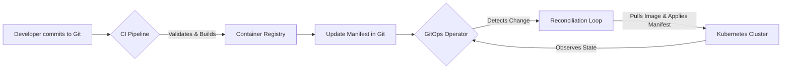

In today’s complex, dynamic IT environments, managing infrastructure and application deployments can feel like a constant battle against inconsistency and manual errors. Teams grapple with configuration drift, slow rollbacks, and a lack of clear audit trails, turning every deployment into a high-stakes operation. This is where GitOps offers a powerful paradigm shift.

GitOps is a set of operational practices that uses Git as the single source of truth for declarative infrastructure and applications. By embracing Git as the central control plane, organizations can achieve faster, more reliable, and more secure deployments. This article will explore the core principles of GitOps, its significant benefits, practical implementation strategies, and how it compares to related practices, ultimately demonstrating how it streamlines your entire operational workflow.

## What is GitOps?

GitOps is an operational framework that takes DevOps best practices used for application development—such as version control, collaboration, compliance, and CI/CD—and applies them to infrastructure automation. At its core, GitOps is about having a Git repository that always contains declarative descriptions of the infrastructure currently desired in the production environment and an automated process to make the production environment match the described state in the repository.

The entire system is managed declaratively, with Git serving as the guaranteed single source of truth. This means that the Git repository contains a complete picture of the desired state of your system, from application configurations to the underlying infrastructure. An automated agent continuously monitors the actual state of the system and reconciles any differences, ensuring that the live environment always reflects what is defined in Git. This approach is built on the foundation of [Infrastructure as Code (IaC)](/resources/infrastructure/what-is-infrastructure-as-code), where infrastructure is managed through code and software development techniques. By embracing a [declarative-first approach](https://kestra.io/blogs/declarative-from-day-one), teams can focus on *what* they want their system to look like, leaving the *how* to the automation tools. For more details on managing workflows with Git, see Kestra's documentation on [version control](https://kestra.io/docs/version-control-cicd/git).

### Key principles of GitOps

The GitOps methodology is guided by four fundamental principles that ensure consistency, reliability, and auditability. These principles form the foundation of any successful GitOps implementation and are crucial for effective [version control and CI/CD](https://kestra.io/docs/version-control-cicd).

1.  **Declarative**: The entire system state must be described declaratively in a format like YAML or JSON. This description defines the desired state of all components, including infrastructure, applications, and configurations. By defining your system declaratively, as you would with [Kestra flows](https://kestra.io/docs/workflow-components/flow), you create a clear, unambiguous target for your automation.

2.  **Versioned and Immutable**: The declarative configuration files are stored in a way that enforces immutability, versioning, and a complete version history — typically a [Git repository](/orchestration/git). All changes to the desired state are made through commits, creating a complete, auditable record of every modification to the system's evolution.

3.  **Pulled Automatically**: Software agents automatically pull the desired state declarations from the source and apply them to the managed system. These agents continuously monitor the environment and apply any necessary changes without requiring external triggers or push-based pipelines.

4.  **Continuously Reconciled**: Software agents continuously observe the actual system state and attempt to apply the desired state, automatically correcting any drift. This reconciliation loop ensures the live environment always reflects what is declared in the source repository.

### How GitOps streamlines continuous deployment

GitOps provides a robust framework for continuous deployment by automating the entire process from code commit to production. When a developer merges a change into the main branch, the GitOps workflow automatically triggers the deployment process. This eliminates the need for manual intervention, significantly reducing the risk of human error and ensuring that deployments are consistent and repeatable.

This high degree of automation creates a faster feedback loop, allowing teams to release new features and fixes more frequently and with greater confidence. Because every change is version-controlled and deployments are handled by an automated reconciliation process, teams can achieve a level of consistency across development, staging, and production environments that is difficult to attain with traditional methods. This streamlined approach is central to modern [GitOps patterns for engineers](https://kestra.io/blogs/2024-02-06-gitops).

## The benefits of adopting GitOps

Adopting GitOps brings a host of benefits that address common challenges in modern software delivery and infrastructure management. By standardizing on a Git-centric workflow, organizations can enhance reliability, security, and deployment velocity.

### Improved reliability and consistency

GitOps enforces a single source of truth for your system's state, which drastically reduces configuration drift—the phenomenon where the live environment diverges from its intended configuration over time. Since an automated agent continuously reconciles the system against the state defined in Git, any unauthorized or manual changes are automatically corrected.

Furthermore, because every state of your system is a commit in Git, rolling back to a previous, known-good state is as simple as executing a `git revert`. This makes rollbacks fast, predictable, and reliable. Kestra offers a similar capability with its [flow revision history](https://kestra.io/docs/concepts/revision), allowing for easy versioning and rollbacks.

### Enhanced security and compliance

Git provides a complete, immutable audit trail of every change made to your system. The commit history shows who made what change, when, and why, which is invaluable for compliance and security audits. The pull request workflow also serves as a critical security gate. It enforces peer review and can be integrated with automated security scans, ensuring that no change is deployed without proper vetting.

This model also improves security by limiting direct access to production environments. Developers and operators push changes to Git, not to the infrastructure itself, reducing the attack surface and minimizing the risk of accidental or malicious manual changes. This can be further strengthened with [Role-Based Access Control (RBAC)](https://kestra.io/docs/enterprise/auth/rbac) on both the Git repository and the orchestration platform.

### Faster deployments and recovery

The automation at the heart of GitOps significantly accelerates deployment cycles. Teams can ship code more frequently, delivering value to users faster. This speed does not come at the cost of stability; in fact, it enhances it.

In the event of a system failure, GitOps enables rapid [disaster recovery](/resources/infrastructure/disaster-recovery). Since the entire desired state of the system is stored in Git, you can quickly redeploy your entire infrastructure and applications from scratch. This dramatically reduces the Mean Time To Recovery (MTTR), a critical metric for operational excellence.

## GitOps in practice: tools and workflow

Implementing GitOps requires a combination of the right tools and a well-defined workflow. While the principles are universal, the specific implementation can vary based on your stack and organizational needs.

### Common GitOps tools and frameworks

The GitOps ecosystem is rich with tools designed to automate and manage declarative infrastructure.
-   **Kubernetes-native tools**: For teams running on Kubernetes, **Argo CD** and **Flux CD** are the most popular GitOps operators. They run inside the cluster, monitor Git repositories, and automatically sync the cluster state. Kestra provides an [Argo CD plugin](https://kestra.io/plugins/plugin-argocd) and a full [Argo CD orchestration guide](/orchestration/argocd) to drive these sync operations end-to-end.
-   **Infrastructure as Code (IaC) tools**: Tools like **[Terraform](/orchestration/terraform)** and **[Ansible](/orchestration/ansible)** are used to define infrastructure declaratively. While not GitOps operators themselves, they are often integrated into a GitOps workflow where an orchestration platform triggers them based on Git commits. Kestra offers native plugins for both [Terraform](https://kestra.io/plugins/plugin-terraform) and [Ansible](https://kestra.io/plugins/plugin-ansible).
-   **Orchestration platforms**: A platform like Kestra can serve as the control plane for your GitOps workflows, coordinating tasks across different tools, triggering deployments, and managing dependencies.

### A typical GitOps workflow

A standard GitOps workflow follows a clear, automated path from development to production.

1.  **Commit**: A developer makes a change to the application code or infrastructure configuration and pushes it to a feature branch in a Git repository.
2.  **Pull Request**: The developer opens a pull request, which triggers automated checks and requires a peer review.
3.  **Merge**: Once approved, the change is merged into the main branch.
4.  **CI Pipeline**: The merge triggers a Continuous Integration (CI) pipeline that builds, tests, and packages the application (e.g., as a Docker image) and pushes it to a container registry. The pipeline then updates a deployment manifest (e.g., a Kubernetes YAML file) in the configuration repository with the new image tag.
5.  **Reconciliation**: The GitOps operator running in the production environment detects the change in the configuration repository. It pulls the updated manifest and compares the desired state with the actual state of the cluster.
6.  **Deployment**: The operator applies the necessary changes to reconcile the cluster's state with the desired state, such as deploying the new container image. This entire process can be managed and validated with [Kestra's CI/CD capabilities](https://kestra.io/docs/version-control-cicd/cicd) — see how teams build end-to-end [CI/CD orchestration with Kestra](/use-cases/ci-cd). Kestra orchestrates each stage of the diagram above: [GitHub Actions](/orchestration/github-actions) for CI, [Docker](/orchestration/docker) for the registry, [Argo CD](/orchestration/argocd) for sync, and [Kubernetes](/orchestration/kubernetes) for runtime.

### Migrating to a GitOps model

Migrating to GitOps is a journey, not a switch. It's best to start small and adopt practices incrementally.
-   **Start with one service**: Choose a non-critical application to pilot your GitOps workflow.
-   **Declarative first**: Ensure your application and its infrastructure are defined declaratively.
-   **Automate configuration**: Set up a GitOps operator to manage the deployment of this single service.
-   **Expand gradually**: Once the process is stable, gradually onboard more services and teams.

This approach allows your team to learn and adapt without disrupting existing operations. The goal is to [make GitOps, DNS, inventory, and compute behave like one system](https://kestra.io/blogs/infra-automation) over time.

## GitOps vs. other practices

GitOps is often discussed alongside other DevOps methodologies. Understanding their differences is key to appreciating the unique value GitOps provides.

### What is the difference between GitOps and CI/CD?

While related, GitOps and CI/CD are not the same. CI/CD (Continuous Integration/Continuous Deployment) is a broad set of practices for automating the software delivery lifecycle. A typical CI/CD pipeline is "push-based," meaning the pipeline actively pushes changes to the production environment.

GitOps, on the other hand, is a "pull-based" model for continuous deployment. The CI pipeline's responsibility ends after it builds an artifact and updates a manifest in Git. A GitOps agent inside the environment then *pulls* the changes and applies them. This pull model, combined with the continuous reconciliation loop, is the core differentiator.

### What is GitOps vs Jenkins?

Jenkins is a powerful, general-purpose automation server often used to build traditional, imperative CI/CD pipelines. In a Jenkins-based workflow, the deployment logic is typically defined in a script (like a `Jenkinsfile`). This script dictates the steps to deploy an application.

GitOps takes a declarative approach. Instead of scripting *how* to deploy, you declare *what* the end state should look like in Git. The GitOps operator handles the "how." This reduces the need for complex deployment scripts and makes the system state more transparent and auditable. While Jenkins can be part of a GitOps workflow (e.g., for the CI part), it is fundamentally different from the declarative, state-driven model of GitOps tools.

### What is the difference between AIOps and GitOps?

GitOps and AIOps are complementary but distinct practices. GitOps automates the deployment and management of system state based on configurations in Git. AIOps (AI for IT Operations) uses artificial intelligence and machine learning to automate the monitoring, analysis, and response to operational issues.

In a combined scenario, GitOps would handle the deployment of an application, ensuring it matches the desired state. AIOps would then monitor the application's performance, detect anomalies, and potentially trigger automated remediation actions—which could even be a Git commit that triggers a GitOps-managed rollback. This synergy creates a powerful, self-managing system, particularly for complex [event-driven orchestration](/resources/infrastructure/event-driven-orchestration) scenarios and [AI-driven automation](https://kestra.io/ai-automation).

## Challenges and disadvantages of GitOps

While GitOps offers significant advantages, it's not without its challenges. Acknowledging these hurdles is the first step toward a successful implementation.

### Common hurdles in GitOps implementation

-   **Initial Learning Curve**: Teams new to declarative configurations, Kubernetes, or IaC may face a steep learning curve.
-   **Secrets Management**: Storing secrets directly in Git is a major security risk. A robust secrets management strategy, using tools like HashiCorp Vault or a cloud provider's secret manager, is essential. This requires careful integration with the GitOps workflow. Kestra offers guidance on [best practices for secrets management](https://kestra.io/docs/best-practices/secrets-management).
-   **Stateful Applications**: Managing stateful applications can be more complex in a GitOps model, as the state lives outside the Git repository.
-   **Tooling Complexity**: Setting up and managing the toolchain for a multi-cluster or multi-cloud GitOps setup can be complex.

### What is a major disadvantage of GitOps?

One of the most cited disadvantages of GitOps is the complexity of managing configurations across multiple environments (e.g., dev, staging, prod). Since Git is the source of truth, each environment often requires its own set of manifests or a separate branch. This can lead to configuration duplication and drift between environments if not managed carefully. Solutions like Kustomize, Helm, or advanced templating can help mitigate this, but they add another layer of complexity to the workflow.

### Is DevOps a dead end?

DevOps is far from a dead end; it's a cultural and philosophical foundation that continues to evolve. GitOps is not a replacement for DevOps but rather a powerful implementation of its principles. It takes the core DevOps ideas of automation, collaboration, and version control and applies them rigorously to infrastructure and operations. GitOps provides a concrete, opinionated framework for achieving the continuous deployment goals that have always been central to the DevOps movement.

## GitOps use cases and examples

GitOps is a versatile framework applicable across various domains, from infrastructure provisioning to AI model deployment.

### Real-world applications of GitOps

-   **Cloud Infrastructure Provisioning**: Managing cloud resources (VPCs, databases, IAM roles) with Terraform or OpenTofu, where changes are applied via a GitOps workflow. This is a core part of modern [IT automation](/resources/infrastructure/it-automation-platform) and orchestrated [provisioning and deployment workflows](/use-cases/provisioning-and-deployment).
-   **Application Deployment**: The most common use case, deploying and managing the lifecycle of microservices and other applications on Kubernetes.
-   **Data Pipeline Orchestration**: Versioning and deploying data pipelines as code. For example, dbt models, data quality tests, and orchestration flows (like Kestra's YAML files) can be managed in Git and deployed automatically.
-   **AI Model Deployment**: Managing the deployment of machine learning models and their configurations, ensuring that a specific model version is tied to a specific Git commit for reproducibility. Kestra can orchestrate these [AI workflows](https://kestra.io/docs/ai-tools/ai-workflows) in a GitOps-native way.

### GitOps for cloud-native applications

GitOps finds its most natural home in the cloud-native ecosystem, particularly with Kubernetes. The declarative nature of Kubernetes APIs aligns perfectly with the GitOps model. By using GitOps, teams can manage entire Kubernetes clusters—including deployments, services, config maps, and custom resources—in a fully automated and auditable manner. This allows for consistent and scalable management of complex microservices architectures. For a deep dive into running automated tasks on Kubernetes, see [Kubernetes workflow orchestration](/resources/infrastructure/kubernetes-workflow-orchestration).

### Scaling GitOps across organizations

As organizations adopt GitOps, scaling it effectively becomes crucial. This involves establishing best practices for repository structure, access control, and promotion of changes across environments. A centralized platform engineering team might manage the core GitOps tooling, while individual application teams manage their own service configurations in separate repositories.

An orchestration platform like Kestra can act as a unifying control plane, providing visibility and control over diverse GitOps workflows across the organization. This allows you to unlock GitOps superpowers and build a scalable, governed, and efficient [infrastructure automation platform](https://kestra.io/infra-automation).
