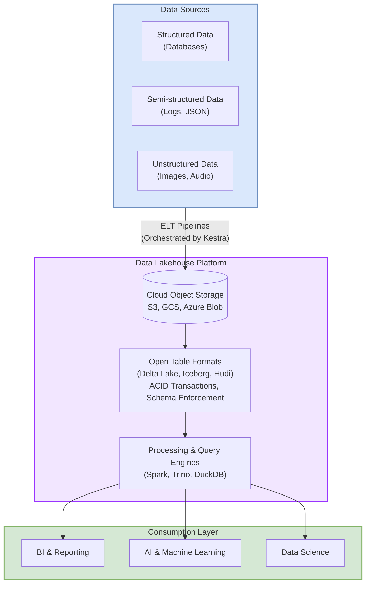

The explosion of data, coupled with the rising demands of AI and advanced analytics, has pushed traditional data architectures to their limits. Organizations often find themselves managing fragmented data estates, struggling to balance the flexibility of data lakes with the structured governance of data warehouses. This complexity leads to data silos, increased operational overhead, and slower time-to-insight. Enter the data lakehouse: an architectural paradigm designed to bridge this gap. This article will explore the core principles, benefits, and practical implementation of lakehouse architecture, demonstrating how a platform like Kestra can orchestrate its full potential for unified data and AI initiatives.

## Understanding Lakehouse Architecture: A Unified Approach

The lakehouse is not just an incremental improvement; it represents a fundamental shift in how organizations manage and analyze their data. By creating a single, unified system, it addresses the limitations of its predecessors.

### Defining the Data Lakehouse: Bridging Lakes and Warehouses

A data lakehouse architecture is a modern data management system that combines the low-cost, flexible storage of a data lake with the powerful data management and analytics capabilities of a data warehouse. Historically, data lakes excelled at storing vast amounts of raw, unstructured data, but lacked transactional support and data quality enforcement. Data warehouses, on the other hand, provided structured, high-performance analytics but were expensive and inflexible for modern data types like video, audio, and text.

The lakehouse resolves this by implementing a metadata and transaction layer directly on top of low-cost object storage. This is made possible by open table formats like Apache Iceberg and Delta Lake, which bring key warehouse features to the data lake:
- **ACID Transactions:** Ensures data integrity and reliability, allowing multiple users to read and write data concurrently.
- **Schema Enforcement and Evolution:** Prevents data corruption by enforcing a schema on write, while still allowing the schema to evolve over time.
- **Time Travel:** Enables data versioning, allowing users to query historical data, audit changes, and roll back errors.

### Key Components of a Lakehouse Architecture

A typical lakehouse architecture is built on several key components working in concert:

- **Storage Layer:** This is the foundation, usually cloud object storage like Amazon S3, Google Cloud Storage, or Azure Blob Storage. It provides a scalable and cost-effective home for all data, from raw to curated. Kestra's approach to [data storage](/docs/concepts/storage) is designed to integrate seamlessly with these environments.
- **Open Table Formats:** As mentioned, formats like Delta Lake, Apache Iceberg, and Apache Hudi sit on top of the storage layer to provide transactional capabilities.
- **Metadata Layer:** A centralized catalog (like AWS Glue Data Catalog or Hive Metastore) that stores information about the data, including schemas, table locations, and partitions.
- **Processing Engines:** A variety of engines can access the data directly. Apache Spark is the most common for large-scale data processing, while query engines like [DuckDB](/blogs/2024-03-14-duck-db) and Trino enable high-performance SQL analytics.
- **Governance and Access Control:** Tools for managing security, access control, data quality, and lineage are integrated across the platform.

### Visualizing the Lakehouse Architecture

To better understand how these components fit together, the following diagram illustrates a typical lakehouse architecture. It shows how diverse data sources are ingested into a unified storage layer enhanced with transactional capabilities. From there, various processing engines can access the same data to serve a wide range of analytics and AI use cases.



This unified structure directly addresses the limitations of maintaining separate data lakes and data warehouses.


## Lakehouse vs. Data Warehouse vs. Data Lake: Key Differentiators

Understanding the distinctions between these architectures is crucial for making informed decisions about your data strategy.

### Why Choose a Lakehouse Over a Traditional Data Warehouse?

The primary advantage of a lakehouse is its ability to serve a wider range of use cases on a single copy of data. While a data warehouse is optimized for business intelligence (BI) on structured data, a lakehouse supports BI, data science, and machine learning on structured, semi-structured, and unstructured data. This eliminates the need for separate, siloed systems, reducing data duplication and complexity.

Compared to a warehouse, a lakehouse offers:
- **Lower Cost:** Leverages inexpensive object storage.
- **Greater Flexibility:** Natively handles diverse data types required for AI/ML.
- **Openness:** Built on open formats, preventing vendor lock-in.

This approach aligns well with modern principles like [data mesh architecture](/resources/data/data-mesh-architecture), where decentralized ownership and a unified platform are key.

### Is Databricks a Data Lake or Lakehouse?

Databricks is a platform built on a lakehouse architecture. The company was a key pioneer of the lakehouse concept, developing Delta Lake as the open-source format to bring reliability and performance to data lakes. Therefore, Databricks is not just a data lake; it is a comprehensive platform that provides the tools and services to implement and manage a full-featured lakehouse. When comparing orchestration tools, it's important to differentiate between the underlying architecture and the job scheduler, such as [Kestra vs. Databricks Workflows](/vs/databricks-workflows).

### What Is Another Name for a Lakehouse?

While "lakehouse" has become the industry-standard term, you might encounter broader concepts like "unified data platform" or "modern data architecture." These terms describe the general goal of breaking down data silos. However, "lakehouse" specifically refers to the architectural pattern of implementing data warehouse capabilities directly on top of a data lake, making it a more precise and descriptive term.

## Benefits of Adopting Data Lakehouse Architecture

Adopting a lakehouse architecture delivers significant advantages for data-driven organizations.

### Cost Reduction and Scalability for Modern Data Needs

By decoupling compute and storage, a lakehouse allows organizations to scale each component independently. You can store petabytes of data in low-cost object storage and spin up compute clusters only when needed for processing or analytics. This elastic model is far more cost-effective than the tightly coupled architecture of traditional data warehouses.

### Enabling AI and Machine Learning Use Cases

Machine learning models thrive on large volumes of diverse, raw data. A lakehouse provides a single location for data scientists to access all data—from structured tables to images and text—without needing to move it between systems. This direct access accelerates feature engineering, model training, and iteration, fostering innovation in AI. As noted in recent [data engineering and AI trends](/blogs/2025-data-engineering-and-ai-trends), this unified approach is becoming standard practice.

### Simplified Data Governance and Management

Managing a separate data lake and data warehouse creates governance headaches. A lakehouse centralizes data, making it easier to implement consistent security policies, manage access controls, and track data lineage. Features like schema enforcement and ACID transactions ensure data quality and reliability across all workloads. Platforms can further enhance this with features like [Kestra's data assets](/blogs/2026-01-26-data-assets-use-cases), which provide a complete view of pipeline lineage.

## Implementing Data Lakehouse: Orchestrating ETL and ELT

A robust orchestration layer is critical to realizing the full potential of a lakehouse.

### Is Data Lakehouse ETL or ELT? Understanding Data Pipelines

Lakehouse architecture is ideally suited for the ELT (Extract, Load, Transform) paradigm. In this model, raw data is extracted from source systems and loaded directly into the lakehouse's storage layer with minimal changes. The transformation logic is then applied in-place using the lakehouse's powerful compute engines. This approach is more flexible than traditional ETL, as it preserves the raw data and allows for multiple transformations to be applied for different use cases.

### Orchestrating Lakehouse Pipelines with Kestra

Managing the flow of data into and within a lakehouse requires a powerful orchestration tool. Kestra provides a declarative, language-agnostic platform to manage complex [data pipelines](/docs/use-cases/data-pipelines) across the entire lakehouse ecosystem.

With Kestra, you can:
- **Define Pipelines as Code:** Use simple YAML to define multi-step workflows that are easy to version, review, and deploy.
- **Run Any Code, Anywhere:** Orchestrate tasks written in Python, SQL, or any other language, and integrate with tools like dbt, Spark, and Dremio. The [Dremio partnership](/blogs/2024-03-14-dremio-partnership) highlights this seamless integration for lakehouse environments.
- **Build Event-Driven Workflows:** Trigger pipelines automatically when new data arrives in your object storage, enabling real-time processing.
- **Handle Complex Dependencies:** Easily manage dependencies between ingestion, transformation, data quality checks, and ML model training tasks.

Here is a simple example of a Kestra flow for an ELT process in a lakehouse:
```yaml
id: lakehouse-elt-pipeline
namespace: production.analytics

tasks:
  - id: extract_and_load
    type: io.kestra.plugin.aws.s3.Upload
    description: "Extracts raw data and loads it to the S3 landing zone."
    from: "/path/to/source/data.csv"
    key: "raw/data/{{ now() | date('yyyy-MM-dd') }}/data.csv"
    bucket: "my-lakehouse-bucket"

  - id: transform_with_dbt
    type: io.kestra.plugin.dbt.cli.DbtCLI
    description: "Runs dbt models to transform raw data into curated tables."
    commands:
      - dbt run --models staging.*
      - dbt run --models marts.*

  - id: data_quality_check
    type: io.kestra.plugin.scripts.python.Script
    description: "Runs a Python script to validate the transformed data."
    script: |
      # Python code to check data quality
      print("Data quality checks passed.")

triggers:
  - id: daily_run
    type: io.kestra.plugin.core.trigger.Schedule
    cron: "0 5 * * *"
```
This [data engineering blueprint](/blueprints/data-engineering-pipeline) illustrates how Kestra can orchestrate a typical lakehouse workflow from end to end.

## Real-World Applications and Future Outlook

The lakehouse is not just a theoretical concept; it's being implemented by leading organizations to solve real-world data challenges.

### Industry Examples of Lakehouse Architecture in Action

- **Retail:** Companies in the [retail sector](/use-cases/retail) use lakehouses to analyze customer behavior, optimize supply chains, and personalize marketing campaigns by combining transactional data with unstructured data like social media feeds and customer reviews.
- **Finance:** Financial institutions leverage lakehouses for fraud detection, risk management, and algorithmic trading, where processing large volumes of real-time data is critical.
- **Public Sector:** Government agencies use lakehouse principles to manage large datasets for everything from urban planning to public health, often within sovereign infrastructure as seen in [public services use cases](/use-cases/public-services).

Organizations like Apple and Toyota use unified orchestration platforms to manage large-scale ML and data pipelines, while JPMorgan Chase applies these principles to power cybersecurity analytics, demonstrating the versatility of this approach at enterprise scale.

### The Evolving Landscape of Data Lakehouse Technologies

The lakehouse architecture continues to evolve. We are seeing continued innovation in open table formats, the emergence of new high-performance query engines, and deeper integration with AI and ML platforms. As highlighted in past [data engineering trends](/blogs/2024-01-24-2024-data-engineering-trends), the move towards open, hybrid architectures is accelerating. The future of data management lies in systems that are open, simple, and capable of handling any data workload—a vision that the lakehouse architecture is well on its way to realizing.

The lakehouse represents a significant step forward in data architecture, offering a unified and efficient solution for the demands of modern analytics and AI. By combining the best of data lakes and data warehouses, it provides a scalable, cost-effective, and flexible platform for all data workloads. To fully leverage its power, a robust orchestration layer is essential. Kestra provides the declarative control plane to manage the entire data lifecycle within a lakehouse, ensuring reliability, observability, and scalability for your most critical data initiatives.

To learn more about how Kestra can help you build and manage your [data](/data) pipelines, explore our other [data engineering resources](/resources/data).
