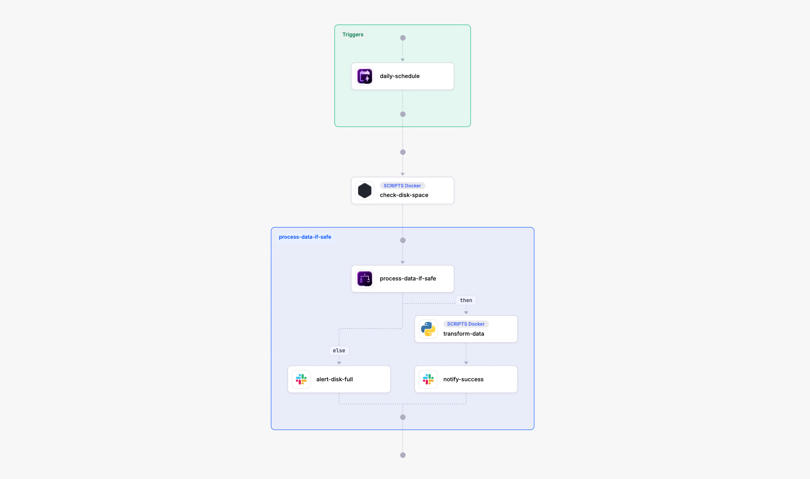

Individual automation scripts and domain-specific tools create new silos of their own. Data teams manage pipelines, platform engineers automate infrastructure, and business units run their own approval flows — each with its own orchestrator. This fragmentation leads to operational overhead, inconsistent governance, and a lack of end-to-end visibility. Workflow orchestration emerges as the critical layer to bridge these gaps, coordinating disparate systems and teams under a unified control plane. This guide explores the core concept of orchestration, its various forms, and why a converged approach is essential for modern enterprises.

## What is workflow orchestration?

Workflow orchestration is the software layer that decides what runs, in what sequence, and what happens when a step fails. It's the centralized brain for all automated processes, managing dependencies, scheduling, retries, and error handling across multiple systems and teams.

Key takeaways about orchestration:
*   **It's about coordination, not execution.** The orchestrator tells other tools *what* to do and *when*, but the tools themselves (like Terraform, dbt, or a Python script) perform the actual work.
*   **It's one concept, four domains, and an AI layer across them.** While the core idea is universal, it manifests differently across data, infrastructure, applications, and business processes, with agentic AI orchestration governing agents across all four.
*   **The modern challenge is cross-domain coordination.** The biggest costs and risks often lie at the boundaries between siloed orchestration tools.

Orchestration is distinct from both integration and execution. Integration tools are primarily concerned with moving data between systems, while execution tools perform the specific tasks. Orchestration is the higher-level control plane that governs the entire end-to-end process.

## Orchestration vs. automation: understanding the difference

While often used interchangeably, orchestration and automation represent different levels of control. [Automation](https://www.kestra.io/resources/infrastructure/automation) focuses on executing a single task or a linear sequence of tasks within one system, like a script that provisions a server or a tool that automates a software build.

Orchestration is the coordination of multiple automated tasks across different systems, teams, and environments. It manages the complex dependencies, conditional logic, error handling, and human approvals that connect these automated steps into a cohesive, end-to-end workflow.

A simple script might be sufficient to automate a daily backup. But when that backup needs to be coordinated with a database snapshot, followed by a data warehouse load, and then a notification to a business team—all with specific retry logic and failure alerts—you need an orchestrator.

## The four domains of orchestration, and the AI layer across them

Orchestration has evolved independently in four technical domains, each with its own specialized tools and practices. Understanding these domains is key to grasping the full scope of modern orchestration challenges.

### Data orchestration: managing pipelines and data flows

This is the most mature domain, focused on automating the movement and transformation of data. Data orchestration tools manage complex ETL (Extract, Transform, Load) and ELT pipelines, ensuring data is processed reliably and delivered on time for analytics and machine learning. The practice evolved from simple cron jobs to sophisticated, code-first platforms like Airflow, which became the standard for many data teams. Explore more in our [Data Engineering Resources](https://www.kestra.io/resources/data).

### Infrastructure and workload orchestration: automating IT operations

This domain deals with the provisioning, configuration, and management of IT infrastructure. It covers everything from legacy batch job scheduling on mainframes with tools like Control-M and AutoSys to modern Infrastructure as Code (IaC) with Terraform and Ansible. The goal is to create reproducible, auditable, and scalable environments. For example, Crédit Agricole's IT arm (CAGIP) used Kestra to replace fragmented scripts and unify infrastructure operations across more than 100 clusters. Dive deeper with our [Infrastructure Automation Resources](https://www.kestra.io/resources/infrastructure).

### Application and microservices orchestration: coordinating distributed services

As applications shifted from monoliths to distributed microservices, a new need for orchestration emerged. This domain focuses on managing the communication and workflow between different services. It handles long-running transactions, durable execution, and complex API choreography. Tools like Temporal and AWS Step Functions are prominent here, ensuring that distributed application logic executes reliably. Learn more about [API Orchestration](https://www.kestra.io/resources/infrastructure/api-orchestration).

### Business process orchestration: streamlining enterprise workflows

Business Process Management (BPM) tools orchestrate workflows that involve both human tasks and system integrations to model end-to-end business operations. This includes processes like customer onboarding, loan approvals, and insurance claims processing. These platforms often use visual designers and low-code interfaces, with tools like Camunda and Pega being common examples. Discover more about [Agentic Business Process Automation](https://www.kestra.io/resources/business/agentic-business-process-automation).

### Agentic AI orchestration: the layer across all four domains

Agentic AI orchestration is a transverse layer that governs the behavior of autonomous AI agents. It's not a separate silo but a control plane that provides memory, tool access, and human-in-the-loop oversight to AI systems. This ensures that AI-driven actions are auditable, reliable, and aligned with business rules, distinguishing between simply orchestrating agent tasks and enabling true [agentic orchestration](https://www.kestra.io/resources/ai/agentic-orchestration).

## Why orchestration is converging: from silos to a unified control plane

Each orchestration domain developed its own specialized tools, creating a fragmented landscape. A typical enterprise might use Airflow for data, Jenkins for CI/CD, Terraform for infrastructure, and a BPM tool for business approvals. This "fragmentation tax" creates significant operational costs and complexity at the boundaries between these systems.

When a data pipeline needs to trigger an infrastructure change, or an AI agent's action requires a formal business approval, the handoffs between these siloed orchestrators are often brittle, manual, and lack visibility. Industry analysts have recognized this problem, with terms like Gartner's SOAP (Service Orchestration and Automation Platforms) and BOAT (Business Orchestration and Automation Technologies) or Forrester's Adaptive Process Orchestration pointing towards a need for convergence.

The solution is a single, unified control plane that can manage workflows across all domains. A unified platform provides a consistent way to define, monitor, and govern processes, regardless of whether they involve data, infrastructure, AI, or business logic. This approach eliminates glue code, reduces operational overhead, and provides end-to-end visibility. That convergence has a name and a testable definition: [unified orchestration](/resources/orchestration/unified-orchestration).

## Choosing an orchestration platform: key requirements

When evaluating an orchestration platform, look for these seven key capabilities to ensure it can handle modern, cross-domain challenges:

1.  **Language and Domain Neutrality:** The platform should be able to run any type of code (Python, SQL, Shell, etc.) and orchestrate any tool, without being tied to a specific language or ecosystem.
2.  **Event-Driven and Scheduled:** It must support both time-based (cron) schedules and event-driven triggers (e.g., API calls, new files, message queues).
3.  **Declarative and Version-Controlled:** Workflows should be defined as code (e.g., YAML) and managed in Git, enabling collaboration, rollbacks, and CI/CD practices.
4.  **Robust Governance:** Essential features include Role-Based Access Control (RBAC), audit logs, secrets management, and support for human-in-the-loop (HITL) approvals.
5.  **Data Sovereignty:** The platform must be deployable anywhere—on-prem, in a private cloud, or in air-gapped environments—to meet security and compliance needs.
6.  **Extensibility:** A rich [plugin ecosystem](https://www.kestra.io/plugins) is crucial for integrating with a wide range of tools and services without writing custom code.
7.  **Governed Nondeterministic Steps:** For AI workflows, the orchestrator must be able to manage and audit the probabilistic nature of AI agents and LLMs.

The choice between open-source and commercial offerings is also important. A strong open-source core ensures flexibility and avoids vendor lock-in, while an [Enterprise edition](https://www.kestra.io/enterprise) should build on that same engine to provide the necessary governance and scale.

## Orchestration tools and platforms by category

The orchestration market is diverse, with tools tailored to specific domains. Here’s a brief overview:

| Category | Representative Tools | Strengths | Common Limitations |
| --- | --- | --- | --- |
| **Data Orchestration** | Airflow, Dagster, Prefect | Strong Python integration, large data-focused ecosystems. | Often Python-centric, less suited for non-data workflows. |
| **Infrastructure Automation** | Ansible, Terraform, Jenkins | Excellent for IaC, configuration management, and CI/CD. | Not designed for general-purpose workflow orchestration. |
| **Microservices Orchestration** | Temporal, AWS Step Functions | Durable execution for application logic, strong state management. | Code-intensive, steeper learning curve for non-developers. |
| **Business Process Automation** | Camunda, n8n, Workato | Visual workflow design, strong human-in-the-loop features. | Can be less flexible for complex, code-heavy engineering tasks. |
| **Unified Orchestration** | Kestra | Declarative YAML, polyglot, spans all domains with a single control plane. | Newer than domain-specific incumbents. |

For a deeper comparison, explore our guides on [Airflow alternatives](https://www.kestra.io/resources/data/airflow-alternatives), [n8n alternatives](https://www.kestra.io/resources/infrastructure/n8n-alternatives), and [Flyte alternatives](https://www.kestra.io/resources/ai/flyte-alternatives).



## Real-world orchestration examples with Kestra

A unified orchestrator allows you to build workflows that seamlessly cross domain boundaries. Here is an example of a single Kestra flow that combines infrastructure, data, and business tasks. It runs on a daily schedule, checks a system's disk space, processes a data file if space is sufficient, and notifies a Slack channel.

```yaml
id: cross-domain-healthcheck
namespace: kestra.seo

tasks:
  - id: check-disk-space
    type: io.kestra.plugin.scripts.shell.Commands
    taskRunner:
      type: io.kestra.plugin.scripts.runner.docker.Docker
    containerImage: debian:stable-slim
    commands:
      - |
        df -h / | awk 'NR==2 {print $5}' | sed 's/%//' > disk_usage.txt
    outputFiles:
      - disk_usage.txt

  - id: process-data-if-safe
    type: io.kestra.plugin.core.flow.If
    condition: "{{ read(outputs['check-disk-space'].outputFiles['disk_usage.txt']) | trim | number < 90 }}"
    then:
      - id: transform-data
        type: io.kestra.plugin.scripts.python.Script
        script: |
          # Your data processing logic here
          print("Disk space OK. Processing data.")
          # ...

      - id: notify-success
        type: io.kestra.plugin.slack.notifications.SlackIncomingWebhook
        url: "{{ secret('SLACK_WEBHOOK_URL') }}"
        payload: |
          {
            "text": "Daily data processing completed successfully for flow `{{ flow.id }}`."
          }
    else:
      - id: alert-disk-full
        type: io.kestra.plugin.slack.notifications.SlackIncomingWebhook
        url: "{{ secret('SLACK_WEBHOOK_URL') }}"
        payload: |
          {
            "text": ":alert: CRITICAL: Disk space is high! Daily data processing for flow `{{ flow.id }}` was skipped."
          }

triggers:
  - id: daily-schedule
    type: io.kestra.plugin.core.trigger.Schedule
    cron: "0 8 * * *"
```

This single YAML file defines a workflow that:
1.  **Infrastructure Task:** Runs a shell command in a Docker container to check disk usage.
2.  **Conditional Logic:** Uses an `If` task to decide the next step based on the output.
3.  **Data Task:** Executes a Python script for data transformation only if disk space is below 90%.
4.  **Business Notification:** Sends a status update to Slack, alerting the team to success or critical failure.

This demonstrates the power of a unified platform to manage diverse tasks within a single, auditable workflow. To build your first workflow, check out our [quickstart guide](https://www.kestra.io/docs/quickstart).

## Explore Kestra's orchestration resources

Orchestration is a vast topic. Start with the definition of the converged category, [unified orchestration](/resources/orchestration/unified-orchestration), then explore our dedicated [resource hubs](/resources) for each domain:
*   [Data Engineering Resources](https://www.kestra.io/resources/data)
*   [Infrastructure Automation Resources](https://www.kestra.io/resources/infrastructure)
*   [AI Orchestration Resources](https://www.kestra.io/resources/ai)
*   [Business Process Resources](https://www.kestra.io/resources/business)
