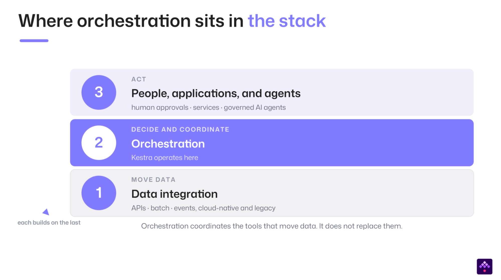

**Whitepaper · By Kai Waehner, Global Field CTO**

[Download the whitepaper as a PDF](/unified-orchestration-whitepaper.pdf) — the full argument and the seven-requirement checklist, in a format you can share with your team and your architecture board.

**Key takeaways**

- Orchestration fragmented into four tool categories that evolved independently. Agentic AI is not a fifth category: agents act across all four and must be governed across all four.
- Gartner (SOAP, BOAT) and Forrester (Adaptive Process Orchestration) each named part of the convergence. None yet covers the whole of it.
- Unified orchestration has seven concrete, testable requirements, written so any serious vendor would agree with them.
- *Orchestrating agents* (coordinating agents with each other) is not [*agentic orchestration*](/resources/ai/agentic-orchestration-vs-orchestrating-agents) (running agentic steps inside governed end-to-end workflows). An enterprise needs both.

**Definition.** Unified orchestration is the coordination of data, infrastructure, application, and business workflows, including governed agentic AI steps, on a single control plane.

→ Read the full definition and how the four domains fit together: [What is orchestration?](/resources/orchestration)

## Executive summary

Enterprise automation is fragmented across four domains: data, infrastructure, applications, and business processes. Each runs its own orchestration tool, tailored to its needs. Business applications add more of them: ERP and CRM suites ship their own automation, scoped to what happens inside the app, and attempts to extend it past that boundary usually fall short. The work breaks at the boundaries between them, where no single tool is in charge.

Often, a pipeline finishes, but the downstream job never starts. A deployment succeeds, but no one on the respective teams is informed. A process waits for an approval that sits in a manager's inbox, and nothing escalates. Agentic AI raises the stakes of these boundaries even further. When an agent operates through an ungoverned workflow, the greatest risk is not just a failure to execute a task but a series of incorrect actions that lead to security breaches, compliance violations, operational disruptions, or other costly business outcomes.

This is not one vendor's observation. Gartner created two categories for the shift and gave each a Magic Quadrant: Service Orchestration and Automation Platforms, and Business Orchestration and Automation Technologies. Forrester named a third, Adaptive Process Orchestration, for platforms that pair deterministic control flows with AI agents. They approach the problem from different markets, but all three point to the same demand: coordination across silos that once operated independently.

This paper asserts that orchestration has fragmented into four tool categories, each of which has evolved independently. Agentic AI is not a fifth category. Agents act across all four, and they need to be governed across all four. Unified orchestration demands a defined and measurable set of capabilities that few platforms provide in full. Kestra addresses this challenge from a differentiated foundation with a declarative, language-agnostic, open, event-driven engine designed to orchestrate the existing technology stack and govern how agents operate across it.

## Why is enterprise orchestration fragmented across four silos?

Orchestration is the software layer that decides what runs, in what sequence, and what happens when a step fails. For years, however, each part of an enterprise has developed these capabilities as independent silos.

Data engineering moved from cron to Airflow to a generation of Python-based orchestrators. IT operations built workload automation on mainframe schedulers and their successors, such as Control-M and Redwood. Software engineering wrote state machines and then durable execution engines. Business leaders bought BPM suites, then low-code automation and business process automation technology. They are now being sold adaptive process automation and agentic tools. Business teams also inherited the automation built into ERP and CRM suites, which is powerful inside each suite and cannot reach beyond it.

AI teams have increasingly adopted agent frameworks such as LangGraph and CrewAI. Across the enterprise, four categories have emerged around siloed workflows, each independently developing orchestration capabilities that now overlap: data, infrastructure, applications, and business processes. Agentic AI does not add a fifth one. Agents act across all four domains within a single process, and they are themselves a workload the control plane has to govern.

The result is a fragmentation tax that lands on the three major issues that IT decision-makers care about.

**Higher costs.** Every silo requires its own tooling, licenses, infrastructure, and specialized expertise in the legacy model. This leads directly to higher spend and coordination overhead.

**Low reliability.** Failures frequently occur at handoffs between systems, where ownership and observability are weakest. As a result, integration and migration issues can take longer to identify, diagnose, and resolve.

**Higher operational risk.** Business-critical logic often remains embedded in individual scripts, with limited documentation and no end-to-end audit trail. This concentration of knowledge makes failures harder to diagnose, changes more difficult to govern, and regulatory compliance more challenging to demonstrate.

The pattern is clearest at the edge, where physical operations meet the cloud. When data arrives, something has to trigger the maintenance workflow, roll back the failed deployment, replicate the dataset, or open the ticket. Architectures that move the data and improvise everything above it scatter automation logic across broker plugins, cron jobs, and cloud functions. This recreates the integration spaghetti the whole discipline set out to remove.

**Related:** [Unified Orchestration in Manufacturing: From Shop Floor to Cloud](https://www.kai-waehner.de/blog/2026/08/28/unified-orchestration-in-manufacturing-from-shop-floor-to-cloud/) (kai-waehner.de)

## Why are orchestration silos converging into a new market category?

Currently, industry analysts delineate orchestration in distinct market categories. Although the categories overlap, they are not yet recognized as a single "unified orchestration" market category.

Gartner defines Service Orchestration and Automation Platforms (SOAP) as software for managing and automating the technology stack across workloads, workflows, resource provisioning, and data pipelines, in on-premises and cloud-native environments. It is the category that grew out of workload automation and job scheduling.

In recent years, Gartner retired its Magic Quadrant for Intelligent Business Process Management Suites and replaced it with a market guide for Business Process Automation. These tools are now positioned as a composition layer on top of existing services and APIs rather than as standalone process engines.

Forrester named Adaptive Process Orchestration for platforms that use AI agents and nondeterministic control flows alongside traditional deterministic ones. RPA, iPaaS, and BPM now compete on that same ground, and the open engineering problem is pairing adaptive intelligence with proven controls.

Gartner also named a category for the business side: Business Orchestration and Automation Technologies (BOAT). This covers business process orchestration, enterprise connectivity, low-code development, and agentic automation. The category overlaps with Kestra's capabilities and comes closest to our definition of unified orchestration. The difference lies in who builds the automation and how they build it. BOAT targets business operations and cross-functional IT teams. It is delivered as low-code and centers on the business process domain. Unified orchestration is engineering-owned and code-first. It covers business processes too, but it also spans the IT workload domains that BOAT does not set out to cover: data pipelines, infrastructure, and applications. Agentic AI is governed across all four. Kestra does not compete directly in the BOAT market, but the category is one more signal that business and IT automation are converging.

Collectively, these categories validate the emergence of unified orchestration as a distinct market, but they do not establish the leadership of any individual vendor. Kestra does not appear in the SOAP Magic Quadrant, which is populated by workload automation incumbents such as BMC, Redwood, and Stonebranch. This absence reflects Kestra's distinct starting point: a declarative, event-driven engine designed to orchestrate the existing technology stack, rather than a batch scheduler subsequently adapted to serve that role.

**Related:** [SOAP, BOAT and Adaptive Process Orchestration explained](/resources/orchestration/gartner-soap-boat-forrester-apo)

## Where does unified orchestration sit in the enterprise architecture stack?

Unified orchestration is the coordination of data, infrastructure, application, and business workflows, including governed agentic AI steps, on a single control plane. It is easy to confuse it with the layers above and below it. Separating them decides what a platform replaces and what it coordinates.

Three layers help to separate them. The bottom layer moves data. This is integration and streaming, spanning three paradigms: request-response, batch, and event-driven, with event-driven increasingly at the center and the other two serving as interfaces on top of it. The middle layer decides and coordinates. This is process intelligence: workflow orchestration to run the work, and process mining to see how the work actually runs. The top layer acts. This is trusted agentic AI, governed and overseen by humans. Each layer depends on the one beneath. This is the Trinity of modern data architecture: event-driven integration, process intelligence, and trusted agentic AI.

Orchestration and process intelligence belong together, and together they are the layer that decides what the business does. The orchestration layer runs the work and records how it actually ran. Process intelligence turns that record into insight, which improves the next run. One executes, the other explains.

Kestra sits in that middle layer, and the boundary is clean. It responds to events, but it is not an event-streaming platform. It coordinates the tools you already run, triggering and sequencing them with dependencies, retries, and approvals, while the tools underneath still move and transform the data. It connects to all three paradigms as a consumer and fits the common stacks enterprises already have, rather than replacing them. The same decoupling makes it a stable layer during major replatforming efforts: the underlying systems can be swapped while the workflows on top keep running.

For the map of that layer below and for where each integration vendor sits across the three paradigms, see the [Data Integration Landscape 2026](https://www.kai-waehner.de/blog/2026/07/07/data-integration-landscape-2026-event-streaming-api-and-batch-in-the-era-of-agentic-ai/), which deliberately places workflow orchestration outside its scope.

Deciding what happens next is orchestration. Moving the data is a different job. Keeping them separate is what allows a single platform to coordinate a heterogeneous stack without pretending to be the whole stack.

## Why is orchestrating agents not agentic orchestration?

Two different ideas share the term "agentic," and conflating them is the source of most confusion in the market. **Orchestrating agents** means coordinating agents with one another, which is what agent frameworks do at the application layer. **Agentic orchestration** means running agentic steps inside governed end-to-end workflows, on the same control plane as every other step. The first is a feature of an agent framework. The second is a property of an orchestration platform.

Agent frameworks such as LangGraph and CrewAI build agent logic at the application layer, and they excel at it. Most of these frameworks now pair with a commercial platform that adds real governance, but only around their own agent runtime: role-based access control, audit trails, human-in-the-loop approval, and private deployment. This governance stops at the agent runtime. It does not extend across the data, infrastructure, application, and business-process steps surrounding the agent, which is what a control plane governs. So the frameworks complement a control plane rather than compete with it. The credible claim is not that Kestra replaces LangGraph or CrewAI. Kestra orchestrates and governs the end-to-end workflows that agents take part in.

[Kestra embeds agentic steps inside governed flows](/docs/ai-tools). Natural-language authoring generates declarative definitions that a person reviews and version-controls. Agents combine memory and tools, connect via the [Model Context Protocol (MCP)](/docs/ai-tools/mcp-server), and loop until a goal is met, with every action logged, auditable, and subject to human approval before it reaches production.

This is why agentic AI is the cross-cutting top layer in this paper, rather than a fifth silo alongside the other four. Agents act across data, infrastructure, applications, and business processes. They need a layer that spans all four and governs them. That layer is unified orchestration.

**Go deeper:** [Agentic Orchestration vs Orchestrating Agents: What's the Difference?](/resources/ai/agentic-orchestration-vs-orchestrating-agents)

## What does unified orchestration actually require?

A platform earns the word unified only if it meets a specific set of requirements. The list below is written so that any serious vendor would agree with it. It is the neutral test. For the concept itself and the four domains it spans, start with [what orchestration is](/resources/orchestration).

1. **Language and domain neutrality.** Runs any language and coordinates any workload, not one language or one domain.
2. **Event-driven and scheduled triggering.** One engine for cron, events, webhooks, and messages.
3. **Declarative and version-controlled definitions.** Workflows are defined as code, versioned and reviewed in Git, then tested and deployed through a CI/CD pipeline.
4. **Deep governance.** Role-based access control (RBAC), audit logs, multi-tenancy, and human-in-the-loop approvals as first-class features.
5. **Sovereignty and deployment flexibility.** Self-hosted, cloud, and air-gapped deployment, with control over where workflows execute and where operational data stays. Regulated and public-sector buyers treat this as a gate rather than a preference.
6. **Extensibility over the existing stack.** Orchestrates current tools through a broad plugin ecosystem, rather than requiring their replacement.
7. **Governed nondeterministic steps.** Runs agentic, nondeterministic actions under deterministic control and oversight.

These requirements sort onto two axes. One is workload heterogeneity, from narrow to broad. The other is governance and control depth, from script level to the enterprise control plane.

**Get the whitepaper as a PDF.** The full argument, figures, and the seven-requirement checklist in a format you can share with your team and your architecture board. [Download the PDF](/unified-orchestration-whitepaper.pdf)

## What changes with one platform across four domains?

Each category produced strong tools for its own domain. The question is what changes when one control plane spans all four and agents are governed across them.

For each domain: what fragmentation looks like today, what one control plane changes, and which tools it coordinates rather than replaces.

**Data.** Today, a data-only orchestrator schedules ingestion and transformation, while alerting, infrastructure, and downstream business steps live elsewhere. One control plane runs the pipeline and the steps on either side of it within a single governed flow, triggering Fivetran, Airbyte, dbt, and Spark rather than reimplementing them.

**Infrastructure.** Today, provisioning runs via Terraform and Ansible, delivery via CI/CD, and legacy batch via a workload scheduler, each observed separately. One control plane sequences provisioning, deployment, and operational workflows with approvals and auditing, and provides a migration path from aging schedulers such as Control-M, AutoSys, and cron.

**Applications.** Today, service coordination is spread across durable execution engines, iPaaS flows, direct API calls, and team-specific glue code. One control plane coordinates microservices, API workflows, and event-driven choreography with consistent dependencies, retries, failure handling, and human approvals. It connects them to the data and infrastructure steps around them without replacing the services themselves.

**Business processes.** Today, process logic sits in a BPM suite that engineering cannot easily reach, or in scripts that the business cannot see. One control plane runs business workflows with human approvals as a native step, versioned and auditable, connected to the same data and infrastructure flows that the rest of the enterprise runs.

**Agentic AI, across all four.** Agentic AI represents a cross-cutting orchestration layer rather than a distinct workload silo. Within a single process, agents may analyze data, invoke infrastructure tools, initiate scheduled workloads, and engage human decision-makers. A unified control plane governs these actions through defined permissions, deterministic execution, approval gates, auditability, and consistent failure handling. By coordinating rather than replacing agent frameworks and models, it provides the operational controls required to scale agentic systems from experimentation to production.

Security operations show why the layer must span all four. [JPMorgan Chase](/customers/jpmorgan-chase) runs its cyber threat intelligence workflows on Kestra for more than a hundred security analysts. Threat feeds are ingested and enriched as data pipelines. Detections from the SIEM trigger workflows that query infrastructure, open tickets, and route decisions to analysts for approval. Response actions hand off to the SOAR playbooks and security tools already in place. Kestra coordinates the process end to end, with one audit trail across data, infrastructure, applications, and human approvals, and does not replace the SIEM or SOAR. Security is a use case that runs across the four domains, not a domain of its own.

Across all four domains, incumbent platforms remain strong within their core areas. The primary cost of fragmentation lies not within the individual tools, but at the boundaries between them.

## What is the business value of unified orchestration?

Revenue, cost, and risk are the three levers executives weigh, and they are the mirror image of the fragmentation tax. Each ties to a mechanism, not a projected figure. One control plane changes the foundation rather than adding another tool, which is what makes strategic modernization possible. The gains compound into operational excellence: time, overhead, output, quality, and security posture.

**Increase profitability and reduce operating costs.** Unified orchestration automating processes such as customer onboarding and order-to-cash shortens cycle times. At the same time, faster delivery enables organizations to bring AI-enabled offerings and real-time data products to market sooner. [Fila](/customers/fila), for example, runs Kestra as the orchestration layer for 2,000 workflows and 2.5 million monthly executions across ERP, PLM, and supply chain operations in more than 70 countries.

Unified orchestration can also lower operating costs by modernizing legacy scheduling, consolidating tools, and expanding self-service. Migrating workloads from Control-M, AutoSys, and cron to a modern, cloud-native engine can reduce the risk and complexity of ERP, core banking, and trading-platform transformations by allowing underlying systems to change without disrupting critical workflows. [Quadis](/customers/quadis), Spain's largest automotive retailer, migrated daily financial reporting and customer communications from Pentaho, reducing processing costs by 50 percent with no downtime.

**Improved reliability and lower Mean Time to Resolution (MTTR).** Unified orchestration provides end-to-end visibility across workflows spanning data, infrastructure, IT systems, and business processes. Centralized monitoring exposes dependencies and failures across system boundaries, while consistent alerting and recovery mechanisms help teams identify root causes and restore systems faster. Clear ownership of the end-to-end workflow also reduces time spent coordinating across teams when incidents do occur.

**Mitigate risk.** Governance and compliance produce audit trails and regulatory reporting from the orchestration layer itself. Reliability and business continuity come from SLA monitoring and failure recovery. Sovereignty is a control, not a deployment preference: self-hosted and air-gapped options keep workflows and operational data inside the jurisdiction and network the business is accountable for. Trusted agentic AI keeps human oversight in the loop. [Dataport](/customers/dataport), the IT provider for German public administration, had no SaaS option available. Its private cloud service portal runs on a self-hosted control plane with no external dependency, and the team validated compliance in three weeks.

The commercial model is part of the value. Fragmentation is one tax on orchestration. Per-execution pricing at enterprise scale adds a second, the adoption tax. It rises with every workflow and every agent step. It penalizes exactly the high-volume, agentic workloads unified orchestration exists to run, and it pushes teams into rationing executions to manage a bill. Rationing is the opposite of consolidating into a single control plane.

Self-managed Kestra Enterprise is not priced per execution. It is licensed by instance, so adding workflows and agent steps does not turn into a runaway bill. A platform built for enterprise and agentic scale needs a commercial model that scales in the same way.

## What is the path from four silos to one platform?

Unification is a journey, not a switch. It runs through five stages: fragmentation across four tool silos, a first project chosen for reliability, expansion as reuse takes hold and the foundation is established, a platform stage in which a center of excellence consolidates, and unified orchestration as the strategic end state. Agents are governed across all four domains at every stage.

Two dimensions advance in parallel. Category breadth grows from one category to all four. Governance moves from many operating models to one. Business value rises as both advance.

Agentic AI adoption is not a separate track. Agent workflows can enter at any stage, and the same control plane governs them as the platform matures. Agents run across the entire journey for this reason, rather than waiting at the end.

This is also the expansion path inside an account. A team that starts in one domain has a clear map to all four, and to governed agents on top. No stage requires ripping anything out. Kestra sits above the tools already in place, the ones that would take months or years to replace, and consolidation happens at the customer's pace.

### One platform, one control plane

Enterprise automation grew up in silos, and demand for coordination across them continues to rise. Gartner and Forrester named categories for it, arriving from workload automation, from business process, and from agentic AI.

The requirements for real unification are concrete and testable, and they sit on top of [one concept spanning four domains](/resources/orchestration). Kestra meets them with a declarative, language-agnostic, open, [event-driven engine](/blogs/2026-09-01-kestra20-rebuild-engine) that coordinates the existing stack and governs agents on top of it. The path from four silos to one platform starts with a single workflow.

## How does Kestra differentiate from incumbent solutions?

Kestra's workflows are declarative and language-agnostic: [defined in YAML](/docs), with any language running inside a task. One engine handles both event-driven and scheduled triggering. Definitions are version-controlled, tested, and deployed like any other code. Governance is first-class, with role-based access control, multi-tenancy, audit, and human-in-the-loop approvals. Deployment is flexible: self-hosted, in the cloud, or air-gapped.

Kestra orchestrates the existing stack through [more than 2,000 plugins](/plugins). Most are open source, and unlike a proprietary connector catalog, they do not lock you in. Because any script or API call runs natively as a task, teams are never blocked waiting for an official plugin. This extends the stack rather than replacing it. Agentic steps run the same way, under deterministic control, logged, audited, and governed.

The core is [open source under the Apache 2.0 license](https://github.com/kestra-io/kestra). It is the same engine teams run in production, free to export and run independently, with no lock-in. Two commercial editions extend that core without changing the engine.

[Kestra Enterprise](/enterprise) adds the governance, security, and scale that unified orchestration needs across the enterprise: fine-grained RBAC, multi-tenancy, audit logs, SSO and SCIM, a bring-your-own secret manager, and an enterprise SLA. [Worker Groups](/docs/enterprise/scalability/worker-group) govern where execution occurs: sensitive workloads stay isolated in secure environments, critical tasks are assigned dedicated workers to meet their SLAs, and heavy AI and ML jobs are routed to the compute resources built for them. Assets give full lineage and traceability across flows. Apps let teams across the enterprise run governed workflows on their own. All of it runs self-managed on the customer's own infrastructure: in a data center, in a cloud VPC, or air-gapped, and a growing set of plugins is available only in Kestra Enterprise. [Kestra Cloud](/pricing), the fully managed SaaS edition, is planned for general availability in Q4 2026, with consumption-based pricing for teams that want to start small and scale elastically.

The adoption motion follows from the same foundation. Developers adopt the open source edition because it works in production. Teams standardize on it as projects multiply. Coordinating them across domains soon matters more than any single workflow. The moment work turns mission-critical, even a single flow, it needs the governance, scale, and support of a commercial edition. Scaling across the organization is the second path: a platform team or center of excellence consolidates silos across domains and governs the result under a single model.

**Download the whitepaper** — the full paper as a PDF, with all figures. [Download the PDF](/unified-orchestration-whitepaper.pdf)

**Start with one workflow** — [get started](/docs/quickstart) with the [open source edition](https://github.com/kestra-io/kestra), or [talk to the Kestra team](/demo) about Kestra Enterprise.

## About the author

Kai Waehner is Global Field CTO at Kestra. He has spent more than twenty years in enterprise architecture, data integration, process intelligence, and AI, working with Fortune 500 and Global 2000 organizations across Europe, North America, the Middle East, Asia, and Australia. He moves between strategy conversations with CIOs and CTOs and deep architecture reviews with engineering teams across industries, including financial services, manufacturing, telecom, retail, and the public sector. He is an international speaker, blogger, and book author on these topics.

[kai-waehner.de](https://www.kai-waehner.de) · [LinkedIn](https://www.linkedin.com/in/kaiwaehner)
