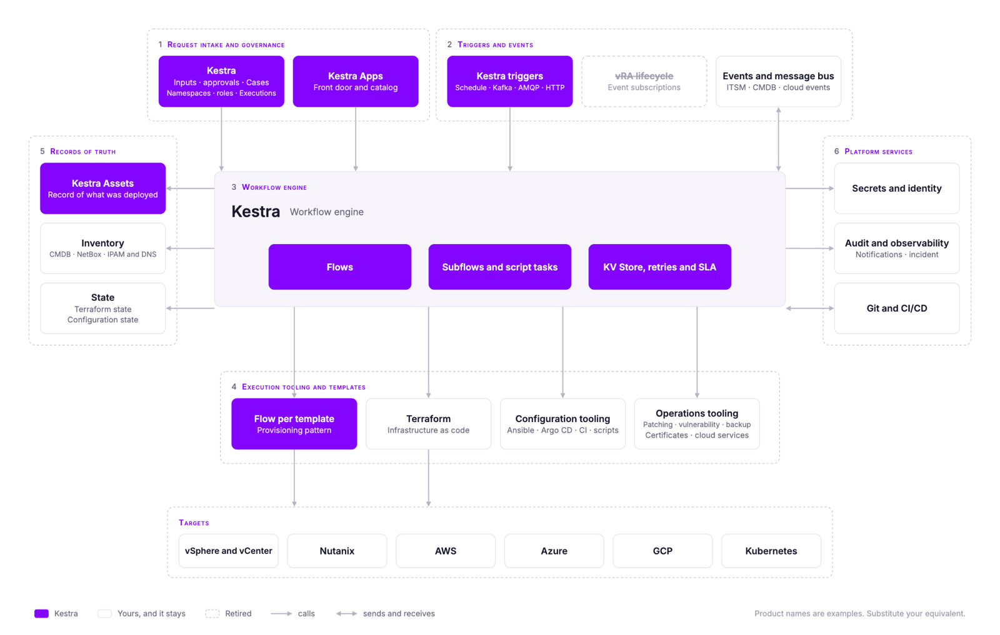

import Callout from "~/components/vra-migration-guide/blocks/Callout.astro"
import Card from "~/components/vra-migration-guide/blocks/Card.astro"
import Cards from "~/components/vra-migration-guide/blocks/Cards.astro"
import CaseStudy from "~/components/vra-migration-guide/blocks/CaseStudy.astro"
import ExplorerPart from "~/components/vra-migration-guide/blocks/ExplorerPart.astro"
import Figure from "~/components/vra-migration-guide/blocks/Figure.astro"
import GuideCta from "~/components/vra-migration-guide/blocks/GuideCta.astro"
import GuideTabPanel from "~/components/vra-migration-guide/blocks/GuideTabPanel.astro"
import GuideTabs from "~/components/vra-migration-guide/blocks/GuideTabs.astro"
import InteractiveFrame from "~/components/vra-migration-guide/blocks/InteractiveFrame.astro"
import PartExplorer from "~/components/vra-migration-guide/blocks/PartExplorer.astro"
import Verdict from "~/components/vra-migration-guide/blocks/Verdict.astro"
import CalculatorFunnel from "~/components/vra-migration-guide/calculator/CalculatorFunnel.vue"
import CalculatorPayback from "~/components/vra-migration-guide/calculator/CalculatorPayback.vue"

## 1. Why teams leave vRA, and what to move to

### 1.1 Whatever brought you here

Teams leave vRA for several reasons, and most have more than one in play. The two that come up most often are both about who controls your automation.

<Cards columns={2}>
<Card title="Pricing and Packaging">

vRA is no longer sold as a product on its own. It is part of VMware Cloud Foundation, licensed per core on subscription, so the automation layer is now priced as part of the hypervisor. [Gartner expects](https://www.theregister.com/2024/08/26/vmware_explore_preview/) most VMware customers' bills to grow by 200 to 500 percent at their next renewal.

As an engineer at one Fortune 500 manufacturer put it before they replaced it:

> _We're using Aria Automation, that's a massive cost, the cost doesn't justify it anymore._

</Card>
<Card title="Dependence on VMware's Roadmap">

What your automation can reach is decided by VMware. Several vRO plugins were deprecated in VCF 9, and recently native AWS, Azure and GCP management were also deprecated and switched it off by default. The Git integration needs a vRA licence. Only a handful of built-in plugins reach outside VMware, so every other integration is a library you write and then maintain yourself.

</Card>
</Cards>

<Callout variant="lesson" label="Both point to the same lesson" statement="Your infrastructure vendor should not own your automation." highlight="not own">

VMware can stay as your hypervisor. The automation on top of it should keep working when the hypervisor, the cloud or the contract changes.

</Callout>

<Callout variant="aside" label="Two other reasons usually show up alongside them">

- **Sprawl.** A single vRA with an embedded vRO is managed as one suite. Many teams outgrow that, with separate instances per tenant, since tenants sharing one Orchestrator can see and change each other's workflows, and separate instances per environment. Each one is its own console, run history and upgrade cycle.
- **People and accessibility.** vRO JavaScript is a dialect, and the number of people who can confidently read and change it shrinks every year. In most teams it is a handful. When those skills are not in the team, the work goes to consultants, which turns your automation into a recurring professional services line.

</Callout>

### 1.2 Choosing what to move to

The decision, then, is what replaces the automation layer. Because vRA only ever reached VMware well, other teams found their own solutions along the way: the Kubernetes platform has its own operator, the data team runs its own scheduler, and a Jenkins pipeline is quietly doing the provisioning that vRA only triggers. Whatever you choose next has to account for all of that.

Here are three questions you should ask for every option on your shortlist, including Kestra:

1. **Does it cover your whole infrastructure estate, or a different slice of it?** Several of the obvious candidates are domain-locked in the same way vRA was. Ansible Automation Platform is strong at configuration. Spacelift and Terraform Cloud are strong at infrastructure as code. Rundeck is strong at operational runbooks. Temporal is strong at durable execution inside application code. If you pick one of them, you have replaced one boundary with another one, and the bolt-on tools stay where they are.

2. **How hard would it be to leave?** Ask where the workflow definitions live, whether you can read them without the product, whether the scripting language is one your team already knows, and whether you can run the thing yourself if the commercial relationship ends. vRO scored badly on all four, and that is a large part of why this migration is as much work as it is.

3. **Is your team the only one who needs this?** Step out of the infrastructure project for a moment. The data team has a scheduler. The application team has a CI pipeline doing more than CI. Somebody upstairs is asking the platform team for self-service. Those lines are blurring in most enterprises, and it is worth knowing now whether you are choosing a tool for the infrastructure team or a platform the others could also use. The answer may be that you only want to solve your own problem, and that is a legitimate answer. It is a worse outcome to discover in two years that you needed the broader one.

### 1.3 Why Kestra

Kestra's answers to those questions are below:

**It reaches the systems outside VMware's boundary.** vSphere and Nutanix, your cloud accounts, Kubernetes, your ITSM and CMDB, IPAM and DNS, Terraform and Ansible, your patch, backup and alert management tooling, and more than two thousand plugins besides. On-prem, across segmented network zones, and fully air-gapped with no outbound connectivity. [**Dataport**](/customers/dataport), the IT provider for German public administration, runs its private cloud service portal this way because no SaaS option was available to it. Nothing in that list is a second-class integration reached through generic REST.

**The workflow definitions stay portable.** Flows are declarative YAML that can live in your own Git repository and go through normal pull-request review. Task code can use Python, Shell, PowerShell or another language that runs in a container. The core is open source, so the definitions do not depend on a proprietary editor or scripting dialect.

**Other teams can use the same platform.** The engine that runs infrastructure provisioning can also run data pipelines, application workflows and business processes, with the same RBAC, secrets and audit trail. A data team can use its own namespace instead of buying and operating a second scheduler. The infrastructure arm of [**Crédit Agricole**](/customers/credit-agricole) runs automation across more than a hundred clusters this way, and describes the change as moving from fragmented automation to a single control plane that all their teams can manage.

Additionally:

- **The economics are different.** vRA is sold inside VCF and priced per core, so the bill tracks the size of your estate whether or not you automate more of it. Kestra Enterprise is licensed by instance, so adding workflows does not change what you pay. The [Fortune 500 manufacturer](#section-2-5) that replaced vRA reported **licensing costs 90% lower** than Aria Automation.
- **It orchestrates on top of what you already run.** Terraform, Ansible, your ITSM, your CMDB, your IPAM and your secrets manager all stay and get called. Kestra does not ask you to re-express your infrastructure in its own object model the way blueprints did.
- **2000+ plugins, and writing your own is documented.** They cover the storage, network and compute systems vRO estates usually integrate with by hand, such as Infoblox, NetBox and SolarWinds, so the integration code your team wrote and maintained for vRO is replaced by a plugin someone else maintains. Extending it further is a normal engineering task rather than a professional services engagement.
- **You can prove it before you buy it.** [Section 8](#section-8) covers how to do that, from open source on your own laptop to a proof of concept run with us.

### 1.4 What your security and platform teams will ask

The questions that stop a migration usually come from the security review and the platform team rather than from the workflow inventory: where it runs, whether it can be air-gapped, how identity and secrets work, what the audit trail looks like, and how it behaves across segmented network zones. All of them are answerable, and none of them need to wait until the end. [**Dataport**](/customers/dataport), which provides IT services to German public administration and had no SaaS option open to it, validated compliance on a self-hosted deployment in three weeks.

[Appendix B](#appendix-b) covers deployment options and [Appendix C](#appendix-c) lists the security and platform questions with where each answer lives.

## 2. The migration in four stages

We have worked with enterprises leaving vRA, and the four stages below are the sequence that held up across them. You can run it with your own team, with us, or with a services partner.

<InteractiveFrame title="The four stages" subtitle="Select a stage to see what you do and what you end up with">
<GuideTabs id="vra-stages" label="The four stages" variant="stages" tabs={[{ kicker: "STAGE 1", label: "Assess" }, { kicker: "STAGE 2", label: "Proof of Concept" }, { kicker: "STAGE 3", label: "Migrate" }, { kicker: "STAGE 4", label: "Exit" }]}>
<GuideTabPanel group="vra-stages" index={1}>

**Stage 1 - Assess**

- **What you do:** Decide what happens to each part of your environment, then inventory, rationalize and classify the workflows that move.
- **What you end up with:** A filled decision table, a target architecture, a short list of distinct workflows grouped by pattern, and the candidates for Stage 2.

[Go to Section 3](#section-3)

</GuideTabPanel>
<GuideTabPanel group="vra-stages" index={2}>

**Stage 2 - Proof of Concept**

- **What you do:** Build two or three real workflows with us, on Kestra Enterprise, measured against vRA on the same criteria.
- **What you end up with:** Working flows, a measured conversion rate, before-and-after numbers, and a sizing and quotation.

[Go to Section 4](#section-4)

</GuideTabPanel>
<GuideTabPanel group="vra-stages" index={3}>

**Stage 3 - Migrate**

- **What you do:** Convert one pattern group at a time, with acceptance criteria agreed before each wave starts.
- **What you end up with:** Production flows, wave by wave, with vRA still running.

[Go to Section 5](#section-5)

</GuideTabPanel>
<GuideTabPanel group="vra-stages" index={4}>

**Stage 4 - Exit**

- **What you do:** Retire the vRA side of each wave once it is verified, then decommission and close out the licence.
- **What you end up with:** An empty vRA and a contract you can end.

[Go to Section 6](#section-6)

</GuideTabPanel>
</GuideTabs>
</InteractiveFrame>

You can run Stage 1 on your own, or [talk to us before you start](/demo) and we will guide you through it. Sections 3 to 6 are one stage each.

### 2.1 Coexistence runs across Stages 3 and 4

vRA keeps running until each migration wave is verified and switched over. Plan for three consequences while both systems are live:

- **Nothing gets frozen.** The automation keeping the lights on continues to run, and continues to be changed, while the migration happens alongside it.
- **The overlap costs infrastructure and people, not licence.** The vRA licence you have already paid covers the overlap. What doubles up is the infrastructure and the team running both platforms at once.
- **Every wave is reversible until you retire it.** If a converted flow does not behave, the vRA version is still there. Nothing is cut over unverified.

This lets the migration run alongside normal operations without a change freeze across the full estate.

### 2.2 It does not have to be all manual

You do not need to inventory the estate or convert every workflow by hand. [Section 3.2.1](#section-3-2-1) covers tools for extracting vRA and vRO content. [Section 5.2](#section-5-2) covers the AI-assisted vRO migration tool and what still needs an engineer after it runs.

### 2.3 The three appendices

Use the appendices as reference. [Appendix A](#appendix-a) is a translation table, mapping every vRA and vRO object to Kestra. [Appendix B](#appendix-b) covers deployment options. [Appendix C](#appendix-c) answers the security and platform questions that usually come up during review.

### 2.4 What the migration costs, and what pays it back

A migration costs money up front, and the first estimate is usually alarming because it assumes every workflow moves on its own. In practice some workflows are already dead, many of the rest are near-duplicates of one another, and wrappers carry no conversion cost at all. What pays for the remaining work is the vRA and vRO renewal you do not sign. [Section 7](#section-7) shows how to work out both sides with your own numbers, and when the move pays for itself.

### 2.5 Four enterprise VMware estates, from assessment to completed migration

These four environments informed the approach in this guide. They differ in scale, security requirements and migration progress. They also show how teams have handled the catalog, resource inventory and systems that stay around the orchestration layer.

<CaseStudy status="MIGRATION COMPLETE" stats={[{ value: "30×", label: "faster delivery" }, { value: "90%", label: "lower licensing cost than Aria Automation" }, { value: "6", label: "isolated automation platforms" }]} quote="We eliminated the high cost and risk of VMware vRA. What used to take 6 months now takes 6 days with Kestra." quoteBy="Principal Hosting" storyHref="/customers/fortune-500-company">

[**A global industrial company**](/customers/fortune-500-company) had one team responsible for both IT and OT. They replaced vRA and vRO together, including the catalog, request forms, orchestration and vCenter integration, across about 75 vCenters and roughly 4,000 automation runs a month. Their security policy prohibited a control plane from spanning security zones, so they deployed six separate Kestra control planes, one per zone.

The catalog moved to Kestra Apps. Resource state stayed in the document store they already operated, and Ansible, ServiceNow, Infoblox and Splunk all stayed. The migration was completed in April 2026, roughly twelve months after the proof of concept began.

</CaseStudy>

<CaseStudy status="GO-LIVE TARGETED JANUARY 2027">

**An EU federal agency** runs roughly 1,600 vRO workflows and 2,000 actions across more than 20 internal services, supporting over 50,000 cloud resources. The environment is fully air-gapped and on-premises, with no outbound connectivity. The team screened around 70 orchestrators and ran Kestra Open Source for six to eight weeks before contacting us.

They chose to reimplement their workflows rather than convert them, selected Kestra Apps for the catalog, and Kestra Assets for the resource inventory, keyed on their own resource naming scheme. A team of 11 is working toward an initial go-live in January 2027, with full service migration targeted for October 2027.

</CaseStudy>

<CaseStudy status="RUNNING IN PARALLEL">

**A Fortune 100 technology manufacturer** is moving from VMware to a different cloud management platform, with both running in parallel. They needed an orchestrator independent of either platform and able to operate across five network risk zones. The most restricted zone permits only HTTPS through a proxy.

Kestra 2.0's separation of the control plane from the data plane, with workers connecting outbound over gRPC and mTLS, made the deployment possible. The orchestration layer can remain in place while the underlying infrastructure changes.

</CaseStudy>

<CaseStudy status="ASSESSED, NOT MIGRATED">

**A global systems integrator** runs roughly 3,000 workflows across three production vRO nodes, supporting more than 100 services in its ServiceNow catalog. It has not migrated. Its environment illustrates the assessment work involved when several thousand workflows are distributed across multiple instances and tied to an established service catalog. Scale itself is not the obstacle: [**Fila**](/customers/fila) runs 2,000 workflows and 2.5 million executions a month on Kestra across ERP, PLM and supply chain operations in more than 70 countries.

</CaseStudy>

## 3. Stage 1 - Assess: Your Estate and Workflows

Stage 1 happens before Kestra is installed, and it has two steps. First, decide what happens to each part of the estate so you do not revisit the same architectural decisions for every workflow. Then inventory the workflows, remove what no longer needs to exist, and classify what remains into repeatable patterns.

At the end of Stage 1 you will know which workflows to start with in Stage 2 (Proof of Concept), which Kestra features and plugins those workflows need, and how to split the rest of your estate into migration waves.

You can do all of this on your own, and everything below is written so that you can. Many teams talk to us first instead, before they have run an export or made any decisions, and we guide them through it as they go.

<GuideCta kind="talk" />

### 3.1 The Estate: Decide Once

#### 3.1.1 The parts of your estate, and what to do with each

vRA and vRO are two different things, and this guide treats them separately. vRA is the automation product: the Service Broker catalog, blueprints, deployments and the lifecycle around them. vRO, VMware vRealize Orchestrator and now VCF Operations Orchestrator, is the workflow engine underneath it, where your workflows, actions and scriptable tasks live. Most teams just call it the orchestrator. Both go when you migrate.

Together they own the workflow engine and the pieces that support it: the Service Broker catalog in front of it, the schedules and lifecycle events that fire it, the blueprints it executes, and the deployment records it keeps. Everything else, the ITSM portal, Terraform and Ansible, the CMDB, the enterprise secrets vault, are separate, predate vRA in most cases, and will outlive it.

Before converting anything, decide what happens to each part of the estate. We describe it as six parts plus the targets they act on.

<Figure caption="Figure 1: Your current estate with vRA and vRO">

</Figure>

<InteractiveFrame title="The six parts, plus targets" subtitle="Select a part. The first tab says what it is, the second gives the verdict and the trade-offs.">
<PartExplorer count={7} legendId="verdicts" id="parts">
<Fragment slot="legend">

Each part of your environment, and each component in it, gets one of four verdicts. Two of them involve Kestra taking something on, and two of them leave the component where it is.

- <Verdict kind="replace" /> Kestra takes it over and the incumbent goes away.
- <Verdict kind="integrate" /> The incumbent stays, and Kestra connects to it in both directions.
- <Verdict kind="keep" /> The incumbent stays and Kestra calls it.
- <Verdict kind="retire" /> Nothing replaces it.

The difference between keep and integrate is direction. A kept tool is invoked from a flow and returns a result. An integrated tool also originates events that start flows, and receives status back when they finish.

</Fragment>

<ExplorerPart index={1} label="PART 1" title="Request intake and governance" verdicts={["integrate"]}>
<Fragment slot="what">

How a request enters the system and who is allowed to make it.

- In a vRA estate this is the Aria Service Broker catalog, the request forms behind each catalog item, approval policies, entitlements, quotas, and project or tenant scoping. It is also the request history users look at to find out what happened.
- Alongside vRA, and often in front of it, sits the ITSM portal your users actually open (ServiceNow, BMC Helix Digital Workplace) and, in some cases, an internal developer portal such as Backstage.

</Fragment>
<Fragment slot="do">

This part has the most options and the least consensus, and the decision that drives everything else in it is where the catalog lives. We have seen four possibilities:

- **Kestra Apps**, which map directly to what Service Broker did. A form sits in front of a flow, and the form's fields are the flow's inputs.
- The **ITSM catalog** you already run, in ServiceNow or BMC Helix Digital Workplace, with each catalog item calling a Kestra flow behind the scenes.
- An **internal developer portal** such as Backstage, for teams that already route self-service through one.
- A **mix**, with some requests native to Kestra and others coming from upstream.

This is an important architectural question, and it goes beyond a list of features. Either self-service lives inside the orchestrator, or it lives upstream in a portal that calls the orchestrator. Here are the pros and cons:

- Going native with Kestra Apps means one definition to maintain, because the request form and the workflow are the same object and a change to one is a change to both.
- Using an ITSM catalog or IDP might be important to keep the portal your users are already familiar with in place along with the request history, and Kestra becomes what the portal calls.

Both options are valid, and Kestra supports whatever suits you or may be an internal mandate. For example, for a large public-sector customer, they were mandated to keep the catalog in ServiceNow by decision of the CIO.

Keep in mind that approvals travel with the catalog. If the catalog stays in the ITSM, the approval step stays there and Kestra receives the approved request. If the catalog moves to Kestra, approvals become a Pause task for a simple gate, a named approver step for a named approver, or a Case for anything that needs an owner, watchers and an SLA of its own. Entitlements and project scoping become namespaces, tenants and roles, which is design work rather than translation, and a good moment to ask whether the existing entitlement model deserves to be carried forward as it is.

For organizations with an established ITSM portal, Integrate is often the lowest-change starting point: keep catalog, approvals and request history there, and move the orchestration behind the request to Kestra. The default verdict for this part is integrate. Most of our customers choose to maintain their ITSM as part of leaving vRA.

</Fragment>
</ExplorerPart>

<ExplorerPart index={2} label="PART 2" title="Triggers and events" verdicts={["replace", "retire", "integrate"]}>
<Fragment slot="what">

What causes a workflow to run when no one submits a form.

- vRO schedules.
- vRA event subscriptions that fire on the provisioning lifecycle.
- Events from the ITSM when a ticket changes state, from the CMDB when a configuration item changes lifecycle, and from cloud providers.
- In regulated environments, a message bus such as Kafka or RabbitMQ.

</Fragment>
<Fragment slot="do">

There are no decisions to be made here. Here's what happens to them:

- **vRO Schedules** are replaced one for one. A vRO schedule becomes a Kestra schedule trigger on the converted flow.
- **vRA event subscriptions on the provisioning lifecycle retire.** The lifecycle events they subscribed to belong to vRA, and when vRA goes so do they. What each subscription did still has to happen, so it gets re-sourced from a trigger that exists in the new world: a webhook, an API call, a message on the bus, an asset trigger, or a flow trigger when one flow finishing should start another.
- Events from the ITSM, the CMDB and the cloud providers get the **integrate** verdict.

For integrated events, choose the transport that matches the reliability requirements. A durable message bus such as Kafka or RabbitMQ makes requests replayable and auditable, and a request raised while the orchestrator is unavailable remains on the bus. Kestra can consume the event and write status back through the same path. A webhook or API call is simpler and works when those guarantees are unnecessary.

</Fragment>
</ExplorerPart>

<ExplorerPart index={3} label="PART 3" title="Workflow engine" verdicts={["replace"]}>
<Fragment slot="what">

This is vRO itself.

- Workflows, the actions they call, the scriptable tasks holding the JavaScript, configuration elements holding environment-specific values, resource elements and script modules holding shared files and libraries, and the error handlers around all of it.
- The packaging that moves content between vRO instances. In most cases that is a .package file exported from one console and imported into another by hand.
- Note that some teams split vRO by what it feeds (one node for the ITSM catalog, one for the CMDB, one for scheduled tasks), and end up with three consoles for one engine.

</Fragment>
<Fragment slot="do">

Replace vRO with Kestra.

- Every vRO workflow becomes a Kestra flow, every action a subflow or task, every configuration element a KV Store entry, and every SecureString a secret. The JavaScript inside the scriptable tasks is either rewritten by hand or drafted by the AI-assisted vRO migration tool and reviewed by an engineer (see [Section 5](#section-5)).
- If you run more than one vRO instance, this is also where Kestra simplifies the architecture. A single Kestra instance handles all of them: tenants and namespaces keep the content separated, and worker groups separate execution where a network zone requires it. Multiple consoles become one, multiple upgrade cycles become one, and a workflow can no longer live somewhere nobody remembers to look.

</Fragment>
</ExplorerPart>

<ExplorerPart index={4} label="PART 4" title="Execution tooling and templates" verdicts={["keep", "integrate", "replace", "retire"]}>
<Fragment slot="what">

What does the actual work of building and changing things. Workflows call most of it. The blueprints and cloud templates work the other way round, declaring what gets built and firing the events that workflows hang off. This is the widest part of your environment and the one with the most tools in it, and almost none of them are VMware.

- vRA blueprints and cloud templates.
- Terraform or OpenTofu for provisioning.
- Ansible for configuration.
- Argo CD and Kubernetes operators for cluster delivery.
- A CI system pressed into operational duty (GitLab, Jenkins, Azure DevOps).
- Per-cloud services such as AWS Systems Manager and Azure Automation.
- An endpoint and patch platform.
- A vulnerability platform.
- A backup product.
- A certificate authority workflow.
- Scripts scattered across folders, some of which nobody has run in years.

</Fragment>
<Fragment slot="do">

Most of this is kept, with two exceptions.

- Terraform, Ansible, Argo CD, the cloud services, and the patch, vulnerability, backup and certificate tooling all stay and get called from flows. Nothing about them changes, and the teams that own them keep owning them. The script folder is the same, minus whatever rationalization retires.
- The first exception is a **CI system that does infrastructure work**. If Azure DevOps or Jenkins is what actually provisions, and vRA only triggered it, the verdict is **integrate** rather than **keep**. Kestra triggers the pipeline, waits, and reads the result, and the pipeline itself is untouched. We have seen cases where vRA's entire contribution to provisioning was to start a pipeline somewhere else, and recognizing that early changes which part of your environment the real logic lives in. It also shrinks the list of things you have to replace.
- The second exception is the **blueprints**. A vRA blueprint is a canvas holding a VM, a disk and a network with the dependencies between them, and each resource on it fires lifecycle events that vRO workflows subscribe to. In Kestra the provisioning becomes a flow, and the workflows that hung off those subscriptions fold into it as tasks. The topology the canvas described is carried by Assets, which the flow generates as it runs. You usually need fewer flows than you had blueprints, because blueprints that differ only in size, region or business unit collapse into a single flow with inputs. The provisioning underneath is done by Terraform, the vSphere plugin, or the Nutanix plugin, which are interchangeable at the flow level.

Teams that keep Ansible generally find the integration improves rather than degrades. The [Fortune 500 manufacturer above](/customers/fortune-500-company) called Ansible output parsing a major win after the move, because the parsing became deterministic.

</Fragment>
</ExplorerPart>

<ExplorerPart index={5} label="PART 5" title="Records of truth" verdicts={["keep"]}>
<Fragment slot="what">

What your environment knows about itself.

- vRA deployment objects, which record what was provisioned, who owns it, and where it is in its lifecycle.
- The CMDB (ServiceNow, BMC Helix).
- NetBox.
- IPAM and DNS (Infoblox).
- Terraform state.
- Ansible host_vars and group_vars acting as configuration state (whether or not anyone calls them that).

</Fragment>
<Fragment slot="do">

Kept, with one open decision.

- The CMDB, IPAM, DNS, Terraform state and configuration state all stay. Kestra reads them and writes to them from inside flows, the same way vRO did. Kestra has plugins for Infoblox, NetBox and SolarWinds IPAM.
- The open decision is the **vRA deployment object**. This is the record vRA kept of everything it provisioned: what it is, who requested it, which project it belongs to, where it is in its lifecycle, and which day-2 actions are available against it. When vRA goes, that record has to live somewhere, and there are two possibilities: it can become a **Kestra Asset**, which puts the inventory and the automation that acts on it in the same place. Or it lands in the **CMDB**. Neither is wrong, and the choice usually follows the catalog decision in Part 1. Teams that keep the catalog in the ITSM tend to keep the inventory there too.

Resource actions, the day-2 operations users invoke against a deployment, become ordinary flows. What that takes depends on the inventory decision above. If the inventory lands in Kestra Assets, each action is a flow bound to the asset, so the resource and the actions available against it sit together. If the inventory stays in your CMDB, the flow looks its target up there instead, and where the list of available actions lives becomes a design decision of its own.

</Fragment>
</ExplorerPart>

<ExplorerPart index={6} label="PART 6" title="Platform services" verdicts={["keep", "integrate"]}>
<Fragment slot="what">

What everything else depends on.

- Secrets and identity. The enterprise vault (CyberArk, HashiCorp Vault, Delinea) and the identity provider (AD, LDAP, OIDC). Note that vRO usually also holds its own copy of the credentials it needs, as SecureStrings and credential-bearing configuration elements, so the vault is the system of record and vRO is one of its consumers.
- Audit and observability. vROps watching the VMware estate, the enterprise stack the rest of the business looks at (Splunk, Grafana, Datadog), and vRO's own execution history and audit logs.
- Git and CI/CD. These exist for application code. On the vRO side the Git integration requires a vRA licence, so many teams never had it, and most still move content between instances by hand.
- Notification and incident tooling (Slack, PagerDuty, Opsgenie, Squadcast).

</Fragment>
<Fragment slot="do">

Mostly kept, with two things to integrate.

- **Secrets and identity stay.** Kestra reads secrets from the manager you already run and authenticates through your existing SSO. Kestra provides plugins for tens of secrets backends, including HashiCorp Vault, CyberArk, Delinea, BeyondTrust and the three major cloud providers' managers. vRO ships no built-in plugin for any of them, so teams reach their vault through custom code and keep a copy in SecureStrings and configuration elements. Those become Kestra secrets read from the same vault, which also means rotating a secret stops meaning updating it in several places.
- **Observability** integrates. Most environments have two layers: vROps watching the VMware estate itself, and an enterprise stack such as Splunk or Grafana where the rest of the business looks. What the migration changes is registration. Getting a newly provisioned server into the monitoring stack was usually a step somebody remembered afterwards, and in Kestra it is a task inside the provisioning flow, so a server that exists is a server that is monitored.
- **Git** replaces vRO packaging as the way workflows move between environments. This is a process change more than a tool swap, and for many teams it is the first time their infrastructure automation will have a review step, a diff and a history. On Enterprise, Promote does the same job with a diff and a sign-off inside Kestra, for teams that are not ready to route everything through pull requests.

</Fragment>
</ExplorerPart>

<ExplorerPart index={7} label="TARGETS" title="vSphere, Nutanix, clouds, Kubernetes" verdicts={["keep"]}>
<Fragment slot="what">

What your environment acts on.

- vSphere and vCenter.
- Nutanix.
- AWS, Azure, and GCP.
- Kubernetes.

</Fragment>
<Fragment slot="do">

Targets get the **keep** verdict. vSphere, Nutanix, the cloud accounts and Kubernetes stay exactly where they are and get called from a flow, the same way Ansible or your vault does. The difference is that there is no decision to make: every other part has at least one alternative worth weighing, and this one does not.

</Fragment>
</ExplorerPart>
</PartExplorer>
</InteractiveFrame>

The distinction between keep and integrate matters when you plan the work, because integrating a system means agreeing on an interface with the team that owns it, while keeping one usually means nothing more than a plugin call.

These four verdicts sort into two motions with different owners and different timelines.

- **Keep and integrate** are about governing the tools that stay, which is mostly a list of things that do not change and the interfaces you agree with the teams who run them.
- **Replace and retire** are about replacing the glue that held those tools together, and that is the migration this guide describes.

Most of the six parts stay. The two decisions that change the target architecture are where the catalog lives and where the resource inventory lives.

#### 3.1.2 The shape you end up with

Those decisions usually produce one of two target architectures. They differ in where the catalog and resource inventory live, and the table under each example is its decision table, filled in.

<InteractiveFrame title="Two target architectures" subtitle="Everything below the orchestration layer is the same in both">
<GuideTabs id="vra-architecture" label="Target architecture" variant="segmented" tabs={[{ label: "Example 1: Kestra under your ITSM" }, { label: "Example 2: Kestra owns the front door" }]}>
<GuideTabPanel group="vra-architecture" index={1}>

**Example 1 - Kestra under your existing ITSM.** ServiceNow or BMC Helix keeps the catalog, approvals, request history and CMDB. Kestra replaces vRO, and the ITSM calls a Kestra flow where it previously called vRA. Users keep the same front door, the CMDB remains the shared record, and the ITSM team keeps its current responsibilities. This requires less organizational change and is common when the ITSM platform predates vRA.

<Figure caption="Figure 2: Example estate with Kestra under your existing ITSM">

</Figure>

| Part | Where it lives in Example 1 |
| --- | --- |
| Catalog and request forms | ITSM catalog, each item calling a Kestra flow |
| Approvals | ITSM approval step, Kestra receives the approved request |
| Request history | ITSM, with execution detail in Kestra |
| Inventory of what was provisioned | ITSM CMDB |
| Resource actions | Kestra flows, invoked from the ITSM against a CMDB record |
| Everything else | Unchanged |

</GuideTabPanel>
<GuideTabPanel group="vra-architecture" index={2}>

**Example 2 - Kestra owns the front door.** This fits teams retiring the existing portal with vRA, or teams that never had a strong one. Kestra Apps become the catalog, with a form in front of each flow. Approvals run in Kestra, and Kestra Assets hold the inventory of what was provisioned. Resource actions can then appear against the asset itself. A CMDB can still be updated from flows, but users no longer depend on it as the front door. This is the larger change because the catalog, approvals and inventory all move.

<Figure caption="Figure 3: Example estate with Kestra as your front door">

</Figure>

| Part | Where it lives in Example 2 |
| --- | --- |
| Catalog and request forms | Kestra Apps |
| Approvals | Kestra (Pause, a named approver step, or Cases) |
| Request history | Kestra executions |
| Inventory of what was provisioned | Kestra Assets, with the CMDB updated from flows if one is kept |
| Resource actions | Kestra flows, attached to the asset |
| Everything else | Unchanged |

</GuideTabPanel>
</GuideTabs>
</InteractiveFrame>

Both shapes support the same transport choices for events (webhook or a message bus such as Kafka or RabbitMQ), and both can be deployed on-prem, across network zones or fully air-gapped. Those are deployment decisions rather than architecture ones, and [Appendix B](#appendix-b) covers them.

### 3.2 The workflows: count the work

#### 3.2.1 Inventory what has to move

Now that you've made decisions about the estate as a system, this section is where you find out how many vRO workflows you'll actually need to migrate.

Start with an export rather than a manual count or a list assembled from people's memory. There are three practical ways to get it:

<GuideTabs id="vra-export" label="Ways to export your inventory" tabs={[{ kicker: "OPTION 1", label: "Build Tools for VMware Aria (BTVA)" }, { kicker: "OPTION 2", label: "An MCP server over the vRO API" }, { kicker: "OPTION 3", label: "The vRO API directly, or by hand" }]}>
<GuideTabPanel group="vra-export" index={1}>

VMware's own open-source toolchain, at [github.com/vmware/build-tools-for-vmware-aria](https://github.com/vmware/build-tools-for-vmware-aria).

- **What it is for.** BTVA exists to package and deliver Aria content as code, so exporting your environment to look at it is a repurpose rather than its stated job. It works well for this anyway, and because it is VMware's own project you can run it without asking anyone's permission.
- **What it gives you.** On the vRO side, workflows, actions, configuration elements and resource elements. On the vRA side, blueprints, subscriptions, custom resources, resource actions, catalog items, content sources, property groups and policies. From that you get counts by element type, and enough structure to see what each workflow calls.
- **Who supports it.** It is open source and community-maintained. There is no support contract behind it, from VMware or from us.
- **What you are risking.** BTVA authenticates against your vRO and vRA endpoints and pulls content. It can also push, so the safe pattern is to run only the export commands, with a service account that has read permissions and nothing else, against a non-production environment first.

</GuideTabPanel>
<GuideTabPanel group="vra-export" index={2}>

A community project at [github.com/mgovedarov/mcp-vcf-orchestrator](https://github.com/mgovedarov/mcp-vcf-orchestrator), Apache 2.0 licensed.

- **What it is for.** It wraps the vRO and VCF Automation REST APIs as an MCP server, with export, preflight and diff operations, tested against vRO 9.1. It is a reasonable alternative to BTVA if your team never adopted BTVA, or if you would rather work through the API than set up a build toolchain.
- **What it gives you.** The same content, through the API rather than a packaging pipeline, in a form an AI assistant can query directly. That last part matters more than it sounds: asking questions of an export is usually faster than reading it.
- **Who supports it.** Community project, no support contract, not affiliated with VMware or Kestra.
- **What you are risking.** It has write operations alongside the read ones. Same precaution as BTVA: read-only credentials, non-production first.

</GuideTabPanel>
<GuideTabPanel group="vra-export" index={3}>

If neither tool suits your environment, the vRO REST API returns the same inventory, and a short script against it is often all a team needs. Some teams already have the list because someone built a usage report years ago and never stopped running it.

</GuideTabPanel>
</GuideTabs>

The first count may be large. Make sure the export includes last-execution dates, because workflows that have not run in twelve months are candidates for retirement. In the estates behind this guide, that group is usually 10 to 20 percent of the list.

Treat the workflows that ran in the last year as in scope until an owner confirms otherwise. The next two steps reduce the work by consolidating duplicates and separating wrappers from workflows that contain their own logic.

#### 3.2.2 Rationalize

Review the inventory in three passes:

- **Retire what nobody runs.** Your export includes usage data. Workflows that have not executed in a year, or ever, are candidates for retirement rather than migration. Some of them are genuinely dead, some are annual processes, and only the people who own them can tell the difference.
- **Group near-duplicates.** Teams accumulate variants: the same provisioning workflow copied once per environment, per business unit, or per requester type, differing only in a few hard-coded values. In Kestra these collapse into one flow with inputs.
- **Separate the workflows that hold logic from the ones that are wrappers.** Some vRO workflows do the work themselves. Others exist only to call something else: an Ansible job, a script on a jump box, a pipeline, a homegrown tool, or a single integration Kestra has a plugin for, such as a ServiceNow request, a Teams message or an Infoblox record. Wrappers do not need rewriting. Kestra calls the same thing the wrapper called, and whatever is on the other end never knows the difference.

The third pass often changes the estimate the most. A wrapper carries no conversion cost, because there is no logic inside it to convert, and neither do its near-duplicates. Each one is still tested and cut over like any other flow.

**The libraries go too.** The export also contains actions and script modules, and many of them are integration libraries: a REST client for Infoblox, one for the load balancer, one for SolarWinds, written by hand because vRO had no plugin for any of them. Where [Kestra has a plugin](/plugins) for the target, that library is deleted rather than converted, and any business logic layered on top of it still moves. Where there is no plugin, the integration is rebuilt, through an HTTP task or a plugin of your own. Count these libraries separately from the workflows, because once a plugin covers the target, maintaining that integration stops being your team's job.

Run the review with the owners of each functional area. The person holding the export usually cannot tell whether an annual workflow is dead or whether an unclaimed script still supports a production process. Give each owner their slice of the list and use the three passes above as the agenda.

<InteractiveFrame>
<Fragment slot="note">Size your own counts. The numbers carry into the payback calculator in <a href="#section-7-2">7.2</a>.</Fragment>
<CalculatorFunnel client:visible idPrefix="vra-calc-funnel" calcHref="#section-7-2" />
</InteractiveFrame>

#### 3.2.3 Classify what moves

You now have a list of distinct workflows that genuinely need to move. The last step of Stage 1 is to organize them, so the migration becomes a small number of repeatable patterns rather than hundreds of individual pieces of work.

Sort by lifecycle stage first:

- **Day 0 - Provisioning.** Standing up the resource. VM and environment provisioning, standing up something new.
- **Day 1 - Configuration.** Making it usable. Configuration rollout, joining a domain, installing agents, registering with monitoring.
- **Day 2 - Operations.** Everything after that, for the rest of the resource's life.

Note that some teams use Day 0 for design rather than provisioning and shift the rest along by one. This guide uses provisioning, configuration and operations. Also note that these stages classify an environment rather than individual workflows: it is common and perfectly reasonable for one flow to provision a VM and configure it in the same run, which puts it in both Day 0 and Day 1.

Day 2 is worth splitting in two, because the two halves are different kinds of work:

- **Resource actions** act on a specific thing, usually because someone asked. Patch, resize, snapshot, extend a lease, decommission.
- **Operational automation** watches and reacts, usually with nobody asking. Certificate expiry, configuration drift, compliance sweeps, failure alerting, incident response.

Then sort within each stage by pattern. This is where the count stops mattering, because a 1,600-workflow estate is usually a dozen or so patterns repeated many times each. Kestra's blueprints are organized the same way, so each pattern has a working template to build against, and a wave becomes "these 40 workflows are all patching, here is the blueprint, do them as a batch."

| Pattern | Typical vRA and vRO workflows in this class | Target Kestra blueprint |
| --- | --- | --- |
| **Day 0 Provisioning** | | |
| Infrastructure automation | VM and environment provisioning, standing up a new environment | [Provision a VMware VM with Ansible configuration and ServiceNow registration](/blueprints/vmware-provision-configure-register) |
| **Day 1 Configuration** | | |
| Infrastructure automation | Configuration rollout, joining a domain, installing agents, monitoring registration | [Ansible with a dynamic NetBox inventory and ServiceNow record](/blueprints/ansible-netbox-dynamic-inventory) |
| CI/CD and deployment | Application deploys requested from the catalog, environment promotion | [Manage an Argo CD application with sync verification](/blueprints/argocd-app-management) |
| **Day 2 Resource actions** | | |
| Patching and updates | OS and application patching, endpoint and patch platform runs | [VM patching over SSH with approval and automatic rollback](/blueprints/ssh-patch-vm-approval-rollback) |
| Lifecycle actions | Resize, snapshot, power on and off, extend lease | Ask us, no published blueprint yet |
| Decommissioning | Shutdown, snapshot, delete, cleanup, CMDB update | [Event-driven VM cleanup from vCenter removal events](/blueprints/vm-event-based-cleanup) |
| Backup and certificates | Backup job orchestration, certificate issuance and renewal | Ask us, no published blueprint yet |
| **Day 2 Operational automation** | | |
| Monitoring and alerting | Certificate expiry, capacity checks, configuration drift | [Monitor SSL certificate expiry and alert before they expire](/blueprints/ssl-certificate-expiry-monitor) |
| Scheduling | Nightly cleanup, scheduled power on and off, cost control | [Start and stop services on a schedule](/blueprints/manage-aiven-resources-from-cli) |
| Policy and compliance | Audit sweeps, agent presence, vulnerability platform runs, tagging enforcement | [Fleet security audit and auto-remediation with Assets](/blueprints/asset-fleet-security-audit) |
| Incident response | Auto-remediation, paging when a provisioning run fails | [Page on-call when a critical flow fails](/blueprints/squadcast-flow-failure-pager) |
| Failure alerting | Ticket creation when a workflow fails | [Create Jira issues automatically for incident management](/blueprints/create-jira-ticket-on-failure) |

**Classify the conversion effort.** Lifecycle stage and pattern help organize migration waves. Complexity helps estimate the effort. Sort the workflows that move into three groups:

- **Wrappers.** Flows that only call something else, such as a script, an Ansible job or a pipeline. They carry no conversion cost, because Kestra calls the same thing directly.
- **Medium.** Flows with their own logic and understood dependencies. The AI-assisted vRO migration tool handles much of the conversion, and an engineer reviews the result.
- **Complex.** Flows nobody fully understands, deep custom JavaScript, or behavior that should be redesigned rather than carried across. These are rewritten by hand.

Before a flow goes into complex, check what its JavaScript actually does. Much of what looks like deep custom code is an integration library for a target [Kestra already has a plugin](/plugins) for. That code is deleted, and the flow is classified on what is left, which is often medium and sometimes a wrapper.

Within each group, separate the first of a kind from its near-duplicates. Twenty workflows sharing one implementation are one first of a kind and nineteen near-duplicates. A standalone workflow is a first of a kind with no near-duplicates. Most of the effort goes into the first of a kind, and each near-duplicate afterwards is mostly a matter of inputs.

Keep near-duplicates in the same group as their first of a kind. If one needs substantial redesign, count it as a first of a kind of its own.

These counts are inputs to the payback estimate in [Section 7](#section-7-2). Retain the workflow list behind each group so you can check that every workflow in scope is counted once.

### 3.3 Summary of what you leave Stage 1 with

Stage 1 is done when you can put the following four things on one page:

| Output | Where it came from | What it looks like |
| --- | --- | --- |
| **The decision table** | [3.1.1](#section-3-1-1), with the examples in [3.1.2](#section-3-1-2) | Seven rows, each with a verdict and a destination |
| **The target architecture** | [3.1.2](#section-3-1-2) | One of the two shapes, with the catalog and inventory decisions settled |
| **The workflow list** | [3.2.1](#section-3-2-1) and [3.2.2](#section-3-2-2) | Distinct workflows that need to move, after retirement and de-duplication, with the original inventory count kept alongside it so you can show the reduction |
| **The pattern breakdown** | [3.2.3](#section-3-2-3) | That list grouped by lifecycle stage and pattern, with counts per group, and sorted into wrappers, medium and complex |

The pattern breakdown identifies candidates for the proof of concept and suggests how the remaining workflows can be grouped into waves. The decision table and target architecture show which Kestra features and plugins the proof of concept needs to exercise. None of this requires Kestra to be installed.

<GuideCta kind="pdf" variant="secondary" />

## 4. Stage 2, Proof of Concept: Prove the pattern and get it funded

In Stage 2, a Kestra field engineer works alongside your team to build and measure real workflows in your environment. The proof of concept needs to show how those workflows behave in Kestra, how long conversion takes, and whether the result is credible enough to fund the migration.

Build on the deployment shape you intend to run and connect the systems those workflows actually use. If the proof of concept succeeds, the flows can become part of the first production wave.

### 4.1 Before it starts

**A scoping session** where we agree on four things:

- **The executive sponsor.** Who decides on the business metrics of the PoC and approves the budget.
- **The requirements and the context.** What the chosen workflows touch, what your environment allows, and what is already decided.
- **The success criteria**, agreed in advance. Usually five to eight items, chosen by your team, measurable within the PoC, and tied to something the executive sponsor cares about.
- **Who is involved and how much time they have.**

Here is one success criterion written out in full as a starting point for your own:

| Field | Example |
| --- | --- |
| **Workflows** | One provisioning workflow, one Day 2 resource action, one scheduled compliance check |
| **Success criterion** | All three run against your vCenter, ServiceNow and Infoblox and produce the same result as the vRA version |
| **What it proves** | The migration can be sized and funded on effort measured in your own environment, rather than on estimates |
| **Owner** | Your platform engineer, with a Kestra field engineer |
| **Evidence at the end** | Results against each criterion, presented to the executive sponsor by your engineer |

Most of this comes straight out of your Stage 1 outputs.

**A start date both sides can hit.** We need to schedule our engineers, and you need people free to deploy on the first day. This is the single most common reason a PoC slips.

### 4.2 What a migration proof of concept proves

A migration proof of concept should answer four questions:

<Cards columns={2}>
<Card kicker="VIABILITY">

Can your workflows run on Kestra against your vCenter, ITSM, CMDB and IPAM, inside your network?

</Card>
<Card kicker="MIGRATION PAIN">

What converting a real workflow actually costs, measured rather than estimated. This is the number that turns your inventory count into a migration estimate.

</Card>
<Card kicker="FEATURE PARITY">

Which capabilities do not map cleanly, and what is the workaround or design change?

</Card>
<Card kicker="LEVEL OF EFFORT">

Enough signal to size the whole thing: roughly how many waves, roughly how long, and whether you need help from a partner for the bulk of it.

</Card>
</Cards>

The last one is the link between the stages. Stage 1 gives you the counts. Stage 2 gives you the rate, and how much of the conversion the AI-assisted vRO migration tool actually handles on your own code. Together they give you an estimate you can defend.

Some answers arrive faster than others. At the [Fortune 500 manufacturer](/customers/fortune-500-company) above, the difference in day-to-day engineering was clear within the first few days: errors were legible, execution was predictable, and the workflows stopped behaving like a black box.

### 4.3 How it runs

<Figure caption="Figure 4: The five phases of a proof of concept">

</Figure>

A PoC runs for three weeks from the kick-off call, including the install. Most of the work happens in weekly working sessions of 30 to 45 minutes, each one setting up or solving one success criterion, with a shared Slack or Teams channel in between so you are never waiting for a meeting to get unblocked. If criteria are still open at three weeks, the PoC continues only while those weekly sessions do.

It moves through five phases:

1. **Scoping.** The session [described above](#section-4-1), covering the sponsor, the requirements, the success criteria and the people. It also confirms that your deployment requirements fit one of our reference installation templates, so the install is a known quantity before anyone starts.
2. **Launchpad.** A one-hour kick-off with your engineers and executive sponsor, and ours. The shared channel is live before the call, and we go through a pre-flight checklist covering the network connectivity, identity, storage and secrets the install will need.
3. **Install.** Kestra is self-hosted, so this is your environment. We send an Enterprise licence ahead of time, so nothing is gated during the evaluation, and provide a Helm chart or Docker Compose template configured for what you described at scoping. The aim is the UI running within two days and a first workflow executed in the first week. Security and the target architecture are settled here rather than discovered later.
4. **Sprint.** Your team builds the workflows and we advise. We do not touch your keyboard, because the point is that your team leaves ready to do this without us. The integrations with your ITSM, CMDB, IPAM and monitoring get wired up first. Then come retries, error branches, SLAs, monitoring and parallel execution at close to real volume, which is where the team tests production behavior rather than the happy path.
5. **Review and decision.** Progress is checked against the success criteria each week. At the end you have the results against each one and what production actually needs, so the cost side of your business case is measured rather than estimated. Whether to proceed is decided with your executive sponsor.

### 4.4 Choosing the workflows

Choose two or three workflows from the pattern breakdown.

1. **Choose one difficult workflow that you would run in production.** A simple happy-path workflow will not expose the migration risk you need the PoC to measure.
2. **Include at least one the business cares about**, so the outcome is something the executive sponsor recognizes without the architecture explained.
3. **Cover more than provisioning.** If all of them are Day 0, the PoC has not tested the half of your environment where most of the work sits.

Record any other candidates for the migration plan rather than adding them to the PoC.

### 4.5 What we measure

The success criteria decide whether the proof of concept passed. The measurements are what the business case needs from it. They only mean something if the same workflow is measured on both platforms, so we baseline in vRA before converting anything. Two kinds of number come out:

- **Conversion effort**, which sizes the rest of the migration. For each workflow, record the hands-on hours to understand, convert and validate it, whether it is medium or complex, and whether it is a first of a kind or a near-duplicate. For medium workflows, also record how much of the conversion the migration tool handled. These replace the starting assumptions in the [payback calculation](#section-7-2) with rates measured on your own code.
- **The four measures**, which show what changes once you have migrated: speed of delivery (request to working automation), development effort (hours to build or change a workflow on each platform), people who can build automation, and consolidation (instances and consoles you run). Take each on the same workflows in vRA first and in Kestra afterwards. [The business case section](#section-7-1) shows how to present them.

Keep shared deployment and integration work out of the per-workflow numbers, and note any workflow that needed redesign or produced a different result from the original. Two or three workflows will not cover every combination, so use them to inform estimates for the rest rather than as the estimate itself.

## 5. Stage 3, Migrate: one pattern at a time, with vRA still running

Stage 1 defines what moves, and Stage 2 gives you a measured conversion rate. Stage 3 is where most of the people cost and production risk sit. The goal is to reuse each pattern and keep every cutover reversible.

### 5.1 Waves by pattern, not by team

Take your pattern breakdown and convert one group at a time. Forty patching workflows, one blueprint to build against, done as a batch. Then the next group.

Organizing waves by team is convenient because it matches the ownership model, but each team's workflows usually span several patterns. That makes every workflow a new conversion problem. A pattern-based wave solves one pattern and then repeats it across the teams that use it.

Two rules that hold for every wave:

- **Acceptance criteria are written before the wave starts.** What has to be true for this group to be considered migrated, agreed with whoever owns those workflows, in writing, before anyone converts anything. Retrofitting criteria at the end is how waves stall.
- **Sequence by risk, not by size.** Start with a pattern where a failure is recoverable and visible. Leave the one where a failure means someone cannot provision in a production datacentre until the team has done two or three waves.

### 5.2 Three ways to convert a workflow

Most estates use all three, and the mix is what determines the cost per workflow that Stage 2 measured. Wrappers need none of them, since Kestra calls what they called. Integration libraries that a Kestra plugin covers are not converted either. The library is deleted, and the workflows that used it are rebuilt on the plugin, which is faster than converting the code, though not free.

**Manual rewrite.** An engineer reads the vRO workflow and writes the Kestra flow. Use this for complex workflows, code the team no longer understands, or logic that should be redesigned instead of carried across.

**Templated.** Build the first of a kind once, then apply it to its near-duplicates. Kestra blueprints can provide a starting point, but the first flow you finish in your environment becomes the template. The near-duplicates are then mostly inputs and integration details.

**AI assisted.** A vRO package exported from your estate is structured content: workflows, actions, configuration elements, resource elements, and the JavaScript inside them. The AI-assisted vRO migration tool converts the structure: folder hierarchy to namespaces, configuration elements to the KV Store, SecureStrings to secrets, resource elements to namespace files, workflows to flows. It also drafts the rewrite of the JavaScript, turning vRO SDK calls into Kestra tasks and expressions. This is the route for medium workflows.

Every flow the tool converts goes through four steps, in this order, before the vRA version is retired:

1. **The tool converts the workflow**, structure and scripts, into a draft Kestra flow.
2. **An engineer reviews the converted flow.** This step is required.
3. **A test is created for the flow, and it has to pass.**
4. **vRA and Kestra run in parallel until the flow is certified.** The owner of the workflow certifies it against the acceptance criteria agreed before the wave started, and only then is the vRA version retired.

How much of the conversion the tool handles depends on how much logic sits in JavaScript, how consistent that code is, and which SDK calls it uses. The [payback calculation](#section-7-2) in the business case lets you set your own share, and a proof of concept measures it on your code.

**For some estates, the right answer is not to convert at all.** When most of the JavaScript turns out to be integration libraries that plugins replace, and what is left is logic the team would design differently today, rebuilding from the pattern breakdown can be faster than converting workflow by workflow. Stage 1 applies either way: the inventory, the decisions and the patterns are what you build to.

### 5.3 Who does the work

Most migrations use a mix of three delivery models.

**Level 1, tooling you run yourself.** All three conversion paths above are yours, along with the extraction tools from Stage 1, the migration tool, Kestra's blueprints, and your own templates once each first of a kind exists. Teams that have done their Stage 1 work properly and have engineering capacity run the bulk of a migration this way. The completed migration in [the business case](#section-2-5) was done by the five or six people who already owned the platform, alongside their normal work.

**Level 2, guided help from us.** Not doing the work, advising on it: reviewing your wave plan, unblocking the patterns that do not convert cleanly, reviewing each first of a kind before you replicate it thirty times. Kestra support tiers include Expert Advisory hours, which are also available separately for whenever needed. This is the level most estates actually need, because the expensive mistakes in a migration are made once, early, and then repeated.

**Level 3, a partner doing the heavy lifting.** For a large estate, a team without capacity, or a timeline set by a renewal date rather than by engineering, a systems integrator does the conversion work. The same is true when the migration is part of a broader architectural change rather than a like-for-like replacement, because the design work then extends well past the workflows. Several partners already do exactly this kind of migration, and the assessment they perform at the start is the same one described in Stage 1.

**Kestra builds and supports the platform.** We can advise and help with scope. For conversion work at scale, a services partner is usually the better fit. The same extraction tools, migration tool and templates are available to your team and the partner.

### 5.4 Verification has to be supplied

One estate behind this guide had no test framework for vRO. If your estate is the same, the migration needs to add verification instead of inheriting it.

The minimum for each wave:

- **A test per converted flow.** Kestra's unit tests are an Enterprise feature and they are what Stage 3 runs on.
- **Output equivalence against the vRA run** for the PoC set, so you can show that the converted flow does the same thing rather than merely running.
- **The acceptance criteria you agreed before the wave started**, checked before it is called done.

### 5.5 Running both systems

vRA keeps running the estate until each wave is verified and switched over, which has three consequences worth planning for.

- **Nothing gets frozen.** The automation keeping the lights on continues to run and continues to be changed while the migration happens alongside it.
- **The overlap costs infrastructure and people, not licence.** The vRA licence you have already paid covers the overlap. What doubles up is the infrastructure and the team running both platforms at once. It sits outside the [payback calculation](#section-7-2), so add it to your estimate alongside the other one-off costs.
- **Every wave is reversible until you retire it.** If a converted flow does not behave, the vRA version is still there and still working. Nothing is cut over unverified.

<Callout variant="note" label="Wrap before replacing">

A useful intermediate step is to wrap before replacing. Point the existing trigger at a Kestra flow that calls the vRO workflow. Once the trigger path works, replace the vRO workflow itself. Each change can then be tested separately.

</Callout>

## 6. Stage 4, Exit: retire vRA wave by wave, end the licence at renewal

### 6.1 The renewal date is the one fixed point

Term licences do not refund mid-contract, so a cutover in month four of a twelve-month term usually produces no licence savings that year. If you own a perpetual licence, the date that matters is the support and maintenance renewal, or the point at which you would be moved to subscription. Either way, build the wave plan backwards from that date and leave enough time to validate the final wave before notice is due. If the last wave slips past it, you renew, and the saving moves out by a full term.

### 6.2 Retire per wave, and validate the exit

Once a wave is verified, switch off the vRA side of it rather than leaving it running quietly. Estates that defer this end up paying for parallel running long after the parallel running stopped being useful.

Validate the exit from each wave with a checklist:

- Nothing still routes to vRO for these workflows.
- No schedule still fires there.
- No catalog item still points at it.
- No subscription still listens for a lifecycle event that these workflows depended on.

### 6.3 Decommission and close out

Export what you need for audit before anything is switched off, because vRO's execution history does not survive the appliance and your retention policy probably does not care that the system was retired. Then decommission the appliances, release the licences, and tell procurement the renewal is not happening early enough that they can act on it.

## 7. Build the business case

The business case needs to show why replacing vRA and vRO with Kestra is worth the investment. The investment is the migration. The return is the vRA and vRO renewal you do not sign, together with the improvements the move brings. It has three parts: what improves, what leaving costs and when it pays back, and why Kestra rather than the alternatives.

Where the case also depends on engineering capacity or reduced operational risk, present those benefits separately and be clear about which ones the proof of concept demonstrated and which remain projections.

### 7.1 What improves, and how to measure it

[Teams that replace vRA](#section-2-5) report the same four improvements: infrastructure requests get delivered faster, building and changing automation takes less engineering time, more people on the team can do it, and the number of things to run and upgrade goes down. How much of each you get depends on your estate, so measure all four rather than assuming.

Use the four measures below to present the results.

| Measure | Evidence to include | Business impact to assess | Published reference points |
| --- | --- | --- | --- |
| **Speed of delivery** | Elapsed time from an agreed request to an automation service ready for use, including handoffs and waiting | Whether infrastructure requests stop delaying application releases, customer delivery or other named projects | A [Fortune 500 manufacturer](/customers/fortune-500-company) reports 30× faster delivery after replacing vRA. [**Amdocs**](/customers/amdocs) moved environment delivery from days to hours |
| **Development effort** | Hands-on hours to build or change comparable workflows, including testing | How much more the team can deliver within the same budget, expressed as projects or requests per period, and whether planned hiring or consulting spend can be reduced | [**CleverConnect**](/customers/cleverconnect) reports building integrations ten times faster, and reached production in two months |
| **People who can build automation** | Engineers who have demonstrated that they can independently modify and troubleshoot the flows | Whether the team can maintain services and deliver changes when a specialist is unavailable or leaves | [**JPMorgan Chase**](/customers/jpmorgan-chase) has more than 100 analysts building and running their own workflows rather than waiting on engineering. [**Acxiom**](/customers/acxiom) reports 120+ engineers on the platform |
| **Consolidation** | Instances, consoles, upgrade cycles and maintenance tasks that can be removed | Which hosting and support costs disappear, and how much maintenance capacity becomes available for other work | [**Crédit Agricole**](/customers/credit-agricole) runs more than 100 clusters from one control plane. [**Dataport**](/customers/dataport) runs its private cloud portal on a single self-hosted control plane |

#### Start with the numbers you already have

Most of the baseline is already recorded somewhere, and none of it needs Kestra installed. Pull it before the proof of concept, because it is what the after figures get compared against and because it describes the current state on its own:

- **Ticket volume** and **average time to fulfil** for infrastructure requests, from your ITSM.
- **Average time to resolution** when an automation fails, from your incident records.
- **Requests reopened, escalated or abandoned**, which is where the cost of a slow process actually shows up.
- **The automation backlog**: requests the team has accepted and not started.

These numbers describe what the current platform costs you in delivery terms, and they are usually more persuasive than anything a proof of concept produces, because leadership already recognizes them. Four hundred provisioning tickets a year at an average of eleven days is a problem a leader understands without the architecture explained.

#### Separate the cash savings from the capacity gains

Finance treats them differently, and the case should too.

- **Cash savings** are payments that stop. The largest is usually the vRA and vRO renewal you do not sign, then the infrastructure the retired instances ran on and the consulting or specialist support you no longer buy. These are the numbers a CFO looks at first, and the [payback calculation below](#section-7-2) starts from them.
- **Capacity gains** are engineering hours returned to the team. Reducing maintenance effort frees capacity without reducing payroll, so it is not a saving unless something is actually cut. Where it avoids a planned hire or reduces consulting spend, name that specific saving and count it once, as cash.

Consolidation is the measure that converts most directly. Count the instances, consoles and supporting infrastructure that are actually retired, and apply the hosting, licensing and support cost of each. Unlike freed engineering hours, those payments stop.

Delivery time and development effort are different from each other. Removing a handoff may shorten delivery without saving many engineering hours. Faster development may free capacity even when an approval process still determines the delivery date. Where development effort falls, use the expected annual volume of comparable work to estimate the hours recovered, and state what the team would do with that capacity. Do not assume that a result from one workflow applies to every category, or count the same hours under both development effort and consolidation.

Some benefits will remain projections until the migration is complete. A proof of concept can demonstrate that more engineers can work with the flows, but wider training still takes time. It can validate a consolidated deployment, but operating costs fall only when the old instances are retired.

### 7.2 What leaving costs, and when it pays back

The migration is the investment. What pays it back is the vRA and vRO renewal you do not sign, together with the other annual costs that stop when vRA goes. The licence you have already paid is sunk, whether it is perpetual or a term already under way, so the saving starts at the renewal date rather than at cutover.

Payback is the month in which the renewal you avoided has covered the migration and Kestra. Compare over your finance team's planning horizon, or three years if there is none.

<InteractiveFrame>
<Fragment slot="note">Your counts from <a href="#section-3-2-2">3.2.2</a> are already carried in.</Fragment>
<CalculatorPayback client:visible idPrefix="vra-calc-payback" shareAnchor="section-7-2" pocHref="#section-8-1" />
</InteractiveFrame>

Two habits make the estimate hold up in front of a CFO:

- **Run it twice, once with low assumptions and once with high.** The result should be a range, not a single number.
- **Label every rate as measured or estimated.** A proof of concept of two or three workflows gives you a few measured rates. The rest are engineering estimates informed by them, and a reviewer should be able to see which is which.

**Count every workflow once.** Keep near-duplicates in the same group as their first of a kind. Workflows retired during the assessment are already out and near-duplicates are already priced at their own rate, so do not discount either a second time.

**Then add the work that happens once, and the overlap.** Platform deployment, shared integrations, security review, training, cutover and project coordination all sit outside the per-flow estimate. So does the period when both platforms run, which costs infrastructure and people rather than licence. If proof of concept flows can be used in production, deduct their completed work.

**Only count a saving when the payment actually stops.** If vRA is part of a VCF bundle you will keep buying for the hypervisor, removing vRA may not reduce that invoice at all. Confirm the amount and timing with procurement before it goes in the case.

As a reference point rather than a projection: the [Fortune 500 manufacturer above](/customers/fortune-500-company) reports **licensing costs 90% below** Aria Automation after replacing it.

The result is a cost and payback estimate rather than a delivery date. How long the migration takes depends on team availability, access to systems and approval windows, and if the last wave finishes after the renewal, the saving moves out by a full term.

### 7.3 Explain why Kestra fits

<Callout variant="lesson" label="The argument leadership needs" statement="Your infrastructure vendor should not own your automation." highlight="not own">

Kestra is the independent layer that stays in place when the hypervisor, the cloud or the contract changes.

</Callout>

The argument leadership needs is the one this guide opened with. The proof of concept is what makes that believable, so answer [the three questions from the start of this guide](#section-1-2) with your own results rather than ours.

**Does it cover your whole infrastructure estate, or a different slice of it?** Name the integrations you validated, inside VMware and beyond it: vCenter, your ITSM and CMDB, IPAM, the cloud accounts, Kubernetes. Then show which of your existing tools stay and get called, such as Terraform, Ansible and ServiceNow, and which implementations change. That makes the scope of the replacement clear and explains the migration estimate.

**How hard would it be to leave?** Show that the flows your team built are YAML in your own Git repository, written in languages your engineers already use, on an open-source core. The strongest evidence is an engineer other than the original author modifying and troubleshooting one of those flows without help.

**Is your team the only one who needs this?** If another team could run its own automation on the same platform, or another orchestration tool or custom integration layer could be retired, say so. Include any retirement you can confirm in the [payback calculation](#section-7-2), and treat the rest as a future opportunity until its scope is agreed.

**Does the deployment meet your constraints?** Summarize the security, network separation and operating requirements you validated, and be specific about the resulting architecture. Some environments can consolidate control planes. Others need separate deployments because of security policy, and it is better to say so than to let leadership assume one.

Leadership will ask about the alternatives: staying on VCF, moving to another commercial cloud management platform, or building on Ansible and scripts. Answer each against the same lesson. Staying keeps your automation priced and scoped by your infrastructure vendor. Another platform may solve today's problem and recreate the same dependency on a different vendor. Building it yourself avoids the dependency, but leaves your team owning everything around the scripts, from the catalog to the audit trail. Put the cost of each next to the [payback above](#section-7-2).

Close with the requirements that decided the recommendation and any gaps that remain. Keep untested assumptions visible.

### 7.4 Assemble the migration approval package

Your team and Kestra assemble the case together. Kestra contributes the proof of concept findings, deployment sizing and quotation. Your team supplies the operating costs, procurement terms and internal priorities.

Keep the leadership summary short, with the supporting calculations available behind it:

- **The recommendation.** What moves to Kestra, what stays, and why this is the preferred option.
- **The investment.** Migration effort and cost range, Kestra pricing, and the infrastructure and people cost of running both platforms during the overlap.
- **The expected return.** The renewal you do not sign first, then other cash savings, then the capacity gains and operational improvements, with projections identified separately.
- **The delivery plan.** Owners, team allocation, migration waves and expected retirement dates.
- **The risks.** Unresolved gaps, untested workflow categories and dependencies, with allowances and mitigations.
- **The approval requested.** Budget, people and the proposed start date.

Tie the timing to your environment. If savings depend on avoiding a renewal, work backward from the notice deadline and allow time for approval, migration and retirement. If the case depends on delivery capacity, show which work remains delayed until that capacity is available.

The final proposal should make clear what the organization will spend, what it expects to gain, and which evidence supports the decision.

<GuideCta kind="pdf" variant="secondary" />

## 8. Getting started

There are two ways to start. Most enterprise teams begin with a conversation, whether they are still assessing their estate or ready to run a migration proof of concept. A vRA migration usually crosses several systems, and many of the capabilities needed to test it properly are available only in Enterprise Edition. If you want to explore the product and its authoring model first, you can install Kestra Open Source without contacting us.

### 8.1 Run a proof of concept with us

A migration PoC uses two or three workflows from your environment, including at least one difficult one, and connects them to the systems they use today. Before converting anything, we agree on the success criteria and baseline the same workflows in vRA.

Your team builds the flows with guidance from Kestra. This tests more than whether the workflows run. It shows how much work conversion takes, where the two platforms differ, and whether your team can develop and operate the result. The deployment should reflect the environment you intend to run, including the relevant network zones, integrations and security requirements.

At the end, you have working flows, a measured conversion rate, before-and-after results on the four measures, and enough deployment sizing to estimate the migration and build the business case. [Section 4](#section-4) explains how the PoC works and how to choose the workflows.

<GuideCta kind="talk" />

### 8.2 Start with open source

Kestra's core is open source and requires no commercial agreement. [Install it](/docs), choose a small set of real workflows from [section 3.2.3](#section-3-2-3), and build them. The [infrastructure automation use case](/docs/use-cases/infrastructure#getting-started-with-infrastructure-automation) is a practical starting point.

**What open source covers.** You can test the workflow engine, the conversion pattern, and the point where manual work begins. vRO workflows, actions, configuration elements, schedules, error handling, retries and dynamic request forms have open-source equivalents. You can also provision against vSphere or Nutanix through Terraform and see whether the authoring model fits your team.

**Where it stops for a vRA migration.** Many of the capabilities needed to test the wider environment are available only in Enterprise Edition:

| Enterprise capability | Role in a vRA migration |
| --- | --- |
| **vSphere and Nutanix plugins** | Native provisioning and Day 2 operations against your hypervisors. In open source, these operations run through Terraform |
| **Apps** | Self-service forms and catalog experiences connected directly to Kestra workflows |
| **Assets** | An inventory of the infrastructure and other resources created or managed by your workflows |
| **External secrets manager** | Access to secrets stored in CyberArk, HashiCorp Vault or Delinea rather than passing them through environment variables |
| **RBAC and multi-tenancy** | Controls for separating teams and environments, assigning permissions, and replacing vRA projects and entitlements |
| **Policies** | Shared configuration and governance rules that can be applied by namespace or tenant |
| **Unit tests** | Automated verification that a flow still behaves as expected after it is converted or changed |
| **Promote** | A controlled way to compare and move flows between environments with review and approval |

Whichever route you take, use real workflows from your environment. They will show you what converts cleanly, where redesign is needed and how much work the migration is likely to take. From there, you can build the plan around your own systems and conversion rates instead of relying on a generic estimate.
